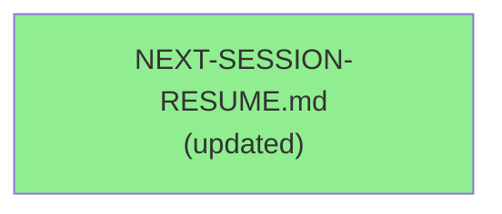
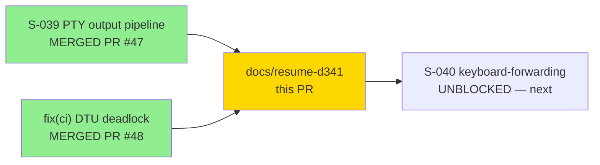
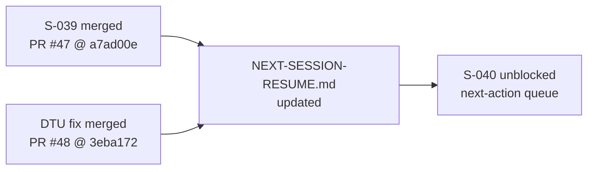

# docs(resume): Wave-9 in progress — S-039 merged (PR #47), DTU deadlock resolved (PR #48); next S-040

**Type:** Documentation (handoff doc refresh — no source code changes)
**Mode:** greenfield (Wave-9 in progress)
**Changed files:** `NEXT-SESSION-RESUME.md` (repo root only)

Refreshes the zero-context resume entry-point doc to reflect the current pipeline state: S-039 (PTY output pipeline) merged at PR #47 (SHA a7ad00e), and the DTU fidelity path-filter deadlock resolved at PR #48 (SHA 3eba172, D-341). The next-action queue is updated to start S-040 (keyboard-forwarding). This PR also doubles as the real-world validation that D-341's fix unblocks non-DTU PRs: the "DTU fidelity oracle (cargo xtask dtu-fidelity)" required check should execute the internal bash change-detection gate, find no DTU-relevant paths changed, and report success-skip (exit 0 / green) — without running the real oracle.

---

## Architecture Changes

No architecture changes. This PR modifies only `NEXT-SESSION-RESUME.md` — a zero-context handoff document at the repository root.



**ADR:** N/A — documentation-only change.

---

## Story Dependencies



---

## Spec Traceability

N/A — handoff document refresh. No behavioral contracts modified. No acceptance criteria tested.



---

## Test Evidence

N/A — documentation-only change. No Rust source files modified. All 11 CI checks expected to pass trivially (no compilation, no test execution path changed).

| Metric | Value | Notes |
|--------|-------|-------|
| New tests | 0 | No source changes |
| Regressions | 0 | No source changes |
| CI checks | 11 | All expected green |

---

## Holdout Evaluation

N/A — evaluated at wave gate, not per documentation PR.

---

## Adversarial Review

N/A — documentation refresh of a handoff doc does not warrant adversarial spec review.

---

## Security Review

N/A — no source code, no configuration, no secrets, no executable paths changed. NEXT-SESSION-RESUME.md contains only prose documentation.

---

## Risk Assessment & Deployment

### Blast Radius

- **Systems affected:** None (documentation only)
- **User impact:** None
- **Data impact:** None
- **Risk Level:** MINIMAL

### DTU Oracle Validation (Key Check — D-341)

This PR is the first non-DTU PR after D-341 fixed the path-filter deadlock. The expected behavior:

| Check | Expected Result |
|-------|----------------|
| DTU fidelity oracle (`cargo xtask dtu-fidelity`) | SKIP-SUCCESS (exit 0) — internal bash gate finds no DTU-relevant paths changed |
| Required context name | `DTU fidelity oracle (cargo xtask dtu-fidelity)` — unchanged (byte-identical) |
| Admin bypass needed | NO — this is the point of the fix |

If the DTU oracle runs the real fidelity test instead of the skip path, that indicates D-341 did not fully resolve the deadlock — STOP and report rather than admin-merging.

---

## Traceability

| Change | Traceability |
|--------|-------------|
| S-039 merged (PR #47) | D-340 decision record |
| DTU deadlock resolved (PR #48) | D-341 decision record; PROCESS-GAP-DTU-FIDELITY-PATH-FILTER-DEADLOCK RESOLVED |
| STATE.md v8.06 | factory-artifacts HEAD 5b0f748 |

---

## AI Pipeline Metadata

```yaml
ai-generated: true
pipeline-mode: greenfield
change-type: documentation-only
scope: NEXT-SESSION-RESUME.md (repo root)
purpose: zero-context-resume handoff refresh
story-context: Wave-9 in progress; S-039 done; S-040 next
dtu-oracle-validation: skip-success path (D-341 real-world check)
generated-at: "2026-06-20"
```

---

## Pre-Merge Checklist

- [x] Branch pushed to origin
- [x] PR targets develop
- [x] All CI status checks passing (expected trivial for markdown-only)
- [x] DTU fidelity oracle reports skip-success (D-341 validation)
- [x] No security findings (docs-only)
- [x] No admin bypass needed
- [x] Branch deleted after merge
