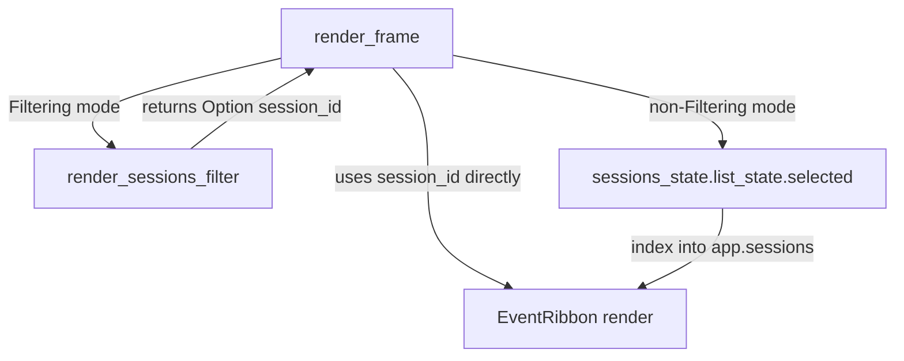
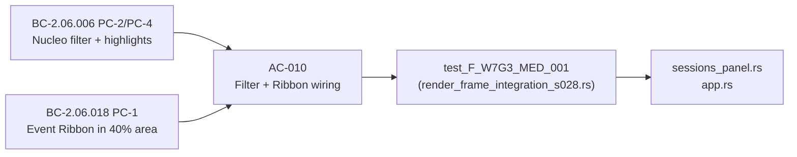
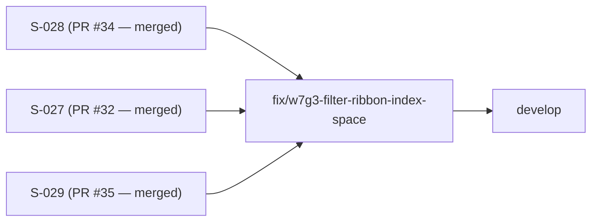

## fix(F-W7G3-MED-001): Event Ribbon index-space remap in Filtering mode

### Summary

Wave-7 Gate-3 MEDIUM finding: when the Sessions panel was in `AppMode::Filtering`,
the Event Ribbon showed the wrong session's events (or "No events yet") because
`render_frame` applied the scored/filtered list index directly to the unfiltered
`app.sessions` vec — a silent index-space mismatch.

### Root Cause

```
Before fix (broken):
  render_sessions_filter(...)  // builds scored[] subset, renders it
  selected_sid = app.sessions.get(list_state.selected())
                              // ^^^ index into scored[], not into app.sessions
```

When a filter query reorders the list (e.g., nucleo scores sess-ZETA #1 but it is
`app.sessions[1]`), `list_state.selected() == 0` hits `app.sessions[0]` (sess-ALPHA)
— wrong session, wrong events in the ribbon.

### Fix

`render_sessions_filter` now returns `Option<String>` — the `session_id` of the
currently highlighted row in the scored list, resolved inside the function where
the scored ordering is known:

| Return path | Resolution |
|-------------|------------|
| Empty query (all sessions visible) | `app.sessions[list_state.selected()]` — insertion order matches display order |
| Zero matches | `None` |
| Scored list | `scored[list_state.selected()].session_id` — correct index space |

`render_frame` uses the returned value as `selected_sid` when in `Filtering` mode;
non-filtering modes continue to use the existing `sessions_state.list_state` path
unchanged.

### Architecture Changes



### Files Changed

| File | Change |
|------|--------|
| `crates/monocle-tui/src/ui/sessions_panel.rs` | `render_sessions_filter` return type `()` → `Option<String>`; all 3 return paths updated |
| `crates/monocle-tui/src/app.rs` | `render_frame` uses returned `session_id` in Filtering mode; non-Filtering path unchanged |
| `crates/monocle-tui/tests/render_frame_integration_s028.rs` | New regression test `test_F_W7G3_MED_001_event_ribbon_shows_highlighted_session_events_in_filter_mode` |

### Regression Test

`test_F_W7G3_MED_001_event_ribbon_shows_highlighted_session_events_in_filter_mode`:

- Seeds two sessions: `sess-ALPHA` (project `alpha-project`, insertion index 0) and
  `sess-ZETA` (project `zeta-xyz`, insertion index 1).
- Seeds distinct events: ALPHA → `Notification`; ZETA → `SessionStart`.
- Enters `AppMode::Filtering` with query `"xyz"` — nucleo scores/ranks ZETA exclusively.
- Highlights filtered row 0 (`sess-ZETA`) via `sessions_state.list_state`.
- Asserts ribbon shows `"SessionStart"` (ZETA) and NOT `"Notification"` (ALPHA).
- **Under old code:** `app.sessions.get(0)` = ALPHA → ribbon shows `"Notification"` → FAIL.
- **Under fix:** `render_sessions_filter` returns `"sess-ZETA"` → ribbon shows `"SessionStart"` → PASS.

### Spec Traceability



### Story Context

This is a pure fix PR for finding F-W7G3-MED-001 (Wave-7 Gate-3 adversarial review).
Parent story: S-028 (Sessions filter + event ribbon, BC-2.05.002/004, BC-2.06.006/018,
merged PR #34 @ 682e5e5).

No spec version bumps. No factory-artifacts changes. No BC/SS changes. The
`version-pin-registry.yaml` and `factory-artifacts` branch are unchanged — CI's
POL-11 check will pass against `e5cc291`.

### Dependencies



All upstream dependencies merged. Base: `develop @ d2cab04`.

### CI-Parity Evidence (pre-push, from worktree)

| Check | Result |
|-------|--------|
| `cargo test -p monocle-tui` | GREEN (all suites including new test) |
| `cargo clippy --workspace --all-targets -- -D warnings` | GREEN |
| `cargo fmt --all -- --check` | GREEN |
| `python3 scripts/check_version_pins.py` (POL-11, from repo root) | PASS |
| `python3 scripts/check_structural_claims.py` (POL-12, from repo root) | PASS |

### Pre-Merge Checklist

- [x] Fix targets correct production path (render_frame → render_sessions_filter → EventRibbon)
- [x] All 3 return paths in render_sessions_filter updated
- [x] Regression test fails on old code, passes on fix
- [x] Non-filtering mode path unchanged (no regression risk)
- [x] clippy --all-targets clean
- [x] fmt clean
- [x] POL-11 + POL-12 pass
- [x] No Co-Authored-By: Claude / robot emoji in commits
- [x] No --no-verify
- [x] No spec version bumps (pure code fix)
- [ ] CI checks green (pending)
- [ ] Security review complete
- [ ] PR reviewer approved
