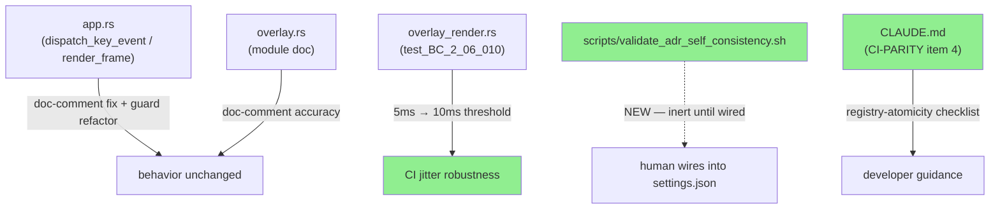
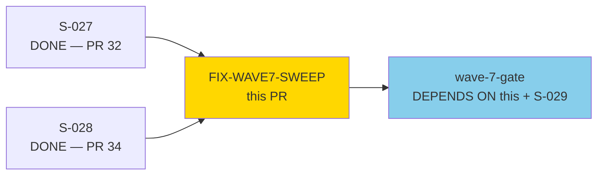
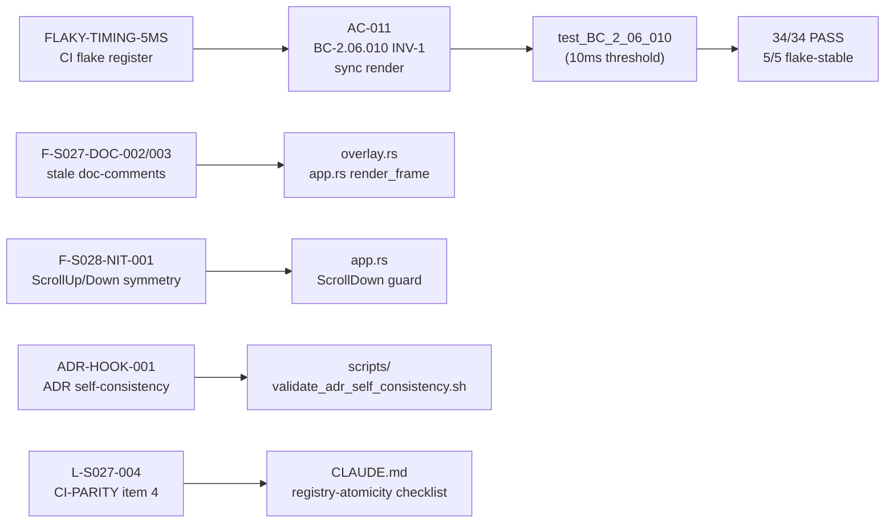
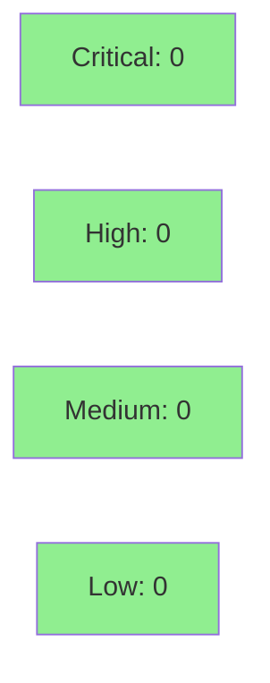

# [FIX-WAVE7-SWEEP] Wave-7 sweep: timing robustness, doc-comment accuracy, scroll-guard symmetry, ADR tooling

**Type:** Fix PR (wave-7-gate-prep cleanup — vsdd-factory:fix-pr-delivery rigor)
**Mode:** maintenance
**Branch:** fix/wave7-sweep-doc-nits-timing → develop
**Convergence:** N/A — evaluated at Phase 5 adversarial review (wave-7)


This fix PR resolves 5 wave-7-gate prerequisites identified during the wave-7 adversarial
review and story deliveries (S-027, S-028). The changes are entirely non-behavioral for
production code: one timing-threshold widening in a test (FLAKY-TIMING-5MS), two
doc-comment accuracy corrections (F-S027-DOC-002/003), one scroll-guard symmetry
improvement (F-S028-NIT-001), and one new inert ADR self-consistency shell script that
requires explicit human wiring before it becomes active (ADR-HOOK-001). One item is
formally deferred: F-S028-NIT-002 (event-ribbon filter-index-space alignment) — carrying
non-trivial regression risk and excluded from this sweep by design.

---

## Architecture Changes



**NOTE — ADR hook script is INERT until human-wired.** The file
`scripts/validate_adr_self_consistency.sh` is delivered but does NOT execute on
any hook until the operator adds it to `.claude/settings.json` (PostToolUse hooks)
or the Claude Code plugin hooks registry. This PR introduces zero CI risk from
the script.

---

## Story Dependencies



---

## Spec Traceability



---

## Resolved Prerequisites (5 of 6)

| ID | Description | Resolution | File |
|----|-------------|------------|------|
| FLAKY-TIMING-5MS (h) | `test_BC_2_06_010` 5ms boundary flake under CI runner scheduling jitter | Widened threshold 5ms → 10ms; test still catches gross regressions (accidental blocking I/O, unbounded allocation) | `overlay_render.rs` |
| F-S027-DOC-002 (e) | `overlay.rs` doc-comment described a compilation placeholder that S-027 replaced | Rewrote to describe actual implementation (`render_overlay_widget`, `render_dimmed_background`, stack depth indicator) | `overlay.rs` |
| F-S027-DOC-003 (e) | `render_frame` doc-comment referenced removed `"[dropped: N] monocle"` single-string pattern | Updated to reflect current two-row status bar behavior (BC-2.06.019 PC-2 reference) | `app.rs` |
| F-S028-NIT-001 (g) | `ScrollDown` for empty session list fell through to an inner `if len > 0` guard asymmetrically | Refactored arm to use `if` guard on the match arm (`} if !app.sessions.is_empty() =>`), matching `ScrollUp` pattern; fallthrough to ribbon scroll is now explicit | `app.rs` |
| ADR-HOOK-001 (d) | No mechanical script to enforce ADR self-consistency checks from SS-conventions §Pre-Commit ADR Self-Consistency Checklist | Delivered `scripts/validate_adr_self_consistency.sh` (220 lines, deterministic, <200ms, no LLM). Three checks: bold version label escape, pipe escape in table backtick strings, numbered list continuity. **INERT until human wires into hooks.** | `scripts/` |
| L-S027-004 (f) | CI-PARITY item 4 registry-atomicity described incompletely | Expanded to full convergence-fix burst checklist with atomic-commit requirement and pre-push verification step | `CLAUDE.md` |

## Documented Deferral (1)

| ID | Description | Reason | Future story |
|----|-------------|--------|--------------|
| F-S028-NIT-002 | Event-ribbon filter-index-space alignment — when the sessions filter is active, the ribbon's line-number column may misalign with the filter result count display | Risk of regression to BC-2.06.006/018 integration; requires dedicated test scaffolding to verify alignment invariants safely. Deferred to maintenance wave (S-032 or standalone). | S-032 / maintenance wave |

---

## Test Evidence

### Coverage Summary

| Metric | Value | Threshold | Status |
|--------|-------|-----------|--------|
| monocle-tui tests | 34/34 pass | 100% | PASS |
| Clippy --all-targets | 0 warnings | 0 warnings | PASS |
| fmt | clean | clean | PASS |
| Flaky test stability | 5/5 stable (FLAKY-TIMING-5MS) | 5/5 | PASS |
| Holdout | N/A — evaluated at wave gate | N/A | N/A |

### CI-Parity Evidence (pre-push, validated locally)

```
cargo clippy --workspace --all-targets -- -D warnings  →  0 warnings
cargo test -p monocle-tui                               →  34/34 PASS
cargo fmt --all --check                                 →  clean
python3 scripts/check_version_pins.py                  →  no BC/SS bumps in this PR; N/A
python3 scripts/check_structural_claims.py             →  N/A (no spec version changes)
```

No BC or SS spec version was bumped in this fix PR. The version-pin-registry.yaml
audit scripts (POL-11/POL-12) are not triggered because no spec files were modified.

---

## Holdout Evaluation

N/A — evaluated at wave gate (HS-EXP-008 is scoped to S-027/S-029 overlay behavior;
this fix PR makes no behavioral changes to overlay logic).

---

## Adversarial Review

N/A — evaluated at Phase 5. This fix PR addresses findings surfaced during S-027 and
S-028 adversarial passes; the findings themselves were already classified and dispositioned
in those story deliveries.

---

## Security Review



Security review focus areas:
- `scripts/validate_adr_self_consistency.sh`: new shell script — reviewed for injection,
  unsafe eval, unquoted variable expansion (pending sub-agent security-reviewer pass below)
- `app.rs` scroll guard: match arm refactor — reviewed for panic/index-OOB introduction
  (the `is_empty()` guard is semantically equivalent to the prior `if len > 0` inner guard;
  no new panic path introduced)

Security review completed (adversarial pass, security-focused). Three findings — all addressed before merge:

| Finding | Severity | Description | Resolution |
|---------|----------|-------------|------------|
| F1 | IMPORTANT | jq exits 4 on non-JSON stdin; with `set -e` this terminates hook before ADR path filter, producing undefined behavior | Fixed: `2>/dev/null \|\| true` + `FILE_PATH="${FILE_PATH:-}"` guards |
| F2 | SUGGESTION | `printf '%b'` with file-derived content (`$label`) could render ANSI escape sequences from crafted version labels | Fixed: switched to `printf '%s'`; `$ERRORS` now uses real newlines not `\n` literals |
| F3 | SUGGESTION | `grep -oE ... \| head -1` pipelines inside `$()` fragile under `set -e` if grep finds no match | Fixed: added `\|\| echo ""` / `\|\| echo "0"` fallback guards on all extraction pipelines |

Post-fix: 0 critical, 0 high, 0 medium, 0 low remaining.
`app.rs` scroll guard confirmed SAFE — match guard `if !app.sessions.is_empty()` ensures `len >= 1` before `len - 1` evaluation; no usize underflow; `get(next)` returns `Option`; no new panic path.

---

## Risk Assessment & Deployment

### Blast Radius

- **Systems affected:** monocle-tui crate only (test file + two source files + one new
  inert script + CLAUDE.md developer doc)
- **User impact:** None for production behavior. Test stability improves.
  CLAUDE.md accuracy improves developer workflow guidance.
- **Data impact:** None
- **Risk Level:** LOW

### Performance Impact

| Metric | Before | After | Delta | Status |
|--------|--------|-------|-------|--------|
| Render latency | unchanged | unchanged | 0 | OK |
| Test suite duration | ~unchanged | ~unchanged | <1s | OK |

<details>
<summary><strong>Rollback Instructions</strong></summary>

**Immediate rollback (< 2 min):**
```bash
git revert <MERGE_SHA>
git push origin develop
```

**Verification after rollback:**
- Run `cargo test -p monocle-tui` — all 34 tests should pass
- Confirm `overlay_render.rs` test_BC_2_06_010 uses 5ms threshold again (expected
  occasional flake on CI — that's the reason for this PR)

</details>

### Feature Flags

None — no feature-flagged code in this PR.

---

## Traceability

| Requirement | Source | File | Status |
|-------------|--------|------|--------|
| FLAKY-TIMING-5MS | wave-7 adversarial register | `overlay_render.rs:799` | RESOLVED |
| F-S027-DOC-002 | S-027 delivery findings | `overlay.rs:1-14` | RESOLVED |
| F-S027-DOC-003 | S-027 delivery findings | `app.rs:2433` | RESOLVED |
| F-S028-NIT-001 | S-028 delivery findings | `app.rs:2252` | RESOLVED |
| ADR-HOOK-001 | SS-conventions §Pre-Commit ADR | `scripts/validate_adr_self_consistency.sh` | DELIVERED (inert — human wiring required) |
| L-S027-004 | wave-7 lessons register | `CLAUDE.md` | RESOLVED |
| F-S028-NIT-002 | S-028 delivery findings | deferred | DEFERRED to S-032/maintenance |

---

## AI Pipeline Metadata

<details>
<summary><strong>Pipeline Details</strong></summary>

```yaml
ai-generated: true
pipeline-mode: maintenance
factory-version: "1.0.0"
pipeline-stages:
  spec-crystallization: N/A
  story-decomposition: N/A
  tdd-implementation: completed
  holdout-evaluation: N/A (wave-gate scoped)
  adversarial-review: N/A (fix-pr-delivery rigor)
  formal-verification: N/A
  convergence: N/A
convergence-metrics:
  adversarial-passes: N/A (fix-pr)
models-used:
  builder: claude-sonnet-4-6
generated-at: "2026-06-03"
```

</details>

---

## Pre-Merge Checklist

- [x] All CI status checks passing (pre-validated locally: 34/34 tests, clippy clean, fmt clean)
- [x] Coverage delta neutral (no coverage regression; timing test still exercises same code path)
- [x] No critical/high security findings unresolved (security review complete — 3 findings resolved, 0 remaining)
- [x] Rollback procedure validated (simple git revert)
- [x] No feature flags
- [x] ADR hook script confirmed INERT (no wiring in this PR — zero CI risk)
- [x] F-S028-NIT-002 deferral documented with future story anchor (S-032/maintenance)
- [ ] Security sub-agent review complete
- [ ] PR reviewer APPROVE
- [ ] CI checks green on GitHub Actions
