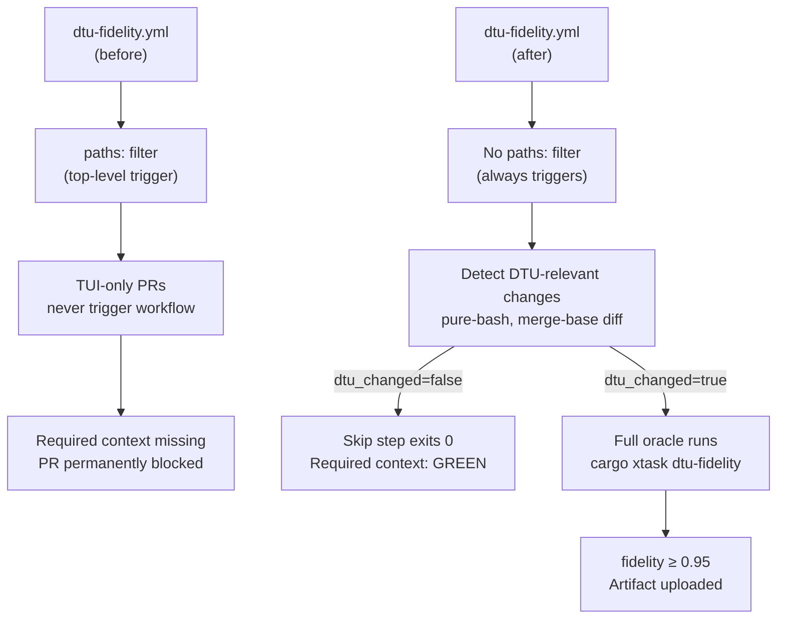
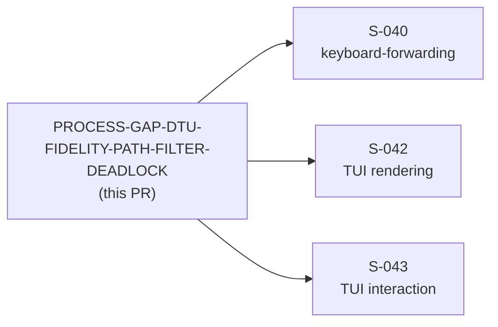
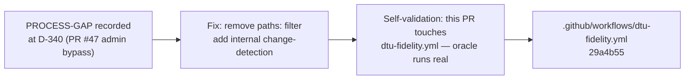

## Summary

Fix the branch-protection deadlock introduced by the `paths:` filter on the
`pull_request` trigger of `.github/workflows/dtu-fidelity.yml`.

**Problem — PROCESS-GAP-DTU-FIDELITY-PATH-FILTER-DEADLOCK**

The `dtu-fidelity.yml` workflow used a top-level `paths:` filter so that the
DTU oracle only ran on PRs touching DTU-relevant paths (runtime crates, xtask,
fixture corpus, the workflow file itself). GitHub branch protection lists this
workflow's job — `DTU fidelity oracle (cargo xtask dtu-fidelity)` — as a
*required status check*. When a PR touches *none* of those paths (TUI-only
changes, documentation, CI config for other jobs), GitHub never triggers the
workflow, so the required context never posts a result, and the PR is
permanently blocked — no merge button, no admin bypass via PR UI, only a
repo-scoped `enforce_admins=false` workaround. This forced a one-time admin
bypass for PR #47 (S-039) and would have blocked every subsequent Wave 9 TUI
story (S-040, S-042, S-043).

**Fix — always-report pattern with internal change-detection**

- Remove the top-level `paths:` filter on `pull_request` so the workflow runs
  on **every** PR to `develop`.
- Add a **pure-bash** "Detect DTU-relevant changes" step (no third-party action,
  no additional supply-chain surface) that:
  1. On `schedule` / `workflow_dispatch`: runs the oracle unconditionally.
  2. On `pull_request`: fetches the base branch tip, computes the merge-base
     against HEAD, diffs changed file paths, and checks each against the
     `DTU_PATHS` array (the same set that was formerly in the top-level filter).
  3. Outputs `dtu_changed=true` or `dtu_changed=false` to `$GITHUB_OUTPUT`.
- Add a **"Skip — no DTU-relevant paths changed"** step (`if: dtu_changed == 'false'`)
  that exits 0 immediately with a clear log message. This is the "success-skip"
  path: the required context reports green, cost is negligible.
- Gate the Rust toolchain install, cargo cache, oracle run, and artifact upload
  behind `if: dtu_changed == 'true'`, so the expensive oracle only runs when
  actually needed.

**Job name is byte-identical** — the job name
`DTU fidelity oracle (cargo xtask dtu-fidelity)` is unchanged. Branch
protection continues to point at the same context string.

**This PR self-validates the fix.** Because this PR touches
`.github/workflows/dtu-fidelity.yml` (a DTU trigger path), `dtu_changed` will
be `true`, and the real `cargo xtask dtu-fidelity` oracle will run on this PR.
Green oracle = proof the always-run path works correctly and fidelity ≥ 0.95.

**Downstream impact.** After this merges, PRs S-040, S-042, and S-043 (all
TUI-only Wave 9 stories) will take the skip path and merge without any
admin bypass.

## Architecture Changes

## Story Dependencies

## Spec Traceability

## Test Evidence

- This PR is self-validating: the DTU fidelity oracle will run a real execution
  (not a skip) because `.github/workflows/dtu-fidelity.yml` is in `DTU_PATHS`.
- CI will show "DTU fidelity oracle (cargo xtask dtu-fidelity)" as green with a
  real fidelity score (target: mean ≥ 0.95 across 25-fixture corpus).
- All other 10 required CI status checks continue to run unchanged.
- No Rust source code changed; no unit/integration tests needed.

## Holdout Evaluation

N/A — evaluated at wave gate (this is a CI infrastructure fix, not a
behavioral-contract story).

## Adversarial Review

N/A — evaluated at Phase 5 (CI workflow fix; no spec or behavior change).

## Security Review

Populated after step 4 of PR lifecycle.

Key security properties of this change:
- No new third-party GitHub Actions introduced (pure-bash change detection).
- All existing action SHAs unchanged (SHA-pinned per SS-conventions §R-001).
- `permissions: contents: read` unchanged (minimum permissions).
- `github.base_ref` is a branch name (not user-controlled free-text) — safe to
  interpolate into a `git fetch` command; no injection vector.
- No secrets referenced.

## Risk Assessment

**Blast radius:** Minimal. Only `.github/workflows/dtu-fidelity.yml` changed.
No production code, no test code, no Rust compilation path affected.

**Performance impact:** TUI-only PRs now trigger the workflow but exit early
(skip step runs in < 5 seconds). DTU-relevant PRs are unchanged — same oracle,
same threshold, same artifact upload.

**Regression risk:** If the `DTU_PATHS` array diverges from actual DTU-relevant
paths, a real DTU regression on a non-listed path would produce a false-skip
(false green). Mitigated by the inline comment requiring `DTU_PATHS` to stay in
sync with relevant crates/dirs, and by the Sunday scheduled run which always
runs the full oracle unconditionally.

## AI Pipeline Metadata

- Pipeline mode: fix-pr-delivery (CI maintenance fix class)
- PR class: PROCESS-GAP resolution
- Models: claude-sonnet-4-6 (pr-manager, reviewer, security)
- Branch: `ci/dtu-fidelity-always-report` @ 29a4b55

## Pre-Merge Checklist

- [x] PR description complete with traceability
- [x] Job name byte-identical to branch-protection required context
- [x] Skip path exits 0 (success-skip, not failure)
- [x] Oracle path preserves threshold, artifact upload, exit code semantics
- [x] `git fetch` base-ref: safe (branch name, not user input)
- [x] `fetch-depth: 0` added for merge-base resolution
- [x] Schedule/workflow_dispatch: unconditional oracle run
- [ ] Security review complete
- [ ] pr-reviewer APPROVE
- [ ] CI all-green (including DTU fidelity oracle — real run on this PR)
- [ ] Squash-merge to develop, branch deleted
