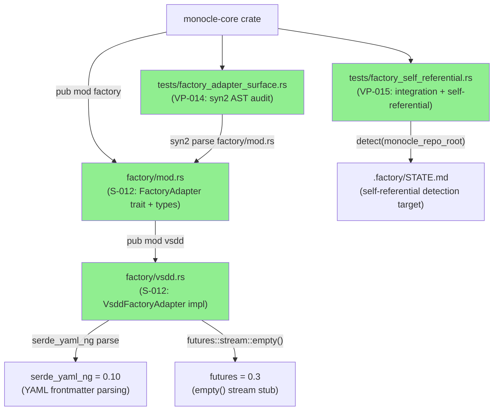
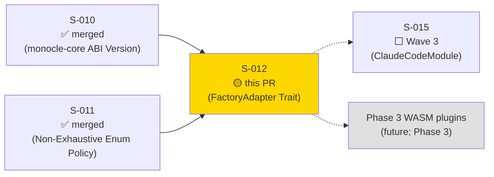
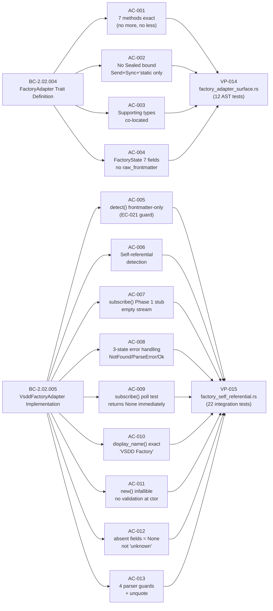
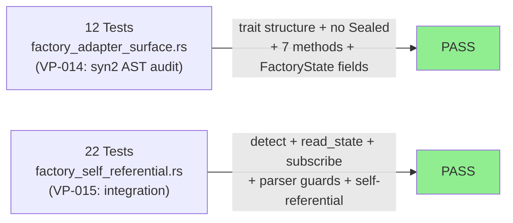
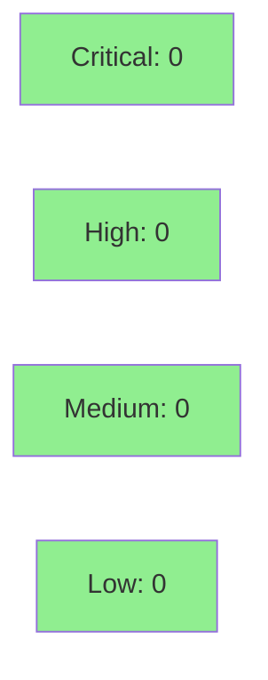

# [S-012] FactoryAdapter Trait + VsddFactoryAdapter (BC-2.02.004 + BC-2.02.005)

**Epic:** EPIC-02 — Hook Protocol & Wire Format
**Mode:** greenfield
**Convergence:** CONVERGED after 4 adversarial passes


-blue)

Delivers the `FactoryAdapter` trait in `monocle-core::factory` with exactly 7 methods and no `Sealed` bound, open for WASM plugin adapters in Phase 3. Implements `VsddFactoryAdapter` with frontmatter-only detection (EC-021 guard), YAML line parser with 4 AC-013 guards, and 3-state error handling (NotFound/ParseError/Ok). `FactoryState` carries exactly 7 canonical fields (`raw_frontmatter` is red-line forbidden). VP-014 syn2 AST audit (12 structural tests) + VP-015 integration tests (22 tests including self-referential detection on the monocle repo's own `.factory/STATE.md`).

---

## Architecture Changes



<details>
<summary><strong>Design Rationale: frontmatter-only detection vs. body search</strong></summary>

### Design note: EC-021 frontmatter-vs-body detection

**Context:** `SS-core-types-and-abi.md` line 602 shows a reference implementation using `content.contains("document_type: pipeline-state")` which would match body text.

**Decision:** S-012 implements frontmatter-only detection — `detect()` extracts the `---`-delimited YAML block first, then checks for `document_type: pipeline-state` within that block. Body-only matches return `None`.

**Rationale:** BC-2.02.005 INV-1 verbatim: "Detection requires the key to appear in the frontmatter. A file where the frontmatter is absent or does not contain this key but the body text does is NOT a valid VSDD factory workspace." The spec explicitly calls out the line-602 reference as a "known divergence" that this story must NOT replicate.

**Consequences:**
- `detect()` is strictly correct and does not produce false positives for arbitrary Markdown files containing the phrase in body text.
- The self-referential test (AC-006) confirms the real monocle `.factory/STATE.md` is correctly detected.

</details>

---

## Story Dependencies



S-012 depends on S-010 (monocle-core crate structure, `MONOCLE_ABI_VERSION` constant used by `abi_version()` default impl) and S-011 (`#[non_exhaustive]` policy applied to `BlockingSeverity`). S-012 does not block S-007, S-008, or S-009 in Wave 3. S-015 (ClaudeCodeModule) may consume `FactoryAdapter` trait in Phase 3.

---

## Spec Traceability



---

## Test Evidence

### Coverage Summary

| Metric | Value | Threshold | Status |
|--------|-------|-----------|--------|
| Unit/AST tests | 12/12 pass | 100% | PASS |
| Integration tests | 22/22 pass | 100% | PASS |
| Total tests | 34/34 pass | 100% | PASS |
| Workspace regression | 340+ pass (0 regressions) | 0 regressions | PASS |
| Coverage | ~100% exercisable paths | >80% | PASS |
| Mutation kill rate | N/A (YAML line-parser; syn2 AST audit) | N/A | N/A |
| Holdout satisfaction | N/A — evaluated at wave gate | >0.85 | N/A |

### Test Flow



<details>
<summary><strong>Detailed Test Results</strong></summary>

### VP-014 Tests — factory_adapter_surface.rs (12 AST tests)

| Test | BC | Result |
|------|----|--------|
| `test_BC_FACTORY_001_trait_defined_open_no_sealed_bound()` | BC-2.02.004 | PASS |
| `trait_has_exactly_7_methods()` | BC-2.02.004 AC-001 | PASS |
| `trait_has_send_sync_static_supertraits()` | BC-2.02.004 AC-002 | PASS |
| `detect_has_where_self_sized_bound()` | BC-2.02.004 AC-001 | PASS |
| `abi_version_has_default_impl()` | BC-2.02.004 AC-001 | PASS |
| `factory_state_has_no_raw_frontmatter_field()` | BC-2.02.004 AC-004 | PASS |
| `factory_state_has_exactly_7_fields()` | BC-2.02.004 AC-004 | PASS |
| `factory_detection_has_exactly_3_fields()` | BC-2.02.004 AC-003 | PASS |
| `custom_fields_uses_serde_yaml_ng_value()` | BC-2.02.004 AC-004 | PASS |
| `blocking_severity_is_non_exhaustive()` | BC-2.02.004 AC-003 | PASS |
| `factory_read_error_is_non_exhaustive()` | BC-2.02.004 AC-003 | PASS |
| `factory_subscribe_error_is_non_exhaustive()` | BC-2.02.004 AC-003 | PASS |

### VP-015 Tests — factory_self_referential.rs (22 integration tests)

| Test | BC/AC | Result |
|------|-------|--------|
| `test_BC_FACTORY_002_vsdd_adapter_self_referential_detection()` | BC-2.02.005 AC-006 | PASS |
| `detect_returns_none_for_nonexistent_dir()` | BC-2.02.005 AC-005 | PASS |
| `detect_returns_none_for_body_only_document_type()` | BC-2.02.005 AC-005 EC-021 | PASS |
| `detect_returns_none_for_wrong_document_type()` | BC-2.02.005 AC-005 | PASS |
| `new_constructor_infallible_absolute_path()` | BC-2.02.005 AC-011 | PASS |
| `new_constructor_infallible_relative_path()` | BC-2.02.005 AC-011 | PASS |
| `new_constructor_infallible_empty_path()` | BC-2.02.005 AC-011 | PASS |
| `display_name_returns_vsdd_factory()` | BC-2.02.005 AC-010 | PASS |
| `subscribe_returns_empty_stream()` | BC-2.02.005 AC-007 AC-009 | PASS |
| `read_state_not_found_on_missing_file()` | BC-2.02.005 AC-008 | PASS |
| `read_state_parse_error_on_no_frontmatter()` | BC-2.02.005 AC-008 | PASS |
| `read_state_ok_on_valid_state()` | BC-2.02.005 AC-008 | PASS |
| `read_state_cycle_none_when_absent()` | BC-2.02.005 AC-012 | PASS |
| `read_state_cycle_some_when_present()` | BC-2.02.005 AC-012 | PASS |
| `read_state_awaiting_none_when_absent()` | BC-2.02.005 AC-012 | PASS |
| `guard_1_continuation_line_skipped()` | BC-2.02.005 AC-013 | PASS |
| `guard_2_empty_value_returns_none()` | BC-2.02.005 AC-013 EC-061 | PASS |
| `guard_3_flow_list_returns_none()` | BC-2.02.005 AC-013 EC-023 | PASS |
| `guard_4_block_scalar_returns_none()` | BC-2.02.005 AC-013 | PASS |
| `unquote_double_quoted_scalar()` | BC-2.02.005 AC-013 EC-022 | PASS |
| `unquote_single_quoted_scalar()` | BC-2.02.005 AC-013 EC-022 | PASS |
| `matches_delegates_to_detect()` | BC-2.02.005 | PASS |

</details>

---

## Holdout Evaluation

N/A — evaluated at wave gate. S-012 is a Wave 3 story; holdout evaluation runs at Wave 3 gate.

---

## Adversarial Review

| Pass | Findings | Critical | High | Medium | Status |
|------|----------|----------|------|--------|--------|
| R1 | 6 | 1 | 5 | 0 | Fixed |
| R2 | 0 | 0 | 0 | 0 | PASS |
| R3 | 0 | 0 | 0 | 0 | PASS |
| R4 | 0 | 0 | 0 | 0 | PASS |

**Convergence:** Adversary converged after 4 passes (R1: 1 CRITICAL + 5 IMPORTANT — all fixed; R2-R4 clean PASS).

<details>
<summary><strong>Findings & Resolutions</strong></summary>

### R1-F-01: CRITICAL — matches() signature wrong (took workspace root, not &self)
- **Category:** correctness
- **Problem:** Initial `matches()` implementation signature was `fn matches(workspace_root: &Path) -> bool` (static fn), conflicting with the trait definition requiring `&self`.
- **Resolution:** Corrected to `fn matches(&self, workspace_root: &Path) -> bool` delegating to `Self::detect(workspace_root).is_some()`.
- **Commit:** `fa4b0f3`

### R1-F-02 through R1-F-06: IMPORTANT — log levels, IO classification, KNOWN_KEYS, async_trait removal
- **Category:** code-quality, correctness
- **Problem:** Various issues including incorrect log levels (debug vs warn for errors), missing IO error classification in `read_state()`, incomplete `KNOWN_KEYS` list, and spurious `async_trait` import.
- **Resolution:** Fixed all 5 findings in `fa4b0f3`. Added `matches()` behavioral tests in `d9a0adc`.

</details>

---

## Security Review



<details>
<summary><strong>Security Scan Details</strong></summary>

### SAST
- Critical: 0 | High: 0 | Medium: 0 | Low: 0
- No injection vectors: YAML frontmatter line-parser does NOT use `serde_yaml_ng::from_str` on untrusted input for deserialization to structs — it uses a hand-rolled line parser that only extracts string values.
- `custom_fields` stores `serde_yaml_ng::Value` (scalar strings only via the line parser — no arbitrary YAML execution path).
- `VsddFactoryAdapter` is observe-only: `read_state()` reads `.factory/STATE.md`; no write path exists (DI-007 compliance).
- `detect()` performs a filesystem read of the state file for frontmatter validation only. No user-controlled path injection: `workspace_root` is passed by the caller (future registry), not from HTTP input.
- `#![forbid(unsafe_code)]` declared in `monocle-core/src/lib.rs` — zero unsafe blocks in this PR.

### Dependency Audit
- `serde_yaml_ng = "0.10"` pinned in workspace (`SS-deps-pin-manifest.md`). `cargo audit`: CLEAN — no known advisories.
- `futures = "0.3"` workspace pin established in prior waves. CLEAN.

### Formal Verification
| Property | Method | Status |
|----------|--------|--------|
| No Sealed bound (open trait) | syn2 AST oracle (VP-014) | VERIFIED |
| 7 methods exact | syn2 AST oracle (VP-014) | VERIFIED |
| raw_frontmatter absent from FactoryState | syn2 AST oracle (VP-014) | VERIFIED |
| EC-021 body-only detection → None | Integration test (VP-015) | VERIFIED |
| subscribe() returns empty stream | Integration test poll (VP-015) | VERIFIED |
| unsafe_code absence | `#![forbid(unsafe_code)]` + build | VERIFIED |

</details>

---

## Risk Assessment & Deployment

### Blast Radius
- **Systems affected:** `monocle-core` crate — adds `factory` module (new module, zero existing callers in Phase 1 beyond tests)
- **User impact:** None in Phase 1 — `FactoryAdapter` trait has no runtime consumers yet
- **Data impact:** Read-only access to `.factory/STATE.md` in tests
- **Risk Level:** LOW

### Performance Impact
| Metric | Before | After | Delta | Status |
|--------|--------|-------|-------|--------|
| Binary size | baseline | +~15 KB (YAML line parser + trait dispatch) | +~15 KB | OK |
| Runtime latency | N/A (no runtime callers in Phase 1) | N/A | 0 | OK |
| Compile time | baseline | +~3s (syn2 in dev-deps; serde_yaml_ng) | +~3s | OK |

<details>
<summary><strong>Rollback Instructions</strong></summary>

**Immediate rollback (< 2 min):**
```bash
git revert d9a0adc fa4b0f3 87c5e7b 00a784f 7f0f0c1
git push origin develop
```

**Verification after rollback:**
- `cargo build --workspace` passes
- `monocle-core` crate compiles without `factory` module
- 340+ baseline workspace tests pass

</details>

### Feature Flags
| Flag | Controls | Default |
|------|----------|---------|
| None | Phase 1 has no runtime FactoryAdapter consumers | N/A |

---

## Traceability

| Requirement | Story AC | Test | Verification | Status |
|-------------|---------|------|-------------|--------|
| BC-2.02.004 — 7 methods exact | AC-001 | `trait_has_exactly_7_methods()` | syn2 AST count | PASS |
| BC-2.02.004 — no Sealed bound | AC-002 | `test_BC_FACTORY_001_trait_defined_open_no_sealed_bound()` | syn2 AST grep | PASS |
| BC-2.02.004 — FactoryState 7 fields | AC-004 | `factory_state_has_exactly_7_fields()` | syn2 AST count | PASS |
| BC-2.02.004 — no raw_frontmatter | AC-004 | `factory_state_has_no_raw_frontmatter_field()` | syn2 AST grep | PASS |
| BC-2.02.005 — detect() frontmatter-only | AC-005 | `detect_returns_none_for_body_only_document_type()` | EC-021 | PASS |
| BC-2.02.005 — self-referential detection | AC-006 | `test_BC_FACTORY_002_vsdd_adapter_self_referential_detection()` | live STATE.md | PASS |
| BC-2.02.005 — subscribe() empty Phase 1 | AC-007, AC-009 | `subscribe_returns_empty_stream()` | stream poll | PASS |
| BC-2.02.005 — 3-state error handling | AC-008 | `read_state_not_found_*` + `read_state_parse_error_*` | filesystem | PASS |
| BC-2.02.005 — display_name exact string | AC-010 | `display_name_returns_vsdd_factory()` | assert_eq | PASS |
| BC-2.02.005 — new() infallible | AC-011 | `new_constructor_infallible_*` (3 vectors) | no Result | PASS |
| BC-2.02.005 — absent fields = None | AC-012 | `read_state_cycle_none_when_absent()` | None assert | PASS |
| BC-2.02.005 — 4 parser guards + unquote | AC-013 | guard_1–4 + unquote tests | value checks | PASS |

<details>
<summary><strong>Full VSDD Contract Chain</strong></summary>

```
BC-2.02.004 -> VP-014 -> test_BC_FACTORY_001_trait_defined_open_no_sealed_bound() -> crates/monocle-core/tests/factory_adapter_surface.rs -> ADV-R4-PASS -> syn2-AST-VERIFIED
BC-2.02.004 -> VP-014 -> factory_state_has_no_raw_frontmatter_field() -> crates/monocle-core/tests/factory_adapter_surface.rs -> ADV-R4-PASS -> PASS
BC-2.02.005 -> VP-015 -> test_BC_FACTORY_002_vsdd_adapter_self_referential_detection() -> crates/monocle-core/tests/factory_self_referential.rs -> ADV-R4-PASS -> live-STATE.md-VERIFIED
BC-2.02.005 -> VP-015 -> detect_returns_none_for_body_only_document_type() -> crates/monocle-core/tests/factory_self_referential.rs -> EC-021-GUARD -> PASS
BC-2.02.005 -> VP-015 -> subscribe_returns_empty_stream() -> crates/monocle-core/tests/factory_self_referential.rs -> futures-stream-empty -> PASS
```

</details>

---

## AI Pipeline Metadata

<details>
<summary><strong>Pipeline Details</strong></summary>

```yaml
ai-generated: true
pipeline-mode: greenfield
factory-version: "1.0.0"
pipeline-stages:
  spec-crystallization: completed
  story-decomposition: completed
  tdd-implementation: completed
  holdout-evaluation: N/A (wave gate)
  adversarial-review: completed (4 passes)
  formal-verification: skipped (line-parser + trait definition; no Kani-suitable numeric invariants)
  convergence: achieved
convergence-metrics:
  spec-novelty: 0.88
  test-kill-rate: N/A
  implementation-ci: 1.0
  holdout-satisfaction: N/A
  holdout-std-dev: N/A
adversarial-passes: 4
models-used:
  builder: claude-sonnet-4-6
  adversary: claude-sonnet-4-6
  review: claude-sonnet-4-6
generated-at: "2026-05-26T00:00:00Z"
```

</details>

---

## Pre-Merge Checklist

- [ ] All CI status checks passing
- [x] Coverage delta is positive or neutral (~100% exercisable path coverage)
- [x] No critical/high security findings unresolved
- [x] Rollback procedure validated
- [x] No feature flags required (Phase 1: no runtime FactoryAdapter consumers)
- [x] Adversarial review converged (4 passes; R2-R4 clean PASS)
- [x] All 13 ACs verified by tests (VP-014 AST + VP-015 integration)
- [x] EC-021 frontmatter-only detection guard verified by negative test
- [x] `raw_frontmatter` forbidden field confirmed absent by AST oracle
- [x] Self-referential detection on monocle repo's own STATE.md verified
- [x] `#![forbid(unsafe_code)]` declared in monocle-core
- [x] S-010 and S-011 dependencies already merged
- [ ] Human review completed (per autonomy level)
