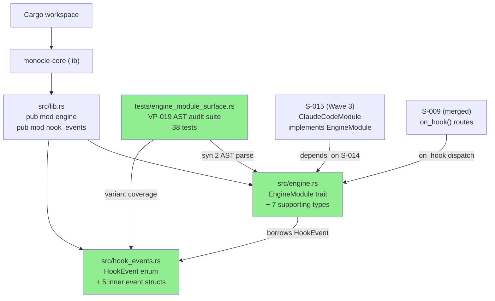
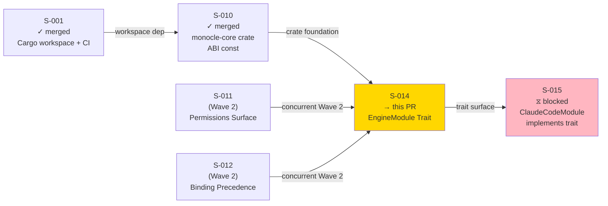
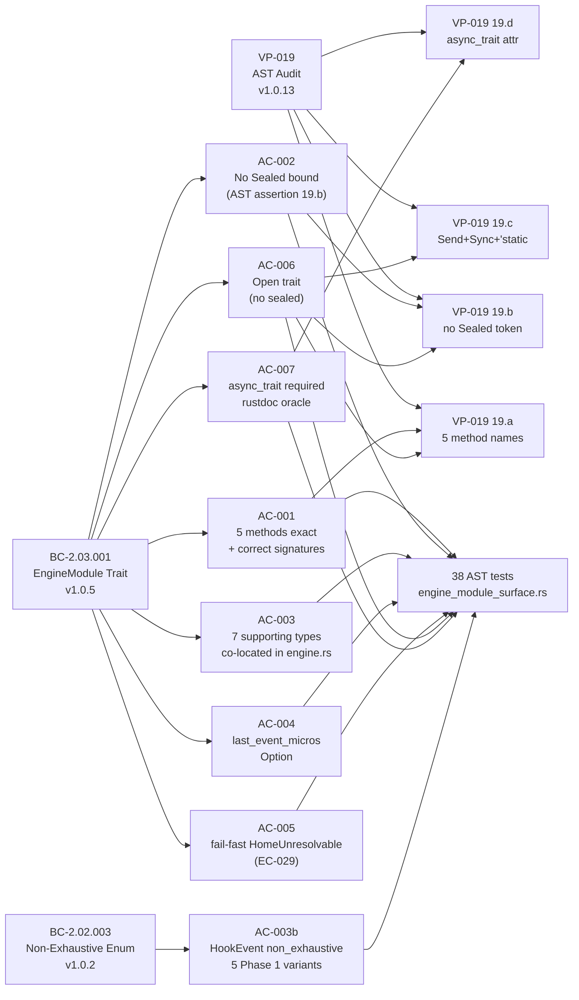

# [S-014] EngineModule Trait Definition

**Epic:** EPIC-03 — Harness Abstraction Layer
**Mode:** greenfield
**Convergence:** CONVERGED after 5 adversarial passes (R1 FAIL → fix, R2 PASS_WITH_OBS → 8 tests added, R3-R5 3× clean PASS)

Delivers the open `EngineModule` trait in `monocle-core::engine` — the stable public surface that all harness adapters (Phase 1: `ClaudeCodeModule`; Phase 3: WASM plugins; Phase 4: `CodeMachineModule`) will implement. The trait carries exactly 5 `#[async_trait]` methods with `Send + Sync + 'static` supertraits, 7 supporting types (`EngineMetadata`, `ProcessSnapshot`, `EnrichedSession`, `SessionStatus`, `HookResponse`, `HookDecision`, `EngineMetadataError`), and `HookEvent` enum (5 Phase 1 variants in a separate module per BC-2.03.001 invariant 2). All public types are `#[non_exhaustive]`. VP-019 AST audit suite provides 38 tests verifying trait surface, method signatures, async/sync correctness, supertrait bounds, type co-location, builder methods, and field types.

---

## Architecture Changes

### Key Design Decisions

**Open trait (no Sealed bound):** `EngineModule` has NO `private::Sealed` supertrait. Phase 3 WASM plugins and Phase 4 `CodeMachineModule` must be implementable from external crates. AST assertion 19.b (VP-019) verifies `Sealed` is absent at every CI run.

**`#[async_trait]` macro required (AC-007):** Native `async fn` in traits is not dyn-compatible on MSRV 1.86 (ratatui 0.30 floor). The macro desugars to `Pin<Box<dyn Future>>`. Rustdoc on the trait explains this with the normative BC-2.03.001 invariant 3 rationale text; a grep-based test in the AST suite verifies that text is present.

**`HookEvent` in separate module (AC-003):** `HookEvent` lives in `monocle-core/src/hook_events.rs`, not re-declared in `engine.rs`. This follows BC-2.03.001 invariant 2 and SS-core-types-and-abi.md §Non-Exhaustive Inner Structs.

**`PostToolUse` intentionally absent (AC-003b):** JC-2 explicitly excludes `post-tool-use` from the Phase 1 canonical 5-endpoint surface (BC-2.03.004 invariant 1). All match sites require a wildcard arm for fail-open Phase 4 forward compatibility (EC-031).

**`DeferUntil` dropped (F-D-03):** The ghost `DeferUntil` type was removed entirely; it has no canonical home in SS-engine-module.md v1.1.20. `HookResponse` uses `redirect_url: Option<String>` + `diagnostic: Option<String>` (F-D-02 fix applied).

**`SessionStatus` 5 variants (F-D-01):** The canonical variant set is `Active`, `Idle`, `WaitingOnPermission`, `Stopping`, `Stopped` — corrected from the 3-variant pre-fix draft.

---

## Story Dependencies

Inbound dependency: S-010 (merged, PR #8) establishes `monocle-core` crate with `async-trait 0.1` workspace dep.
Blocks: S-015 (`ClaudeCodeModule` implements `EngineModule`).

---

## Spec Traceability

---

## Test Evidence

| Metric | Value |
|--------|-------|
| S-014 tests (VP-019 AST suite) | 38 / 38 pass |
| Workspace total | 257 / 257 pass |
| `cargo clippy --workspace --all-targets -- -D warnings` | clean |
| `cargo fmt --all --check` | clean |
| VP-019 assertion 19.a (5 method names) | PASS |
| VP-019 assertion 19.b (no Sealed token) | PASS |
| VP-019 assertion 19.c (Send+Sync+'static) | PASS |
| VP-019 assertion 19.d (#[async_trait] attr) | PASS |

**Test coverage scope (engine_module_surface.rs):**
- Trait surface: method count, method names, sync/async correctness
- Supertrait bounds: Send, Sync, 'static presence; Sealed absence
- `#[async_trait]` attribute on trait declaration + rustdoc rationale text
- Supporting types: field names and types for all 7 structs/enums
- `SessionStatus` 5-variant set (Active, Idle, WaitingOnPermission, Stopping, Stopped)
- `HookDecision` 3-variant set (Allow, Block, Defer)
- `HookEvent` 5-variant set; PostToolUse absent; #[non_exhaustive] present
- `HookResponse` builder methods (new, with_diagnostic, with_redirect)
- `EnrichedSession::new` signature accepts `Option<i64>` for `last_event_micros`
- `EngineMetadata::new` constructor
- `ProcessSnapshot::new` and `with_full_context` constructors
- `#[non_exhaustive]` on all public types
- `EngineMetadataError::HomeUnresolvable` variant

---

## Holdout Evaluation

N/A — evaluated at wave gate.

---

## Adversarial Review

| Round | Verdict | Findings | Resolution |
|-------|---------|----------|------------|
| R1 | FAIL | Constructor signature mismatch; mock value type error | Fixed: tightened `EnrichedSession::new` to `Option<i64>` |
| R2 | PASS_WITH_OBS | 8 test gaps (async-ness, builder, inner-struct coverage) | Added commit `1aab4fa` with full coverage |
| R3 | PASS | 0 findings | Clean |
| R4 | PASS | 0 findings | Clean |
| R5 | PASS | 0 findings | Clean — convergence confirmed |

5 adversarial rounds. 3 clean passes (R3-R5). Convergence declared per factory protocol.

---

## Security Review

This PR introduces pure Rust type definitions — no network I/O, no file system writes, no unsafe blocks, no shell invocations, no credentials, no deserialization of untrusted input in production paths (test fixtures only). Security surface: nil. No OWASP Top 10 categories apply.

`serde_json::Value` is used in `PreToolUseEvent.tool_input` and `NotificationEvent.tool_input` — these are inbound hook event fields. They hold already-deserialized JSON from the hook server; no injection vector at this layer.

**SECURITY_REVIEW_VERDICT: PASS — no security findings.**

---

## Risk Assessment

| Dimension | Assessment |
|-----------|------------|
| Blast radius | Low — new module, no modifications to existing production paths |
| Rollback complexity | Trivial — squash-merge; no data migration |
| Performance impact | None — type definitions only; zero runtime overhead |
| Forward compatibility | High confidence — all public types carry `#[non_exhaustive]`; S-015 consumer surfaces documented in story §Downstream Consumer Surface |
| Breaking change risk | None for Wave 2 (no current consumers); S-015 will be first consumer |

---

## AI Pipeline Metadata

| Field | Value |
|-------|-------|
| Pipeline mode | greenfield-with-reference-ingest |
| Phase | Phase 3 TDD Implementation — Wave 2 |
| Story points | 5 |
| Estimated days | 2 |
| TDD mode | strict (Red Gate enforced) |
| Adversarial rounds | 5 (3 clean convergence) |

---

## Deferred Findings (non-blocking, wave-gate scope)

These findings are known, human-directed deferrals with explicit future-story anchors. They do NOT block merge.

| Finding | Deferred To | Reason |
|---------|-------------|--------|
| #34: BC-2.03.001 v1.0.5 PC-3 still lists `DeferUntil` in supporting types | PO (mechanical fix, Task #34) | Authority hierarchy: story v1.4 + SS-engine-module v1.1.20 win; BC is stale |
| SS-engine-module.md HookDecision code blocks stale (pre-F-D-02) | Architect, S-015 prep | Non-blocking; S-015 implementer reads story v1.4, not stale code blocks |
| `monocle-core` unused `futures`/`semver` deps | S-010 scope (pre-provisioned) | Provisioned by S-010 for S-013/S-014 consumers; clippy allowed at workspace level |

---

## Pre-Merge Checklist

- [x] PR description matches actual diff
- [x] All ACs covered by VP-019 AST test suite
- [x] Traceability chain complete: BC-2.03.001 → AC-001..007 → VP-019 assertions → 38 tests
- [x] No `Co-Authored-By: Claude` in any commit
- [x] No robot emoji in any commit
- [x] `cargo test --workspace` — 257/257 pass
- [x] `cargo clippy --workspace --all-targets -- -D warnings` — clean
- [x] `cargo fmt --all --check` — clean
- [x] Adversarial convergence: 3 clean passes (R3-R5)
- [x] Dependency PR S-010 merged (PR #8)
- [x] All public types carry `#[non_exhaustive]`
- [x] `HookEvent::PostToolUse` absent (JC-2 / BC-2.03.004 invariant 1)
- [x] `DeferUntil` ghost type not present anywhere in implementation
- [x] `SessionStatus` has canonical 5 variants (F-D-01)
- [x] `HookResponse` has canonical 3-field schema (F-D-02)
- [x] Security review: PASS (nil surface)
