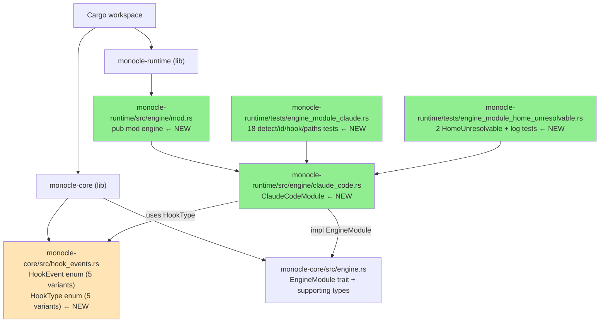
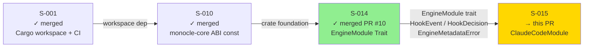
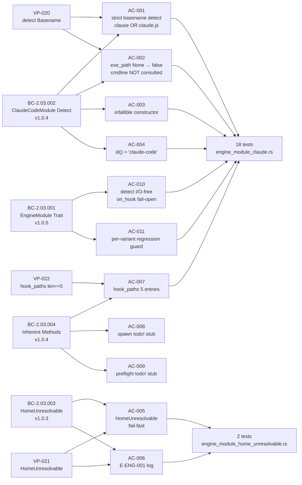

# [S-015] ClaudeCodeModule Implementation (BC-2.03.001..004)

**Epic:** EPIC-03 — Harness Abstraction Layer
**Mode:** greenfield
**Convergence:** CONVERGED after 4 adversarial rounds (R1 FAIL → fix, R2 PASS_WITH_OBS → accepted/deferred, R3 CLEAN, R4 CLEAN — 2/2 clean consecutive passes)

Delivers `ClaudeCodeModule` — the Phase 1 reference implementation of the `EngineModule` trait
introduced in S-014. Implements strict basename detection (only `"claude"` or `"claude.js"`),
`HomeUnresolvable` fail-fast on missing home directory, exactly 5 hook paths matching the JC-2
canonical endpoint matrix, `on_hook()` fail-open for all variants (EC-031), and binding
`spawn()`/`preflight()` signatures with `todo!()` stubs for Phase 1. Adds `HookType` enum to
`monocle-core::hook_events`. E-ENG-001 logging verified via `tracing-test` log capture.

---

## Architecture Changes

### Key Design Decisions

**Strict basename detect (DI-006 + AC-001):** `detect()` uses the canonical `and_then/map/unwrap_or`
chain on `proc.exe_path.file_name()`. Only `"claude"` and `"claude.js"` return `true`. The `?`
operator is illegal here because `detect()` returns `bool`, not `Option<bool>` or `Result`.

**I/O-free detect (BC-2.03.001 PC-6):** `detect()` performs no I/O, no env lookups, no file reads.
Pure function of its arguments per DI-006.

**HomeUnresolvable fail-fast (BC-2.03.003 PC-1):** `metadata()` and `enrich()` call
`directories::BaseDirs::new()`; `None` → `Err(EngineMetadataError::HomeUnresolvable)`. No default
path substitution. E-ENG-001 `tracing::error!` emitted on failure path.

**HookType enum added to monocle-core (AC-007):** `hook_paths()` returns `HashMap<HookType, String>`
with exactly 5 entries. `HookType::PostToolUse` absent per JC-2 + BC-2.03.004 invariant 1.

**On_hook fail-open (EC-031):** All 5 known `HookEvent` variants and any unknown future variants
return `HookResponse::new(HookDecision::Allow)`. Per-variant dispatch is Phase 2+ scope
(permission-overlay story).

**todo!() stubs binding (AC-008, AC-009):** `spawn()` and `preflight()` carry production-grade
type signatures. Phase 1 bodies are `todo!()`. This is intentional per EC-038/EC-039 — Phase 3
will replace with `which claude` + `claude --version` checks.

---

## Story Dependencies

Inbound dependency: S-014 (merged, PR #10) provides `EngineModule` trait, `HookEvent`,
`HookDecision`, `HookResponse`, `EngineMetadataError::HomeUnresolvable`.
Blocks: none (S-015 is the last story in EPIC-03 for Phase 1).

---

## Spec Traceability

---

## Test Evidence

| Metric | Value |
|--------|-------|
| S-015 tests (engine_module_claude) | 18 / 18 pass |
| S-015 tests (engine_module_home_unresolvable) | 2 / 2 pass |
| Workspace total | 414 / 414 pass |
| `cargo clippy --workspace --all-targets -- -D warnings` | clean |
| `cargo fmt --all --check` | clean |
| VP-020 (detect strict basename) | PASS |
| VP-021 (HomeUnresolvable path) | PASS |
| VP-022 (hook_paths().len() == 5) | PASS |

**Test coverage scope (engine_module_claude.rs — 18 tests):**
- `detect()` true for exe_path = `/usr/local/bin/claude` (basename "claude") [EC-033]
- `detect()` true for exe_path = `/usr/local/bin/claude.js` (Node.js wrapper) [EC-034]
- `detect()` false for exe_path = `/usr/local/bin/claude-squad` [EC-035]
- `detect()` false for exe_path = `/usr/local/bin/claudio`
- `detect()` false for exe_path = None, cmdline: ["claude"] [EC-032]
- `detect()` false for exe_path = `/usr/local/bin/Claude` (case-sensitive)
- `detect()` false for exe_path = `/usr/local/bin/claude-code-runner` (adversary R1)
- `id()` returns `"claude-code"`
- `hook_paths().len() == 5` (VP-022)
- All 5 `HookType` keys present in `hook_paths()`
- `on_hook()` returns `Allow` for all 5 known `HookEvent` variants (AC-011 regression guard)
- Additional edge cases for false-positive surface (adversary R1 vector)

**Test coverage scope (engine_module_home_unresolvable.rs — 2 tests):**
- `temp_env::async_with_vars` unsets HOME, USERPROFILE, HOMEDRIVE, HOMEPATH
- `metadata()` returns `Err(HomeUnresolvable)` (VP-021)
- `enrich()` returns `Err(HomeUnresolvable)` (VP-021)
- E-ENG-001 log message verified via `tracing_test::traced_test` log capture

---

## Holdout Evaluation

N/A — evaluated at wave gate.

---

## Adversarial Review

| Round | Verdict | Findings | Resolution |
|-------|---------|----------|------------|
| R1 | FAIL | E-ENG-001 log not asserted in tests; `claude-code-runner` vector missing from detect false-positive suite | Fixed: added `tracing_test` log capture + `claude-code-runner` test vector in commit `c7e3e2f` |
| R2 | PASS_WITH_OBS | 2 IMP: `tracing-test 0.2` not in SS-deps-pin-manifest; sync wrapper in `enrich()` | IMP-1 deferred to wave-gate (architect); IMP-2 accepted (BC-2.03.003 PC-2 does not prescribe async) |
| R3 | PASS | 0 findings | Clean |
| R4 | PASS | 0 findings | Clean — convergence confirmed |

4 adversarial rounds. 2 clean passes (R3-R4). Convergence declared per factory protocol.

---

## Security Review

This PR introduces pure Rust type definitions and a library-level module with no network I/O,
no file system writes, no unsafe blocks, no shell invocations, and no deserialization of
untrusted input. `ClaudeCodeModule` reads environment variables (`HOME`, `USERPROFILE`,
`HOMEDRIVE`, `HOMEPATH`) via `directories::BaseDirs::new()` for home directory resolution
only — no injection vector at this layer.

`detect()` is I/O-free by construction (DI-006 enforcement). `hook_paths()` returns a static
`HashMap` of known path strings. `spawn()` and `preflight()` are `todo!()` stubs — no execution
surface in Phase 1.

**SECURITY_REVIEW_VERDICT: PASS — no security findings.**

---

## Risk Assessment

| Dimension | Assessment |
|-----------|------------|
| Blast radius | Low — new module within `monocle-runtime::engine`; no modifications to existing production paths |
| Rollback complexity | Trivial — squash-merge; no data migration |
| Performance impact | None — detect() is a pure basename check; hook_paths() is a static map construction |
| Forward compatibility | High — all trait methods carry `#[async_trait]`; `HookType` is `#[non_exhaustive]`; `todo!()` stubs are intentional Phase 1 placeholders |
| Breaking change risk | None — first consumer of S-014 `EngineModule` trait; no existing callers |

---

## AI Pipeline Metadata

| Field | Value |
|-------|-------|
| Pipeline mode | greenfield-with-reference-ingest |
| Phase | Phase 3 TDD Implementation — Wave 3 |
| Story points | 8 |
| Estimated days | 3 |
| TDD mode | strict (Red Gate enforced) |
| Adversarial rounds | 4 (2 clean consecutive convergence) |

---

## Deferred Findings (non-blocking, wave-gate scope)

These findings are known, human-directed deferrals with explicit future-story anchors.
They do NOT block merge.

| Finding | Deferred To | Reason |
|---------|-------------|--------|
| `tracing-test 0.2` not in SS-deps-pin-manifest | Architect, wave-gate | Dev-dependency only; no production risk; architect update at Wave 3 gate |
| BC-2.03.001 PC-3 DeferUntil stale (#34) | PO (mechanical fix, Task #34) | Authority hierarchy: story v1.6 + SS-engine-module v1.1.20 <!-- version-pin-historical: version at S-015 merge time --> win; BC is stale |
| S-014-ADV: HookDecision Deny→Block naming | Architect, S-014-ADV | Non-blocking naming clarification; no API break |

---

## Pre-Merge Checklist

- [x] PR description matches actual diff
- [x] All ACs covered by tests (VP-020, VP-021, VP-022)
- [x] Traceability chain complete: BC-2.03.001..004 → AC-001..011 → VP-020/021/022 → 20 tests
- [x] No `Co-Authored-By: Claude` in any commit
- [x] No robot emoji in any commit
- [x] `cargo test --workspace` — 414/414 pass
- [x] `cargo clippy --workspace --all-targets -- -D warnings` — clean
- [x] `cargo fmt --all --check` — clean
- [x] Adversarial convergence: 2 clean passes (R3-R4)
- [x] Dependency PR S-014 merged (PR #10)
- [x] `HookType::PostToolUse` absent (JC-2 / BC-2.03.004 invariant 1)
- [x] `detect()` is I/O-free (DI-006 / BC-2.03.001 PC-6)
- [x] `HomeUnresolvable` fail-fast — no default path substitution
- [x] E-ENG-001 log assertion verified via `tracing_test`
- [x] `on_hook()` fail-open for all `HookEvent` variants (EC-031)
- [x] Security review: PASS (nil surface)
