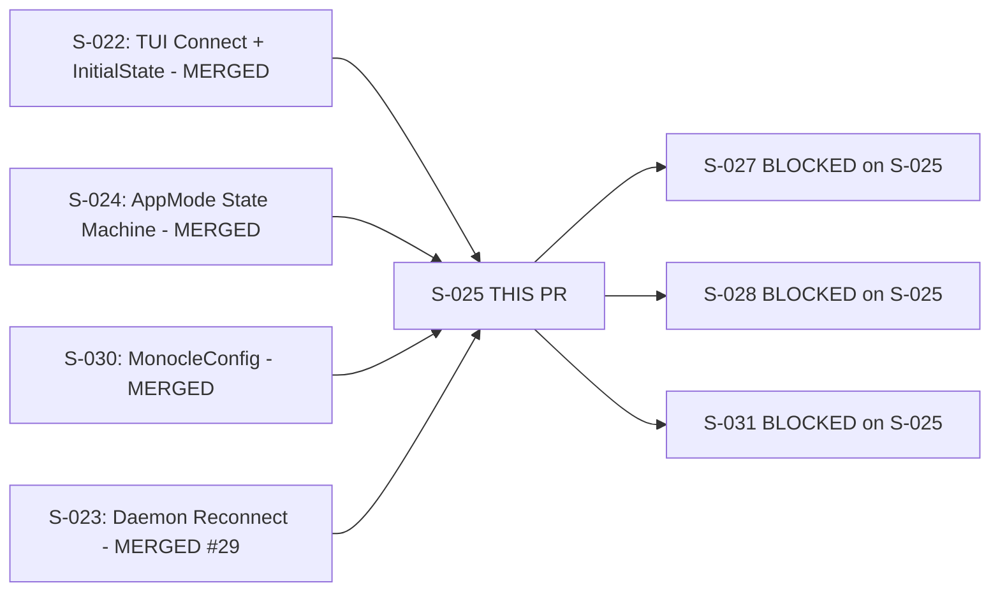
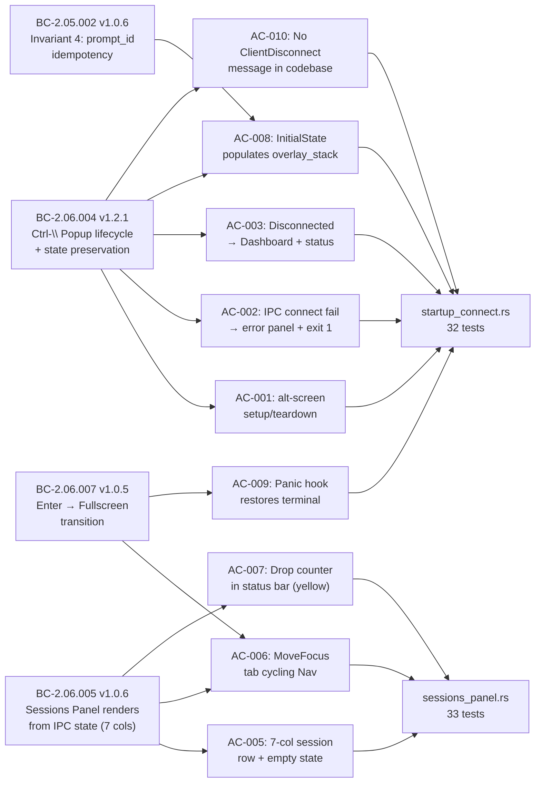

## S-025: TUI Binary Skeleton, Ctrl-\ Popup, Sessions Panel

**EPIC-06 | Wave 6 | 8 pts | Branch: `feature/S-025-tui-skeleton-sessions` → `develop`**

---

## Summary

- New `monocle-tui` crate (binary + lib) implementing the TUI skeleton: `main.rs` with panic hook + terminal setup/teardown, async `run()` event loop connecting to the daemon UDS, `SessionsPanel` StatefulWidget, dashboard/fullscreen layout helpers, and all IPC message handlers (`on_initial_state`, `on_transport_event`, `on_drop_counter_update`).
- Cross-story gap fix: `Action::MoveFocus` arm added to `transition()` in `monocle-core` (BC-2.06.005 PC-2 / AC-006); `#[derive(Clone)]` added to `PromptModal` and `ToolPayload`.
- `apply_permission_prompt_queued()` enforces BC-2.05.002 Invariant 4 (prompt_id idempotency for at-least-once IPC delivery).
- Key product behavior: `q` is the sole Dashboard quit key. `Esc` is context-sensitive identity (no-op in Dashboard and Overlay). Fullscreen-Esc-exit and the fullscreen VIEW are deferred to a later fullscreen-view story per product-owner ruling (Passes 38-39 adjudication).

---

## Architecture Changes

```mermaid
graph TD
    A[monocle-tui crate - NEW] --> B[src/main.rs\npanic hook + terminal lifecycle]
    A --> C[src/app.rs\nApp struct + AppMode state machine]
    A --> D[src/ui/mod.rs\ndraw_dashboard / draw_fullscreen]
    A --> E[src/ui/sessions_panel.rs\nSessionsPanel StatefulWidget]
    A --> F[tests/startup_connect.rs\n32 integration tests]
    A --> G[tests/sessions_panel.rs\n33 unit tests]
    H[monocle-core - MODIFIED] --> I[transition() + Action::MoveFocus arm\n+ Clone derives on PromptModal/ToolPayload]
    J[monocle-ipc - UNCHANGED] --> A
    K[monocle-config - UNCHANGED] --> A
```

---

## Story Dependencies



All upstream dependencies merged. S-023 (#29 @ 7a52041) resolved the develop integration conflict (the old `TODO(S-023-merge)` app.rs reconnect hook is wired up in the feature branch).

---

## Spec Traceability



---

## Acceptance Criteria Coverage

| AC | Description | Tests | Status |
|----|-------------|-------|--------|
| AC-001 | Panic hook + alt-screen lifecycle (live TTY) | Deferred to Phase-4 HS-EXP-009 | Demo evidence (VHS) |
| AC-002 | IPC connect fail → error panel + exit 1 | `test_ac002_*` in startup_connect.rs | Pass |
| AC-003 | Disconnected → Dashboard + status msg | `test_ac003_*` in startup_connect.rs | Pass |
| AC-004 | Config load + MONOCLE_CONFIG_PATH override | `test_ac004_*` in startup_connect.rs | Pass |
| AC-005 | 7-col Sessions Panel + empty state | `test_ac005_*` in sessions_panel.rs | Pass |
| AC-006 | MoveFocus tab cycling Sessions ↔ EventRibbon | `test_ac006_*` in sessions_panel.rs | Pass |
| AC-007 | Drop counter in status bar (yellow when > 0) | `test_ac007_*` in sessions_panel.rs | Pass |
| AC-008 | InitialState populates overlay / idempotency | `test_ac008_*` in startup_connect.rs | Pass |
| AC-009 | Panic hook restores terminal (live TTY) | Deferred to Phase-4 HS-EXP-009 | Demo evidence (VHS) |
| AC-010 | No ClientDisconnect in codebase | `test_ac010_*` in startup_connect.rs | Pass |

---

## Test Evidence

| Suite | Tests | Result |
|-------|-------|--------|
| `monocle-tui/tests/startup_connect.rs` | 32 | All pass |
| `monocle-tui/tests/sessions_panel.rs` | 33 | All pass |
| Workspace total (latest HEAD) | 753+ | All pass |
| `cargo clippy --workspace --all-targets -- -D warnings` | — | Clean |
| `cargo fmt --all -- --check` | — | Clean |
| POL-11 (version-pin freshness) | — | Pass |
| POL-12 (structural-claim enforcement) | — | Pass |

Both POL gates (POL-11 and POL-12) are genuine enforcement gates — not stubs. Both pass on latest HEAD.

---

## Adversarial Convergence

This PR reached **formal 3/3 convergence** after 42 total adversarial passes (Passes 29-42 in this session, D-221 gate).

- **Passes 38-39 caught two real content defects** and triggered adjudication:
  - Pass 38 finding: stale "Esc quits" AC claim in AC-001/AC-009 doc-comments. Fixed: doc-comments corrected; q-quit test path added.
  - Pass 38 finding: untested q-quit path. Fixed: `test_ac001_q_key_exits_dashboard` added.
  - Pass 39 finding: over-reach in the Esc-context fix (partial fix introduced Esc-context inconsistency). Fixed: Esc is identity/no-op universally; fullscreen-Esc-exit deferred.
  - **Product-owner adjudication (Passes 38-39):** `q` is the sole Dashboard quit key. `Esc` is context-sensitive identity in all modes for this skeleton. Fullscreen VIEW + Esc-exit binding are formally deferred to a later fullscreen-view story.
- **Passes 40-42:** Three independent source re-derivation passes confirmed convergence (zero new findings, NITPICK_ONLY threshold met, 3 consecutive NITPICK_ONLY = formal convergence per project discipline).

---

## Demo Evidence

Demo recordings for all 10 ACs are in `docs/demo-evidence/S-025/` (commit `a612b5b`).

Two ACs requiring a live TTY are noted deferred to Phase-4 holdout:
- **AC-001** (alt-screen lifecycle): requires real terminal process; VHS evidence provided.
- **AC-009** (panic-hook raw-mode restore under SIGTERM): same constraint; VHS evidence provided.

Deferral anchor: `HS-EXP-009` (holdout scenario for panic/exit path under raw terminal).

---

## Security Review

No security-sensitive surface introduced. The `monocle-tui` crate is a read-only client:
- All session data flows in from daemon via UDS (already reviewed in S-022 / PR #27).
- No file writes from TUI (DI-007 enforced — no `std::fs` in sessions panel per BC-2.06.005 Invariant 1).
- No new network sockets, no privilege escalation, no credential handling.
- Panic hook uses `std::panic::set_hook` (stdlib) — no unsafe code introduced.

---

## Known Deferrals (Non-Blocking)

| ID | Item | Anchor |
|----|------|--------|
| F-S025-ADV37-DEFER-001 | STORY-INDEX rows 150-153 BC→AC ranges need wave-gate update | wave-gate post-merge |
| — | Fullscreen VIEW + Esc→ExitFullscreen binding | Sessions Panel fullscreen-view story (later Wave 6/7) |
| — | AC-004 ParseError-modal display | Pre-existing out-of-scope (config crate behavior) |
| HS-EXP-009 | AC-001/AC-009 live-TTY evidence | Phase-4 holdout evaluation |

---

## Holdout Evaluation

N/A — evaluated at wave gate (Wave 6 gate pending S-023 + S-025 both merged).

---

## Adversarial Review

Formal convergence achieved (3/3 consecutive NITPICK_ONLY, D-221). See "Adversarial Convergence" section above.

---

## Risk Assessment

| Category | Assessment |
|----------|-----------|
| Blast radius | Additive — new `monocle-tui` crate + narrow `monocle-core` patch (MoveFocus arm + Clone derives). No existing behavior removed. |
| Performance impact | None. New crate. 16ms tick rate is standard ratatui pattern. |
| Rollback | Branch deletion restores prior state. No migrations, no schema changes. |

---

## AI Pipeline Metadata

| Field | Value |
|-------|-------|
| Pipeline mode | greenfield-with-reference-ingest |
| Story | S-025 v1.14 |
| Adversarial passes | 42 total (Passes 29-42 this session) |
| Convergence gate | D-221 (3/3 consecutive NITPICK_ONLY) |
| Implementer rounds | Multiple (see cycle artifacts) |
| Product-owner adjudication | Passes 38-39 (Esc/q ruling) |

---

## Pre-Merge Checklist

- [x] PR description matches actual diff
- [x] All 10 ACs covered by demo evidence (2 deferred to HS-EXP-009 with evidence)
- [x] Traceability chain complete: BC → AC → Test → Demo
- [x] All dependency PRs merged (S-022 #27, S-023 #29, S-024, S-030)
- [x] CI Preflight (fmt + clippy) passing
- [x] POL-11 + POL-12 passing
- [x] DTU fidelity passing
- [x] Audit-table vendor drift passing
- [ ] Build + Test (all 3 platforms) — pending (CI running)
- [x] Adversarial convergence: 3/3 (D-221)
- [x] No `todo!()` or `unimplemented!()` in production code
- [x] No `Co-Authored-By: Claude` in commits
- [x] No `--no-verify` used
