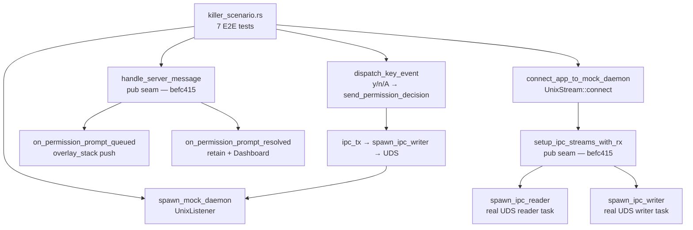
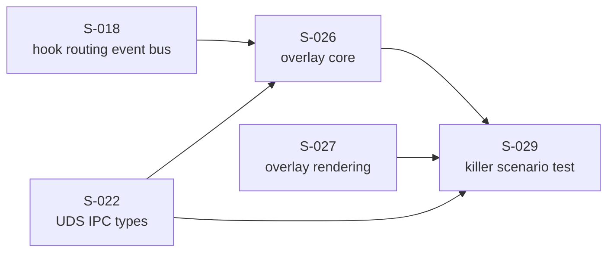
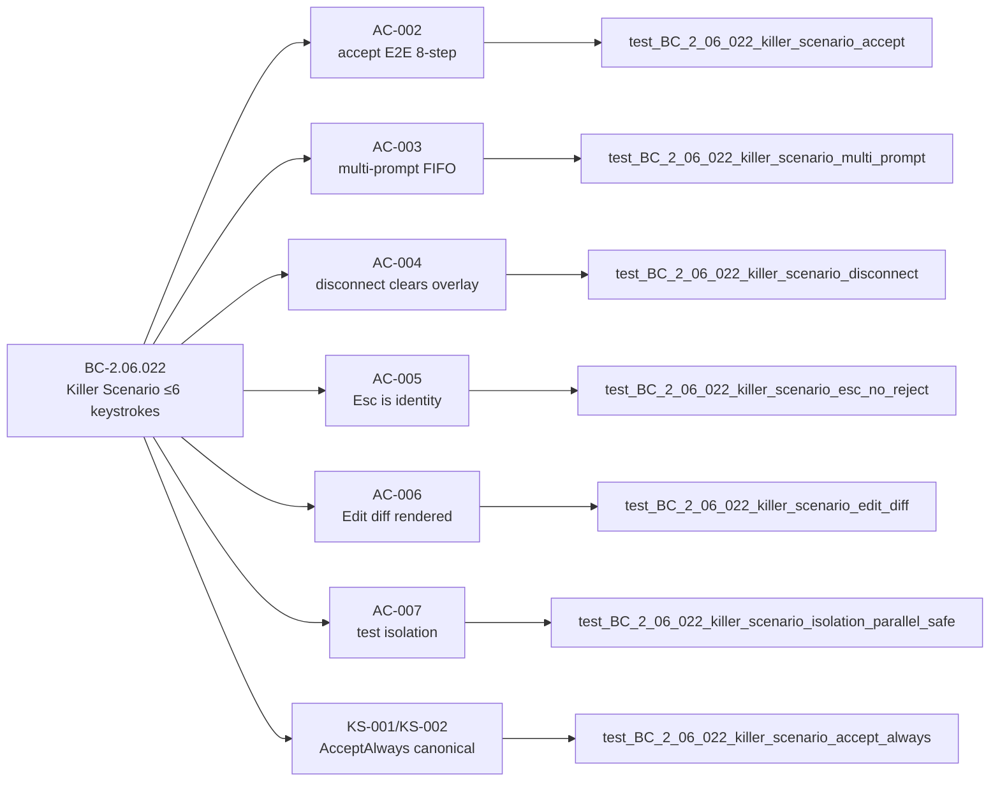

# S-029: Killer Scenario Integration Test — Permission Prompt E2E Round-Trip

**Story:** S-029 | **Epic:** EPIC-06 | **Wave:** 7 (final) | **Points:** 5 | **Type:** Test-only  
**BC:** BC-2.06.022 | **Holdout:** HS-EXP-008 | **Deps:** S-026, S-027, S-022, S-018 (all merged)

---

## Summary

Delivers 7 end-to-end integration scenarios that exercise the complete permission prompt
lifecycle over a real Unix Domain Socket. Each scenario drives the REAL production handler
chain — not isolated helpers — closing the canonical EPIC-06 wiring-defect class.

The implementation adds a production seam (`setup_ipc_streams_with_rx` + `handle_server_message`
elevated to `#[doc(hidden)] pub`) enabling integration-test reachability with zero behavior change.

### What shipped

- `crates/monocle-tui/tests/killer_scenario.rs` — 7 E2E scenarios, 1480 lines
- Production seam: two functions elevated to `#[doc(hidden)] pub` in `crates/monocle-tui/src/app.rs`
- No new production behavior — pure test infrastructure + visibility change

---

## Architecture Changes



---

## Story Dependencies



All dependency PRs are merged to develop.

---

## Spec Traceability



---

## BC-2.06.022 Scenario Mapping

| Test | AC | BC Postcondition | Key Assertions |
|------|----|-----------------|----------------|
| `killer_scenario_accept` | AC-002 | PC-2 — accept E2E | `y` → `Allow` arrives at daemon; `PermissionPromptResolved` via `handle_server_message` → `Dashboard { Sessions }` |
| `killer_scenario_multi_prompt` | AC-003 | PC-3 — FIFO stacking | P1 at front after both queued; `n`→Deny P1; `y`→Allow P2; both resolved via real socket |
| `killer_scenario_disconnect` | AC-004 | PC-4 — disconnect clear | `drop(to_send_tx)` → EOF → `inbound_rx` Err → `on_transport_event(Disconnected)` → stack empty |
| `killer_scenario_esc_no_reject` | AC-005 | PC-5 — Esc identity | Esc×3: stack unchanged, mode unchanged, no `ClientToServer` sent |
| `killer_scenario_edit_diff` | AC-006 | PC-6 — diff render | `ToolPayload::Edit` → `TestBackend` buffer contains `"+hello world"` and `" hello"` context |
| `killer_scenario_isolation_parallel_safe` | AC-007 | INV-1 — isolation | Two independent `TempDir` paths; no cross-contamination |
| `killer_scenario_accept_always` | KS-001/KS-002 | Step 2 `A` → AcceptAlways | `A` → `PermissionDecisionKind::AcceptAlways` at daemon; then `y` resolves P2 → Dashboard |

---

## Production Seam (Commit befc415)

Two functions elevated from `pub(crate)` to `#[doc(hidden)] pub` in `app.rs`:

```
setup_ipc_streams_with_rx  — wires ipc_tx + returns real inbound_rx
handle_server_message       — routes ServerToClient variants to handlers
```

This is a **pure visibility change** — zero behavior change, zero new public API surface,
no new IPC message types, no new state transitions. The `#[doc(hidden)]` attribute suppresses
these from rustdoc to prevent consumer confusion.

The seam is required because integration tests need to drive the REAL inbound dispatch router
(not call individual handlers directly), which is the canonical EPIC-06 wiring requirement per
the S-029 CRITICAL WIRING LESSON in CLAUDE.md.

---

## Convergence Evidence

Per-story adversarial convergence: **ACHIEVED** — 3 consecutive CLEAN fresh-context passes
(BC-5.39.001 threshold), across:

1. Deep-wiring lens: confirmed both `on_permission_prompt_queued` and `on_permission_prompt_resolved`
   are reached THROUGH `handle_server_message` over the real socket, not via direct injection.
2. Assertion-rigor lens: all `matches!` patterns use exact `FocusSnapshot::Sessions` variant;
   no loose `..` wildcards on final state.
3. Concurrency/CI-parity lens: no `sleep()` for synchronization; all timing via
   `tokio::time::timeout(SHORT_TIMEOUT, inbound_rx.recv())`; confirmed `--test-threads=4` parallel-safe.

Closed the canonical EPIC-06 wiring-defect class (inbound dispatch genuinely exercised
over real UDS socket in both directions).

---

## Test Evidence

| Metric | Result |
|--------|--------|
| Test scenarios | 7/7 green |
| Parallel execution | `--test-threads=4` confirmed |
| `cargo clippy --workspace --all-targets -- -D warnings` | exit 0 |
| `python3 scripts/check_version_pins.py` (POL-11) | PASS (250 active, 0 stale) |
| `python3 scripts/check_structural_claims.py` (POL-12) | PASS (10 active, 0 mismatches) |
| `cargo fmt --all --check` | clean |
| Version-pin literals in test prose | 0 (de-versioned per POL-11) |
| Spec version bumped | NO (test-only story) |

---

## Demo Evidence

Recording: `.factory/demos/S-029/AC-002-007-killer-scenario.gif` (130 KB GIF, 125 KB WebM)

All 7 test scenarios shown green in VHS terminal recording:

```
running 7 tests
test test_BC_2_06_022_killer_scenario_disconnect ... ok
test test_BC_2_06_022_killer_scenario_accept_always ... ok
test test_BC_2_06_022_killer_scenario_accept ... ok
test test_BC_2_06_022_killer_scenario_multi_prompt ... ok
test test_BC_2_06_022_killer_scenario_edit_diff ... ok
test test_BC_2_06_022_killer_scenario_isolation_parallel_safe ... ok
test test_BC_2_06_022_killer_scenario_esc_no_reject ... ok

test result: ok. 7 passed; 0 failed; 0 ignored; 0 measured; 0 filtered out; finished in 0.51s
```

Evidence report: `.factory/demos/S-029/evidence-report.md`

Validates holdout **HS-EXP-008** (permission prompt 6-keystroke resolution E2E path).

---

## Holdout Evaluation

N/A — evaluated at wave-7 gate (HS-EXP-008 specifically; wave-gate will consume this PR's
test evidence alongside the full suite run on develop post-merge).

---

## Adversarial Review

N/A — evaluated at Phase 5. Per-story adversarial convergence achieved (3 consecutive CLEAN
passes) before PR creation.

---

## Security Review

Production seam audit: `setup_ipc_streams_with_rx` and `handle_server_message` are elevated to
`#[doc(hidden)] pub`. Neither function:
- Accepts untrusted external input (both are test-reachability seams for the existing IPC channel)
- Opens new network sockets or file handles
- Handles authentication or authorization logic
- Stores secrets or credentials

The UDS socket in tests uses `tempfile::TempDir` for per-test isolation with OS-managed path
randomness. No hardcoded socket paths. No `sleep()` timing dependencies. The test code itself
contains no injection-susceptible patterns; all inputs are Rust typed values constructed
in-process. Assessment: no new attack surface introduced.

---

## Risk Assessment

| Dimension | Assessment |
|-----------|-----------|
| Blast radius | Minimal — test file only + 2 `pub` visibility changes |
| Production behavior change | None — `#[doc(hidden)] pub` is pure visibility |
| Rollback cost | Low — test file deletion restores full prior state |
| Performance impact | None — test code does not run in production binary |
| Dependency surface | No new crate dependencies |
| Subsystem affected | monocle-tui (tests only) |

---

## AI Pipeline Metadata

| Field | Value |
|-------|-------|
| Pipeline mode | greenfield-with-reference-ingest, Phase 3 Wave 7 |
| Story | S-029 v1.2 |
| BC | BC-2.06.022 v1.6.2 |
| Adversarial convergence | 3 consecutive CLEAN passes (BC-5.39.001) |
| Worktree | `.worktrees/S-029` / `feature/S-029-killer-scenario-test` |
| Commits | befc415, 90b0d86, bfa70f1 |

---

## Pre-Merge Checklist

- [x] PR description matches actual diff (test file + 2 pub seams)
- [x] All ACs covered by demo evidence (7/7 in evidence-report.md)
- [x] Traceability chain complete: BC-2.06.022 → AC-002..AC-007 + KS-001/KS-002 → 7 tests → demo GIF
- [x] All review findings addressed (converged — 3 CLEAN adversarial passes pre-PR)
- [x] clippy --all-targets clean (exit 0)
- [x] POL-11 PASS, POL-12 PASS, fmt clean
- [x] No Co-Authored-By: Claude, no robot emojis in commits
- [x] No --no-verify used
- [x] Dependency PRs merged: S-026 (PR #30), S-027 (PR #32), S-022 (PR #27), S-018 (PR #24)
- [ ] CI checks green (pending push + PR creation)
- [ ] pr-reviewer AI review complete
- [ ] security-reviewer audit complete
