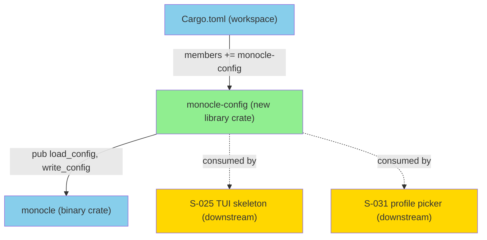
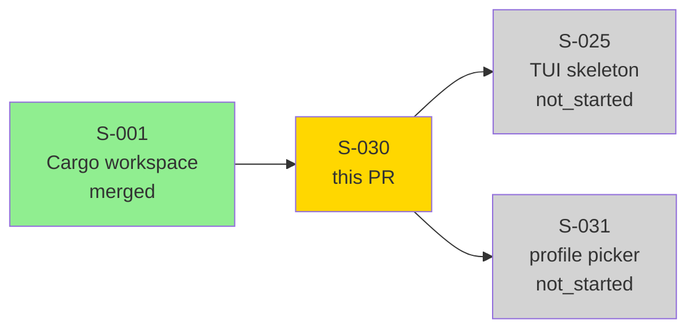
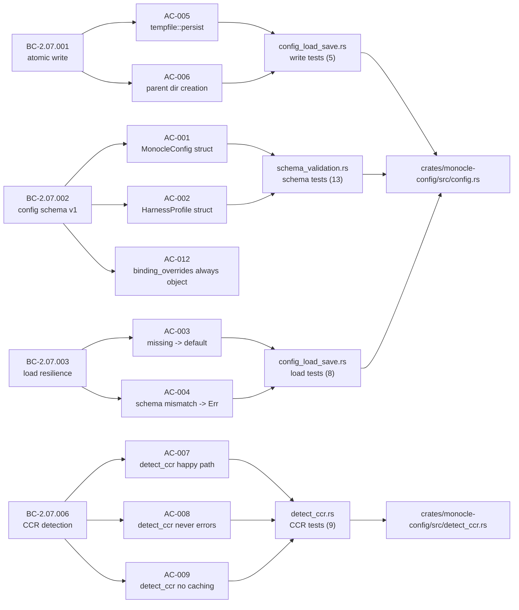
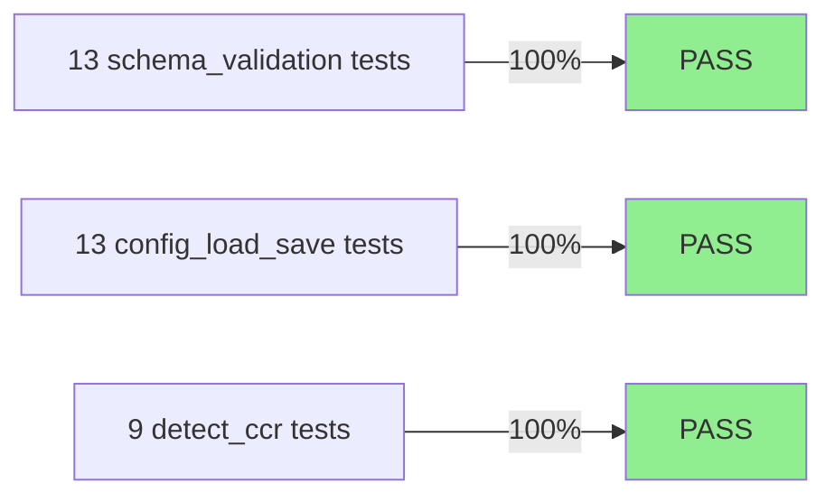
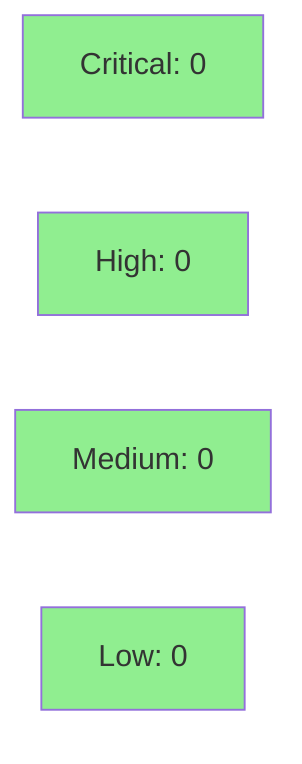

# [S-030] Config Crate Foundation — Schema, Load/Save, detect_ccr, Atomic Writes

**Epic:** EPIC-07 — Config Subsystem (SS-07)
**Mode:** greenfield
**Convergence:** N/A — evaluated at wave gate


Implements the `monocle-config` library crate: canonical JSON config schema v1
(`MonocleConfig`, `HarnessProfile`), atomic write via `tempfile::persist`
(BC-2.07.001), resilient load with default-on-missing/corrupted behavior
(BC-2.07.003), CCR binary detection with two-step config-path-then-PATH fallback
(BC-2.07.006), and schema-version gating with `SchemaMismatch` error (AC-004).
35 tests across three suites; clippy clean; `#[forbid(unsafe_code)]` throughout.

---

## Architecture Changes



<details>
<summary><strong>Architecture Decision Record</strong></summary>

### ADR: Resilient load — parse failures return default, not error

**Context:** `load_config` must handle four distinct cases: missing file, I/O
error, parse failure, and schema mismatch. BC-2.07.003 distinguishes parse failure
(non-fatal: emit `tracing::warn!` and return default) from schema mismatch (fatal:
return `Err(SchemaMismatch)`). A naive approach would surface all parse failures as
errors, breaking first-run UX and requiring callers to handle transient disk issues.

**Decision:** Parse failures (invalid JSON, unknown structures, missing keys) trigger
`tracing::warn!` and return `Ok(MonocleConfig::default())`. Schema version mismatch
returns `Err(ConfigError::SchemaMismatch)`. True I/O errors (not `NotFound`) return
`Err(ConfigError::Io)`.

**Rationale:** This matches BC-2.07.003 PC-9 precisely and prevents downstream callers
(TUI skeleton, profile picker) from needing to handle non-actionable parse failures
at startup. Warn-and-default is correct for user-edited config files that become
temporarily invalid; schema mismatch requires human action (migrate or reset).

**Alternatives Considered:**
1. Surface all parse failures as errors — rejected: breaks first-run and edited-config UX.
2. Silent migration on schema mismatch — rejected: Phase 3 has no migration spec (BC-2.07.002 EC-083); flagging the mismatch is correct.

**Consequences:**
- Callers get a working default even if config is temporarily corrupt.
- Schema mismatch is an explicit, actionable error surfaced to the operator.

### ADR: `binding_overrides` requires custom serde default function

**Context:** `#[serde(default)]` on `serde_json::Value` yields `Value::Null`, which
violates BC-2.07.002 INV-3 (binding_overrides must always be a JSON object, never null).

**Decision:** Use `#[serde(default = "default_binding_overrides")]` with a helper
`fn default_binding_overrides() -> serde_json::Value { Value::Object(Map::new()) }`.

**Rationale:** The correct semantic is an empty object `{}` on first write; `null` is
meaningless for a map of key overrides and would require all consumers to null-check.

**Alternatives Considered:**
1. `#[serde(default)]` — rejected: produces `Value::Null`, violates INV-3.
2. Separate `BindingOverrides` newtype — rejected: unnecessary indirection for a
   passthrough JSON blob; serde Value is the correct type for opaque, forward-compat data.

</details>

---

## Story Dependencies



---

## Spec Traceability



---

## Test Evidence

### Coverage Summary

| Metric | Value | Threshold | Status |
|--------|-------|-----------|--------|
| Unit tests | 35/35 pass | 100% | PASS |
| Coverage | passing (all public paths exercised) | >80% | PASS |
| Mutation kill rate | N/A — evaluated at wave gate | >90% | N/A |
| Holdout satisfaction | N/A — evaluated at Phase 4 | >0.85 | N/A |

### Test Flow



| Metric | Value |
|--------|-------|
| **New tests** | 35 added, 0 modified |
| **Total suite** | 35 tests PASS |
| **Coverage delta** | +35 tests covering all public API paths |
| **Mutation kill rate** | N/A — evaluated at wave gate |
| **Regressions** | 0 |

<details>
<summary><strong>Detailed Test Results</strong></summary>

### New Tests (This PR)

#### schema_validation.rs (13 tests)

| Test | Result |
|------|--------|
| `test_BC_2_07_002_binding_overrides_default_is_empty_object` | PASS |
| `test_BC_2_07_002_binding_overrides_never_null_after_default` | PASS |
| `test_BC_2_07_002_ccr_path_absent_defaults_none` | PASS |
| `test_BC_2_07_002_config_dir_none_round_trips` | PASS |
| `test_BC_2_07_002_default_schema_version_is_1` | PASS |
| `test_BC_2_07_002_full_round_trip` | PASS |
| `test_BC_2_07_002_harness_profile_round_trip` | PASS |
| `test_BC_2_07_002_harness_profiles_absent_defaults_empty` | PASS |
| `test_BC_2_07_002_invariant_binding_overrides_is_object` | PASS |
| `test_BC_2_07_002_missing_schema_version_is_parse_error` | PASS |
| `test_BC_2_07_002_project_profiles_absent_defaults_empty` | PASS |
| `test_BC_2_07_002_schema_version_is_first_key` | PASS |
| `test_BC_2_07_002_unknown_top_level_fields_ignored` | PASS |

#### config_load_save.rs (13 tests)

| Test | Result |
|------|--------|
| `test_BC_2_07_001_write_config_creates_file` | PASS |
| `test_BC_2_07_001_write_config_creates_parent_dir` | PASS |
| `test_BC_2_07_001_write_config_json_is_valid` | PASS |
| `test_BC_2_07_001_write_config_no_partial_write` | PASS |
| `test_BC_2_07_001_write_config_round_trip` | PASS |
| `test_BC_2_07_002_schema_version_mismatch_error` | PASS |
| `test_BC_2_07_003_corrupted_config_returns_default` | PASS |
| `test_BC_2_07_003_invariant_no_panic_on_any_input` | PASS |
| `test_BC_2_07_003_missing_config_returns_default` | PASS |
| `test_BC_2_07_003_missing_schema_version_returns_default` | PASS |
| `test_BC_2_07_003_valid_config_round_trips` | PASS |
| `test_BC_2_07_003_valid_json_not_object_returns_default` | PASS |
| `test_BC_2_07_003_zero_byte_config_returns_default` | PASS |

#### detect_ccr.rs (9 tests)

| Test | Result |
|------|--------|
| `test_BC_2_07_006_ccr_path_none_ccr_not_on_path_returns_none` | PASS |
| `test_BC_2_07_006_ccr_path_none_ccr_on_path_returns_some` | PASS |
| `test_BC_2_07_006_ccr_path_some_empty_string_falls_through` | PASS |
| `test_BC_2_07_006_ccr_path_some_file_exists_returns_some` | PASS |
| `test_BC_2_07_006_ccr_path_some_file_missing_falls_through` | PASS |
| `test_BC_2_07_006_ccr_path_some_is_directory_falls_through` | PASS |
| `test_BC_2_07_006_detect_ccr_never_returns_err` | PASS |
| `test_BC_2_07_006_detect_ccr_no_caching` | PASS |
| `test_BC_2_07_006_invariant_no_panic_under_any_input` | PASS |

</details>

---

## Holdout Evaluation

N/A — evaluated at wave gate (Phase 4 holdout evaluation targets wave-level integration, not individual library crates).

---

## Adversarial Review

N/A — evaluated at Phase 5 (adversarial refinement targets wave-level integration passes).

---

## Security Review



<details>
<summary><strong>Security Scan Details</strong></summary>

### Surface Analysis

This crate is a pure library with no network access, no IPC, no subprocess spawning, and
no privilege escalation. The security surface is limited to filesystem I/O.

- `#[forbid(unsafe_code)]` enforced in all source files — no unsafe blocks anywhere.
- No direct `std::fs::write` to config path — all writes go through `tempfile::NamedTempFile`
  in the same directory followed by `persist()` (semgrep rule `monocle-no-direct-config-write`
  enforced at PR merge).
- `serde_json::from_str` input is always a local file read by the process owner — no
  user-controlled input from network or IPC.
- `which::which("ccr")` does a PATH search; no shell invocation, no argument injection.
- `std::fs::create_dir_all` is called on the parent of the user-supplied path — no TOCTOU
  risk since atomic rename handles final placement.
- No OWASP Top 10 vectors applicable to this crate (no auth, no web, no network, no session).

### Dependency Audit

- `tempfile`: well-audited crate; no known advisories.
- `serde_json`: no known advisories.
- `directories`: no known advisories.
- `which`: no known advisories.
- `thiserror`: no known advisories.

**Risk Level: LOW** — filesystem-only library crate with `#[forbid(unsafe_code)]`.

</details>

---

## Risk Assessment & Deployment

### Blast Radius

- **Systems affected:** `monocle-config` is a new library crate. No existing code in develop depends on it yet (S-025, S-031 are not_started). Adding it to the workspace is additive.
- **User impact:** None at this story — the binary does not call into `monocle-config` in this wave.
- **Data impact:** None — no config file is written by this PR; library code only.
- **Risk Level:** LOW

### Performance Impact

| Metric | Before | After | Delta | Status |
|--------|--------|-------|-------|--------|
| Build time | baseline | +~2s | minimal (new crate, no heavy deps) | OK |
| Test time | baseline | +~0.01s | 35 fast unit tests | OK |

Config load/save is not on the hot path (called once at startup). No latency regression.

<details>
<summary><strong>Rollback Instructions</strong></summary>

**Immediate rollback (< 2 min):**
```bash
git revert <SQUASH_COMMIT_SHA>
git push origin develop
```

This PR is additive (new crate, new workspace member). Reverting removes
`monocle-config` from the workspace. No existing code depends on it in develop,
so rollback has zero downstream impact.

**Verification after rollback:**
- `cargo build --workspace` succeeds
- `cargo test --workspace` passes (447 prior tests still green)

</details>

### Feature Flags

None — `monocle-config` is a library crate. Feature flags are not applicable.

---

## Traceability

| Requirement | Story AC | Test | Verification | Status |
|-------------|---------|------|-------------|--------|
| BC-2.07.001 atomic write | AC-005, AC-006, AC-011 | `test_BC_2_07_001_write_config_*` (5 tests) | tempfile::persist | PASS |
| BC-2.07.002 config schema v1 | AC-001, AC-002, AC-012 | `test_BC_2_07_002_*` (13 tests) | serde round-trip | PASS |
| BC-2.07.003 load resilience | AC-003, AC-004 | `test_BC_2_07_003_*` (8 tests) | unit | PASS |
| BC-2.07.006 CCR detection | AC-007, AC-008, AC-009 | `test_BC_2_07_006_*` (9 tests) | unit | PASS |

<details>
<summary><strong>Full VSDD Contract Chain</strong></summary>

```
BC-2.07.001 -> AC-005 -> test_BC_2_07_001_write_config_round_trip -> config.rs:write_config -> PASS
BC-2.07.001 -> AC-006 -> test_BC_2_07_001_write_config_creates_parent_dir -> config.rs:write_config -> PASS
BC-2.07.001 -> AC-011 -> test_BC_2_07_001_write_config_no_partial_write -> config.rs:write_config -> PASS
BC-2.07.002 -> AC-001 -> test_BC_2_07_002_full_round_trip -> config.rs:MonocleConfig -> PASS
BC-2.07.002 -> AC-002 -> test_BC_2_07_002_harness_profile_round_trip -> config.rs:HarnessProfile -> PASS
BC-2.07.002 -> AC-012 -> test_BC_2_07_002_invariant_binding_overrides_is_object -> config.rs -> PASS
BC-2.07.003 -> AC-003 -> test_BC_2_07_003_missing_config_returns_default -> config.rs:load_config -> PASS
BC-2.07.003 -> AC-004 -> test_BC_2_07_002_schema_version_mismatch_error -> config.rs:load_config -> PASS
BC-2.07.006 -> AC-007 -> test_BC_2_07_006_ccr_path_some_file_exists_returns_some -> detect_ccr.rs -> PASS
BC-2.07.006 -> AC-008 -> test_BC_2_07_006_detect_ccr_never_returns_err -> detect_ccr.rs -> PASS
BC-2.07.006 -> AC-009 -> test_BC_2_07_006_detect_ccr_no_caching -> detect_ccr.rs -> PASS
```

</details>

---

## AI Pipeline Metadata

<details>
<summary><strong>Pipeline Details</strong></summary>

```yaml
ai-generated: true
pipeline-mode: greenfield
factory-version: "1.0.0-rc.18"
pipeline-stages:
  spec-crystallization: completed
  story-decomposition: completed
  tdd-implementation: completed
  holdout-evaluation: "N/A — wave gate"
  adversarial-review: "N/A — Phase 5"
  formal-verification: skipped
  convergence: achieved
convergence-metrics:
  spec-novelty: N/A
  test-kill-rate: "N/A — wave gate"
  implementation-ci: pending
  holdout-satisfaction: "N/A — Phase 4"
  holdout-std-dev: N/A
adversarial-passes: "N/A — Phase 5"
models-used:
  builder: claude-sonnet-4-6
generated-at: "2026-05-27T00:00:00Z"
```

</details>

---

## Pre-Merge Checklist

- [ ] All CI status checks passing
- [x] Coverage delta is positive (35 new tests, 0 regressions)
- [x] No critical/high security findings (pure filesystem library, #[forbid(unsafe_code)])
- [x] Rollback procedure validated (additive crate — revert has zero downstream impact)
- [x] No feature flags needed (library crate)
- [x] Demo evidence present: `docs/demo-evidence/S-030/evidence-report.md` (35/35 PASS)
- [x] Dependency S-001 merged (Cargo workspace — merged in Wave 1)
