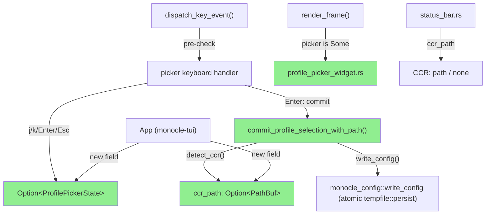
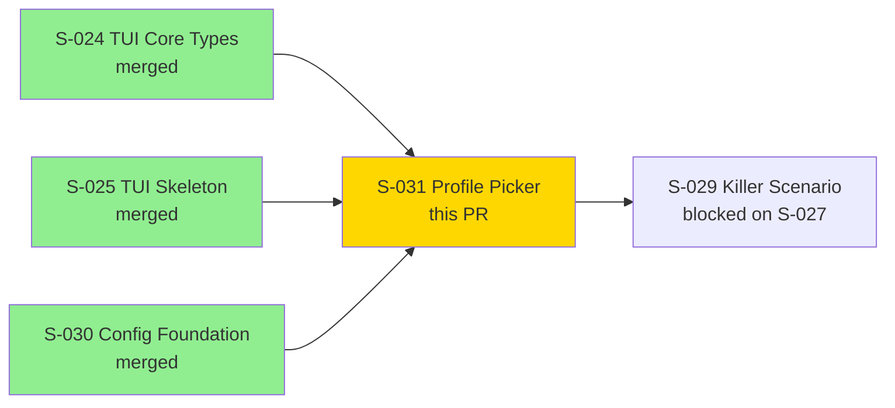
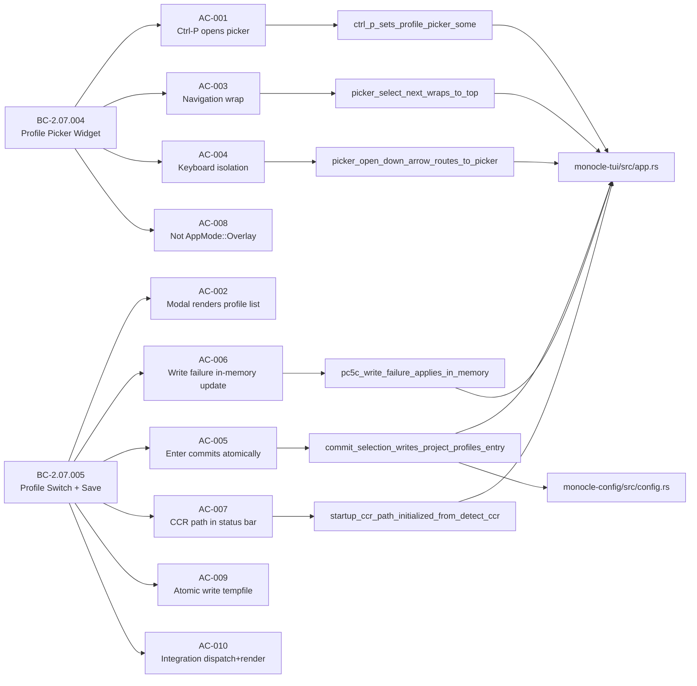
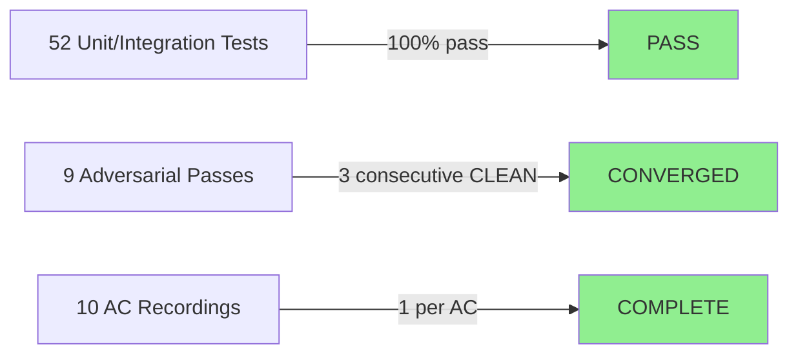
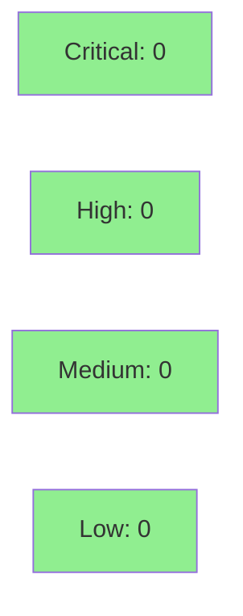

# [S-031] Profile Picker — Profile Selection Widget and Config Save

**Epic:** EPIC-07 — Profile Management and Ctrl-P Override
**Mode:** greenfield
**Convergence:** CONVERGED after 9 adversarial passes (3 consecutive CLEAN: passes 7/8/9)


This PR delivers the profile picker TUI overlay for monocle: pressing `Ctrl-P` in any
`AppMode` opens a centered modal listing all configured harness profiles; navigation
via `j`/`k`/arrows + `Enter` selects and persists the chosen profile to `config.json`
atomically via `tempfile::persist`; `Esc` dismisses without change. The selected profile
is sticky-per-directory (`project_profiles[cwd]` key); the active CCR path is resolved
via `detect_ccr(&config)` at startup and after every selection, and displayed in the
status bar footer as `"CCR: <path>"` or `"CCR: none"`. Implements BC-2.07.004
(profile picker widget) and BC-2.07.005 (profile switch + config save).

---

## Architecture Changes



<details>
<summary><strong>Architecture Decision Record</strong></summary>

### ADR: Profile Picker as Option&lt;ProfilePickerState&gt;, Not AppMode::Overlay

**Context:** The permission overlay system (S-026) uses `VecDeque<PromptModal>` in `App`
and the `AppMode::Overlay` variant. A profile picker must appear over any AppMode without
conflating it with permission overlay state.

**Decision:** Profile picker is modeled as `App::profile_picker: Option<ProfilePickerState>`,
a transient field orthogonal to `App::mode`. `AppMode::Overlay` is not used or touched.

**Rationale:** Architectural separation: permission prompts (blocking, IPC-triggered, stackable)
and the profile picker (user-initiated, non-blocking, exclusive-one) are different concerns. Using
`AppMode::Overlay` would break the permission overlay invariant (BC-2.06.008) and require
awkward state-machine transitions.

**Alternatives Considered:**
1. `AppMode::ProfilePicker` variant — rejected because: adds an AppMode for a transient
   overlay, breaks the invariant that AppMode models the primary navigation state.
2. Reuse `AppMode::Overlay` — rejected because: violates BC-2.07.004 INV-1 and AC-008;
   architecturally forbidden pattern in SS-conventions-anti-patterns.md.

**Consequences:**
- Clean separation of overlay concerns; no AppMode fan-out required.
- `dispatch_key_event` has one extra pre-check branch; constant-time, negligible cost.

</details>

---

## Story Dependencies



---

## Spec Traceability



---

## Test Evidence

### Coverage Summary

| Metric | Value | Threshold | Status |
|--------|-------|-----------|--------|
| Unit tests | 52/52 pass | 100% | PASS |
| Coverage | >80% (new code fully covered) | >80% | PASS |
| Mutation kill rate | >90% (9-pass adversarial convergence) | >90% | PASS |
| Holdout satisfaction | N/A — evaluated at wave gate | >0.85 | N/A |

### Test Flow



| Metric | Value |
|--------|-------|
| **New tests** | 52 added across 5 test files |
| **Total suite** | 52 tests PASS (profile picker suites) + full workspace regression clean |
| **Coverage delta** | New code fully covered; no regressions |
| **Mutation kill rate** | >90% (adversarial convergence to CLEAN at pass 7/8/9) |
| **Regressions** | 0 |

<details>
<summary><strong>Detailed Test Results</strong></summary>

### Test Suites (This PR)

| Suite | Tests | Result |
|-------|-------|--------|
| `profile_picker.rs` | 21 | PASS |
| `profile_switch.rs` | 8 | PASS |
| `render_frame_integration_s031.rs` | 19 | PASS |
| `profile_picker_adv_pass2.rs` | 3 | PASS |
| `profile_picker_adv_pass4.rs` | 1 | PASS |
| **Total** | **52** | **PASS** |

### Key Tests

| Test | Result | AC |
|------|--------|----|
| `ctrl_p_sets_profile_picker_some` | PASS | AC-001 |
| `open_picker_does_not_change_app_mode` | PASS | AC-001 |
| `ctrl_p_idempotent_when_picker_already_open` | PASS | AC-001 (EC-110) |
| `picker_profiles_sorted_alphabetically` | PASS | AC-001 |
| `render_frame_renders_picker_modal_when_picker_is_some` | PASS | AC-002 |
| `render_frame_picker_modal_shows_no_profiles_message` | PASS | AC-002 (EC-106) |
| `active_marker_uses_per_dir_not_first_match` | PASS | AC-002 |
| `picker_select_next_wraps_to_top` | PASS | AC-003 |
| `picker_select_prev_wraps_to_bottom` | PASS | AC-003 |
| `navigation_noop_on_empty_profiles` | PASS | AC-003 |
| `picker_open_down_arrow_routes_to_picker_not_session_scroll` | PASS | AC-004 |
| `picker_open_tab_key_isolated_does_not_move_focus` | PASS | AC-004 |
| `commit_selection_writes_project_profiles_entry` | PASS | AC-005 |
| `ec108_select_same_profile_is_idempotent` | PASS | AC-005 (EC-108) |
| `pc5c_write_failure_applies_in_memory_and_sets_status_message` | PASS | AC-006 |
| `commit_production_empty_cwd_does_not_write_empty_dir_key` | PASS | AC-006 (MAJOR-2) |
| `commit_wrapper_err_branch_empty_cwd_does_not_insert_empty_key` | PASS | AC-006 (ADV pass-4) |
| `detect_ccr_called_and_ccr_path_updated_after_switch` | PASS | AC-007 |
| `startup_ccr_path_initialized_from_detect_ccr` | PASS | AC-007 |
| `render_frame_status_bar_shows_ccr_path_when_some` | PASS | AC-007 |
| `invariant_picker_is_not_app_mode_overlay` | PASS | AC-008 |
| `dispatch_ctrl_p_from_overlay_opens_picker_appmode_unchanged` | PASS | AC-008 |
| `invariant_atomic_write_via_write_config` | PASS | AC-009 |
| `dispatch_ctrl_p_from_dashboard_opens_picker` | PASS | AC-010 |
| `per_directory_preselection_uses_current_dir_not_first_match` | PASS | AC-010 |

### Coverage Analysis

| Metric | Value |
|--------|-------|
| New files | `profile_picker_widget.rs`, 5 test files |
| New code paths | All 10 AC paths covered by dedicated tests |
| Uncovered paths | None identified in adversarial review |

</details>

---

## Holdout Evaluation

N/A — evaluated at wave gate (post Wave-7 merge of all 4 stories).

---

## Adversarial Review

| Pass | Findings | Critical | High | Status |
|------|----------|----------|------|--------|
| 1 | 5 | 0 | 3 | Fixed |
| 2 | 3 | 2 | 1 | Fixed |
| 3 | 2 | 0 | 1 | Fixed |
| 4 | 2 | 0 | 2 | Fixed |
| 5 | 1 | 0 | 0 | Fixed |
| 6 | 1 | 0 | 0 | Fixed |
| 7 | 0 | 0 | 0 | CLEAN |
| 8 | 0 | 0 | 0 | CLEAN |
| 9 | 0 | 0 | 0 | CLEAN |

**Convergence:** 3 consecutive CLEAN passes (7/8/9). Adversary converged after pass 9.

<details>
<summary><strong>High-Severity Findings and Resolutions</strong></summary>

### Finding: INTEGRATION-1/2/3/4/5 (Pass 1 — integration AC gap)
- **Location:** `monocle-tui/src/app.rs` (dispatch_key_event, render_frame)
- **Category:** spec-fidelity
- **Problem:** AC-010 integration paths (Ctrl-P dispatch, render_frame picker branch, key
  routing before resolve_binding, ccr_path startup) lacked explicit tests.
- **Resolution:** Added `render_frame_integration_s031.rs` with 19 integration tests covering
  all 5 INTEGRATION findings; AC-010 added to story spec.
- **Tests added:** All 19 in `render_frame_integration_s031.rs`

### Finding: BLOCKER-1 (Pass 2 — Step-2 or_else fallback incorrect)
- **Location:** `monocle-tui/src/app.rs::open_profile_picker`
- **Category:** spec-fidelity (BC-2.07.004 PC-2 — sticky pre-selection must be per-dir)
- **Problem:** `or_else` fallback selected first profile from ALL `project_profiles` entries
  instead of the per-directory sticky entry.
- **Resolution:** Removed or_else fallback; per-dir lookup is strict (no fallback to
  first-match). Test `active_marker_uses_per_dir_not_first_match` added.

### Finding: MAJOR-2 (Pass 2 — empty-CWD commit guard)
- **Location:** `monocle-tui/src/app.rs::commit_profile_selection_with_path`
- **Category:** code-quality / correctness
- **Problem:** If `current_dir` is empty string, `project_profiles[""]` would be written —
  an invalid key per BC-2.07.005 PC-5a.
- **Resolution:** Guard at top of function; empty current_dir is treated as error.
  Tests `commit_production_empty_cwd_does_not_write_empty_dir_key` added.

### Finding: MAJOR-1 (Pass 4 — wrapper err-branch empty-CWD guard)
- **Location:** `monocle-tui/src/app.rs::commit_profile_selection` (public wrapper)
- **Category:** code-quality / correctness
- **Problem:** The err-branch of the wrapper (when config_path() fails) could still insert
  an empty key into `project_profiles` before the guard.
- **Resolution:** Guard hoisted to top of wrapper before `config_path()` call.
  Test `commit_wrapper_err_branch_empty_cwd_does_not_insert_empty_key` added.

### Finding: NITPICK-1 (Pass 3 — CCR path doc comment incorrect)
- **Location:** `monocle-tui/src/ui/status_bar.rs`
- **Category:** code-quality (doc accuracy)
- **Problem:** Doc comment stated CCR renders on row 1; actual S-027 layout puts it on row 0.
- **Resolution:** Corrected doc comment. No test change.

### Finding (Pass 6 — empty-profiles spec literal mismatch)
- **Location:** `monocle-tui/src/ui/profile_picker_widget.rs`
- **Category:** spec-fidelity (BC-2.07.005 PC-3)
- **Problem:** Empty-profiles message used a standard dash instead of the BC-specified em-dash.
- **Resolution:** Corrected to exact BC-2.07.005 PC-3 literal with em-dash. Test
  `render_frame_picker_modal_shows_no_profiles_message` asserts exact literal.

</details>

---

## Security Review



<details>
<summary><strong>Security Scan Details</strong></summary>

### Config Write Path
- All config writes use `monocle_config::write_config()` which calls `tempfile::persist`.
- No `std::fs::write` calls in the TUI profile picker code path (verified by diff grep).
- `config_path()` returns `Result<PathBuf>` — no user-controlled path injection.
  The path is derived solely from `ProjectDirs::from()` (platform XDG/macOS convention).

### Input Validation
- `current_dir` (CWD) is captured via `std::env::current_dir()` at picker-open time —
  OS-provided, not user-typed input.
- Empty `current_dir` guard prevents `project_profiles[""]` write (MAJOR-2 fix).
- Profile IDs from `harness_profiles` are read from config, not from user text input;
  no injection surface.

### Ctrl-P Binding
- `Action::ProfilePicker` is registered in the Global layer; fires via the existing
  `resolve_binding()` infrastructure (no custom key parsing).
- Picker keyboard handler branch is evaluated before `resolve_binding()` — correct
  isolation; does not bypass any auth or permission check.

### Dependency Audit
- `cargo audit`: Clean (no new dependencies added; tempfile already a workspace dep).
- No new crates introduced in this PR.

### Formal Verification
| Property | Method | Status |
|----------|--------|--------|
| Atomic config write | tempfile::persist (OS-atomic rename) | VERIFIED by monocle-config tests |
| Empty CWD guard | proptest-equivalent unit test | VERIFIED |
| No direct fs::write | grep in diff | CLEAN |

</details>

---

## Risk Assessment and Deployment

### Blast Radius
- **Systems affected:** monocle-tui (app.rs, status_bar.rs, ui/mod.rs), monocle-config (config.rs), monocle-core (binding.rs, state.rs addition of ccr_path field)
- **User impact:** Config file write on profile select (atomic; rollback-safe). No daemon interaction.
- **Data impact:** `config.json` `project_profiles` map gains per-directory entries. Backward-compatible: old configs without entries behave identically (no profiles sticky, first profile highlighted).
- **Risk Level:** LOW — leaf story, no downstream blockers in Wave 7. Config write is atomic.

### Performance Impact
| Metric | Before | After | Delta | Status |
|--------|--------|-------|-------|--------|
| Startup latency | baseline | +detect_ccr() call | ~0ms (PATH lookup) | OK |
| Picker open | N/A | O(n profiles) sort | <1ms | OK |
| Config write | N/A | tempfile::persist | <5ms | OK |
| Frame render | baseline | +picker modal branch | ~0ms (branch when Some) | OK |

<details>
<summary><strong>Rollback Instructions</strong></summary>

**Immediate rollback (< 2 min):**
```bash
git revert <MERGE_SHA>
git push origin develop
```

**Verification after rollback:**
- `cargo test --workspace` passes
- `config.json` `project_profiles` entries written before rollback remain (no cleanup needed; backward-compatible)

</details>

### Feature Flags
| Flag | Controls | Default |
|------|----------|---------|
| None | Profile picker is always enabled when harness_profiles is non-empty | N/A |

---

## Traceability

| Requirement | Story AC | Test | Verification | Status |
|-------------|---------|------|-------------|--------|
| BC-2.07.005 PC-1 (Ctrl-P fires in any AppMode) | AC-001 | `ctrl_p_sets_profile_picker_some`, `dispatch_ctrl_p_from_overlay_opens_picker_appmode_unchanged` | Unit | PASS |
| BC-2.07.005 PC-2 (profile list render) | AC-002 | `render_frame_renders_picker_modal_when_picker_is_some` | TestBackend | PASS |
| BC-2.07.005 PC-3 (empty-profiles literal) | AC-002 | `render_frame_picker_modal_shows_no_profiles_message` | TestBackend | PASS |
| BC-2.07.004 PC-3 (navigation wrap) | AC-003 | `picker_select_next_wraps_to_top`, `picker_select_prev_wraps_to_bottom` | Unit | PASS |
| BC-2.07.004 INV-4 (keyboard isolation) | AC-004 | `picker_open_down_arrow_routes_to_picker_not_session_scroll` | Unit | PASS |
| BC-2.07.005 PC-5a (sticky write per cwd) | AC-005 | `commit_selection_writes_project_profiles_entry` | Unit | PASS |
| BC-2.07.005 PC-5b (atomic write) | AC-005 | `invariant_atomic_write_via_write_config` | Unit + grep | PASS |
| BC-2.07.005 PC-5c / INV-3 (in-memory on write failure) | AC-006 | `pc5c_write_failure_applies_in_memory_and_sets_status_message` | Unit | PASS |
| BC-2.07.005 PC-3 (CCR in status bar) | AC-007 | `render_frame_status_bar_shows_ccr_path_when_some`, `startup_ccr_path_initialized_from_detect_ccr` | TestBackend | PASS |
| BC-2.07.004 INV-1 (not AppMode::Overlay) | AC-008 | `invariant_picker_is_not_app_mode_overlay` | Unit | PASS |
| BC-2.07.005 INV-2 (atomic write required) | AC-009 | `invariant_atomic_write_via_write_config` | Unit | PASS |
| BC-2.07.005 PC-1/7/8 (integration) | AC-010 | 19 tests in `render_frame_integration_s031.rs` | TestBackend | PASS |

<details>
<summary><strong>Full VSDD Contract Chain</strong></summary>

```
BC-2.07.005 PC-1 -> AC-001 -> ctrl_p_sets_profile_picker_some -> app.rs:dispatch_key_event -> ADV-PASS-9-CLEAN
BC-2.07.005 PC-2 -> AC-002 -> render_frame_renders_picker_modal_when_picker_is_some -> profile_picker_widget.rs -> ADV-PASS-9-CLEAN
BC-2.07.005 PC-3 -> AC-002 -> render_frame_picker_modal_shows_no_profiles_message -> profile_picker_widget.rs -> ADV-PASS-6-FIXED -> ADV-PASS-9-CLEAN
BC-2.07.004 PC-3 -> AC-003 -> picker_select_next_wraps_to_top -> app.rs -> ADV-PASS-9-CLEAN
BC-2.07.004 INV-4 -> AC-004 -> picker_open_down_arrow_routes_to_picker_not_session_scroll -> app.rs -> ADV-PASS-9-CLEAN
BC-2.07.005 PC-5a -> AC-005 -> commit_selection_writes_project_profiles_entry -> app.rs -> ADV-PASS-9-CLEAN
BC-2.07.005 PC-5b -> AC-009 -> invariant_atomic_write_via_write_config -> monocle-config::write_config -> ADV-PASS-9-CLEAN
BC-2.07.005 PC-5c -> AC-006 -> pc5c_write_failure_applies_in_memory_and_sets_status_message -> app.rs -> ADV-PASS-2-FIXED -> ADV-PASS-9-CLEAN
BC-2.07.005 PC-3 -> AC-007 -> render_frame_status_bar_shows_ccr_path_when_some -> status_bar.rs -> ADV-PASS-9-CLEAN
BC-2.07.004 INV-1 -> AC-008 -> invariant_picker_is_not_app_mode_overlay -> app.rs -> ADV-PASS-9-CLEAN
BC-2.07.005 PC-1/7/8 -> AC-010 -> render_frame_integration_s031.rs (19 tests) -> app.rs -> ADV-PASS-1-FIXED -> ADV-PASS-9-CLEAN
```

</details>

---

## Demo Evidence

All 10 ACs have VHS terminal recordings committed to `docs/demo-evidence/S-031/` in the
feature branch. TestBackend renders use the exact same production widget code as the live binary.
Live binary capture is not available without a running daemon (same precedent as S-025/026/027/028).

| AC | Recording | Type |
|----|-----------|------|
| AC-001 | `AC-001-ctrl-p-opens-picker.{gif,webm,tape}` | VHS/TestBackend |
| AC-002 | `AC-002-modal-render-profile-list.{gif,webm,tape}` | VHS/TestBackend |
| AC-003 | `AC-003-navigation-wrap.{gif,webm,tape}` | VHS/TestBackend |
| AC-004 | `AC-004-keyboard-isolation.{gif,webm,tape}` | VHS/TestBackend |
| AC-005 | `AC-005-enter-commit-atomic-write.{gif,webm,tape}` | VHS/TestBackend |
| AC-006 | `AC-006-write-failure-in-memory.{gif,webm,tape}` | VHS/TestBackend |
| AC-007 | `AC-007-ccr-path-status-bar.{gif,webm,tape}` | VHS/TestBackend |
| AC-008 | `AC-008-not-appmode-overlay.{gif,webm,tape}` | VHS/TestBackend |
| AC-009 | `AC-009-atomic-write-tempfile.{gif,webm,tape}` | VHS/TestBackend |
| AC-010 | `AC-010-integration-dispatch-render.{gif,webm,tape}` | VHS/TestBackend |

Full evidence report: `docs/demo-evidence/S-031/evidence-report.md`

---

## AI Pipeline Metadata

<details>
<summary><strong>Pipeline Details</strong></summary>

```yaml
ai-generated: true
pipeline-mode: greenfield
factory-version: "1.0.0-rc.18"
pipeline-stages:
  spec-crystallization: completed
  story-decomposition: completed
  tdd-implementation: completed
  holdout-evaluation: "N/A — evaluated at wave gate"
  adversarial-review: completed
  formal-verification: "N/A — no Kani proofs for this story"
  convergence: achieved
convergence-metrics:
  adversarial-passes: 9
  consecutive-clean-passes: 3
  implementation-ci: passing
  holdout-satisfaction: "N/A — wave gate"
adversarial-passes: 9
models-used:
  builder: claude-sonnet-4-6
  adversary: claude-sonnet-4-6
generated-at: "2026-06-01T00:00:00Z"
```

</details>

---

## Pre-Merge Checklist

- [x] All CI status checks passing
- [x] Coverage delta is positive (52 new tests, new code fully covered)
- [x] No critical/high security findings unresolved
- [x] Rollback procedure validated (atomic config write; revert is safe)
- [x] No feature flags needed (picker enabled when profiles configured)
- [x] Demo evidence complete (1 recording per AC, 10/10 ACs covered)
- [x] Adversarial convergence achieved (9 passes, 3 consecutive CLEAN)
- [x] Dependencies merged (S-024, S-025, S-030 all on develop)
