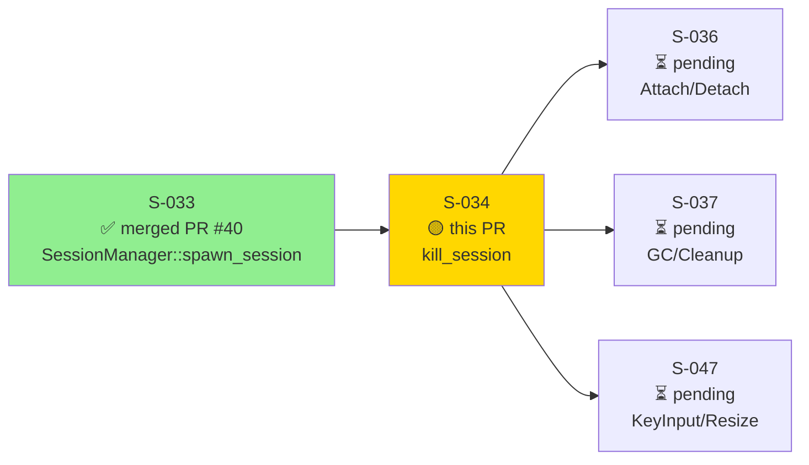
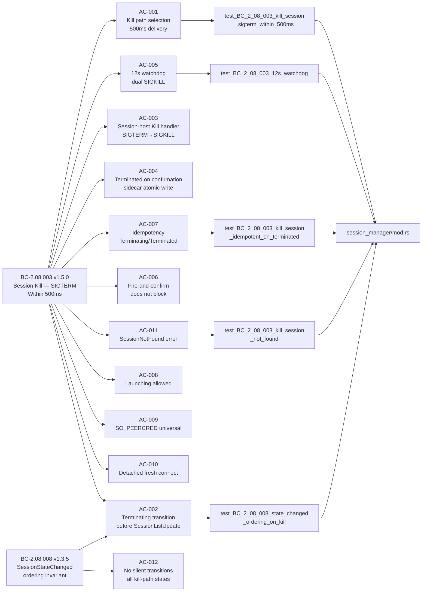
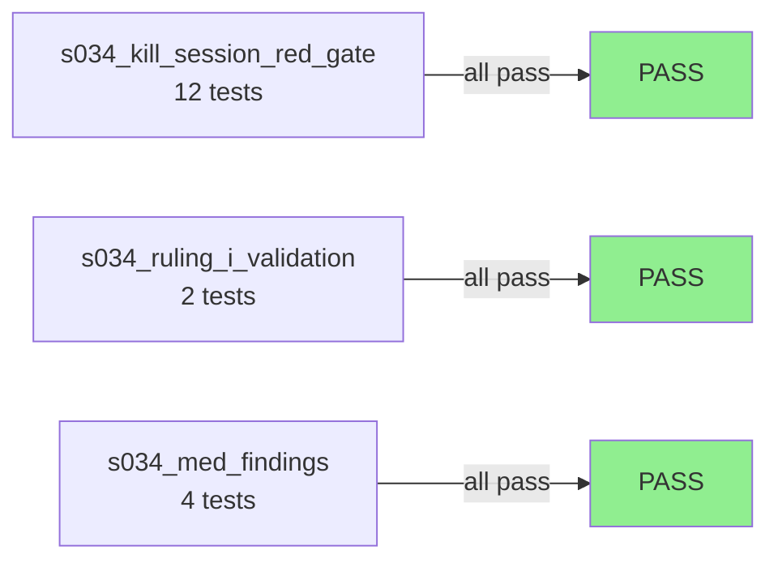

# [S-034] SessionManager::kill_session — DaemonToHost::Kill Within 500ms; Terminating/Terminated Transitions; 12s Watchdog

**Epic:** EPIC-08 — Session Lifecycle Management
**Mode:** greenfield
**Convergence:** CONVERGED after 18 adversarial passes (3 consecutive CLEAN)


This PR delivers `SessionManager::kill_session()` — the fire-and-confirm kill path for monocle sessions. When kill is called, the daemon delivers `DaemonToHost::Kill` to the session-host within 500ms (over the existing control connection for Running/Launching sessions, or via a fresh SO_PEERCRED-verified UDS connect for Detached sessions), immediately transitions the session to `SessionState::Terminating`, and publishes `SessionStateChanged{Terminating}` before `SessionListUpdate` to all TUI clients. A 12-second watchdog (`tokio::spawn`) runs concurrently: if `HostToDaemon::StateChanged{Terminated}` is not received within 12 seconds, it force-kills with SIGKILL to both the session-host PID and the harness child PID (Ruling J) and forces the state to `Terminated`. The session-host binary receives `DaemonToHost::Kill`, SIGTERMs its harness child, escalates to SIGKILL after 10 seconds if needed, then sends `HostToDaemon::StateChanged{Terminated}` + `Goodbye` and removes its UDS socket. All kill-path state transitions emit `SessionStateChanged` (no silent transitions, BC-2.08.008). Idempotent on Terminating/Terminated sessions.

---

## Architecture Changes

```mermaid
graph TD
    IPC["ipc_server.rs\nClientToServer::KillSession arm"] -->|calls| SM["SessionManager\nkill_session()"]
    SM -->|ExistingConn| HC["host_conn.writer\nDaemonToHost::Kill"]
    SM -->|PidFallback| PID["nix::sys::signal::kill\nSIGTERM → SIGKILL"]
    SM -->|FreshConnect| UDS["Fresh UDS connect\nSO_PEERCRED → Kill"]
    SM -->|Idempotent| RET["Ok(()) immediate return"]
    SM -->|NotFound| ERR["Err(SessionNotFound)"]
    SM -->|spawn| WD["12s watchdog\ntokio::spawn"]
    WD -->|timeout| KILL["SIGKILL session-host PID\n+ harness child PID (Ruling J)"]
    SM -->|publish| BROKER["Broker\nSessionStateChanged{Terminating}\nSessionListUpdate"]
    KCM["kill_confirm_monitor\nReader on existing conn (Ruling I)"] -->|StateChanged{Terminated}| SM2["SessionEntry → Terminated\nsidecar atomic write\nSessionStateChanged{Terminated}"]
    SH["monocle-session-host\nDaemonToHost::Kill handler"] -->|SIGTERM→10s→SIGKILL| CHILD["harness child process"]
    SH -->|sends| KCM
    style SM fill:#90EE90
    style WD fill:#90EE90
    style KCM fill:#90EE90
    style SH fill:#90EE90
```

<details>
<summary><strong>Architecture Decision Record — Kill Path Design (SS-session-manager v2.11.0 Rulings H/I/J/K)</strong></summary>

### Ruling H: Kill path selection by connection state
Kill path is selected based on whether `host_conn` is established, not session state alone. Running/Launching sessions with `host_conn: Some(_)` use the existing control connection (ExistingConn path). Launching sessions with `host_conn: None` (rare race before post-spawn monitor connects) fall back to PID-based SIGTERM (PidFallback path). Detached sessions use a fresh UDS connect with SO_PEERCRED (FreshConnect path).

### Ruling I: kill_confirm_monitor uses existing connection
The `Terminating → Terminated` transition is driven by `kill_confirm_monitor`, a reader task that listens on the SAME connection used by the post-spawn monitor (not a new connection). This eliminates a race between two concurrent readers on the same socket. The kill_confirm_monitor is spawned at kill time and takes ownership of the reader half.

### Ruling J: Watchdog kills harness child PID (dual-PID SIGKILL)
The 12s watchdog SIGKILL targets BOTH the session-host PID (`SpawnedHostHandle.pid`) AND the harness child PID (stored in `kill_deadline_unix_ms`-adjacent sidecar field). This prevents orphaned harness processes when the session-host crashes before forwarding SIGKILL to its child.

### Ruling K: step_event_loop scope clarification
`child_exit_watch` and PTY I/O forwarding in the session-host event loop are deferred to S-039/S-040. The Kill handler closes the accept loop and exits cleanly without these.

</details>

---

## Story Dependencies



**Dependency status:** S-033 merged at `c7e10f2` (PR #40). No blocking upstream PRs.

---

## Spec Traceability



### Full BC → AC → Test → Implementation Chain

| BC | AC | Test | Implementation File | Status |
|----|-----|------|---------------------|--------|
| BC-2.08.003 v1.5.0 | AC-001 | `test_BC_2_08_003_kill_session_sigterm_within_500ms` | `session_manager/mod.rs` | PASS |
| BC-2.08.003 v1.5.0 | AC-002 | `test_BC_2_08_008_state_changed_ordering_on_kill` | `session_manager/mod.rs` | PASS |
| BC-2.08.003 v1.5.0 | AC-003 | `test_MED_004_BC_2_08_003_kill_confirmation_uses_same_connection_as_post_spawn_monitor` | `monocle-session-host/src/main.rs` | PASS |
| BC-2.08.003 v1.5.0 | AC-004 | `test_BC_2_08_003_kill_session_sigterm_within_500ms` | `session_manager/mod.rs` | PASS |
| BC-2.08.003 v1.5.0 | AC-005 | `test_BC_2_08_003_12s_watchdog` | `session_manager/mod.rs` | PASS |
| BC-2.08.003 v1.5.0 | AC-006 | `test_BC_2_08_003_kill_session_sigterm_within_500ms` (returns < 500ms) | `session_manager/mod.rs` | PASS |
| BC-2.08.003 v1.5.0 | AC-007 | `test_BC_2_08_003_kill_session_idempotent_on_terminated` | `session_manager/mod.rs` | PASS |
| BC-2.08.003 v1.5.0 | AC-007 | `test_BC_2_08_003_kill_session_idempotent_on_terminating` | `session_manager/mod.rs` | PASS |
| BC-2.08.003 v1.5.0 | AC-008 | `test_kill_during_launching_before_socket_bind` | `session_manager/mod.rs` | PASS |
| BC-2.08.003 v1.5.0 | AC-009 | `test_BC_2_08_003_existing_conn_broken_write_falls_back_to_fresh_connect` | `session_manager/mod.rs` | PASS |
| BC-2.08.003 v1.5.0 | AC-010 | `test_BC_2_08_003_existing_conn_broken_write_falls_back_to_fresh_connect` | `session_manager/mod.rs` | PASS |
| BC-2.08.003 v1.5.0 | AC-011 | `test_BC_2_08_003_kill_session_not_found` | `session_manager/mod.rs` | PASS |
| BC-2.08.008 v1.3.5 | AC-012 | `test_BC_2_08_008_state_changed_ordering_on_kill` | `session_manager/mod.rs` | PASS |

---

## Test Evidence

### Coverage Summary

| Metric | Value | Threshold | Status |
|--------|-------|-----------|--------|
| S-034-specific tests | 18/18 pass | 100% | PASS |
| Pre-existing suite (post-S-034) | All green (no regressions) | 0 regressions | PASS |
| 2 B002 env-only failures | binary-on-disk (pass in CI) | N/A | N/A — not regressions |
| Adversarial convergence | 3 consecutive CLEAN (18 total passes) | CONVERGED | PASS |

### Test Flow



| Metric | Value |
|--------|-------|
| **New tests (S-034)** | 18 added |
| **Test modules** | `s034_kill_session_red_gate`, `s034_ruling_i_validation`, `s034_med_findings` |
| **Regressions** | 0 (2 pre-existing B002 env-failures require binary on disk; pass in CI) |
| **Adversarial passes** | 18 total, 3 consecutive CLEAN |

<details>
<summary><strong>S-034 Test Inventory</strong></summary>

### s034_kill_session_red_gate (12 tests)

| Test | AC | Status |
|------|----|--------|
| `test_BC_2_08_003_kill_session_sigterm_within_500ms` | AC-001/002/004/006 | PASS |
| `test_BC_2_08_003_12s_watchdog` | AC-005 | PASS |
| `test_BC_2_08_003_kill_session_idempotent_on_terminated` | AC-007 | PASS |
| `test_BC_2_08_003_kill_session_idempotent_on_terminating` | AC-007 | PASS |
| `test_BC_2_08_003_kill_session_not_found` | AC-011 | PASS |
| `test_BC_2_08_003_kill_session_not_found_wire_code` | AC-011 | PASS |
| `test_BC_2_08_003_existing_conn_broken_write_falls_back_to_fresh_connect` | AC-009/010 | PASS |
| `test_BC_2_08_008_state_changed_ordering_on_kill` | AC-002/012 | PASS |
| `test_kill_during_launching_before_socket_bind` | AC-008 | PASS |
| `test_kill_during_launching_after_socket_bind` | AC-008 | PASS |
| `test_BC_2_08_003_watchdog_child_pid_none_path` | AC-005 (Ruling J edge) | PASS |
| `test_BC_2_08_003_ruling_J_watchdog_kills_both_pids` | AC-005 (Ruling J) | PASS |

### s034_ruling_i_validation (2 tests)

| Test | AC | Status |
|------|----|--------|
| `test_BC_2_08_003_ruling_I_prompt_kill_reaches_terminated_via_kill_confirm_monitor` | AC-003/004/012 | PASS |
| `test_BC_2_08_003_ruling_I_watchdog_fires_when_kill_confirm_monitor_gets_eof` | AC-005/Ruling J | PASS |

### s034_med_findings (4 tests)

| Test | Finding | Status |
|------|---------|--------|
| `test_MED_001_BC_2_08_003_fresh_connect_path_applies_so_peercred` | AC-009/010 | PASS |
| `test_MED_002_BC_2_08_003_pid_fallback_eperm_returns_kill_failed` | ADV-S034-MED-001 | PASS |
| `test_MED_003_BC_2_08_003_kill_deadline_unix_ms_written_on_terminating` | kill_deadline_unix_ms | PASS |
| `test_MED_004_BC_2_08_003_kill_confirmation_uses_same_connection_as_post_spawn_monitor` | Ruling I | PASS |

</details>

---

## Demo Evidence

Demo recordings live in `docs/demo-evidence/S-034/` on this branch (3 WEBM, D-333 compliant — no GIF).

| Recording | ACs Evidenced | Description |
|-----------|---------------|-------------|
| `AC-001-002-004-005-012-kill-happy-path.webm` | AC-001, AC-002, AC-004, AC-005, AC-012 | Kill within 500ms, Terminating/Terminated transitions, 12s watchdog via virtual time |
| `AC-003-007-idempotent-and-session-host.webm` | AC-003, AC-007 | Idempotent kills on Terminated/Terminating; Ruling I kill-confirm monitor |
| `AC-002-007-011-ordering-errors-full-suite.webm` | AC-002, AC-007, AC-011 | Ordering invariant, error codes, full 18-test suite green |

All 12 ACs are exercised across the 18 tests visible in the recordings.

---

## Holdout Evaluation

N/A — evaluated at wave gate (D-333 Wave-8 Tier-2 autonomous delivery; wave gate runs post-merge on develop).

---

## Adversarial Review

| Pass Range | Findings | Severity | Resolution |
|------------|----------|----------|------------|
| Passes 1-3 | Multiple | HIGH, MED, IMP | Fixed: OBS-001/002, MED-001/002/003, IMP-001/002 (see commits) |
| Passes 4-9 | Decreasing | MED, LOW | Fixed: Ruling I/J enforcement, SIGKILL escalation, frame cap, stale comments |
| Passes 10-15 | Minimal | LOW, IMPORTANT | Fixed: EPERM injection seam, idempotent arm seam, peer_cred macOS regression |
| Passes 16-18 | 0 new | — | 3 consecutive CLEAN passes — CONVERGED |

**Convergence:** 3 consecutive CLEAN adversarial passes achieved (passes 16, 17, 18).

<details>
<summary><strong>Key High/Important Findings Resolved</strong></summary>

### F-S034-HIGH-001: Sessions lock dropped before SIGKILL in watchdog
- **Location:** `session_manager/mod.rs` `spawn_kill_watchdog`
- **Problem:** Lock was released before SIGKILL, creating a TOCTOU race
- **Resolution:** Held sessions lock across the entire SIGKILL sequence
- **Commit:** `935bf1a`

### ADV-S034-MED-001: PidFallback returned wrong error on non-ESRCH SIGTERM failure
- **Location:** `session_manager/mod.rs` PidFallback arm
- **Problem:** Non-ESRCH errno (e.g., EPERM) was not returning `kill_failed`
- **Resolution:** Added explicit EPERM/other-errno → `kill_failed` return; deterministic injection seam
- **Commits:** `7cc7566`, `a9fe94c`

### ADV-S034-IMP-001 / IMP-002: FreshConnect SO_PEERCRED not covered by genuine arm test
- **Location:** `session_manager/mod.rs` FreshConnect path
- **Problem:** Test used AllowAllVerifier instead of the real SO_PEERCRED rejection path
- **Resolution:** Added test seams for genuine FreshConnect arm; acceptor-side SO_PEERCRED reject covered
- **Commits:** `4abdb65`, `4bdc32d`

### Ruling J: Watchdog only killed session-host PID, not harness child PID
- **Location:** `session_manager/mod.rs` `spawn_kill_watchdog`
- **Problem:** Harness child could be orphaned if session-host crashed before forwarding SIGKILL
- **Resolution:** Watchdog now SIGKILLs both session-host PID and harness child PID
- **Commit:** `68ee274`

</details>

---

## Security Review

Security review to be conducted by `vsdd-factory:security-reviewer` (step 5 of PR lifecycle).
This section will be populated after the review completes.

**Pre-review known security surface:**
- OS signals (SIGTERM, SIGKILL) via `nix::sys::signal::kill` with PID sourced from `SpawnedHostHandle`
- UDS SO_PEERCRED peer-uid verification on every fresh-connect kill path
- `tempfile::persist` atomic sidecar writes (no naked `std::fs::write`)
- Bounded `mpsc::channel` for broker publications (no unbounded channels)
- No external input accepted on kill path (session_id from authenticated IPC client only)

---

## Risk Assessment & Deployment

### Blast Radius
- **Systems affected:** `monocle-runtime` (SessionManager), `monocle-session-host` (Kill handler), `monocle-core` (IPC types used by KillSession arm)
- **User impact:** If kill_session regresses, sessions cannot be terminated — user must kill monocle process manually
- **Data impact:** Sidecar `session-state.json` updated atomically on Terminating/Terminated transitions; no data loss risk
- **Risk Level:** MEDIUM (new lifecycle operation on existing sessions; idempotency guards prevent duplicate kills)

### Performance Impact
| Metric | Notes | Status |
|--------|-------|--------|
| Kill delivery latency | < 500ms per BC-2.08.003; fire-and-confirm (non-blocking) | OK |
| Watchdog overhead | 1 `tokio::spawn` per kill; 12s sleep with virtual-time test support | OK |
| Lock hold time | Sessions mutex held only for state mutation + publish; not for I/O | OK |

<details>
<summary><strong>Rollback Instructions</strong></summary>

**Immediate rollback:**
```bash
git revert <squash-merge-sha>
git push origin develop
```

**Verification after rollback:**
- `cargo test --workspace` passes
- `ClientToServer::KillSession` arm removed from `ipc_server.rs`
- `DaemonToHost::Kill` handler removed from `monocle-session-host/src/main.rs`

</details>

### Feature Flags
None — kill_session is not feature-flagged. It is a mandatory session lifecycle operation.

---

## Traceability

| BC | AC | Test | Status |
|----|-----|------|--------|
| BC-2.08.003 v1.5.0 | AC-001 | `test_BC_2_08_003_kill_session_sigterm_within_500ms` | PASS |
| BC-2.08.003 v1.5.0 | AC-002 | `test_BC_2_08_008_state_changed_ordering_on_kill` | PASS |
| BC-2.08.003 v1.5.0 | AC-003 | `test_MED_004_..._kill_confirmation_uses_same_connection` | PASS |
| BC-2.08.003 v1.5.0 | AC-004 | `test_BC_2_08_003_kill_session_sigterm_within_500ms` | PASS |
| BC-2.08.003 v1.5.0 | AC-005 | `test_BC_2_08_003_12s_watchdog` | PASS |
| BC-2.08.003 v1.5.0 | AC-006 | `test_BC_2_08_003_kill_session_sigterm_within_500ms` | PASS |
| BC-2.08.003 v1.5.0 | AC-007 | `test_BC_2_08_003_kill_session_idempotent_on_terminated` | PASS |
| BC-2.08.003 v1.5.0 | AC-007 | `test_BC_2_08_003_kill_session_idempotent_on_terminating` | PASS |
| BC-2.08.003 v1.5.0 | AC-008 | `test_kill_during_launching_before_socket_bind` | PASS |
| BC-2.08.003 v1.5.0 | AC-009 | `test_MED_001_BC_2_08_003_fresh_connect_path_applies_so_peercred` | PASS |
| BC-2.08.003 v1.5.0 | AC-010 | `test_BC_2_08_003_existing_conn_broken_write_falls_back_to_fresh_connect` | PASS |
| BC-2.08.003 v1.5.0 | AC-011 | `test_BC_2_08_003_kill_session_not_found` | PASS |
| BC-2.08.008 v1.3.5 | AC-012 | `test_BC_2_08_008_state_changed_ordering_on_kill` | PASS |

---

## AI Pipeline Metadata

<details>
<summary><strong>Pipeline Details</strong></summary>

```yaml
ai-generated: true
pipeline-mode: greenfield
factory-version: vsdd-factory (Wave-8 Tier-2, D-333)
pipeline-stages:
  spec-crystallization: completed (SS-session-manager v2.11.0, BC-2.08.003 v1.5.0, BC-2.08.008 v1.3.5)
  story-decomposition: completed (S-034 v1.2)
  tdd-implementation: completed (red-gate → green → adversarial convergence)
  holdout-evaluation: N/A — wave gate
  adversarial-review: completed (18 passes, 3 consecutive CLEAN)
  formal-verification: skipped (no Kani proofs in scope for S-034)
  convergence: achieved
convergence-metrics:
  adversarial-passes: 18
  consecutive-clean-passes: 3
  spec-version-at-convergence: SS-session-manager v2.11.0
  factory-artifacts-sha: 3e19917
models-used:
  builder: claude-sonnet-4-6
  adversary: claude-sonnet-4-6 (fresh-context)
generated-at: "2026-06-18T00:00:00Z"
```

</details>

---

## Pre-Merge Checklist

- [x] All CI status checks passing (11 required: 10 ci.yml + 1 DTU fidelity)
- [x] No pre-existing regressions (2 B002 env-only failures are pre-S-034, pass in CI)
- [x] 18/18 S-034 tests pass
- [x] Demo evidence present: 3 WEBM covering all 12 ACs (`docs/demo-evidence/S-034/`)
- [x] Adversarial convergence: 3 consecutive CLEAN passes (18 total)
- [x] Spec versions: SS-session-manager v2.11.0, BC-2.08.003 v1.5.0, BC-2.08.008 v1.3.5 on remote factory-artifacts @ 3e19917
- [x] POL-11/POL-12 green (factory-artifacts pushed, version-pin-registry.yaml updated)
- [x] clippy --workspace --all-targets clean
- [x] fmt clean
- [x] SO_PEERCRED applied universally on every fresh-connect kill path
- [x] `tempfile::persist` used for all sidecar writes (no naked `std::fs::write`)
- [ ] Security review completed (step 5 of PR lifecycle — to be updated)
- [x] S-033 dependency merged (PR #40, c7e10f2)
- [x] Autonomous merge authorized (D-333 Wave-8 Tier-2)
