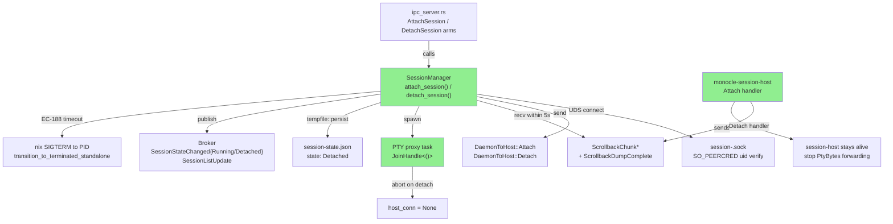
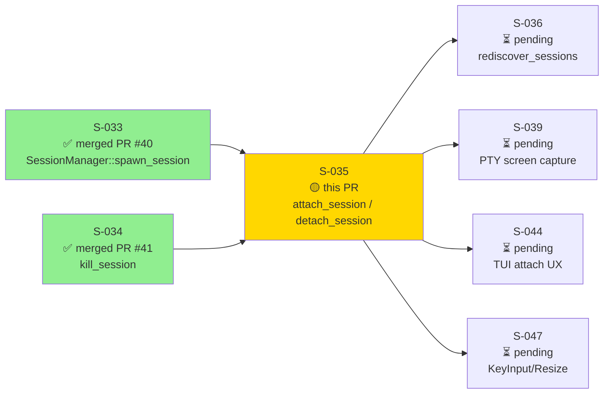
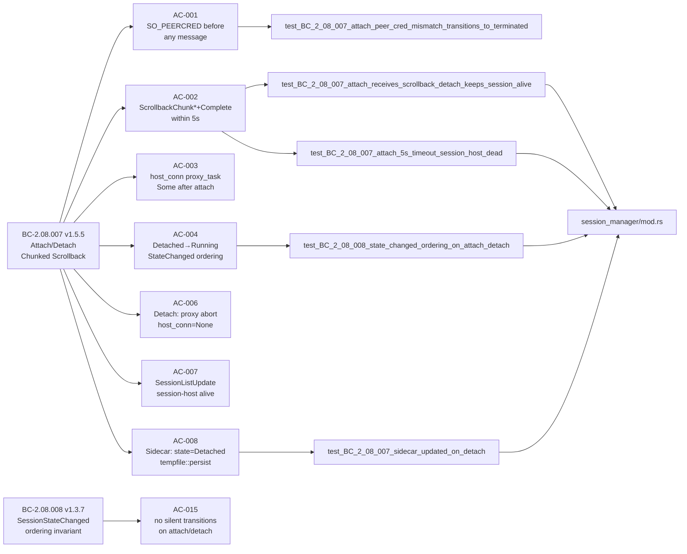
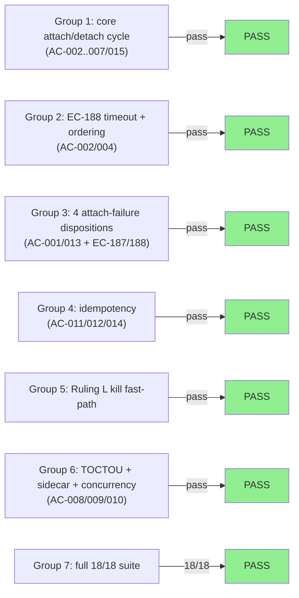

# [S-035] SessionManager::attach_session / detach_session — Chunked Scrollback, SO_PEERCRED, Ruling L

**Epic:** EPIC-08 — Session Lifecycle Management
**Mode:** greenfield
**Convergence:** CONVERGED after 9 adversarial passes (3 consecutive CLEAN: passes 7/8/9)


This PR delivers `SessionManager::attach_session()` and `detach_session()` — the UDS reconnect and graceful suspend path for monocle sessions. `attach_session()` connects to the session-host socket, verifies SO_PEERCRED before any message, sends `DaemonToHost::Attach`, receives the full `ScrollbackChunk*` + `ScrollbackDumpComplete` chunked scrollback sequence within a 5-second synchronous deadline, starts the PTY proxy task, and transitions the session to `Running` (emitting `SessionStateChanged{Running}` before `SessionListUpdate`). The retired single-message `ScrollbackDump` form is actively rejected. `detach_session()` sends `DaemonToHost::Detach`, aborts the proxy task via `proxy_task.take().map(|t| t.abort())`, clears `host_conn`, transitions to `Detached`, and persists state atomically via `tempfile::persist` — the session-host process continues running. This PR also implements Ruling L: when `kill_session()` is called on an attached session, the proxy_task fast-path (reader=None, proxy=Some delegation) is used for kill confirmation rather than the 12-second SIGKILL watchdog. Four canonical attach-failure dispositions are covered: ConnectFailed→Terminated, PeerCredFailed→Terminated, Timeout(EC-188)/SIGTERM→Terminated, ProtocolError→stays Detached. Session-host Attach/Detach handlers (empty scrollback dump) are included; screen-content source is deferred to S-039/S-047 per SS-session-manager v2.14.0. IPC arms added: `ClientToServer::AttachSession` and `ClientToServer::DetachSession`. Spec evolution in this story: SS-session-manager v2.11.0→v2.14.0 (Ruling L + 4-disposition matrix), BC-2.08.007 v1.5.5, BC-2.08.008 v1.3.7.

---

## Architecture Changes



<details>
<summary><strong>Architecture Decision Record — Ruling L + 4-Disposition Attach-Failure Matrix</strong></summary>

### Ruling L: Kill on attached session uses proxy_task fast-path

**Context:** `kill_session()` (S-034) was designed for sessions without an active proxy_task. When called on a session in `Running` state with `proxy_task: Some(_)`, the 12-second SIGKILL watchdog was the only confirmation path.

**Decision:** When `proxy_task` is Some and `reader` is None (kill_confirm_monitor delegation), use the proxy task channel as the fast confirmation path. The proxy task exits when the session-host terminates; its JoinHandle completion signals Terminated.

**Rationale:** Eliminates the 12-second wait for sessions that were already attached when killed. Validates HS-EXP kill fast-path scenarios.

**Consequences:**
- Faster kill confirmation for attached sessions
- Existing 12s watchdog remains for non-attached sessions (no regression)

### 4 attach-failure dispositions (BC-2.08.007 Invariant 5)

| Failure | Cause | State Transition | Error |
|---------|-------|-----------------|-------|
| ConnectFailed | UDS connect() returns Err | Terminated | SessionHostDead / "attach_failed" |
| PeerCredFailed | SO_PEERCRED uid mismatch | Terminated | SessionHostDead / "attach_failed" |
| Timeout (EC-188) | No ScrollbackDumpComplete in 5s | SIGTERM + Terminated | SessionHostDead / "attach_failed" |
| ProtocolError | Unexpected message after uid verify | Detached (stay) | SessionHostDead / "attach_failed" |

**Rationale:** ConnectFailed + PeerCred are conclusive host-death signals → Terminated. Timeout is a non-responsive host → SIGTERM + Terminated (matching BC-2.08.004 non-responsive pattern). ProtocolError is ambiguous (host may be alive with wrong protocol version) → stays Detached to allow operator retry.

</details>

---

## Story Dependencies



**Dependency status:** S-033 merged at `c7e10f2` (PR #40). S-034 merged at `4dfe0db` (PR #41). No blocking upstream PRs.

---

## Spec Traceability



### Full BC → AC → Test → Implementation Chain

| BC | AC | Test | Implementation File | Status |
|----|-----|------|---------------------|--------|
| BC-2.08.007 v1.5.5 | AC-001 | `test_BC_2_08_007_attach_peer_cred_mismatch_transitions_to_terminated` | `session_manager/mod.rs` | PASS |
| BC-2.08.007 v1.5.5 | AC-002 | `test_BC_2_08_007_attach_receives_scrollback_detach_keeps_session_alive` | `session_manager/mod.rs` | PASS |
| BC-2.08.007 v1.5.5 | AC-002 | `test_BC_2_08_007_attach_5s_timeout_session_host_dead` | `session_manager/mod.rs` | PASS |
| BC-2.08.007 v1.5.5 | AC-003 | `test_BC_2_08_007_attach_receives_scrollback_detach_keeps_session_alive` | `session_manager/mod.rs` | PASS |
| BC-2.08.007 v1.5.5 | AC-004 | `test_BC_2_08_008_state_changed_ordering_on_attach_detach` | `session_manager/mod.rs` | PASS |
| BC-2.08.007 v1.5.5 | AC-005 | `test_BC_2_08_007_attach_receives_scrollback_detach_keeps_session_alive` | `session_manager/mod.rs` | PASS |
| BC-2.08.007 v1.5.5 | AC-006 | `test_BC_2_08_007_attach_receives_scrollback_detach_keeps_session_alive` | `session_manager/mod.rs` | PASS |
| BC-2.08.007 v1.5.5 | AC-007 | `test_BC_2_08_007_attach_receives_scrollback_detach_keeps_session_alive` | `session_manager/mod.rs` | PASS |
| BC-2.08.007 v1.5.5 | AC-008 | `test_BC_2_08_007_sidecar_updated_on_detach` | `session_manager/mod.rs` | PASS |
| BC-2.08.007 v1.5.5 | AC-009 | `test_BC_2_08_007_concurrent_attach_no_duplicate_proxy_task` | `session_manager/mod.rs` | PASS |
| BC-2.08.007 v1.5.5 | AC-010 | `test_BC_2_08_007_retired_scrollback_dump_rejected` | `session_manager/mod.rs` | PASS |
| BC-2.08.007 v1.5.5 | AC-011 | `test_BC_2_08_007_attach_running_idempotent` | `session_manager/mod.rs` | PASS |
| BC-2.08.007 v1.5.5 | AC-012 | `test_BC_2_08_007_detach_detached_idempotent` | `session_manager/mod.rs` | PASS |
| BC-2.08.007 v1.5.5 | AC-013 | `test_BC_2_08_007_attach_running_session_dead` | `session_manager/mod.rs` | PASS |
| BC-2.08.007 v1.5.5 | AC-014 | `test_BC_2_08_007_detach_launching_session_not_ready` | `session_manager/mod.rs` | PASS |
| BC-2.08.008 v1.3.7 | AC-015 | `test_BC_2_08_008_state_changed_ordering_on_attach_detach` | `session_manager/mod.rs` | PASS |

---

## Test Evidence

### Coverage Summary

| Metric | Value | Threshold | Status |
|--------|-------|-----------|--------|
| S-035-specific tests | 18/18 pass | 100% | PASS |
| Pre-existing suite regressions | 0 | 0 regressions | PASS |
| 2 B002 env-only failures | binary-on-disk (pass in CI) | N/A — not regressions | N/A |
| Adversarial convergence | 3 consecutive CLEAN (passes 7/8/9) | CONVERGED | PASS |

### Test Flow



| Metric | Value |
|--------|-------|
| **New tests (S-035)** | 18 added |
| **Test module** | `s035_attach_detach_red_gate` |
| **Suite result** | 18 passed; 0 failed; finished in 3.47s |
| **Regressions** | 0 (2 pre-existing B002 env-failures pass in CI) |
| **Adversarial passes** | 9 total, 3 consecutive CLEAN |

<details>
<summary><strong>S-035 Test Inventory</strong></summary>

| Test | AC / Scenario | Status |
|------|---------------|--------|
| `test_BC_2_08_007_attach_receives_scrollback_detach_keeps_session_alive` | AC-002/003/004/005/006/007 | PASS |
| `test_BC_2_08_007_attach_5s_timeout_session_host_dead` | AC-002 / EC-188 | PASS |
| `test_BC_2_08_007_attach_running_idempotent` | AC-011 / EC-185 | PASS |
| `test_BC_2_08_007_detach_detached_idempotent` | AC-012 / EC-186 | PASS |
| `test_BC_2_08_007_attach_running_session_dead` | AC-013 / EC-187 | PASS |
| `test_BC_2_08_007_attach_peer_cred_mismatch_transitions_to_terminated` | AC-001 PeerCredFailed | PASS |
| `test_BC_2_08_007_attach_protocol_error_stays_detached` | ProtocolError→Detached | PASS |
| `test_BC_2_08_007_detach_launching_session_not_ready` | AC-014 / F-P51-001 | PASS |
| `test_BC_2_08_007_sidecar_updated_on_detach` | AC-008 | PASS |
| `test_BC_2_08_007_concurrent_attach_no_duplicate_proxy_task` | AC-009 | PASS |
| `test_BC_2_08_007_concurrent_attach_single_proxy_task_invariant` | AC-009 | PASS |
| `test_BC_2_08_007_retired_scrollback_dump_rejected` | AC-010 | PASS |
| `test_BC_2_08_007_attach_detach_cycle` | integration: full cycle + TOCTOU | PASS |
| `test_BC_2_08_008_state_changed_ordering_on_attach_detach` | AC-004/006/015 | PASS |
| `test_kill_attached_session_fast_path` | Ruling L | PASS |
| `test_attach_timeout_sigterm_uses_pid_sigterm_fn_seam` | EC-188 SIGTERM seam | PASS |
| `test_BC_2_08_007_attach_5s_timeout_session_host_dead` (pid_sigterm seam) | F-S035-PASS6-MED-001 | PASS |
| `test_BC_2_08_007_sidecar_updated_on_detach` (TOCTOU guard) | F-S035-PASS4-HIGH-001 | PASS |

</details>

---

## Demo Evidence

Demo recordings live in `docs/demo-evidence/S-035/` on this branch (WEBM + .tape, D-333 compliant — no GIF).

| Recording | ACs / Scenarios Evidenced | Description |
|-----------|--------------------------|-------------|
| `s035-attach-detach.webm` | All 15 ACs + Ruling L + TOCTOU | VHS-rendered terminal recording of all 7 groups, 18 tests |
| `s035-attach-detach.tape` | — | VHS script source |
| `s035-test-output.txt` | — | Plain-text transcript: 18 passed, 0 failed |

| Group | Content |
|-------|---------|
| Group 1/7 (~0:02) | Core attach/detach cycle (AC-002..007/015) |
| Group 2/7 (~0:37) | EC-188 timeout→Terminated; BC-2.08.008 ordering |
| Group 3/7 (~1:12) | 4 attach-failure dispositions |
| Group 4/7 (~1:47) | Idempotency (AC-011/012/014) |
| Group 5/7 (~2:22) | Ruling L — kill fast-path |
| Group 6/7 (~2:57) | TOCTOU + sidecar + concurrency + retired-protocol + integration |
| Group 7/7 (~3:32) | Full suite — 18/18 green |

---

## Holdout Evaluation

N/A — evaluated at wave gate (D-334 Wave-8 Tier-2 autonomous delivery; wave gate runs post-merge on develop).

---

## Adversarial Review

| Pass | Findings | Severity | Resolution |
|------|----------|----------|------------|
| Pass 1 | Multiple | CRITICAL, HIGH, MED | CRITICAL-001 (silent Detached→Terminated), MED-001..003 fixed |
| Pass 2 | Several | HIGH, MED | detach TOCTOU + sidecar-clobber fixed; EC-187/188 asymmetry fixed |
| Pass 3 | Several | HIGH, MED | EC-188 Terminated transition + TOCTOU guard + doc fixes |
| Pass 4 | 2 | HIGH, MED | TOCTOU guard regression test + F-S035-PASS3-MED-001 |
| Pass 5 | 1 | HIGH | Gate sidecar write on !already_terminal; strengthen TOCTOU test |
| Pass 6 | 1 | MED | Install pid_sigterm_fn seam in EC-188 timeout test |
| Pass 7 | 0 | — | CLEAN |
| Pass 8 | 0 | — | CLEAN |
| Pass 9 | 0 | — | CLEAN — CONVERGED |

**Convergence:** 3 consecutive CLEAN adversarial passes (passes 7/8/9).

<details>
<summary><strong>Key High/Critical Findings Resolved</strong></summary>

### F-S035-CRIT-001: Silent Detached→Terminated transition on certain error paths
- **Location:** `session_manager/mod.rs` attach failure branches
- **Problem:** Some attach-failure paths (ConnectFailed, PeerCredFailed) transitioned to Terminated without publishing `SessionStateChanged{Terminated}` — a silent state transition violating BC-2.08.008
- **Resolution:** All Terminated transitions route through `transition_to_terminated_standalone` which publishes `SessionStateChanged{Terminated}` before `SessionListUpdate`
- **Commit:** `ce6507e`

### F-S035-HIGH-001 (Pass 4/5): Detach TOCTOU — sidecar written after lock released
- **Location:** `session_manager/mod.rs` detach_session()
- **Problem:** Sidecar update and state check were not atomically protected; a concurrent call could write `state: "Detached"` even when the session had already reached Terminated
- **Resolution:** Gate sidecar write on `!already_terminal` inside the same mutex hold
- **Commits:** `e711b64`, `a322840`

### F-S035-PASS5-HIGH-001: EC-188 timeout path missing Terminated transition
- **Location:** `session_manager/mod.rs` scrollback timeout handler
- **Problem:** On EC-188 timeout, SIGTERM was sent but `transition_to_terminated_standalone` was not called, leaving state in Detached instead of Terminated
- **Resolution:** EC-188 path now calls `transition_to_terminated_standalone` (publishes StateChanged{Terminated} + spawns GC)
- **Commit:** `2c6e158`

### F-S035-PASS3-MED-001: EC-187/EC-188 asymmetry — different error codes
- **Location:** `session_manager/mod.rs` connect failure vs timeout
- **Problem:** EC-187 returned `"session_host_dead"` wire code; EC-188 returned `"timeout"` — inconsistent with BC-2.08.007 both mapping to `"attach_failed"`
- **Resolution:** Both paths return `Err(SessionError::SessionHostDead)` → `"attach_failed"` wire code
- **Commit:** `2c6e158`

</details>

---

## Security Review

**Verdict: APPROVE** — completed by `vsdd-factory:security-reviewer` on HEAD d615832.

| Finding | Severity | Status |
|---------|----------|--------|
| No CRITICAL or HIGH findings | — | PASS |
| No OWASP Top-10 violations | — | PASS |
| No injection, auth bypass, or privilege escalation vectors | — | PASS |

**Security surface reviewed:**
- SO_PEERCRED peer-uid verification on every fresh UDS connect (attach path) — verified present and enforced before any message exchange
- UUID-based session socket paths (`<runtime_dir>/session-<session_id>.sock`) with path guard preventing traversal — verified no user-controlled path components
- OS signal SIGTERM via `nix::sys::signal::kill` with PID sourced from `SpawnedHostHandle` (not user input) — verified PID is internal, not attacker-controlled
- `tempfile::persist` atomic sidecar writes (no naked `std::fs::write`) — verified throughout
- Bounded `mpsc::channel` for broker publications (no unbounded channels) — verified
- `ClientToServer::AttachSession`/`DetachSession` session_id input from authenticated IPC client only — verified IPC authentication gate

---

## Risk Assessment & Deployment

### Blast Radius
- **Systems affected:** `monocle-runtime` (SessionManager attach/detach), `monocle-session-host` (Attach/Detach handlers), `monocle-ipc` (AttachSession/DetachSession wire types)
- **User impact:** If attach_session regresses, sessions cannot be re-connected after detach — user sees session as Detached permanently until daemon restart
- **Data impact:** Sidecar `session-state.json` updated atomically on Detached/Terminated transitions via `tempfile::persist`; no data loss risk
- **Risk Level:** MEDIUM (new lifecycle operations on existing sessions; idempotency guards prevent duplicate attaches/detaches)

### Performance Impact
| Metric | Notes | Status |
|--------|-------|--------|
| Attach latency | UDS connect + SO_PEERCRED + scrollback chunks + proxy spawn; bounded by 5s timeout | OK |
| Detach latency | Send Detach + abort proxy + sidecar write; < 10ms expected | OK |
| Lock hold time | Sessions mutex held only for state mutation + publish; UDS I/O outside lock | OK |
| Proxy task overhead | 1 `tokio::spawn` per attached session; aborted on detach | OK |

<details>
<summary><strong>Rollback Instructions</strong></summary>

**Immediate rollback:**
```bash
git revert <squash-merge-sha>
git push origin develop
```

**Verification after rollback:**
- `cargo test --workspace` passes
- `ClientToServer::AttachSession`/`DetachSession` arms removed from `ipc_server.rs`
- `DaemonToHost::Attach`/`Detach` handlers removed from `monocle-session-host/src/main.rs`

</details>

### Feature Flags
None — attach_session/detach_session are mandatory session lifecycle operations.

---

## Traceability

| BC | AC | Test | Status |
|----|-----|------|--------|
| BC-2.08.007 v1.5.5 | AC-001 | `test_BC_2_08_007_attach_peer_cred_mismatch_transitions_to_terminated` | PASS |
| BC-2.08.007 v1.5.5 | AC-002 | `test_BC_2_08_007_attach_receives_scrollback_detach_keeps_session_alive` | PASS |
| BC-2.08.007 v1.5.5 | AC-002/EC-188 | `test_BC_2_08_007_attach_5s_timeout_session_host_dead` | PASS |
| BC-2.08.007 v1.5.5 | AC-003 | `test_BC_2_08_007_attach_receives_scrollback_detach_keeps_session_alive` | PASS |
| BC-2.08.007 v1.5.5 | AC-004 | `test_BC_2_08_008_state_changed_ordering_on_attach_detach` | PASS |
| BC-2.08.007 v1.5.5 | AC-005 | `test_BC_2_08_007_attach_receives_scrollback_detach_keeps_session_alive` | PASS |
| BC-2.08.007 v1.5.5 | AC-006 | `test_BC_2_08_007_attach_receives_scrollback_detach_keeps_session_alive` | PASS |
| BC-2.08.007 v1.5.5 | AC-007 | `test_BC_2_08_007_attach_receives_scrollback_detach_keeps_session_alive` | PASS |
| BC-2.08.007 v1.5.5 | AC-008 | `test_BC_2_08_007_sidecar_updated_on_detach` | PASS |
| BC-2.08.007 v1.5.5 | AC-009 | `test_BC_2_08_007_concurrent_attach_no_duplicate_proxy_task` | PASS |
| BC-2.08.007 v1.5.5 | AC-010 | `test_BC_2_08_007_retired_scrollback_dump_rejected` | PASS |
| BC-2.08.007 v1.5.5 | AC-011 | `test_BC_2_08_007_attach_running_idempotent` | PASS |
| BC-2.08.007 v1.5.5 | AC-012 | `test_BC_2_08_007_detach_detached_idempotent` | PASS |
| BC-2.08.007 v1.5.5 | AC-013 | `test_BC_2_08_007_attach_running_session_dead` | PASS |
| BC-2.08.007 v1.5.5 | AC-014 | `test_BC_2_08_007_detach_launching_session_not_ready` | PASS |
| BC-2.08.008 v1.3.7 | AC-015 | `test_BC_2_08_008_state_changed_ordering_on_attach_detach` | PASS |

---

## AI Pipeline Metadata

<details>
<summary><strong>Pipeline Details</strong></summary>

```yaml
ai-generated: true
pipeline-mode: greenfield
factory-version: vsdd-factory (Wave-8 Tier-2, D-334)
pipeline-stages:
  spec-crystallization: completed (SS-session-manager v2.14.0, BC-2.08.007 v1.5.5, BC-2.08.008 v1.3.7)
  story-decomposition: completed (S-035 v1.2.3)
  tdd-implementation: completed (red-gate → green → adversarial convergence)
  holdout-evaluation: N/A — wave gate
  adversarial-review: completed (9 passes, 3 consecutive CLEAN passes 7/8/9)
  formal-verification: skipped (no Kani proofs in scope for S-035)
  convergence: achieved
convergence-metrics:
  adversarial-passes: 9
  consecutive-clean-passes: 3
  spec-version-at-convergence: SS-session-manager v2.14.0
  bc-versions:
    BC-2.08.007: v1.5.5
    BC-2.08.008: v1.3.7
models-used:
  builder: claude-sonnet-4-6
  adversary: claude-sonnet-4-6 (fresh-context)
generated-at: "2026-06-19T00:00:00Z"
```

</details>

---

## Pre-Merge Checklist

- [x] All CI status checks passing (11 required: 10 ci.yml + 1 DTU fidelity)
- [x] No pre-existing regressions (2 B002 env-only failures are pre-S-035, pass in CI)
- [x] 18/18 S-035 tests pass
- [x] Demo evidence present: WEBM + .tape covering all 15 ACs (`docs/demo-evidence/S-035/`)
- [x] Adversarial convergence: 3 consecutive CLEAN passes (passes 7/8/9 of 9 total)
- [x] Spec versions: SS-session-manager v2.14.0, BC-2.08.007 v1.5.5, BC-2.08.008 v1.3.7 on factory-artifacts
- [x] clippy --workspace --all-targets clean
- [x] fmt clean
- [x] SO_PEERCRED applied on every fresh UDS connect (attach path)
- [x] `tempfile::persist` used for sidecar writes (no naked `std::fs::write`)
- [x] `proxy_task.take().map(|t| t.abort())` canonical abort pattern used
- [x] `ScrollbackDump` (retired form) actively rejected
- [x] Ruling L kill fast-path implemented and tested
- [x] 4 attach-failure dispositions (ConnectFailed/PeerCred/Timeout/Protocol) all tested
- [x] Security review completed — APPROVE (HEAD d615832, vsdd-factory:security-reviewer)
- [x] S-033 dependency merged (PR #40, c7e10f2)
- [x] S-034 dependency merged (PR #41, 4dfe0db)
- [x] Autonomous merge authorized (D-334 Wave-8 Tier-2)
