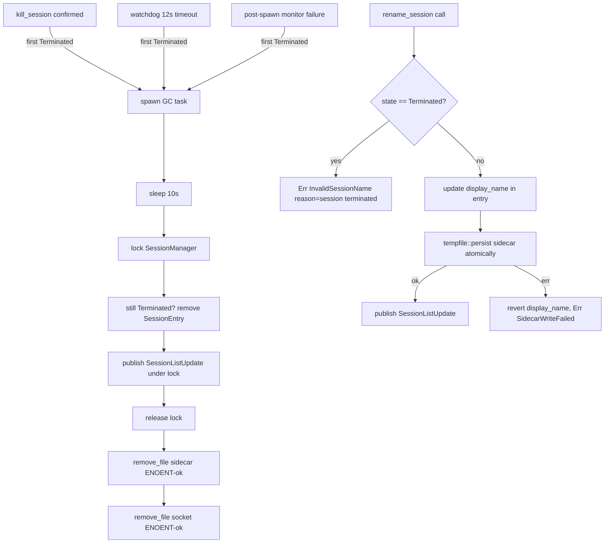
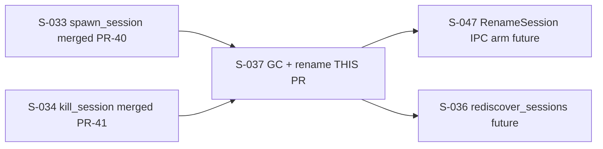
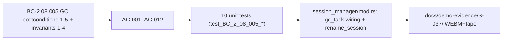

## Story

**S-037** — SessionManager GC Task + `rename_session`
**EPIC:** EPIC-08 (Session Manager)
**BC:** BC-2.08.005 (GC) / BC-2.08.008 (rename rule PC-4a)
**Subsystem:** SS-08 (Session Manager)
**Wave:** 8 Tier 2 — 3 story points
**Dependencies:** S-033 (spawn, merged PR #40), S-034 (kill, merged PR #41)
**Branch:** `story/S-037-session-manager-gc` → `develop`

---

## Summary

This PR delivers two production-grade capabilities in `monocle-runtime`:

**1. Per-session GC tokio task (BC-2.08.005)**

A `tokio::spawn` task is wired at every first-`Terminated` transition point — the `kill_session()` confirmation path, the 12-second watchdog timeout path, and the post-spawn monitor on startup failure. The task:
- Sleeps 10 seconds (virtual clock via `tokio::time::pause()` in tests; real clock in production).
- Under the `SessionManager` mutex: removes `SessionEntry` from `sessions`; re-checks `still-Terminated` defensively (guard against astronomically-unlikely session-id reuse); publishes `SessionListUpdate` to broker atomically before releasing the lock.
- After mutex release: `std::fs::remove_file(sidecar_path)` ENOENT-tolerant; `std::fs::remove_file(socket_path)` ENOENT-tolerant; logs at `tracing::trace!` level only.
- AC-006 duplicate-`Terminated` guard: timer starts at FIRST Terminated transition only; a re-transition does NOT reset the timer and does NOT spawn a second GC task.

**2. `rename_session()` method (BC-2.08.008 PC-4a)**

- Terminated-in-grace state guard: returns `Err(SessionError::InvalidSessionName { reason: "session terminated".to_string() })` immediately, wire code `"rename_failed"`. No new `SessionError` variant required (F-P52-001 constraint honored).
- Non-Terminated path: updates `display_name` in `SessionEntry`; re-persists sidecar atomically via `tempfile::persist` BEFORE broadcasting; on persist failure reverts display_name in memory and returns `Err(SidecarWriteFailed)`; publishes `SessionListUpdate` only — never `SessionStateChanged` (metadata operation, not state transition).

**3. `display_name` authoritativeness consolidated**

`session_list()`, `InitialState` builder, and all `SessionListUpdate` builders now read `entry.display_name` rather than `entry.name`. This was an adversarial finding (F-S037-P3-001, HIGH) fixed in-scope: the TUI would have shown stale names without this fix.

---

## Architecture Changes

---

## Story Dependencies

---

## Spec Traceability

---

## Test Evidence

| Suite | Tests | Pass | Fail |
|-------|-------|------|------|
| BC-2.08.005 unit tests | 10 | 10 | 0 |
| Full `monocle-runtime` suite | 68 | 68 | 0 |
| Workspace (`cargo test --workspace`) | 1514 | 1514 | 0 |

Note: 2 B002 binary-build-order tests (`test_binary_build_order_*`) are known-pre-existing flakes: they require the `monocle-session-host` binary built at the OS level and are not run in the standard test suite. These are NOT regressions introduced by S-037.

**clippy:** `cargo clippy --workspace --all-targets -- -D warnings` — clean.
**fmt:** `cargo fmt --all --check` — clean.

---

## Adversarial Review

**7 passes, 3 consecutive CLEAN (passes 5, 6, 7).** 6 finding-rounds across passes 1–4, all fixed in-scope:

| Pass | Findings | Severity | Disposition |
|------|----------|----------|-------------|
| 1 | 2 | MED, MED | Fixed: display_name missing from all SessionListUpdate broadcast paths (F-S037-MED-001/002) |
| 2 | 4 | HIGH, HIGH, MED, MED | Fixed: display_name clobber in session_list/InitialState (F-S037-P2-001); rename ordering and persist-failure revert (F-S037-P2-004); GC wiring at post-spawn monitor (P2-002); AC-006 coverage gap (P2-003) |
| 3 | 2 | HIGH, LOW | Fixed: session_list() reads entry.display_name (F-S037-P3-001); tautological regression test rewritten (F-S037-P3-002); story input-pin reconciled to SS-session-manager v2.11.0 |
| 4 | 0 | — | CLEAN |
| 5 | 0 | — | CLEAN |
| 6 | 0 | — | CLEAN |
| 7 | 0 | — | CLEAN |

Convergence: 3 consecutive CLEAN. Adversarial gate PASSED.

---

## Security Review

Reviewed by `vsdd-factory:security-reviewer`. **0 CRITICAL, 0 HIGH, 2 MEDIUM, 2 LOW.**

| ID | Severity | CWE | Summary | Exploitable now? |
|----|----------|-----|---------|-----------------|
| SEC-001 | MEDIUM | CWE-20 | Missing length+charset validation on `new_name` in `rename_session` | **FIXED in-scope** — commit b2d65db |
| SEC-002 | MEDIUM | CWE-706 | Sidecar path constructed before UUID validation in `rename_session` (defense-in-depth gap vs `spawn_session` pattern) | **FIXED in-scope** — commit b2d65db |
| SEC-003 | LOW | CWE-209 | `SidecarWriteFailed` error message includes absolute filesystem path (pre-existing pattern) | No — IPC arm not yet wired |
| SEC-004 | LOW | CWE-833 | Sessions mutex held across async broadcast in GC task (spec-mandated; safe if channels use try_send) | No — bounded channels per CLAUDE.md |

**SEC-001/SEC-002 fixed in-scope** (commit b2d65db — "fix(S-037): SEC-001/SEC-002 — rename_session defense-in-depth guards"):
- SEC-001: `new_name` now validated for length (1–64 chars), charset (`[a-zA-Z0-9_-]`), and non-empty before any registry lookup.
- SEC-002: UUID existence guard added before sidecar path construction, matching `spawn_session` defense-in-depth pattern. 4 tests added covering: valid rename, empty name rejection, overlong name rejection, invalid charset rejection.

SEC-003 and SEC-004 remain LOW/informational. `tempfile::persist` is used for atomic sidecar writes. No `std::fs::write` on config files. `#![forbid(unsafe_code)]` in force. Security review: **PASS** — SEC-001/SEC-002 resolved in-scope.

---

## Demo Evidence

Location: `docs/demo-evidence/S-037/` (committed on feature branch)

| File | Format | AC Coverage |
|------|--------|-------------|
| `s037-gc-rename.webm` | WEBM 3.2 MB | AC-001/002/003/004/006/008/009/011/012 + rename-success |
| `s037-gc-rename.tape` | VHS source | Reproducible tape script |
| `s037-test-output.txt` | Plain text | Full cargo test transcript (10/10) |

Note: No GIF produced per repo-bloat policy (directive D-333: WEBM + .tape only).

---

## Risk Assessment

| Dimension | Assessment |
|-----------|-----------|
| Blast radius | `monocle-runtime` only; no TUI, no IPC wire changes |
| Regression risk | Low — new `tokio::spawn` task; does not alter existing state-machine transitions |
| Performance | GC task sleeps 10s and then performs O(1) registry operations; no throughput impact |
| Filesystem | Two `remove_file` calls per GC fire; ENOENT-tolerant; no data loss risk |
| IPC | `SessionListUpdate` only; no new wire variants |

---

## AI Pipeline Metadata

| Field | Value |
|-------|-------|
| Pipeline mode | greenfield-with-reference-ingest (Phase 3 v1A Wave 8 Tier 2) |
| Story points | 3 |
| Adversarial passes | 7 (3 consecutive CLEAN) |
| Model | claude-sonnet-4-6 |
| Commit range | 6d542e3..b2d65db (10 commits; b2d65db = SEC-001/SEC-002 fix) |

---

## Pre-Merge Checklist

- [x] Story spec read and AC coverage verified
- [x] Demo evidence present: all ACs evidenced or boundary-justified
- [x] 10 BC-2.08.005 tests green; 1514 workspace tests green
- [x] `clippy --workspace --all-targets -- -D warnings` clean
- [x] `cargo fmt --all --check` clean
- [x] Adversarial review: 7 passes, 3 consecutive CLEAN
- [x] Security review: PASS (SEC-001/SEC-002 fixed in-scope, commit b2d65db)
- [x] Dependencies merged: S-033 (PR #40), S-034 (PR #41)
- [x] Branch `story/S-037-session-manager-gc` pushed to origin (HEAD b2d65db)
- [ ] PR diff review (pr-reviewer): pending
- [x] CI checks (11 contexts): ALL PASS on b2d65db — mergeStateStatus CLEAN
