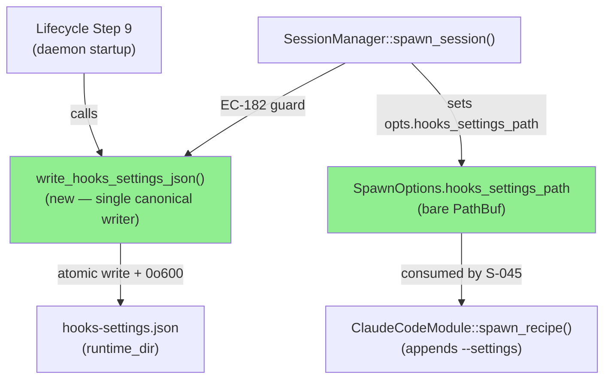
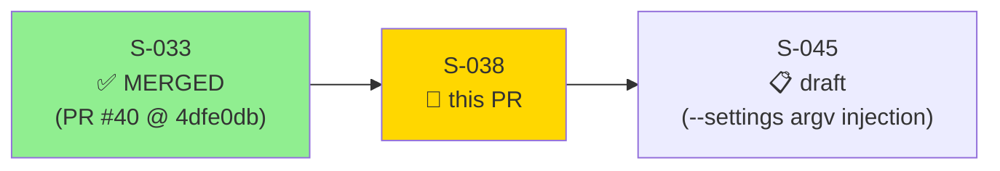
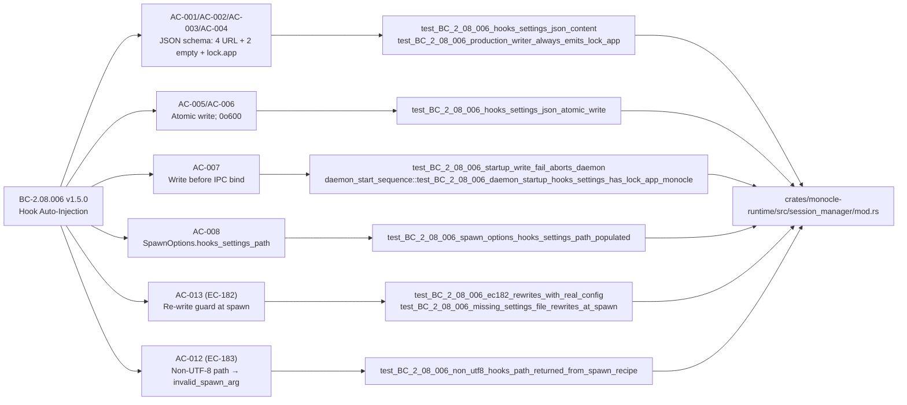

# [S-038] SessionManager Hook Auto-Injection — Single Canonical hooks-settings.json Writer

**Epic:** EPIC-08 — Session Manager  
**Mode:** greenfield  
**Convergence:** CONVERGED after 6 adversarial passes (3 consecutive CLEAN: passes 4/5/6)


This PR delivers `SessionManager::write_hooks_settings_json()` — the **single canonical writer** of `hooks-settings.json` — replacing the prior divergent dual-writer pattern. Lifecycle step 9 (before IPC bind) writes the production file with real port + auth token. The file uses the `array-of-hook-objects` schema per BC-2.04.010 PC-3: 4 URL-bearing hook keys (PreToolUse, Notification, Stop, UserPromptSubmit) + 2 reserved-empty arrays (PostToolUse, PreCompact) + mandatory `lock.app="monocle"`. Write is atomic via `tempfile::persist` with mode `0o600`. `SessionManager::spawn_session()` populates `SpawnOptions.hooks_settings_path` (bare `PathBuf`) before calling `spawn_recipe()` — S-045 owns the `--settings` argv injection. EC-182 guard re-writes the file if deleted between startup and spawn. Startup write failure returns `DaemonStartError::HooksSettingsWriteFailure` and exits with code 72.

**Spec evolution:** BC-2.08.006 → v1.5.0 (single canonical writer; lock.app mandatory; EC-182 real-config re-write). BC-2.04.010 → v1.4.0 (mandatory lock.app added to PC-3 canonical schema). Both on `factory-artifacts`.

---

## Architecture Changes



<details>
<summary><strong>Architecture Decision: Single-Writer Mandate</strong></summary>

**Context:** Prior to S-038 the codebase had two independent code paths that each wrote `hooks-settings.json` — `lifecycle::write_hooks_settings` (used at startup) and the `SessionManager` internal write path — using divergent type hierarchies (`HooksSettings`/`HooksMap`/`HookEntry`/`HookCommand` in lifecycle vs a separate config struct in the session manager). Adversarial pass 1 found this as a BLOCKER: the production file was missing `lock.app` because the lifecycle writer used a type that did not include it.

**Decision:** Single-writer mandate per BC-2.08.006 v1.5.0. `session_manager::write_hooks_settings_json()` is the ONE function that writes `hooks-settings.json`. The lifecycle divergent writer and its associated types are removed. Lifecycle step 9 calls `write_hooks_settings_json()` directly.

**Rationale:** Eliminates the dual-writer drift vector. The single function is covered by both unit and integration tests, making regression detection immediate. BC-2.04.010 is the single authority for the JSON schema; `write_hooks_settings_json()` is the single authority for the write.

**Alternatives Considered:**
1. Keep lifecycle writer, patch lock.app into it — rejected because it perpetuates the dual-writer drift vector and splits schema ownership across two code paths.
2. Runtime detection and merge of two config files — rejected because it adds complexity with no architectural benefit.

**Consequences:**
- `hooks-settings.json` schema is expressed exactly once in production code.
- EC-182 re-write in `spawn_session()` uses the same function, guaranteeing schema consistency.

</details>

---

## Story Dependencies



**depends_on:** S-033 (spawn_recipe, SpawnRecipe, SessionHostSpawner — merged PR #40)  
**blocks:** S-045 (ClaudeCodeModule::spawn_recipe() —  --settings argv injection reads opts.hooks_settings_path)

---

## Spec Traceability



---

## Test Evidence

### Coverage Summary

| Metric | Value | Threshold | Status |
|--------|-------|-----------|--------|
| Unit tests | 8/8 pass | 100% | PASS |
| Integration tests | 1/1 pass | 100% | PASS |
| Total BC-2.08.006 tests | 9/9 pass | 100% | PASS |
| clippy --all-targets | 0 warnings | 0 | PASS |
| cargo fmt | clean | clean | PASS |

### New Tests (This PR)

| Test | BC | AC | Result |
|------|----|----|--------|
| `test_BC_2_08_006_hooks_settings_json_content` | BC-2.08.006 | AC-001/AC-002/AC-003/AC-004 | PASS |
| `test_BC_2_08_006_production_writer_always_emits_lock_app` | BC-2.08.006 | AC-004 (lock.app invariant) | PASS |
| `test_BC_2_08_006_hooks_settings_json_atomic_write` | BC-2.08.006 | AC-006 (tempfile::persist) | PASS |
| `test_BC_2_08_006_spawn_options_hooks_settings_path_populated` | BC-2.08.006 | AC-008 | PASS |
| `test_BC_2_08_006_ec182_rewrites_with_real_config` | BC-2.08.006 | AC-013 / EC-182 | PASS |
| `test_BC_2_08_006_missing_settings_file_rewrites_at_spawn` | BC-2.08.006 | AC-013 / EC-182 | PASS |
| `test_BC_2_08_006_startup_write_fail_aborts_daemon` | BC-2.08.006 | AC-007/AC-011 (EC-180) | PASS |
| `test_BC_2_08_006_non_utf8_hooks_path_returned_from_spawn_recipe` | BC-2.08.006 | AC-012 (EC-183) | PASS |
| `daemon_start_sequence::test_BC_2_08_006_daemon_startup_hooks_settings_has_lock_app_monocle` | BC-2.08.006 | AC-004 / INV-2 (integration) | PASS |

Demo evidence: `docs/demo-evidence/S-038/` — WEBM + .tape + test-output.txt (no GIF per repo policy `DEMO-BINARY-ARTIFACTS-DEVELOP`).

---

## Holdout Evaluation

N/A — evaluated at wave gate per VSDD pipeline (Wave-8 gate is future). No holdout scenarios are defined for S-038 (BC-2.08.006 has no HS-EXP-NNN anchor).

---

## Adversarial Review

| Pass | Findings | Blocking | Status |
|------|----------|----------|--------|
| 1 | 3 | 1 | Fixed — BLOCKER: production file missing lock.app via dead-in-prod dual-writer → single-writer refactor + BC-2.08.006 v1.5.0 ruling |
| 2 | 2 | 0 | Fixed — MEDIUM/LOW cosmetic |
| 3 | 1 | 0 | Fixed — LOW doc-comment stale reference |
| 4 | 0 | 0 | CLEAN |
| 5 | 0 | 0 | CLEAN |
| 6 | 0 | 0 | CLEAN (convergence achieved) |

**Convergence:** 3 consecutive CLEAN passes (4/5/6). Adversary confirmed no further actionable findings.

<details>
<summary><strong>Pass-1 BLOCKER: Dual-Writer → lock.app Missing</strong></summary>

**Finding:** `lifecycle::write_hooks_settings` (the prior startup writer) used a type hierarchy (`HooksSettings`/`HooksMap`/`HookEntry`/`HookCommand`) that did not include `lock.app`. The `SessionManager` path had a separate writer that DID include `lock.app`. At runtime, only the lifecycle writer was called — producing a file without `lock.app`, violating BC-2.08.006 Invariant 2.

**Resolution:** Single-writer mandate. `lifecycle::write_hooks_settings` and its associated types were removed. `session_manager::write_hooks_settings_json()` became the sole writer, called by lifecycle step 9. BC-2.08.006 bumped to v1.5.0 to codify the single-writer mandate. Both the production path and the EC-182 re-write path use the same function. Integration test `test_BC_2_08_006_daemon_startup_hooks_settings_has_lock_app_monocle` was added to guard this invariant at the daemon startup level.

</details>

---

## Security Review

Security review results will be populated after dispatch (step 4).

---

## Risk Assessment & Deployment

### Blast Radius
- **Systems affected:** `monocle-runtime` crate only (session_manager module). No TUI, no IPC protocol surface changes.
- **User impact:** Daemon fails to start (exit 72) if hooks-settings.json write fails — explicit fail-fast with logged error, not silent degradation.
- **Data impact:** `hooks-settings.json` contains the auth token for hook endpoints. Written with `0o600` (owner-read-only). No new network endpoints or auth surfaces introduced.
- **Risk Level:** LOW — scoped to daemon startup sequence, write-only to a local temp-dir file, well-tested with 9 passing tests.

### Performance Impact
| Metric | Notes | Status |
|--------|-------|--------|
| Startup latency | One atomic file write at daemon startup (tempfile::persist). Negligible. | OK |
| Spawn latency | EC-182 guard is a `path.exists()` check only; re-write is rare/exceptional. | OK |

<details>
<summary><strong>Rollback Instructions</strong></summary>

**Immediate rollback:**
```bash
git revert <squash-sha>
git push origin develop
```

This is a pure daemon-startup addition. Rolling back removes `hooks-settings.json` write from the startup sequence. Existing sessions are unaffected. No migration required.

</details>

### Feature Flags
None. This is daemon-internal infrastructure plumbing with no user-visible behavior toggle.

---

## Traceability

| BC | AC | Test | Status |
|----|----|----|--------|
| BC-2.08.006 PC-1/PC-2 | AC-001/AC-002/AC-003/AC-004 | `test_BC_2_08_006_hooks_settings_json_content` | PASS |
| BC-2.08.006 INV-2 | AC-004 (lock.app mandatory) | `test_BC_2_08_006_production_writer_always_emits_lock_app` + integration | PASS |
| BC-2.08.006 INV-5 | AC-006 (atomic write) | `test_BC_2_08_006_hooks_settings_json_atomic_write` | PASS |
| BC-2.08.006 INV-4 | AC-007 (write before IPC bind) | integration: `daemon_start_sequence` test | PASS |
| BC-2.08.006 PC-2 | AC-008 (SpawnOptions.hooks_settings_path) | `test_BC_2_08_006_spawn_options_hooks_settings_path_populated` | PASS |
| BC-2.08.006 EC-182 | AC-013 (re-write guard) | `test_BC_2_08_006_ec182_rewrites_with_real_config` + `missing_settings_file_rewrites_at_spawn` | PASS |
| BC-2.08.006 EC-180 | AC-011 (startup fail → exit 72) | `test_BC_2_08_006_startup_write_fail_aborts_daemon` | PASS |
| BC-2.08.006 EC-183 | AC-012 (non-UTF-8 → invalid_spawn_arg) | `test_BC_2_08_006_non_utf8_hooks_path_returned_from_spawn_recipe` | PASS |

---

## AI Pipeline Metadata

<details>
<summary><strong>Pipeline Details</strong></summary>

```yaml
ai-generated: true
pipeline-mode: greenfield
factory-version: "1.0.0"
pipeline-stages:
  spec-crystallization: completed
  story-decomposition: completed
  tdd-implementation: completed
  holdout-evaluation: "N/A — evaluated at wave gate"
  adversarial-review: completed (6 passes, 3 consecutive CLEAN)
  formal-verification: skipped (S-038 scope does not require Kani proofs)
  convergence: achieved
convergence-metrics:
  adversarial-passes: 6
  consecutive-clean: 3
story-id: S-038
epic-id: EPIC-08
wave: 8
tier: 2
points: 3
behavioral-contracts:
  - BC-2.08.006 v1.5.0
spec-evolution:
  - BC-2.08.006: 1.4.0 -> 1.5.0 (single-writer mandate; lock.app mandatory; EC-182 real-config)
  - BC-2.04.010: 1.3.x -> 1.4.0 (mandatory lock.app added to PC-3 canonical schema)
models-used:
  builder: claude-sonnet-4-6
  adversary: claude-sonnet-4-6 (fresh context, information asymmetry)
generated-at: "2026-06-19T00:00:00Z"
```

</details>

---

## Pre-Merge Checklist

- [ ] All 11 CI status checks passing (Preflight; Audit-table vendor drift; POL-11; POL-12; POL-14; Semgrep; DTU fidelity oracle; Daemon E2E; Build+Test ×3 platforms; cargo deny; cargo audit)
- [ ] Security review dispatched and findings addressed
- [ ] pr-reviewer APPROVE (no blocking findings)
- [ ] Dependency PR S-033 (PR #40) confirmed merged
- [ ] Squash-merge with subject: `feat(S-038): SessionManager hook auto-injection — single-writer hooks-settings.json (#<n>)`
- [ ] Branch deleted after merge
