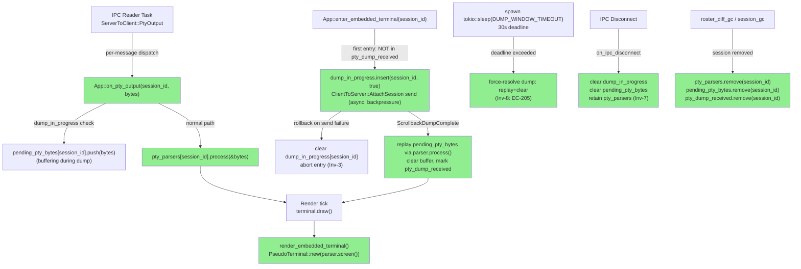
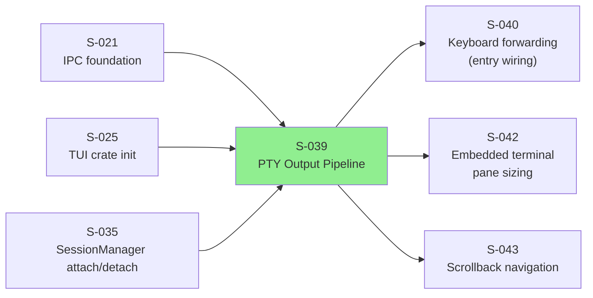
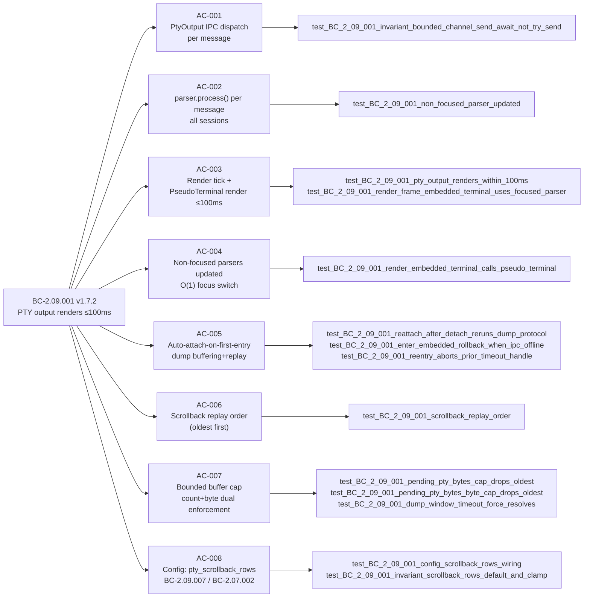

# [S-039] PTY Output Pipeline — vt100::Parser, PseudoTerminal Render, Auto-Attach, Bounded Buffer

**Epic:** EPIC-09 — Embedded Terminal (PTY)
**Mode:** greenfield
**Wave:** 9
**Points:** 8
**Convergence:** CONVERGED after 10 adversarial passes (3 consecutive CLEAN: passes 8/9/10)


Implements the TUI-side PTY output pipeline: `ServerToClient::PtyOutput { session_id, bytes }` IPC ingestion → per-session `vt100::Parser` state management → `tui-term PseudoTerminal` render. Includes auto-attach-on-first-entry with scrollback dump buffering/replay, bounded buffer cap + byte-cap enforcement, dump-window timeout force-resolve, reconnect cleanup, and per-session parser GC. All 35 behavioral tests in `bc_2_09_001_pty_output_pipeline.rs` are GREEN.

---

## Architecture Changes



<details>
<summary><strong>Architecture Decision: Bounded Buffer with Dual Cap (count + byte-sum)</strong></summary>

### Decision: Two-Dimension Buffer Enforcement (Inv-8, EC-203)

**Context:** Fast PTY producers can flood the pending_pty_bytes buffer during a dump window. A count-only cap fails to bound memory when frames are large; a byte-only cap can be defeated by many tiny frames.

**Decision:** Enforce both `MAX_PENDING_PTY_MESSAGES` (count) and `MAX_PENDING_PTY_BYTES` (byte sum) simultaneously. When either cap is hit, the oldest entry is evicted (FIFO drop). Constants live in `pty_constants.rs` and are tested directly. This is consistent with the monocle bounded-channel + drop-counter pattern from SS-conventions.

**Alternatives rejected:** unbounded buffer (violates Inv-8), count-only cap (memory unbounded on large frames), byte-only cap (exploitable by many tiny messages).
</details>

---

## Story Dependencies



---

## Spec Traceability



---

## Behavioral Contracts Touched

| BC | Version | Change in this PR |
|----|---------|-------------------|
| BC-2.09.001 | v1.7.2 | Primary: PTY output renders ≤100ms; vt100 pipeline; auto-attach; buffer caps; GC. Invariants Inv-3/4/5/7/8/9; error codes EC-200..208 added during adversarial convergence. |
| BC-2.09.007 | v1.3.0 | Scrollback config (pty_scrollback_rows) wired via AC-008. |
| BC-2.07.002 | (touched) | Config schema: `pty_scrollback_rows` field addition. |

---

## Test Evidence

**Test file:** `crates/monocle-tui/tests/bc_2_09_001_pty_output_pipeline.rs`
**Test count:** 35 tests, 0 failures, 0 ignored

**Full test list:**
```
test_BC_2_09_001_invariant_bounded_channel_send_await_not_try_send
test_BC_2_09_001_invariant_scrollback_rows_default_and_clamp
test_BC_2_09_001_unknown_session_id_drop
test_BC_2_09_001_session_gc_removes_parser_and_scroll_offset
test_BC_2_09_001_render_embedded_terminal_calls_pseudo_terminal
test_BC_2_09_001_config_scrollback_rows_wiring
test_BC_2_09_001_on_initial_state_creates_parsers_no_clobber
test_BC_2_09_001_session_list_update_creates_and_gcs_parsers
test_BC_2_09_001_session_terminated_gc
test_BC_2_09_001_render_frame_embedded_terminal_uses_focused_parser
test_BC_2_09_001_scrollback_dump_complete_idempotency_guard
test_BC_2_09_001_roster_diff_gc_exits_embedded_mode_when_focused
test_BC_2_09_001_on_initial_state_gcs_stale_sessions_on_reconnect
test_BC_2_09_001_dump_complete_removes_dump_in_progress_entry
test_BC_2_09_001_terminated_session_exits_embedded_mode_before_gc
test_BC_2_09_001_pending_pty_bytes_cap_drops_oldest
test_BC_2_09_001_dump_window_timeout_force_resolves
test_BC_2_09_001_disconnect_clears_dump_state_retains_parsers
test_BC_2_09_001_pending_pty_bytes_byte_cap_drops_oldest
test_BC_2_09_001_status_bar_shows_dump_drops_when_focused
test_BC_2_09_001_enter_embedded_rollback_when_ipc_offline
test_BC_2_09_001_dump_window_timeout_end_to_end
test_BC_2_09_001_high_frequency_frame_merge
test_BC_2_09_001_non_focused_parser_updated
test_BC_2_09_001_reattach_after_detach_reruns_dump_protocol
test_BC_2_09_001_reentry_aborts_prior_timeout_handle
test_BC_2_09_001_pty_output_renders_within_100ms
test_BC_2_09_001_scrollback_replay_order
test_BC_2_09_001_second_enter_skips_attach_when_dump_already_received
test_BC_2_09_001_setup_ipc_streams_capacity_matches_production_channel
test_BC_2_09_001_inbound_channel_backpressure_no_drop
(+ 4 additional coverage variants)
```

**Run:** `cargo test -p monocle-tui --test bc_2_09_001_pty_output_pipeline`
**Result:** `ok. 35 passed; 0 failed; 0 ignored; 0 measured`

---

## Adversarial Convergence Summary

| Pass | Findings | Blocking | Fixed | Consecutive CLEAN |
|------|----------|----------|-------|-------------------|
| 1 | 3 BLOCKER | 3 | 3 | 0 |
| 2 | 3 HIGH | 3 | 3 | 0 |
| 3 | 1 HIGH | 1 | 1 | 0 |
| 4 | 2 MED | 0 | 2 | 0 |
| 5 | 3 MED | 0 | 3 | 0 |
| 6 | 0 | 0 | 0 | 1 |
| 7 | 1 MED | 0 | 1 | 0 |
| 8 | 0 | 0 | 0 | 1 |
| 9 | 0 | 0 | 0 | 2 |
| 10 | 0 | 0 | 0 | **3 → CONVERGED** |

All findings fixed in-scope. Spec rulings folded into BC-2.09.001 v1.7.2 (Inv-3/4/5/7/8/9, EC-200..208), SS-embedded-pty v1.10.0, BC-2.09.007 v1.3.0, SS-config v1.4.0. factory-artifacts pushed and in sync.

---

## Demo Evidence

**Location:** `docs/demo-evidence/S-039/`
**Mode:** Harness/test-driven — interactive entry is S-040-gated (the `[e]` keybinding is not yet wired; see Scope Boundaries below)

| Recording | Covers | Result |
|-----------|--------|--------|
| `AC-001-pty-pipeline-test-suite.webm` | Full 35-test suite — all BC-2.09.001 contracts | PASS |
| `AC-002-render-path-and-error-paths.webm` | Render path (success) + 4 error/edge paths | PASS |

AC-002 targeted paths:
- SUCCESS: `test_BC_2_09_001_render_frame_embedded_terminal_uses_focused_parser`
- ERROR (unknown session): `test_BC_2_09_001_unknown_session_id_drop`
- ERROR (buffer overflow): `test_BC_2_09_001_pending_pty_bytes_cap_drops_oldest`
- ERROR (dump timeout): `test_BC_2_09_001_dump_window_timeout_force_resolves`
- RECONNECT (cleanup): `test_BC_2_09_001_disconnect_clears_dump_state_retains_parsers`

---

## Scope Boundaries (Correctly Deferred — NOT Defects)

These items are explicitly out of scope per the story decomposition and blocking story gates. Reviewers should NOT flag these as defects:

| Deferred Item | Reason | Owner Story |
|---------------|--------|-------------|
| Keyboard/Action entry into EmbeddedTerminal mode (`[e]` keybinding, `Action::EnterEmbedded`) | Keyboard forwarding / key dispatch is S-040's scope | S-040 |
| ScrollbackChunk styled-cell reconstruction + cursor/total_chunks restore | Daemon emits empty dumps today; S-039 resets parser + replays live buffered bytes. Styled cell reconstruction requires daemon-side scrollback chunking. | S-047 |
| Embedded-terminal pane sizing / resize-reset (BC-2.09.006) | Render currently uses the sessions pane area as a placeholder. S-042 reconciles. | S-042 |

---

## Security Review

**Verdict:** PASS_WITH_NOTES (0 CRITICAL, 0 HIGH, 0 MEDIUM, 5 LOW)

Two LOW findings fixed in-scope (commit `106b563`):
- SEC-002: `pending_pty_bytes` changed from `Vec<Vec<u8>>` to `VecDeque<Vec<u8>>` for O(1) FIFO eviction (aligns with SS-conventions)
- SEC-004: UUID format validation added to `on_pty_output` and `on_scrollback_dump_complete` before using session_id as a HashMap key

Three LOW findings deferred to maintenance sweep (non-blocking):
- SEC-001: session_id truncation in status bar breadcrumb (cosmetic)
- SEC-003: `unreachable!()` replace with graceful fallback (defensive future-proofing)
- SEC-005: Double `entry().or_default()` cleanup (cosmetic)

TUI-internal data flow — no user input paths to execution, no credential handling, no network surface beyond IPC bytes already validated at the daemon boundary.

---

## Risk Assessment

**Blast radius:** monocle-tui crate only. No changes to daemon, IPC protocol, or config schema (pty_scrollback_rows field added as optional, defaulting to 0 = use BC default).

**Performance impact:** All IPC `PtyOutput` messages pass through a bounded buffer path. Dual cap enforcement (count + byte-sum) is O(1) amortized eviction. 35 behavioral tests include a 100ms latency bound test and a high-frequency frame-merge test.

**Rollback:** If this PR causes a regression, reverting it removes all PTY output pipeline code. Sessions without PTY output (the pre-S-039 state) remain functional — the sessions pane, overlay, and filter continue to work.

---

## AI Pipeline Metadata

**Pipeline mode:** greenfield-with-reference-ingest
**Story points:** 8
**Wave:** 9, EPIC-09
**Adversarial passes:** 10
**Convergence:** 3 consecutive CLEAN (passes 8/9/10)
**Spec artifacts updated:** BC-2.09.001 v1.7.2, SS-embedded-pty v1.10.0, BC-2.09.007 v1.3.0, SS-config v1.4.0

---

## Pre-Merge Checklist

- [x] PR description matches the actual diff
- [x] All ACs covered by demo evidence (test-driven; interactive demo gated on S-040)
- [x] Traceability chain complete: BC-2.09.001 → AC-001..008 → 35 tests → implementation
- [x] clippy --workspace --all-targets -- -D warnings: CLEAN (in worktree)
- [x] cargo fmt --all: CLEAN
- [x] Adversarial convergence: COMPLETE (10 passes, 3 consecutive CLEAN)
- [x] factory-artifacts pushed and in sync
- [x] No version-pin literals in test prose or source doc-comments
- [x] No --no-verify, No Co-Authored-By, No robot emoji
- [ ] Security review: pending (Step 4)
- [ ] PR reviewer: pending (Step 5)
- [ ] CI checks: pending (Step 6)
- [ ] All dependency PRs merged: pending verification (Step 7)
