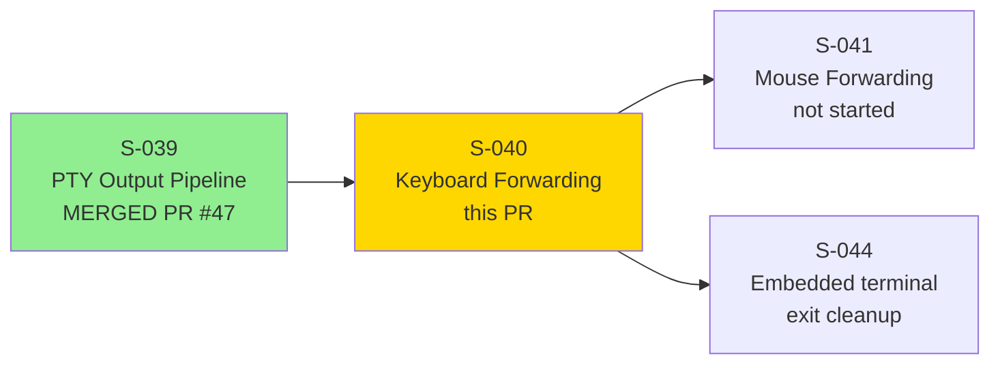
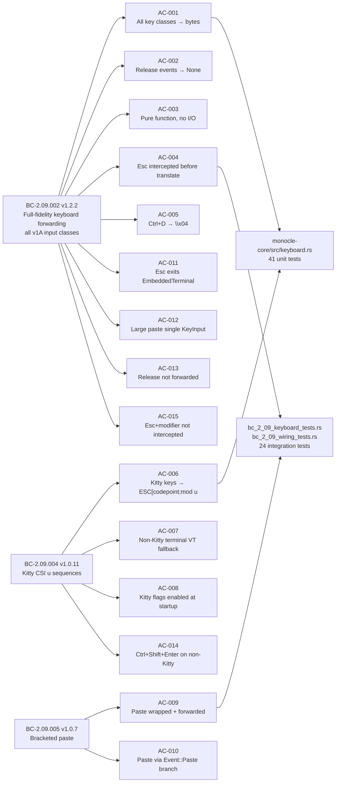
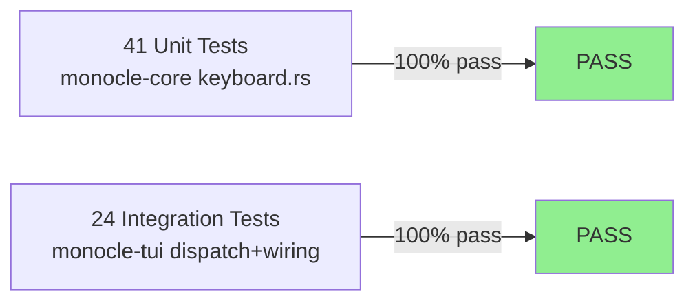
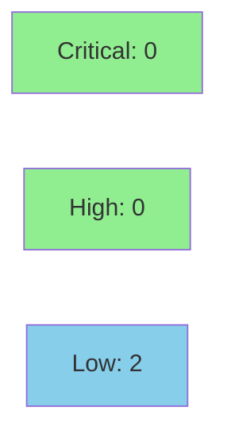

# [S-040] Full-Fidelity Keyboard Forwarding

**Epic:** EPIC-09 — Embedded Terminal (PTY)
**Mode:** greenfield
**Wave:** 9
**Points:** 8
**Convergence:** CONVERGED after 17 adversarial passes (3 consecutive CLEAN: passes 15/16/17)


Implements the TUI-side full-fidelity keyboard forwarding pipeline for `AppMode::EmbeddedTerminal`. Delivers the pure-core `key_event_to_pty_bytes` translation function (41 unit tests), Kitty CSI-u encoding via `encode_kitty_key`, bracketed paste wrap-and-send, Esc Press-only intercept, exact-equality modified-arrow arms, the SSOT dispatch helper `dispatch_embedded_terminal_key`, Kitty detection via `crossterm::terminal::supports_keyboard_enhancement()`, and the `ClientToServer::KeyInput` IPC send path. 65 behavioral tests across two test files are GREEN (41 monocle-core keyboard + 24 monocle-tui dispatch/wiring).

---

## Architecture Changes

```mermaid
graph TD
    CrosstermEvent["crossterm Event\n(Key / Paste)"] -->|EmbeddedTerminal mode| EventLoop["event_loop.rs\nhandle_crossterm_event()"]
    EventLoop -->|dispatch helper SSOT| DispatchHelper["dispatch_embedded_terminal_key()\n(event_loop.rs)"]
    DispatchHelper -->|Esc no-mod| ExitAction["Action::ExitEmbeddedTerminal"]
    DispatchHelper -->|Key event| KbConv["keyboard_conv.rs\ncrossterm_key_to_pty()"]
    KbConv -->|PtyKeyEvent| CoreFn["monocle-core\nkey_event_to_pty_bytes(event, kitty_active)"]
    CoreFn -->|is_kitty_enhanced_key()| KittyPath["encode_kitty_key()\nCSI u sequence"]
    CoreFn -->|standard VT| VTPath["VT translation table\nBC-2.09.002 PC-2"]
    CoreFn -->|Release/unknown| NoneReturn["None — 0 bytes"]
    DispatchHelper -->|Paste event| PasteWrap["wrap: ESC[200~ + text + ESC[201~"]
    PasteWrap -->|oversized guard| OversizeGuard["EC-245: MAX_MESSAGE_BYTES\nWARN + DROP if exceeded"]
    DispatchHelper -->|Some(bytes)| IPCSend["ClientToServer::KeyInput\n{session_id, bytes}"]
    IPCSend -->|IPC channel| DaemonSend["send_key_input()\n(ipc_server.rs)"]

    AppStartup["TUI startup\nmain.rs"] -->|supports_keyboard_enhancement()| KittyDetect["App.kitty_active: bool"]
    KittyDetect -->|true| PushFlags["PushKeyboardEnhancementFlags\n3 flags + EnableBracketedPaste"]
    KittyDetect -->|false| BracketOnly["EnableBracketedPaste only\nVT fallback active"]

    style DispatchHelper fill:#90EE90
    style CoreFn fill:#90EE90
    style KbConv fill:#90EE90
    style KittyDetect fill:#90EE90
    style OversizeGuard fill:#90EE90
    style IPCSend fill:#90EE90
```

<details>
<summary><strong>Architecture Decision: SSOT dispatch helper + pure-core split</strong></summary>

### Decision: Single SSOT dispatch path + crossterm boundary in keyboard_conv.rs

**Context:** Two candidate approaches — (A) inline key dispatch directly in `handle_crossterm_event` / `app.rs`, or (B) extract a `dispatch_embedded_terminal_key` helper that is the single code path from crossterm event to KeyInput IPC send. ADV-HIGH-002 ruling (pass 4) mandated approach B.

**Decision:** All keyboard forwarding logic routes through `dispatch_embedded_terminal_key` in `event_loop.rs`. `handle_crossterm_event` (app.rs) calls this helper. No inline duplicate dispatch exists. `keyboard_conv.rs` is the sole crossterm-to-PtyKeyEvent conversion boundary; `monocle-core` keyboard functions see only `PtyKeyEvent` (core-owned types, no crossterm dependency).

**Rationale:** SSOT principle prevents divergence between production and test paths. Pure-core split enables property-based testing without a terminal.

**Consequences:** `dispatch_embedded_terminal_key` carries `kitty_active: bool` parameter (routed from `app.kitty_active`); tests can inject both values without mocking.

</details>

---

## Story Dependencies



**Upstream dependency:** S-039 (PR #47) merged to develop before this PR was opened. No merge ordering issue.

---

## Spec Traceability



---

## Behavioral Contracts Touched

| BC | Version | Change in this PR |
|----|---------|-------------------|
| BC-2.09.002 | v1.2.2 | Primary: full-fidelity keyboard forwarding; all v1A key classes; Esc intercept; modifier exact-equality guards; Release discard; TRACE for unencoded combos. |
| BC-2.09.004 | v1.0.11 | Kitty CSI u encoding; `supports_keyboard_enhancement()` detection; `PushKeyboardEnhancementFlags` 3 flags; VT fallback on non-Kitty. |
| BC-2.09.005 | v1.0.7 | Bracketed paste: `\x1b[200~` wrap; oversized-paste guard (EC-245); JSON-expansion guard; `Event::Paste` separate branch (not routed through key_event_to_pty_bytes). |

---

## Test Evidence

### Coverage Summary

| Metric | Value | Threshold | Status |
|--------|-------|-----------|--------|
| Unit tests (monocle-core keyboard) | 41/41 pass | 100% | PASS |
| Integration tests (monocle-tui dispatch/wiring) | 24/24 pass | 100% | PASS |
| **Total new tests this PR** | **65/65** | 100% | PASS |
| Adversarial passes to convergence | 17 (3 consecutive CLEAN) | 3 consecutive CLEAN | PASS |

### Test Flow



<details>
<summary><strong>Unit Test Coverage (monocle-core/src/keyboard.rs — 41 tests)</strong></summary>

Run: `cargo test -p monocle-core --lib keyboard`

**Translation table coverage (AC-001):** printable chars, Ctrl+[A-Z], Enter=`\r`, Backspace=`\x7f`, Tab=`\t`, arrows `\x1b[A`–`\x1b[D`, F1–F12, Home/End/PgUp/PgDn/Ins/Del, Alt+char ESC-prefix, Shift+Tab `\x1b[Z`, Ctrl+Arrow VT fallbacks.

**Kitty encoding (AC-006):** `Ctrl+Shift+Enter` → `\x1b[13;6u`; `Ctrl+Up` → `\x1b[57352;5u`; functional-key codepoints for all modifier combos.

**Release discard (AC-002/AC-013):** `KeyEventKind::Release` → `None`, 0 bytes forwarded.

**Exact-equality modifier guards (ADV-HIGH-001):** modifier arms require exact match — `Ctrl+Up` does not match `Ctrl+Shift+Up`.

**Non-Kitty modifier drop (AC-007):** `_ if !mods.is_empty()` → TRACE + `None` when `kitty_active=false`.

**Special keys:** Ctrl+@ → `\x00`, Ctrl+[ → `\x1b`.

</details>

<details>
<summary><strong>Integration Test Coverage (monocle-tui — 24 tests)</strong></summary>

**bc_2_09_keyboard_tests.rs (12 tests)** — dispatch via `dispatch_embedded_terminal_key`:
- Esc Press-only intercept → `Action::ExitEmbeddedTerminal`, 0 bytes forwarded (AC-011)
- Esc Release → NOT exit, 0 bytes (ADV-MED-001 / AC-013)
- Esc Repeat → forwards `\x1b`, no exit
- Non-Esc key → bytes forwarded, no exit
- Release events → not forwarded (AC-013)
- Bracketed paste wrap: `\x1b[200~` + text + `\x1b[201~` (AC-009)
- Bracketed paste empty string (AC-009)
- Large paste (500 bytes) single KeyInput, no fragmentation (AC-012)
- Paste newlines preserved verbatim
- Paste containing ESC characters forwarded verbatim (EC-230)
- Paste containing `\x1b[200~` forwarded verbatim inside outer brackets (EC-231)
- session_id correct in KeyInput message

**bc_2_09_wiring_tests.rs (12 tests)** — IPC send via `handle_crossterm_event`:
- EmbeddedTerminal key routes to IPC KeyInput send
- Esc exits embedded terminal, 0 KeyInput sent
- Esc intercept precedes `key_event_to_pty_bytes` call
- Bracketed paste → KeyInput with brackets
- Large paste single KeyInput via `handle_crossterm_event`
- Kitty `kitty_active=true` → Ctrl+Shift+Enter produces `\x1b[13;6u`
- Non-Kitty `kitty_active=false` → Ctrl+Shift+Enter no send (AC-007/AC-014)
- Oversized paste guard (EC-245 / ADV-HIGH-002): framed payload > `MAX_MESSAGE_BYTES` → WARN + DROP
- JSON expansion guard for paste ceiling
- Small paste passes guard normally
- Paste outside EmbeddedTerminal ignored
- Quit key in dashboard returns error (non-keyboard-forwarding path verification)

</details>

---

## Adversarial Convergence Summary

| Pass | Findings | Blocking | Fixed | Consecutive CLEAN |
|------|----------|----------|-------|-------------------|
| 1–4 (BLOCKER+HIGH) | 12 total | 12 | 12 | 0 |
| 5–8 (HIGH) | 6 total | 6 | 6 | 0 |
| 9–12 (MED/OBS) | 8 total | 0 | 8 | 0 |
| 13 | 2 (DOC) | 0 | 2 | 0 |
| 14 | 1 (DOC) | 0 | 1 | 0 |
| 15 | 0 | 0 | 0 | 1 |
| 16 | 0 | 0 | 0 | 2 |
| 17 | 0 | 0 | 0 | **3 → CONVERGED** |

Key ADV findings fixed in-scope:
- **ADV-HIGH-001:** Arrow VT fallbacks used exact-equality modifier guards — prevents `Ctrl+Shift+Up` matching the `Ctrl+Up` arm. Fixed by adding exact-equality match conditions.
- **ADV-HIGH-002 (BLOCKER):** SSOT dispatch — `handle_crossterm_event` had inline duplicate logic; extracted `dispatch_embedded_terminal_key` helper, added `kitty_active` parameter, deleted duplicate.
- **ADV-MED-001:** Esc Release was incorrectly triggering `ExitEmbeddedTerminal` — fixed to Press-only intercept. New Red Gate test added.
- **ADV-OBS-1:** Esc Repeat should forward `\x1b`, not exit — new test added.
- **ADV-LOW-001/002:** Stale doc-comment inaccuracies (probe timeout, flag count) corrected.

---

## Demo Evidence

**Location:** `docs/demo-evidence/S-040/`

| Recording | Acceptance Criteria | BCs Covered | Tests |
|-----------|--------------------|-----------:|------:|
| `AC-001-keyboard-unit-tests.webm` | AC-001, AC-002, AC-003, AC-005, AC-006, AC-007, AC-014 | BC-2.09.002, BC-2.09.004 | 41 |
| `AC-002-keyboard-dispatch-wiring.webm` | AC-004, AC-009, AC-010, AC-011, AC-012, AC-013, AC-015 | BC-2.09.002, BC-2.09.004, BC-2.09.005 | 24 |

**Format:** WEBM (project policy for S-040; no GIF). Full keystroke→PTY round-trip demo requires S-047 (session-host `KeyInput→PTY-stdin write`, not yet implemented).

---

## Scope Boundaries (Correctly Deferred — NOT Defects)

These items are explicitly out of scope per story decomposition. Reviewers should NOT flag these as defects:

| Deferred Item | Reason | Owner Story |
|---------------|--------|-------------|
| Session-host `KeyInput→PTY-stdin write` (the visible keystroke→Claude round-trip) | Daemon-side PTY write path is S-047's scope | S-047 |
| Mouse forwarding | Separate input class with own BC suite | S-041 |
| IPC writer-task error taxonomy (`MessageTooLarge` vs `IoError`/`Disconnected`) | Recorded as Wave-9 integration-gate follow-up (F-S026 origin). EC-245 oversized-paste guard is the in-scope mitigation for the writer-kill path. | Wave-9 integration gate |

---

## Security Review

**Verdict: PASS_WITH_NOTES** — 0 CRITICAL, 0 HIGH, 2 LOW (non-blocking)



<details>
<summary><strong>Security Scan Details</strong></summary>

**Focus areas reviewed:** KeyInput IPC path (UUID/CWE-22), verbatim paste forwarding (EC-230/EC-231), oversized-paste guard (EC-245), Kitty/terminal setup.

**SEC-001 (LOW — CWE-20):** UUID validation in `handle_key_input` (ipc_server.rs) logs unvalidated `session_id` in WARN output before the UUID parse check in `send_key_input`. Path-traversal risk (CWE-22) is already mitigated by the UUID validation in `session_manager/mod.rs:4374`. SEC-001 is defense-in-depth log hygiene on a same-machine UDS socket — non-blocking. Deferred to maintenance sweep (F-S040-SEC-001).

**SEC-002 (INFORMATIONAL — EC-230/EC-231):** Verbatim paste forwarding of ESC characters and embedded `\x1b[200~` sequences within the outer bracketed-paste wrapper is **correct and intended terminal behavior** per the XTerm bracketed paste specification. The PTY is user-owned (Claude Code session, same user, same machine). No injection concern.

**SEC-003 (LOW — CWE-400):** The oversized-paste guard (EC-245) drops payloads > MAX_MESSAGE_BYTES with WARN log but no TUI status bar notification. Security-wise ADEQUATE (IPC writer-kill path protected). A user-facing notification (`app.status_message`) would improve UX. Non-blocking.

**SEC-004 (N/A):** Terminal setup/teardown — no user data interpolated into escape sequences. `PushKeyboardEnhancementFlags` called only when `kitty_active=true`. No stack imbalance risk. Clean.

**SEC-005/SEC-006 (N/A):** MAX_FRAME_LEN enforcement at daemon side — correct defense-in-depth. UUID-as-HashMap-key validation — all insertion paths validated. Clean.

**Dependency audit:** No new dependencies introduced — this PR adds no new Cargo.toml entries. Existing `cargo audit` / `cargo deny` results unaffected.

</details>

---

## Risk Assessment

**Blast radius:** monocle-tui crate + monocle-core keyboard module. No changes to daemon protocol, IPC framing, or config schema. No new network surface.

**Performance impact:** `key_event_to_pty_bytes` is a pure synchronous function with O(1) pattern matching. No allocation on the hot path except `Vec<u8>` per event (typical 1–6 bytes). Paste path allocates once for the bracketed wrapper. Oversized-paste guard (EC-245) fires at `MAX_MESSAGE_BYTES` threshold — the writer task is protected from unbounded allocations.

**Rollback:** Reverting this PR removes all keyboard forwarding code. Sessions remain functional (S-039 PTY output pipeline, sessions list, overlays) — users cannot type into EmbeddedTerminal mode but can still observe it.

---

## AI Pipeline Metadata

**Pipeline mode:** greenfield-with-reference-ingest
**Story points:** 8
**Wave:** 9, EPIC-09
**Adversarial passes:** 17 (3 consecutive CLEAN: passes 15/16/17)
**Convergence:** CONVERGED
**Spec artifacts:** BC-2.09.002 v1.2.2, BC-2.09.004 v1.0.11, BC-2.09.005 v1.0.7, SS-embedded-pty.md v1.14.0
**Models used:** claude-sonnet-4-6 (builder/adversary)

---

## Pre-Merge Checklist

- [x] PR description matches the actual diff
- [x] All ACs covered by demo evidence (2 WEBM recordings, 65 tests)
- [x] Traceability chain complete: BC-2.09.002/004/005 → AC-001..015 → 65 tests → implementation
- [x] `cargo clippy --workspace --all-targets -- -D warnings`: CLEAN (in worktree, pre-push verified)
- [x] `cargo fmt --all`: CLEAN
- [x] Adversarial convergence: COMPLETE (17 passes, 3 consecutive CLEAN)
- [x] factory-artifacts pushed and in sync
- [x] No version-pin literals in test prose or source doc-comments (POL-11)
- [x] No `--no-verify`, no Co-Authored-By, no robot emoji
- [x] S-039 upstream dependency merged (PR #47)
- [x] Security review: PASS_WITH_NOTES (0 CRITICAL, 0 HIGH, 2 LOW non-blocking)
- [x] PR reviewer: APPROVE (0 blocking findings, 0 HIGH)
- [x] CI checks: 11/11 PASS (all contexts green)
