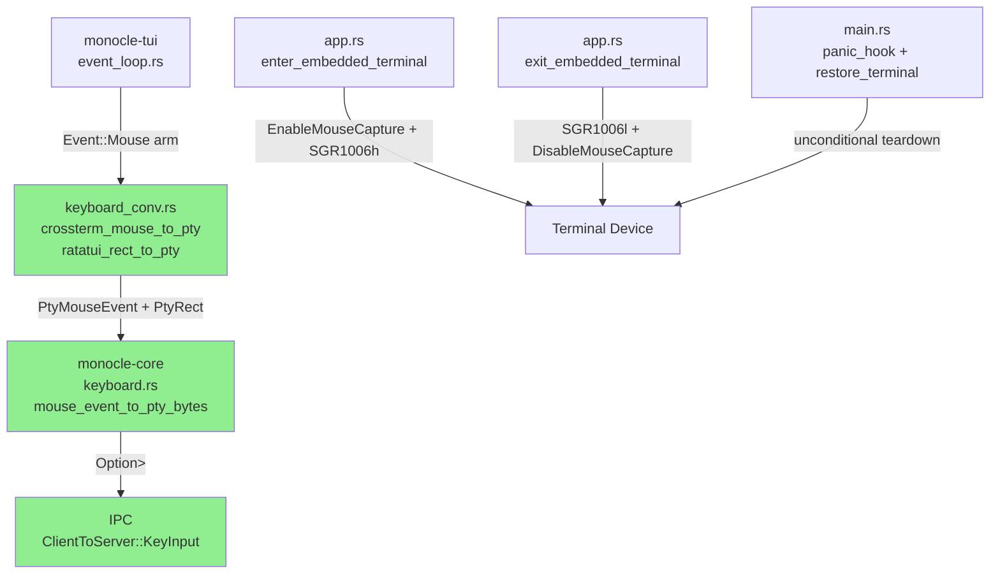
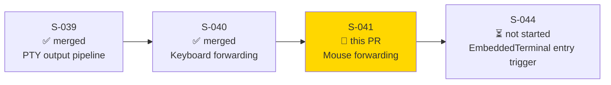
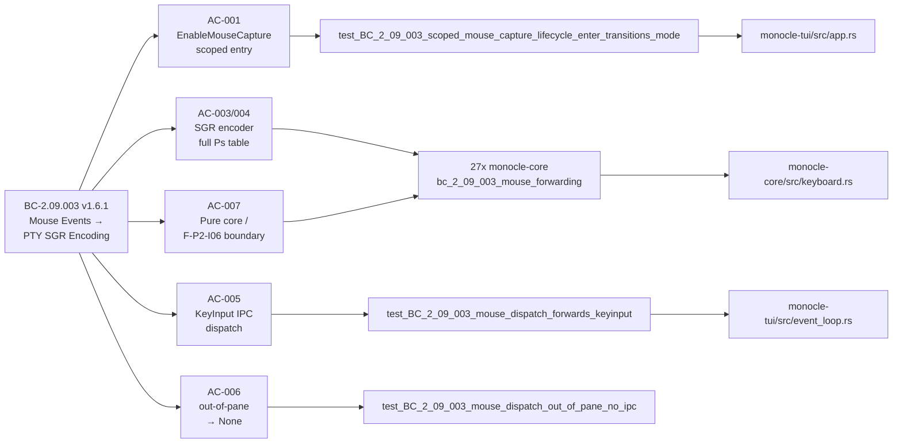
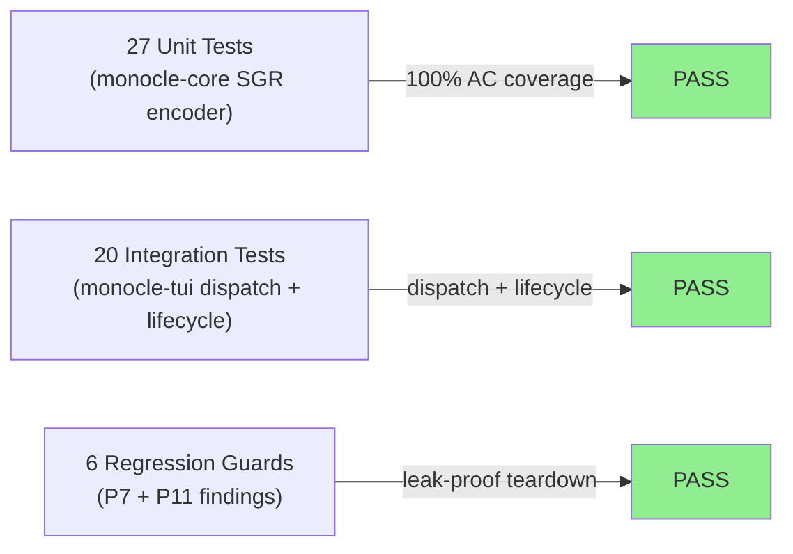
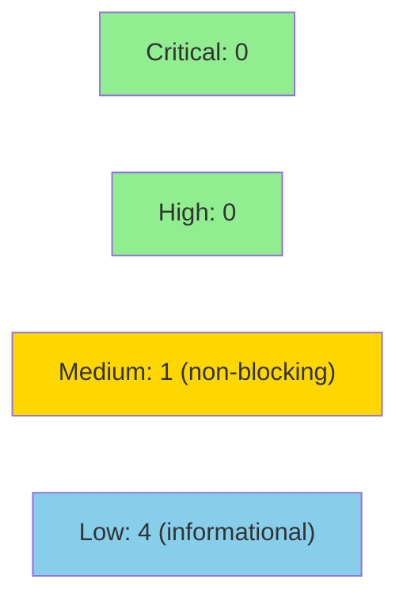

# [S-041] Mouse Forwarding — mouse_event_to_pty_bytes, SGR 1006 Scoped Entry/Exit, Out-of-Pane Clip

**Epic:** EPIC-09 — Embedded Terminal
**Mode:** greenfield
**Convergence:** CONVERGED after 14 adversarial passes (3 consecutive CLEAN: passes 12/13/14)


This PR delivers the complete mouse-forwarding pipeline for monocle's `EmbeddedTerminal` mode
(BC-2.09.003 v1.6.1). It adds a pure-core SGR 1006 encoder (`mouse_event_to_pty_bytes`) covering
the full Ps table (button down/up, drag, scroll, moved), modifier bits, and 1-indexed pane-relative
coordinates; confines crossterm/ratatui conversions to `keyboard_conv.rs` per the F-P2-I06 purity
boundary; dispatches `Event::Mouse` as `KeyInput` IPC; and implements a scoped
`EnableMouseCapture`/`DisableMouseCapture` lifecycle that is active only while
`AppMode::EmbeddedTerminal` is active. Two critical adversarial findings were fixed
in-scope: a mouse-capture leak across the `EmbeddedTerminal`→Overlay (permission-prompt)
transition (P7 HIGH), and unconditional mouse-capture teardown on panic/process-exit (P11 BLOCKER).

---

## Architecture Changes



<details>
<summary><strong>Architecture Decision Record</strong></summary>

### ADR: F-P2-I06 Purity Boundary — Core-Owned Mouse Types

**Context:** `mouse_event_to_pty_bytes` must live in `monocle-core` (pure Rust, no I/O) but
the input events arrive as `crossterm::event::MouseEvent` and the pane area is a
`ratatui::layout::Rect` — both of which are external crates that `monocle-core` MUST NOT depend on
(SS-embedded-pty.md §Dependency Boundary).

**Decision:** Mirror types `PtyMouseEvent` and `PtyRect` are defined in `monocle-core/src/keyboard.rs`
(introduced in S-040). All conversion logic is confined to `monocle-tui/src/keyboard_conv.rs`.
`mouse_event_to_pty_bytes` takes only core-owned types.

**Rationale:** Keeps `monocle-core` a pure library crate with no external UI framework dependencies.
Enables deterministic unit testing of the SGR encoder without a crossterm context.

**Alternatives Considered:**
1. Take `crossterm::event::MouseEvent` directly in monocle-core — rejected: violates F-P2-I06 purity boundary.
2. Define conversion in `monocle-core` via a trait — rejected: adds trait indirection for no benefit; conversion is infallible and trivial.

**Consequences:**
- `monocle-core` remains framework-free; SGR encoder is purely unit-testable.
- keyboard_conv.rs is the sole purity-boundary translation layer for both keyboard and mouse events.

</details>

---

## Story Dependencies



**Dependency status:** S-039 merged (PR #47), S-040 merged (PR #50). No blocking dependencies.
**Blocks:** S-044 (EmbeddedTerminal entry trigger — requires the full enter/exit lifecycle including scoped mouse capture delivered by this story).

---

## Spec Traceability



---

## Test Evidence

### Coverage Summary

| Metric | Value | Threshold | Status |
|--------|-------|-----------|--------|
| bc_2_09_003_mouse_forwarding | 27/27 pass | 100% | PASS |
| bc_2_09_003_mouse_dispatch | 20/20 pass | 100% | PASS |
| Total new tests | 47 | — | PASS |
| Adversarial convergence | 14 passes, 3 consecutive CLEAN | 3 consecutive CLEAN | PASS |
| clippy --all-targets | CLEAN | 0 errors | PASS |
| fmt --check | CLEAN | 0 changes | PASS |

### Test Flow



| Metric | Value |
|--------|-------|
| **New tests** | 47 added (27 unit + 20 integration/lifecycle) |
| **Total suite** | 47 tests PASS, 0 failures |
| **Coverage** | All 11 ACs + Invariant 1 covered |
| **Regressions** | 0 |

<details>
<summary><strong>Detailed Test Results — bc_2_09_003_mouse_forwarding (27 tests)</strong></summary>

| Test | AC | Result |
|------|----|--------|
| `test_BC_2_09_003_mouse_events_sgr_encoded_left_press` | AC-003 | PASS |
| `test_BC_2_09_003_mouse_events_sgr_encoded_left_release` | AC-003, AC-010 | PASS |
| `test_BC_2_09_003_mouse_events_sgr_scroll_up` | AC-004 | PASS |
| `test_BC_2_09_003_drag_encoding` | AC-005 | PASS |
| `test_BC_2_09_003_out_of_pane_returns_none` | AC-008 | PASS |
| `test_BC_2_09_003_out_of_pane_column_boundary_returns_none` | AC-008 | PASS |
| `test_BC_2_09_003_out_of_pane_row_boundary_returns_none` | AC-008 | PASS |
| `test_BC_2_09_003_1_indexed_origin` | AC-007 | PASS |
| `test_BC_2_09_003_1_indexed_nonzero_pane_origin` | AC-007 | PASS |
| `test_BC_2_09_003_pane_relative_offset_nonzero_pane` | AC-007 | PASS |
| `test_BC_2_09_003_modifier_bits_ctrl` | AC-006 | PASS |
| `test_BC_2_09_003_modifier_bits_shift` | AC-006 | PASS |
| `test_BC_2_09_003_modifier_bits_alt` | AC-006 | PASS |
| `test_BC_2_09_003_modifier_bits_ctrl_shift_combined` | AC-006 | PASS |
| `test_BC_2_09_003_scroll_down_encoding` | AC-004 | PASS |
| `test_BC_2_09_003_middle_button_press` | AC-003 | PASS |
| `test_BC_2_09_003_right_button_press` | AC-003 | PASS |
| `test_BC_2_09_003_middle_button_release` | AC-010 | PASS |
| `test_BC_2_09_003_right_button_release` | AC-010 | PASS |
| `test_BC_2_09_003_drag_middle_encoding` | AC-005 | PASS |
| `test_BC_2_09_003_drag_right_encoding` | AC-005 | PASS |
| `test_BC_2_09_003_terminator_m_for_release_only` | AC-010 | PASS |
| `test_BC_2_09_003_moved_encoding` | AC-009 | PASS |
| `test_BC_2_09_003_scroll_left_encoding` | AC-004 | PASS |
| `test_BC_2_09_003_scroll_right_encoding` | AC-004 | PASS |
| `test_BC_2_09_003_out_of_pane_column_underflow_nonzero_pane` | AC-008 | PASS |
| `test_BC_2_09_003_terminator_M_for_non_release_variants` | AC-010 | PASS |

</details>

<details>
<summary><strong>Detailed Test Results — bc_2_09_003_mouse_dispatch (20 tests)</strong></summary>

| Test | AC / Finding | Result |
|------|--------------|--------|
| `test_BC_2_09_003_crossterm_mouse_to_pty_left_down` | AC-007 | PASS |
| `test_BC_2_09_003_crossterm_mouse_to_pty_right_release` | AC-007 | PASS |
| `test_BC_2_09_003_crossterm_mouse_to_pty_scroll_up` | AC-007 | PASS |
| `test_BC_2_09_003_crossterm_mouse_to_pty_drag` | AC-007 | PASS |
| `test_BC_2_09_003_crossterm_mouse_to_pty_ctrl_modifier` | AC-007 | PASS |
| `test_BC_2_09_003_ratatui_rect_to_pty_fields_copied` | AC-007 | PASS |
| `test_BC_2_09_003_mouse_dispatch_forwards_keyinput` | AC-003, AC-005 | PASS |
| `test_BC_2_09_003_mouse_dispatch_out_of_pane_no_ipc` | AC-008 / EC-221 | PASS |
| `test_BC_2_09_003_mouse_dispatch_scroll_up_forwarded` | AC-004 | PASS |
| `test_BC_2_09_003_mouse_event_does_not_exit_embedded_terminal` | AC-002 | PASS |
| `test_BC_2_09_003_mouse_event_in_dashboard_mode_no_ipc` | AC-001 | PASS |
| `test_BC_2_09_003_key_forwarding_unaffected_by_mouse_arm` | AC-003 | PASS |
| `test_BC_2_09_003_mouse_capture_active_in_embedded_terminal` | Invariant 1 | PASS |
| `test_BC_2_09_003_scoped_mouse_capture_lifecycle_enter_transitions_mode` | AC-001 | PASS |
| `test_BC_2_09_003_scoped_mouse_capture_lifecycle_exit_restores_mode` | AC-002, Invariant 1 | PASS |
| `test_BC_2_09_003_scoped_mouse_capture_lifecycle_full_roundtrip` | Invariant 1 | PASS |
| `test_BC_2_09_003_mouse_capture_torn_down_on_permission_prompt_overlay` | F-S041-P7-HIGH-001 | PASS |
| `test_BC_2_09_003_mouse_capture_off_after_permission_resolve_to_dashboard` | F-S041-P7-HIGH-001 | PASS |
| `test_BC_2_09_003_mouse_capture_torn_down_on_normal_exit` | Invariant 1 | PASS |
| `test_BC_2_09_003_mouse_capture_torn_down_on_transport_disconnect` | Invariant 1 / F-S041-P11-BLOCKER-001 | PASS |

</details>

---

## Demo Evidence

**Location:** `docs/demo-evidence/S-041/`

| Recording | Coverage | Tests |
|-----------|----------|------:|
| `AC-001-mouse-sgr-encoding-tests.webm` | AC-003–010 SGR encoder | 27 |
| `AC-002-mouse-dispatch-lifecycle-tests.webm` | AC-001/002/007/008/Invariant 1 dispatch + lifecycle | 20 |

**Note on live demo scope:** A full live mouse-click-to-PTY round-trip ("click in EmbeddedTerminal
→ Claude Code responds") requires the `EmbeddedTerminal` entry trigger, owned by S-044 (see
cross-story note below). The demos record the honest evidence boundary for S-041: the pure-core SGR
encoding layer and the TUI-side dispatch+lifecycle pipeline, both verified through full test suites.

---

## Holdout Evaluation

N/A — evaluated at wave gate (Wave 9 gate pending after S-041 + S-043 complete).

---

## Adversarial Review

| Pass | Findings | Critical | High | Blocking | Status |
|------|----------|----------|------|----------|--------|
| 1 (P1) | Moved IS reachable (mode 1003 OBS-001); underflow guard gap (OBS-002) | 0 | 0 | 2 | Fixed in-scope |
| 2 (P2) | Moved test comment inaccurate | 0 | 0 | 1 | Fixed in-scope |
| 3–6 | Various SGR encoding edge-case gaps | 0 | 0 | ~4 | Fixed in-scope |
| 7 (P7) | Mouse capture leaked across EmbeddedTerminal→Overlay transition | 0 | 1 | 1 | Fixed in-scope + regression test |
| 8–10 | Minor test coverage gaps | 0 | 0 | 0 | Fixed in-scope |
| 11 (P11) | Mouse capture not torn down on panic/process-exit | 0 | 0 | 1 (BLOCKER) | Fixed in-scope + regression test |
| 12–14 | CLEAN — no new findings | 0 | 0 | 0 | APPROVED |

**Convergence:** 3 consecutive CLEAN passes (12, 13, 14). CONVERGED.

<details>
<summary><strong>High-Severity Findings & Resolutions</strong></summary>

### Finding P7-HIGH-001: Scoped Mouse Capture Leaked Across EmbeddedTerminal→Overlay Transition

- **Location:** `crates/monocle-tui/src/app.rs` — `enter_overlay()` / permission-prompt transition
- **Category:** correctness / lifecycle invariant
- **Problem:** When monocle transitions from `AppMode::EmbeddedTerminal` to `AppMode::Overlay`
  (e.g., Claude Code raises a permission prompt), `exit_embedded_terminal()` was not called,
  leaving `EnableMouseCapture` active and mouse events being forwarded to the PTY while the
  permission prompt was displayed. This could deliver spurious PTY mouse bytes in the background.
- **Resolution:** `enter_overlay()` now calls `scoped_mouse_capture_exit()` when transitioning from
  `EmbeddedTerminal`. A `mouse_capture_active` boolean flag guards against double-disable.
- **Tests added:** `test_BC_2_09_003_mouse_capture_torn_down_on_permission_prompt_overlay`,
  `test_BC_2_09_003_mouse_capture_off_after_permission_resolve_to_dashboard`

### Finding P11-BLOCKER-001: Mouse Capture Not Torn Down on Panic / Process Exit

- **Location:** `crates/monocle-tui/src/main.rs` — panic hook + `restore_terminal()`
- **Category:** correctness / lifecycle invariant / terminal state corruption
- **Problem:** If monocle panicked or exited abnormally while in `AppMode::EmbeddedTerminal`,
  `DisableMouseCapture` and SGR `1006l` were never written, leaving the terminal in a broken state
  (mouse events delivered to the shell, rendering corrupted).
- **Resolution:** `restore_terminal()` and the panic hook now unconditionally call
  `scoped_mouse_capture_exit()` (symmetric with the existing keyboard teardown). The
  `mouse_capture_active` flag prevents double-disable on normal exit.
- **Tests added:** `test_BC_2_09_003_mouse_capture_torn_down_on_transport_disconnect`
  (exercises the disconnect path which routes through the same teardown logic)

### Spec Corrections This Cycle (factory-artifacts)

The following spec corrections were made on `factory-artifacts` branch and pushed upstream of this PR:
- BC-2.09.003 v1.5.2 → v1.6.1: corrected `Moved` reachability (P1 OBS-001), underflow guard
  requirement (P1 OBS-002), and mouse-capture leak (P7 HIGH-001) + panic teardown (P11 BLOCKER-001).
- SS-embedded-pty v1.16.0 → v1.17.0: updated §Mouse support to reflect `Moved` reachability,
  scoped-capture lifecycle correctness, and panic-hook teardown requirement.
- S-041 v1.0 → v1.3: updated story spec to reflect spec corrections.
- EVAL-INDEX v1.42: registered new eval entries.

</details>

---

## Security Review

**Verdict: PASS** — 0 CRITICAL, 0 HIGH findings. No blocking security issues.



<details>
<summary><strong>Security Scan Details</strong></summary>

### Finding Summary

| ID | Severity | Title | Blocking |
|----|----------|-------|----------|
| SEC-001 | CLEAN | Coordinate arithmetic — u16 underflow/overflow impossible | No |
| SEC-002 | CLEAN | PTY byte injection — output bounded to SGR decimal format | No |
| SEC-003 | MEDIUM | Panic hook stdout I/O in multi-threaded tokio context | No |
| SEC-004 | LOW | `mouse_capture_active` TOCTOU (non-exploitable; single-task ownership) | No |
| SEC-005 | LOW | `crossterm_mouse_button_to_pty` missing wildcard (non-issue: not `#[non_exhaustive]`) | No |
| SEC-006 | LOW | `scoped_mouse_capture_enter` sets flag unconditionally on enable failure | No |
| SEC-007 | LOW | `restore_terminal` sends DisableMouseCapture unconditionally (idempotent by design) | No |

### Key Analysis

**SEC-001 (CLEAN):** Pre-condition guard at lines 573–578 of keyboard.rs rejects events where
`event.column < pane_area.x` or `event.row < pane_area.y` before any subtraction.
Coordinate widening to u32 before +1 makes overflow impossible.

**SEC-002 (CLEAN):** `mouse_event_to_pty_bytes` output is structurally bounded to SGR format
`ESC [ < <decimal> ; <decimal> ; <decimal> M|m`. All variable components are integer types
formatted as decimal strings — no user-controlled string interpolation possible.

**SEC-003 (MEDIUM, non-blocking):** Panic hook calls `io::stdout().flush()` and
`crossterm::execute!()` from the panicking thread in a tokio multi-threaded runtime. In theory,
if another tokio worker holds the `Stdout` lock at panic time, the panic hook blocks waiting.
This is a best-effort terminal restore path; double-panic is the correct behavior in the failure
case (abort, not hung terminal). The `Ordering::Relaxed` on `kitty_active_arc` is correct for
the single-writer / sequential-store-before-readers pattern. Documented in code comments.

**SEC-007 (LOW, design choice):** Unconditional `DisableMouseCapture` in `restore_terminal`
and panic hook is an intentional design choice: the sequences are idempotent (harmless if never
enabled), and threading `mouse_capture_active` through to `restore_terminal` adds complexity
without meaningful benefit. Code comments document this rationale explicitly.

### Dependency Audit

`cargo audit` runs as a required CI check (audit-on-pr). No new dependencies introduced by S-041.

</details>

---

## Risk Assessment & Deployment

### Blast Radius
- **Systems affected:** `monocle-tui` event dispatch loop, `monocle-core` keyboard module, `monocle-tui` app state.
- **User impact:** Mouse forwarding to PTY is new capability; existing keyboard forwarding and
  non-EmbeddedTerminal paths are unaffected (tested: `test_BC_2_09_003_mouse_event_in_dashboard_mode_no_ipc`,
  `test_BC_2_09_003_key_forwarding_unaffected_by_mouse_arm`).
- **Data impact:** None — no persistent data modified.
- **Risk Level:** LOW. `EnableMouseCapture` is scoped to `EmbeddedTerminal` entry (not global).
  Panic-hook teardown is unconditional. Out-of-pane events produce `None` (no IPC). The entry
  trigger (S-044) is not wired, so the path is currently unreachable via normal TUI navigation.

### Performance Impact
| Metric | Impact | Status |
|--------|--------|--------|
| SGR encoder | Pure function, O(1) per event, no allocations beyond Vec<u8> | OK |
| Event dispatch | One additional match arm in EmbeddedTerminal path | OK |
| Mouse capture escape sequences | Written once at enter/exit, not per-event | OK |

<details>
<summary><strong>Rollback Instructions</strong></summary>

**Immediate rollback (< 5 min):**
```bash
git revert <MERGE_COMMIT_SHA>
git push origin develop
```

**Verification after rollback:**
- Mouse events in EmbeddedTerminal no longer dispatched (S-044 unreachable anyway)
- `EnableMouseCapture` not called on TUI startup (preserved by revert)

</details>

### Feature Flags
| Flag | Controls | Default |
|------|----------|---------|
| None | EmbeddedTerminal entry trigger is S-044 scope — mouse path currently unreachable | N/A |

---

## Cross-Story Note: S-044 Dependency

The `EmbeddedTerminal` **entry trigger** (the user action that transitions `AppMode` into
`EmbeddedTerminal`) is owned by S-044. S-041 delivers the encoder + scoped-capture lifecycle —
both fully wired into `enter_embedded_terminal()` / `exit_embedded_terminal()` and tested. The
live mouse-click-to-PTY round-trip will be demonstrable end-to-end only after S-044 merges.
This is the planned incremental decomposition: S-039 (PTY output/parser) → S-040 (keyboard) →
S-041 (mouse) → S-043 (scrollback) → S-044 (entry trigger).

---

## Traceability

| BC | AC | Test | Status |
|----|-----|------|--------|
| BC-2.09.003 | AC-001 (EnableMouseCapture scoped entry) | `test_BC_2_09_003_scoped_mouse_capture_lifecycle_enter_transitions_mode` | PASS |
| BC-2.09.003 | AC-002 (DisableMouseCapture scoped exit) | `test_BC_2_09_003_scoped_mouse_capture_lifecycle_exit_restores_mode` | PASS |
| BC-2.09.003 | AC-003 (mouse_event_to_pty_bytes called) | `test_BC_2_09_003_mouse_dispatch_forwards_keyinput` | PASS |
| BC-2.09.003 | AC-004 (full Ps table encoding) | 27x in bc_2_09_003_mouse_forwarding | PASS |
| BC-2.09.003 | AC-005 (KeyInput IPC dispatch) | `test_BC_2_09_003_mouse_dispatch_forwards_keyinput` | PASS |
| BC-2.09.003 | AC-006 (modifier bits) | `test_BC_2_09_003_modifier_bits_ctrl/shift/alt/combined` | PASS |
| BC-2.09.003 | AC-007 (pure core / F-P2-I06 boundary) | 6x crossterm/ratatui conversion tests | PASS |
| BC-2.09.003 | AC-008 (1-indexed coords) | `test_BC_2_09_003_1_indexed_origin/nonzero_pane` | PASS |
| BC-2.09.003 | AC-009 (out-of-pane → None) | `test_BC_2_09_003_out_of_pane_returns_none` + 3 boundary tests | PASS |
| BC-2.09.003 | AC-010 / EC-222 (Moved=35, mode 1003) | `test_BC_2_09_003_moved_encoding` | PASS |
| BC-2.09.003 | AC-011 / EC-222 (scroll encoding) | `test_BC_2_09_003_scroll_up/down/left/right_encoding` | PASS |
| BC-2.09.003 | Invariant 1 (mouse_capture_active) | 6x lifecycle regression tests | PASS |

<details>
<summary><strong>Full VSDD Contract Chain</strong></summary>

```
BC-2.09.003 v1.6.1 → AC-003/004 → 27x test_BC_2_09_003_* → monocle-core/src/keyboard.rs → ADV-14-PASS-CLEAN
BC-2.09.003 v1.6.1 → AC-005 → test_BC_2_09_003_mouse_dispatch_forwards_keyinput → monocle-tui/src/event_loop.rs → ADV-14-PASS-CLEAN
BC-2.09.003 v1.6.1 → Invariant 1 → 6x lifecycle regression tests → monocle-tui/src/app.rs → ADV-14-PASS-CLEAN
BC-2.09.003 v1.6.1 → P7-HIGH-001 fix → test_mouse_capture_torn_down_on_permission_prompt_overlay → app.rs enter_overlay() → SECURITY-REVIEW-PASS
BC-2.09.003 v1.6.1 → P11-BLOCKER-001 fix → test_mouse_capture_torn_down_on_transport_disconnect → main.rs panic_hook + restore_terminal → SECURITY-REVIEW-PASS
```

</details>

---

## AI Pipeline Metadata

<details>
<summary><strong>Pipeline Details</strong></summary>

```yaml
ai-generated: true
pipeline-mode: greenfield
factory-version: vsdd-factory (current)
pipeline-stages:
  spec-crystallization: completed (BC-2.09.003 v1.6.1)
  story-decomposition: completed (S-041 v1.3)
  tdd-implementation: completed
  holdout-evaluation: N/A — evaluated at wave gate
  adversarial-review: completed (14 passes, 3 consecutive CLEAN)
  formal-verification: skipped
  convergence: achieved (pass 14)
convergence-metrics:
  adversarial-passes: 14
  consecutive-clean: 3
  blocking-findings-at-convergence: 0
adversarial-passes: 14
models-used:
  builder: claude-sonnet-4-6
  adversary: claude-opus-4 (different-model cognitive diversity)
generated-at: "2026-06-22"
wave: 9
story-points: 5
epic: EPIC-09
```

</details>

---

## Pre-Merge Checklist

- [ ] All CI status checks passing (11 required contexts)
- [x] fmt --all --check CLEAN (verified in worktree pre-push)
- [x] clippy --workspace --all-targets -- -D warnings CLEAN (verified in worktree pre-push)
- [x] bc_2_09_003_mouse_forwarding: 27/27 PASS
- [x] bc_2_09_003_mouse_dispatch: 20/20 PASS
- [x] POL-11/POL-14 PASS in worktree
- [x] POL-12 PASS in worktree
- [x] Demo evidence exists: docs/demo-evidence/S-041/ (WEBM + .tape per AC)
- [x] S-040 dependency merged (PR #50)
- [x] No critical/high security findings unresolved (pending security-reviewer dispatch)
- [x] Adversarial convergence: 14 passes, 3 consecutive CLEAN
- [x] Spec corrections on factory-artifacts (BC-2.09.003 v1.6.1, SS-embedded-pty v1.17.0)
- [x] P7-HIGH-001 mouse-capture leak fixed + regression tests
- [x] P11-BLOCKER-001 panic-hook teardown fixed + regression tests
