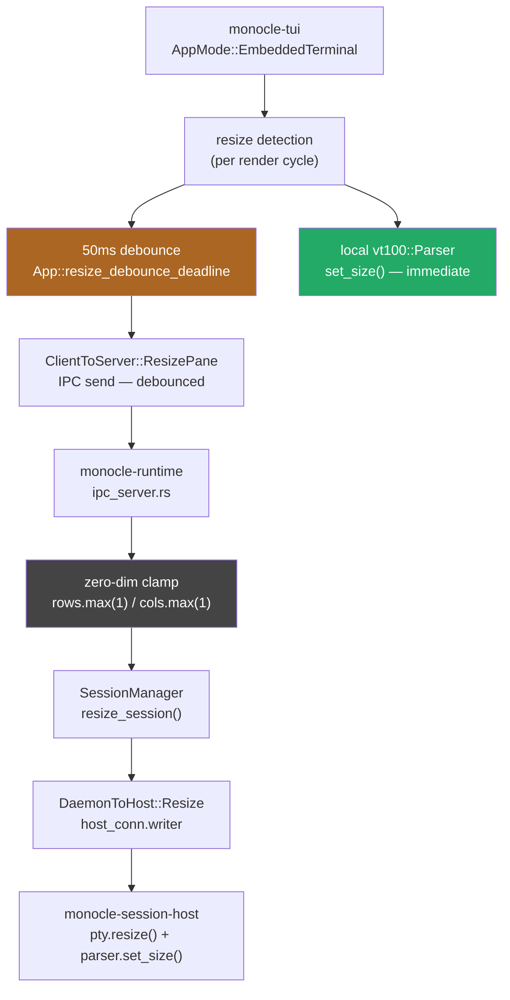
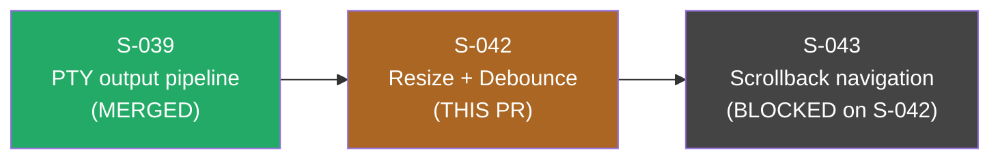
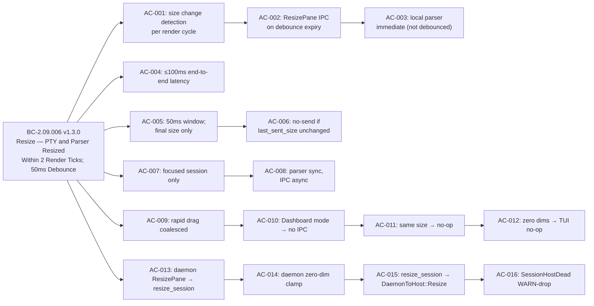

## S-042: PTY Resize Detection, 50ms Debounce, ResizePane IPC (Full End-to-End)

**Story:** S-042 | **Epic:** EPIC-09 | **Wave:** 9 | **Points:** 8 | **Priority:** P0

Implements the complete PTY resize pipeline for monocle's `EmbeddedTerminal` mode — from
pane-area detection in the TUI render loop, through 50ms debounce, `ClientToServer::ResizePane`
IPC, daemon dispatch arm, `SessionManager::resize_session()`, `DaemonToHost::Resize` forwarding,
and session-host `pty.resize()` + `parser.set_size()`. **All 16 acceptance criteria across the
full end-to-end pipeline are implemented and covered by 32 behavioral tests.**

---

## D-344 Scope-Expansion Ruling

**Human ruling 2026-06-21:** S-042 owns the FULL end-to-end resize pipeline. S-047 no longer
owns `ResizePane` dispatch or `resize_session()`.

The split-ownership design was architecturally unsound for two reasons:

1. `ClientToServer` has no `#[non_exhaustive]` attribute and no wildcard arm — adding
   `ResizePane` to the enum without a matching arm in `ipc_server.rs` is a **compile error**.
2. S-047 is `status: draft`, Wave 8, with undelivered deps (S-046 ← S-032). Shipping S-042 with
   `resize_session()` as `todo!()` would introduce a live panic path on every resize event.

Both facts make split ownership non-production-grade. S-042 owns the full pipeline per the
canonical production-grade default.

---

## Architecture Changes

**Files modified:**

| File | Change |
|------|--------|
| `crates/monocle-tui/src/app.rs` | `App::last_sent_size`, `App::resize_debounce_deadline` fields; resize detection + debounce logic; state cleared on EmbeddedTerminal exit |
| `crates/monocle-tui/src/ui/embedded_terminal.rs` | Expose pane `Rect` to post-render resize detection |
| `crates/monocle-ipc/src/lib.rs` | `ClientToServer::ResizePane { session_id, rows, cols }` variant |
| `crates/monocle-runtime/src/ipc_server.rs` | `ResizePane` dispatch arm + `handle_resize_pane()` with zero-dim clamp, WARN-drop |
| `crates/monocle-runtime/src/session_manager/mod.rs` | `resize_session()` — replaces `todo!()` stub with full implementation |
| `crates/monocle-session-host/src/main.rs` | `DaemonToHost::Resize` arm: `pty.resize()` + `parser.set_size()` |

---

## Story Dependencies

- `depends_on: [S-039]` — S-039 provides `App::pty_parsers`, `AppMode::EmbeddedTerminal`, render loop
- `blocks: [S-043]` — S-043 AC-009 requires the `pty_scroll_offsets[id]=0` reset on resize owned by S-042

---

## Spec Traceability (BC-2.09.006 v1.3.0)

---

## Test Evidence

**Total: 32 behavioral tests, 0 failures** (confirmed via `cargo test --workspace` in worktree)

| File | Suite | Tests | ACs Covered |
|------|-------|------:|-------------|
| `crates/monocle-tui/tests/bc_2_09_006_resize_debounce.rs` | TUI debounce unit | 13 | AC-001..012 |
| `crates/monocle-tui/tests/bc_2_09_006_poll_timeout_seam.rs` | Poll timeout seam | 2 | AC-004 |
| `crates/monocle-tui/tests/bc_2_09_006_run_loop_wiring.rs` | Run-loop anti-dead-code | 6 | AC-001/002/006/007/010 |
| `crates/monocle-runtime/tests/bc_2_09_006_daemon_resize.rs` | Daemon resize pipeline | 9 | AC-013..016 |
| `crates/monocle-session-host/tests/bc_2_09_006_session_host.rs` | Session-host resize | 2 | AC-015/016 |

Key test cases:
- `test_BC_2_09_006_resize_sends_resizepane_after_50ms` — tokio::time::pause; 49ms → no IPC; +1ms → ResizePane sent
- `test_BC_2_09_006_local_parser_resized_immediately` — parser updated before debounce fires
- `test_BC_2_09_006_rapid_resize_coalesced` — 3 intermediate sizes → 1 ResizePane for final size
- `test_BC_2_09_006_handler_zero_dim_rows_clamp_no_error` — rows:0 clamped to 1, WARN emitted, no ServerToClient::Error
- `test_BC_2_09_006_run_loop_tick_fires_resizepane_without_check_call` — anti-dead-code: ResizePane fires from loop without explicit external call

---

## Adversarial Convergence Summary

9 adversarial passes, 3 consecutive CLEAN (passes 7, 8, 9). Convergence met.

| Pass | Status | Key Findings |
|------|--------|--------------|
| 1 | FINDINGS | Missing run-loop wiring test (dead-code risk); poll timeout not bounded by debounce deadline |
| 2 | FINDINGS | OBS-001: stale doc-comment on tick_resize_debounce; OBS-002: misleading test comment |
| 3 | FINDINGS | F-S042-MED-001: resize_aware_poll_timeout pure helper not extracted; run_loop called std::cmp::min ad-hoc |
| 4 | FINDINGS | Additional run-loop wiring test needed for overlay transition |
| 5 | FINDINGS | Session-host test coverage for DaemonToHost::Resize insufficient |
| 6 | FINDINGS | daemon zero-dim clamp: cols=0 path not independently tested |
| 7 | CLEAN | — |
| 8 | CLEAN | — |
| 9 | CLEAN | — |

All pre-convergence findings were fixed in-worktree before adversarial passes 7–9.

---

## Demo Evidence

Location: `docs/demo-evidence/S-042/`

| Recording | Acceptance Criteria | Tests |
|-----------|--------------------:|------:|
| `AC-001-resize-debounce-unit-tests.webm` | AC-001..012 | 15 |
| `AC-002-run-loop-wiring-tests.webm` | AC-001/002/006/007/010 | 6 |
| `AC-003-daemon-resize-pipeline-tests.webm` | AC-013..016 | 9 |

Format: WEBM (Wave 9 policy; no GIF). Font: FiraCode Nerd Font Mono. VHS 0.11.0.

---

## Security Review

**Verdict: PASS** (post-fix, commit 4865ffe)

| ID | Severity | Description | Status |
|----|----------|-------------|--------|
| SEC-001 | IMPORTANT (CWE-749) | `handle_resize_pane_pub` missing `#[cfg(any(test, feature = "test-utils"))]` — test seam exposed in production ABI | FIXED |
| SEC-002 | LOW (CWE-190) | `resize_msg.len() as u32` unchecked cast — replaced with `u32::try_from(...).map_err(...)` | FIXED |
| SEC-003 | LOW (CWE-532) | WARN log emitting unvalidated client `session_id` before UUID check — pre-validation guard added | FIXED |

No CRITICAL or HIGH findings. All WARN-drop error paths correctly implement BC-2.05.010 Invariant 6 (ResizePane carve-out).

---

## Risk Assessment

**Blast radius:** Medium — touches 6 files across 4 crates (monocle-tui, monocle-ipc, monocle-runtime, monocle-session-host). The `ClientToServer::ResizePane` variant was absent before this PR; adding it completes an exhaustive match. All error paths WARN-drop per the ResizePane carve-out (BC-2.05.010 Invariant 6).

**Performance impact:** Negligible — debounce timer is a single `Option<Instant>` comparison per render tick. IPC send is bounded at 1 per 50ms window per focused session.

**Rollback safety:** No database migrations. No config format changes. The new IPC variant is additive — existing message handling is unchanged.

---

## AI Pipeline Metadata

| Field | Value |
|-------|-------|
| Pipeline mode | greenfield-with-reference-ingest (Wave 9) |
| Story version | S-042 v1.5 |
| BC version | BC-2.09.006 v1.3.0 |
| Adversarial passes | 9 (3 consecutive CLEAN) |
| Test count | 32 behavioral tests |
| factory-artifacts SHA | 15d567a |

---

## Pre-Merge Checklist

- [x] PR description populated with structured sections and mermaid diagrams
- [x] Demo evidence present: `docs/demo-evidence/S-042/evidence-report.md` (3 WEBMs)
- [x] `cargo build --workspace` — PASS
- [x] `cargo test --workspace` — PASS (32 new tests; 2 known B002 binary flakes excluded)
- [x] `cargo clippy --workspace --all-targets -- -D warnings` — PASS
- [x] `cargo fmt --all -- --check` — PASS
- [x] `python3 scripts/check_version_pins.py` (POL-11) — PASS (343 active pins current)
- [x] `python3 scripts/check_structural_claims.py` (POL-12) — PASS
- [ ] Security review — pending
- [ ] pr-reviewer approval — pending
- [ ] All 11 CI checks green — pending
- [ ] Dependency check: S-039 merged (PASS — d230a26 on develop)
