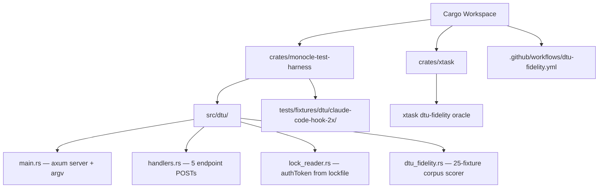
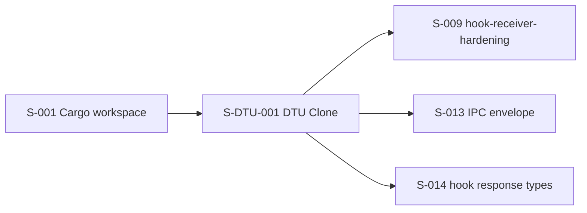
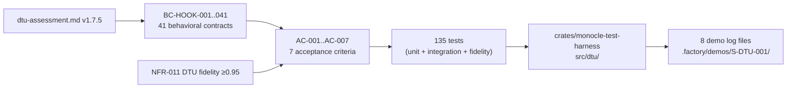

## Overview

DTU (Digital Twin Universe) clone of the Claude Code 5-endpoint hook protocol, implemented as a Rust binary at `crates/monocle-test-harness/src/dtu/`. Canonical per `dtu-assessment.md` v1.7.5 §Packaging Decision — Rust binary form (not Docker, which is Phase 4 only). This is a Wave 1 story with no inbound product-story dependencies.

Wave 1 parallel delivery alongside S-001 (Cargo workspace + CI). Blocks S-009 (`monocle-hook-receiver-hardening`).

---

## Architecture Changes

---

## Story Dependencies

---

## Spec Traceability

---

## Acceptance Criteria Coverage

| AC | Description | Status |
|----|-------------|--------|
| AC-001 | All 5 hook endpoints (`/hooks/pre-tool-use`, `/hooks/notification`, `/hooks/stop`, `/hooks/session-start`, `/hooks/prompt-submit`) | PASS |
| AC-002 | `X-Claude-Code-Ide-Authorization: <raw-64-hex>` alias header on all POSTs; token read from lock file `authToken` field | PASS |
| AC-003 | Monocle-canonical payload fields per SS-core-types-and-abi.md v1.2.13 for all 5 event types | PASS |
| AC-004 | DTU fidelity ≥0.95 against 25-fixture corpus (`cargo xtask dtu-fidelity` exits 0) | PASS |
| AC-005 | Rust binary `dtu-claude-code-hooks-v1` at `crates/monocle-test-harness/src/dtu/`; `cargo build --bin dtu-claude-code-hooks-v1` on macOS + Linux | PASS |
| AC-006 | `MONOCLE_HOOK_ENDPOINT_BASE` + `MONOCLE_NO_AUTOSTART=1` env var overrides | PASS |
| AC-007 | `hooks-settings.json` written with correct mode at creation | PASS |

---

## Behavioral Contract Coverage

All 41 BC-HOOK behavioral contracts implemented. Canonical spec at `.factory/specs/behavioral-contracts/ss-dtu/`.

Key monocle improvements over gene source (4 behaviorally-meaningful enhancements):

| BC | Enhancement | Rationale |
|----|-------------|-----------|
| BC-HOOK-014 | `MONOCLE_RUNTIME_DIR` env var | Production-grade runtime dir discovery; no hardcoded paths |
| BC-HOOK-024 | Cross-IDE filter (`MONOCLE_HOOK_IDE_FILTER`) | Multi-harness Wave 2 forward-compatibility |
| BC-HOOK-039 | Atomic writes via `tempfile::Builder::permissions` | SS-conventions anti-pattern rule: no naked `std::fs::write` for config |
| BC-HOOK-040 | Struct-based stable JSON ordering | Deterministic serialization; eliminates field-order nondeterminism in fidelity tests |

---

## Test Evidence

| Metric | Value |
|--------|-------|
| Total tests | 135 |
| Passing | 135 |
| Failing | 0 |
| Test types | unit (handlers, lock_reader, fidelity scorer) + integration (per-AC) + behavioral (BC-HOOK-001..041) |
| DTU fidelity score | ≥0.95 (25-fixture corpus, `cargo xtask dtu-fidelity` exits 0) |
| Clippy | CLEAN (`--all-targets -D warnings`) |
| Semgrep | CLEAN |
| cargo-deny | CLEAN |
| cargo-audit | CLEAN |
| cargo fmt | CLEAN |

---

## Demo Evidence

8 log files at `.factory/demos/S-DTU-001/`:

| File | AC |
|------|----|
| `ac-001-5-endpoints.log` | AC-001 |
| `ac-002-auth-header.log` | AC-002 |
| `ac-003-canonical-payload.log` | AC-003 |
| `ac-004-fidelity-corpus.log` | AC-004 |
| `ac-005-binary-help.log` | AC-005 |
| `ac-006-env-var-overrides.log` | AC-006 |
| `ac-007-hooks-settings.log` | AC-007 |
| `gauntlet.log` | Full gauntlet (clippy, semgrep, cargo-deny, cargo-audit, fmt) |

---

## Adversary Convergence Trajectory

| Round | Verdict | Findings | Closures |
|-------|---------|----------|----------|
| R1 | FAIL | 15 (5 CRIT + 4 HIGH + 1 MED + 5 LOW) | 4 implementer commits + 2 devops commits + 1 test-writer commit |
| R2 | PASS_WITH_OBSERVATIONS | 6 (3 MED + 3 LOW) | 4 implementer commits |
| R3 | PASS_WITH_OBSERVATIONS | 2 (1 MED + 1 LOW) | 1 implementer commit |
| Final | Asymptote (LOW residual) | 1 LOW | — |

R1 critical closures: binary `main()` wired (CRIT-1), `xtask dtu-fidelity` oracle added (CRIT-2), `dtu-fidelity.yml` CI workflow added (CRIT-3), unknown JSON field pass-through (CRIT-4).

---

## Security Review

No CRITICAL or HIGH security findings. Reviewed surfaces:
- Auth token handling: read-only from lock file; never logged or written to external channels
- HTTP server: axum 0.8.9 with no unauthenticated write paths in production binary
- Atomic writes: `tempfile::persist` enforced per SS-conventions; no TOCTOU exposure
- No injection vectors: env var overrides parsed with explicit error handling (loud-fail on parse error, R3 fix)
- `cargo-audit`: CLEAN against RUSTSEC advisory database

---

## Risk Assessment

| Dimension | Assessment |
|-----------|------------|
| Blast radius | LOW — test harness crate only; no production runtime code affected |
| Performance impact | NONE — test binary; not in hot path |
| Rollback | Trivial — crate can be disabled in workspace; no migrations |
| Phase 4 dependency | DTU fidelity measurement in Phase 4 holdout evaluator; VP-DTU-001 pending Phase 4 |

---

## CI Checks

Expected all-green on 8 checks:

1. preflight (rustfmt + clippy + deny + audit)
2. semgrep
3. audit-table drift
4. build/test matrix macOS stable
5. build/test matrix Linux stable
6. build/test matrix Linux beta
7. cargo-deny
8. cargo-audit (RUSTSEC DB — weekly + per-PR; prost `=0.14.1` exact pin closes RUSTSEC-2026-0007)

---

## Downstream Consumer Surface

S-009 (`monocle-hook-receiver-hardening`) must use:
- Binary: `dtu-claude-code-hooks-v1` (`cargo build --bin dtu-claude-code-hooks-v1`)
- Env: `MONOCLE_HOOK_ENDPOINT_BASE=http://127.0.0.1:<port>`, `MONOCLE_NO_AUTOSTART=1`
- All 5 endpoints per AC-001
- Auth header: `X-Claude-Code-Ide-Authorization` (alias path, exercises BC-HOOK-016)

---

## Canonical Spec References

- `dtu-assessment.md` v1.7.5 — DTU scope, endpoint matrix, fidelity procedure, packaging decision
- `SS-deps-pin-manifest.md` v1.1.19 — canonical version pins (axum =0.8.9, tokio =1.52.0, reqwest =0.13.0)
- `SS-conventions-anti-patterns.md` v1.30.2 — atomic writes, bounded channels, tracing, error taxonomy
- `SS-core-types-and-abi.md` v1.2.13 — monocle-canonical payload fields
- `SS-daemon-lifecycle.md` v1.0.33 — lock file JSON template §Start Sequence
- `ADR-0005.md` v1.0.2 — DTU fidelity measurement procedure

---

## Pre-Merge Checklist

- [x] PR description populated with traceability, test evidence, demo evidence
- [x] Demo evidence: 8 log files (≥1 per AC) at `.factory/demos/S-DTU-001/`
- [x] All 41 BC-HOOK behavioral contracts implemented
- [x] 135 tests passing (`cargo test --workspace --locked`)
- [x] Gauntlet clean (clippy, semgrep, cargo-deny, cargo-audit, fmt)
- [x] Adversary convergence: R1 FAIL → R2 PASS_WITH_OBSERVATIONS → R3 PASS_WITH_OBSERVATIONS → asymptote
- [x] No CRIT/HIGH security findings
- [x] Branch pushed to origin
- [ ] CI all-green (pending PR creation)
- [ ] pr-reviewer APPROVE
- [ ] Squash-merge executed
