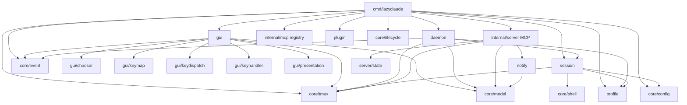

# Pass 0 — Project Discovery: any-context/lazyclaude

**Repo:** `github.com/any-context/lazyclaude` @ branch `stg`, HEAD `4516c004a12ace88bc488c76718182a1bb4a4eca`
**Path:** `/Users/jmagady/Dev/monocle/.reference/any-context-lazyclaude/`
**Top-level commit subject:** "merge: Session Profile Selection feature"

## Tech Stack

- **Language:** Go 1.25 (go.mod:3)
- **Module:** `github.com/any-context/lazyclaude` (go.mod:1)
- **Build:** Makefile + goreleaser, `make build` ldflags inject `main.version` + `main.commit` (Makefile:1-9)
- **Test:** stdlib `testing` + `stretchr/testify v1.11.1` + `go.uber.org/goleak v1.3.0` for goroutine leak detection (go.mod:15-16)
- **CLI framework:** `github.com/spf13/cobra v1.10.2` (go.mod:14)
- **TUI:** `github.com/jesseduffield/gocui v0.3.1-0.20260308162933-5e45e57b5564`, locally forked via `replace` to `./third_party/gocui` (go.mod:5, 13)
- **Terminal:** `github.com/gdamore/tcell/v2 v2.13.5`, locally forked via `replace` to `./third_party/tcell` (go.mod:7, 34)
- **WebSocket:** `nhooyr.io/websocket v1.8.17` for MCP protocol transport (go.mod:18)
- **UUID:** `github.com/google/uuid v1.6.0` (go.mod:12)
- **Terminal sizing:** `golang.org/x/term v0.38.0` (go.mod:17)
- **PTY testing:** `ActiveState/termtest`, `ActiveState/vt10x` for terminal emulation in tests (go.mod:10, 25-26)
- **Style/ANSI:** `charmbracelet/x/ansi v0.11.6` (go.mod:11)
- **External runtime deps:** `tmux >= 3.4` (for `display-popup -b rounded`), `claude` CLI binary, optional `lazygit` (README.md:99-101)
- **E2E:** VHS tape recording inside Docker (`make test-vhs TAPE=<name>`); not run on host (Makefile:21-24, .claude/CLAUDE.md docker block)

## File Inventory (Recount)

Source: `find /Users/jmagady/Dev/monocle/.reference/any-context-lazyclaude ...`

| Bucket | Count / LOC |
|---|---|
| Total files | 470 |
| Total size | 7.0M |
| `.go` files (incl. third_party + tests) | 362 |
| `_test.go` files | 119 |
| `cmd/` total LOC (Go) | 6056 |
| `internal/` total LOC (Go) | 46073 |
| `internal/daemon/` LOC | 9153 |
| `internal/gui/` LOC | 18276 |
| `internal/session/` LOC | 5692 |
| `internal/server/` LOC | 5525 |
| `internal/core/` LOC | 3191 |
| `internal/mcp/` LOC | 1708 |
| `internal/plugin/` LOC | 1223 |
| `internal/profile/` LOC | 727 |
| `internal/adapter/tmuxadapter/` LOC | 420 |
| `internal/notify/` LOC | 158 |

Test density: 119 / 362 = 33% test files (counting `_test.go` separately).

## Top-Level Directory Map

```
/                          Repo root
├── cmd/lazyclaude/         CLI entry (cobra root + subcommands)
├── cmd/mock-claude-client/ Test harness binary for hook protocol
├── internal/core/          Reusable primitives (no domain knowledge)
│   ├── choice/             Tool-approval Accept/Allow/Reject enum
│   ├── config/             Path + hook injection config
│   ├── debuglog/           Debug logging sink
│   ├── event/              Generic pub/sub broker
│   ├── lifecycle/          LIFO cleanup registry
│   ├── model/              Notification event types (cross-cutting)
│   ├── shell/              Shell quoting utilities
│   └── tmux/               tmux client (exec + control mode + pidwalk)
├── internal/adapter/tmuxadapter/  Sendkeys + detection adapter atop core/tmux
├── internal/session/       Session/project/worktree manager + store + GC
├── internal/profile/       Claude launch profiles ($HOME/.lazyclaude/config.json)
├── internal/server/        MCP (Model Context Protocol) server — IDE auto-discovery
│                           handlers: /notify, /stop, /session-start, /prompt-submit,
│                                     /msg/send, /msg/create, /msg/sessions
├── internal/daemon/        HTTP+SSE daemon for remote (SSH) hosts
│                           handlers: /session/*, /worktree/*, /msg/*, /profiles,
│                                     /cwd, /health, /shutdown, /notifications (SSE)
│                           Also: askpass, SSH executor, reverse tunnel, mirror,
│                           composite/remote providers, lifecycle, capture/preview
├── internal/mcp/           Claude Code MCP server registry manager (~/.claude.json)
├── internal/plugin/        Claude Code plugin manager (wraps `claude plugins` CLI)
├── internal/notify/        ToolNotification on-disk queue (runtime dir)
├── internal/gui/           gocui TUI (App, popup controller, fullscreen, scroll,
│                           preview, render, presentation/diff/mcp/plugins/tool,
│                           keymap, keyhandler, keydispatch, chooser)
├── lazyclaude.tmux         tmux plugin entry (TPM-compatible)
├── scripts/                lazyclaude-launch.sh (display-popup invoker)
├── .lazyclaude/prompts/    PM + Worker system prompt templates (PM/Worker subsystem)
├── prompts/                (separate from .lazyclaude/prompts — top-level prompt dir;
│                           layer 2 in resolvePrompt — see session/resolve_prompt_test.go)
├── tests/testdata/         Test fixtures
├── third_party/gocui/      Forked gocui (paste aggregation, rawEvents pipeline)
├── third_party/tcell/      Forked tcell (build-files-only; patches in LAZYCLAUDE_PATCHES.md)
├── vis_e2e_tests/          VHS tape E2E test harness (Docker)
├── docs/                   CODEMAPS, dev/, images/, README artifacts
├── .goreleaser.yml         Release build matrix (darwin/linux × amd64/arm64)
├── Makefile                build/test/test-vhs/readme-gif/lint/install
└── install.sh              Quick-install script (binary download)
```

## Entry Points

| Entry | File | Purpose |
|---|---|---|
| `main` (TUI binary) | cmd/lazyclaude/main.go:13 | `newRootCmd().Execute()` |
| Cobra root `lazyclaude` | cmd/lazyclaude/root.go:31 | TUI launcher (default RunE) |
| `lazyclaude server` | cmd/lazyclaude/server.go | Standalone MCP server subprocess |
| `lazyclaude setup` | cmd/lazyclaude/setup.go | Ensure MCP + write hooks settings |
| `lazyclaude sessions` | cmd/lazyclaude/sessions.go:14 | List sessions via MCP server `/msg/sessions` |
| `lazyclaude sessions resume` | cmd/lazyclaude/sessions.go:54 | Resume session by ID |
| `lazyclaude msg send <id> <body>` | cmd/lazyclaude/msg.go:32 | POST `/msg/send` via MCP client |
| `lazyclaude msg create` | cmd/lazyclaude/msg.go:73 | POST `/msg/create` (worker/local) |
| `lazyclaude daemon` | cmd/lazyclaude/daemon_cmd.go | Run remote-host HTTP daemon |
| `lazyclaude askpass` | cmd/lazyclaude/askpass.go | SSH_ASKPASS helper subprocess |
| `lazyclaude profile list` | cmd/lazyclaude/profile.go | List profiles from config.json |
| TPM plugin shell | lazyclaude.tmux | Bind `C-\` and run `lazyclaude setup` |
| Launcher script | scripts/lazyclaude-launch.sh | tmux `display-popup` invoker |
| `cmd/mock-claude-client` | cmd/mock-claude-client/main.go | Mock MCP client for hook protocol tests |

The CLI is structured around **one binary, many subcommands**, all wired in `cmd/lazyclaude/root.go:383-389`:

```go
cmd.AddCommand(newServerCmd())
cmd.AddCommand(newSetupCmd())
cmd.AddCommand(newSessionsCmd())
cmd.AddCommand(newMsgCmd())
cmd.AddCommand(newDaemonCmd())
cmd.AddCommand(newAskpassCmd())
cmd.AddCommand(newProfileCmd())
```

## Configuration & Runtime Paths

From `internal/core/config/` and references throughout:

| Path | Purpose |
|---|---|
| `~/.local/share/lazyclaude/state.json` | Session/project store (read by daemon fallback in handler_msg.go:449) |
| `~/.lazyclaude/config.json` | User-defined `claude` launch profiles (root.go:88, daemon/server.go:641) |
| `~/.lazyclaude/prompts/*` | Layer-3 prompt overrides (session/resolve_prompt_test.go) |
| `/tmp/lazyclaude/` | Process runtime dir (ensured on root.go:52) |
| `/tmp/lazyclaude/debug.log` | Default `--debug` log destination (root.go:56) |
| `/tmp/lazyclaude/server.log` | In-process MCP server log (root.go:416) |
| `/tmp/lazyclaude-$USER/...` | Daemon runtime dir (daemon/server.go:36 `RuntimeDir`) |
| `~/.claude/ide/*.lock` | MCP server discovery lock files (config/hooks.go:14) |
| `~/.claude.json` | Claude Code config (read by mcp.Manager; onboarding setup) |
| `<runtimeDir>/hooks-settings.json` | Generated Claude Code hooks settings (config/hooks.go:70) |
| `<runtimeDir>/daemon.json` | Daemon port + token + PID (daemon/server.go:766) |
| `<runtimeDir>/askpass.sock` | Askpass UDS endpoint |
| `<runtimeDir>/askpass.sh` | Askpass wrapper script written by askpass server |

## tmux Topology

From `.claude/CLAUDE.md` (`tmux architecture`) and README.md:208-228:

- **Two distinct tmux servers, distinguished by socket name:**
  - User's tmux: default socket, hosts the lazyclaude TUI popup via `display-popup`.
  - lazyclaude tmux: socket `-L lazyclaude`, hosts Claude Code session windows (one window per session).
- The TUI process attaches a **control mode** client to the lazyclaude socket for event-driven refresh (`tmux -C -L lazyclaude attach-session -t lazyclaude`, internal/core/tmux/control.go:90-98). Output events trigger preview refresh; the connection dies when all windows are deleted, so `controlManager.ensureConnected()` reconnects on tick (root.go:368-373).
- Two `tmux -L` invocations exist: `tmux` for the user's tmux server, `tmux -L lazyclaude` for the Claude session server (lazyclaude.tmux:53-54).

## Dependency Graph (Module-Level)



## Build & Release

- `make build` → `bin/lazyclaude` with `-s -w` strip and version/commit injection (Makefile:8-9)
- `make test` → `go test -race -cover ./...` (Makefile:11-12)
- `make test-unit` → `go test -race -cover ./internal/...` (Makefile:14-15)
- `make test-vhs TAPE=<name>` → Docker-based visual E2E via VHS (Makefile:21-24)
- `make readme-gif` → Regenerates `docs/images/hero.gif` (Makefile:27-32)
- `make lint` → `golangci-lint run ./...` (Makefile:34-35)
- `make install PREFIX=...` → Installs binary to `$(PREFIX)/bin/lazyclaude` (Makefile:39-41)
- `.goreleaser.yml` builds matrix darwin/linux × amd64/arm64, archives as tar.gz, generates checksums

## Subsystem Manifest (Cross-Reference Index)

Indexed by orienting-prompt subsystem heading. **PM/Worker = "PMW" (low-priority depth).** **monocle-relevant = "M+".**

| Subsystem | Primary files | Pass coverage |
|---|---|---|
| **CLI root** | cmd/lazyclaude/{main,root}.go | Pass 0/1 (M+) |
| **CLI: daemon** | cmd/lazyclaude/daemon_cmd.go (126 LOC) | Pass 1 (M+) |
| **CLI: sessions** | cmd/lazyclaude/sessions.go (119 LOC) | Pass 1 (M+) |
| **CLI: msg** | cmd/lazyclaude/msg.go (126 LOC) | Pass 1/B (M+ for /msg/send) |
| **CLI: profile** | cmd/lazyclaude/profile.go (153 LOC) | Pass 1 |
| **CLI: setup** | cmd/lazyclaude/setup.go (51 LOC) | Pass 1 (M+) |
| **CLI: askpass** | cmd/lazyclaude/askpass.go (60 LOC) | Pass 1/B (M+) |
| **CLI: mirror** | cmd/lazyclaude/mirror.go + mirror_test.go (226 LOC) | Pass B (M+) |
| **CLI: remote_host** | cmd/lazyclaude/remote_host.go | Pass B (M+) |
| **CLI: gui_adapter, session_command, local_provider** | cmd/lazyclaude/* | Pass B (adapter glue, M+) |
| **core/tmux** | client.go, control.go, exec.go, mock.go, pidwalk.go, types.go | Pass B deep (M+) |
| **core/event** | broker.go (122 LOC) | Pass 1 (M+) |
| **core/config** | config.go, hooks.go | Pass B (hook injection M+) |
| **core/lifecycle** | lifecycle.go (82 LOC) | Pass 1 (M+) |
| **core/{choice,shell,model}** | small primitives | Pass 1 |
| **adapter/tmuxadapter** | sendkeys + detect | Pass B (M+) |
| **daemon** | server.go (784), server_sse.go, askpass.go, ssh.go, tunnel.go, capture_preview.go, composite_provider.go, remote_provider.go, http_client.go, connection*.go, lifecycle.go, paths.go, proc_cwd_*.go | Pass B deep (M+) |
| **gui** | app.go (619), popup_controller.go, fullscreen.go, scroll_state.go, render*.go, preview.go, presentation/*, keymap/*, keydispatch/*, keyhandler/*, layout, popup* | Pass B deep (M+) |
| **session** | manager.go (1127), store.go, gc.go, worktree.go, gitcmd.go, launchspec.go, project.go, role.go, service.go, resolve_prompt | Pass B deep (M+) |
| **mcp** | mcp.Manager (claude.json + deny lists) | Pass B (M+ for toggle/MCP server view) |
| **plugin** | wraps `claude plugins` CLI | Pass B (M+ for plugin tab) |
| **profile** | $HOME/.lazyclaude/config.json | Pass B (M+) |
| **notify** | enqueue ToolNotification files | Pass B (M+, fallback path) |
| **server (MCP)** | server.go, handler.go, handler_msg.go (511 LOC), state.go, discover.go, ensure.go, jsonrpc.go, lock.go, client.go | Pass B deep (M+) |
| **PM/Worker subsystem** | .lazyclaude/prompts/{pm,worker}.md, session/role.go, session/worktree.go (PMW), CLI msg create --type worker (PMW + M+ for /msg/create generic surface) | Single Pass B pass (PMW) |
| **tmux plugin** | lazyclaude.tmux + scripts/lazyclaude-launch.sh | Pass 1 (M+) |
| **mock-claude-client** | cmd/mock-claude-client/main.go | Pass B (test harness, M+ for hook protocol verification) |
| **VHS E2E** | vis_e2e_tests/{tapes,scripts}/ | Pass 1/B (verification gaps pass) |

## State Checkpoint

```yaml
pass: 0
status: complete
files_scanned: ~40 (entry points, build files, configs, READMEs)
total_files_indexed: 470
go_files_indexed: 362
test_files_indexed: 119
timestamp: 2026-05-11T17:30:00Z
next_pass: 1
```
