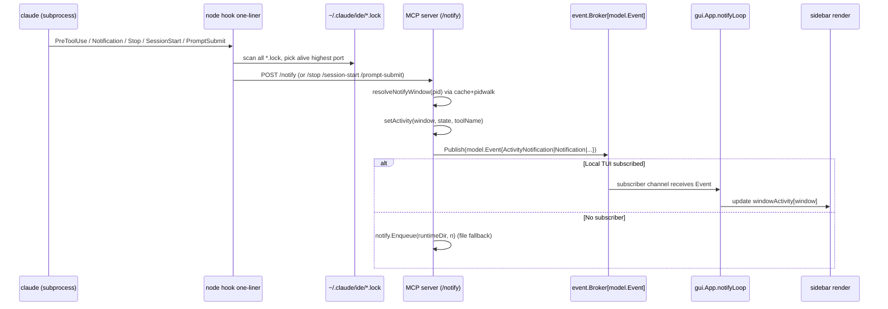
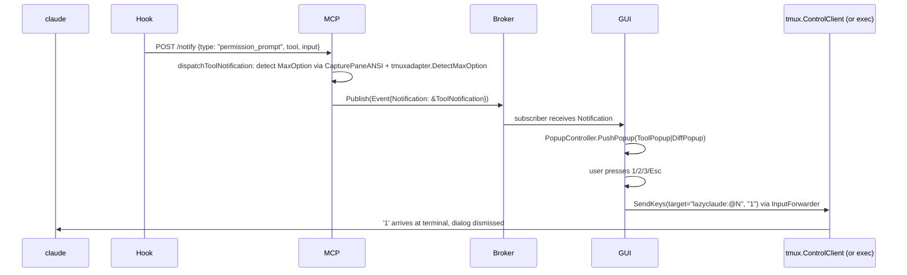

# Pass 1 — Architecture: any-context/lazyclaude

## Component Catalog

### Process Topology (Top-Down)

lazyclaude is **one binary, multiple roles**, selected by subcommand:

| Process | Role | Entry |
|---|---|---|
| `lazyclaude` (no subcommand) | gocui TUI + in-process MCP server | cmd/lazyclaude/root.go:31 |
| `lazyclaude server` | Standalone MCP server | cmd/lazyclaude/server.go |
| `lazyclaude daemon` | Remote-host HTTP+SSE daemon (also starts in-process MCP server) | cmd/lazyclaude/daemon_cmd.go:24 |
| `lazyclaude setup` | One-shot: ensure MCP server + write hooks settings | cmd/lazyclaude/setup.go |
| `lazyclaude askpass` | SSH_ASKPASS helper (talks to TUI via UDS) | cmd/lazyclaude/askpass.go |
| `lazyclaude sessions` / `msg` / `profile` | CLI clients that POST to the MCP server | cmd/lazyclaude/{sessions,msg,profile}.go |
| `tmux -L lazyclaude attach -t lazyclaude` | The Claude Code session tmux server (separate socket) | spawned by session.Manager |
| `claude` (subprocess of tmux window) | The Claude Code agent | hooks file injected via `--settings` |
| Subprocess hooks (`node -e ...`) | Hook commands that POST to MCP server | core/config/hooks.go:31-44 |
| `ssh` (subprocess) | Reverse SSH tunnel + interactive attach + scp | internal/daemon/{ssh,tunnel}.go |

The README diagram (README.md:212-228) captures the **steady-state** picture:

```
+---------------------------+       +---------------------------+
|     User's tmux           |       |   lazyclaude tmux (-L)    |
|  (display-popup)          |       |   Claude Code sessions    |
|   +-------------------+   |       |   @0..@N: per-session     |
|   | lazyclaude TUI    |<--+-------+-> windows                  |
|   |  + in-process     |   |       |                           |
|   |  MCP server       |   |       +---------------------------+
|   |  127.0.0.1:<port> |   |
|   +-------------------+   |       Claude Code hooks POST to:
+---------------------------+         /notify, /stop,
                                      /session-start, /prompt-submit
```

### Architectural Layers (Dependency-Direction, Inner → Outer)

```
                        ┌─────────────────────────────────┐
                        │  cmd/lazyclaude  (composition)  │ ← only this layer
                        │  cmd/mock-claude-client         │   wires it all up
                        └────────────────┬────────────────┘
              ┌──────────────────────────┼──────────────────────────┐
              ▼                          ▼                          ▼
      ┌────────────────┐         ┌────────────────┐         ┌────────────────┐
      │ internal/gui   │         │ internal/      │         │ internal/      │
      │ (gocui TUI)    │         │ daemon         │         │ server (MCP)   │
      │ App, popups,   │         │ HTTP+SSE +     │         │ WS + HTTP +    │
      │ fullscreen,    │         │ SSH+tunnel +   │         │ hook endpoints │
      │ presentation   │         │ mirror +       │         │                │
      │                │         │ composite/     │         │                │
      │                │         │ remote prov.   │         │                │
      └────────┬───────┘         └────────┬───────┘         └────────┬───────┘
               └─────────────┐ ┌──────────┴──────────┐ ┌─────────────┘
                             ▼ ▼                     ▼ ▼
                  ┌────────────────────┐ ┌─────────────────────────┐
                  │ internal/session   │ │ internal/{mcp,plugin,   │
                  │ Manager, Store,    │ │  profile,notify}        │
                  │ GC, Worktree, Role │ │ (cross-cutting domain   │
                  │                    │ │  managers + on-disk)    │
                  └─────────┬──────────┘ └────────────┬────────────┘
                            └──────┬──────┬───────────┘
                                   ▼      ▼
                  ┌────────────────────┐  ┌──────────────────────────┐
                  │ internal/adapter/  │  │ internal/core/           │
                  │ tmuxadapter        │  │ tmux, event, lifecycle,  │
                  │ (sendkeys+detect)  │  │ config, choice, model,   │
                  │                    │  │ shell, debuglog          │
                  └────────────────────┘  └──────────────────────────┘
```

**Direction:** inner packages know nothing about outer. `internal/core` has no domain knowledge (it is reusable primitives). `internal/session` is the domain core but is consumed by both `gui` and `daemon`. There is no cyclic dependency.

**Composition rule (verified):** `cmd/lazyclaude/root.go` is the ONLY file that imports `gui`, `daemon`, `server`, `mcp`, `plugin`, `profile`, and `session` together (root.go:15-28). Subcommands (daemon_cmd.go, msg.go) compose narrower subsets.

### Per-Package Responsibility Matrix

| Package | Responsibility | Public Surface |
|---|---|---|
| `internal/core/event` | Generic typed pub/sub broker, non-blocking, drop-on-full (broker.go:60-75) | `Broker[T]`, `Subscribe(bufSize)`, `Publish(event)`, `Close()` |
| `internal/core/lifecycle` | LIFO cleanup registry, panic-tolerant (lifecycle.go:75-82) | `Register(name, fn)`, `Close()` |
| `internal/core/tmux` | tmux abstraction — exec adapter (one subprocess per cmd), control mode (persistent connection), pidwalk (PID→window), mock | `Client` interface, `NewExecClient(WithSocket)`, `NewControlClient`, `FindWindowForPid` |
| `internal/core/config` | Default paths + Claude Code hook command generation (node-eval one-liners with lock-file scanning) | `DefaultPaths()`, `WriteHooksSettingsFile(runtimeDir)` |
| `internal/core/model` | Cross-cutting event types: `ActivityState`, `ToolNotification`, `StopNotification`, `SessionStartNotification`, `PromptSubmitNotification`, `ActivityNotification`, `Event` discriminated-union | model.go types |
| `internal/core/{choice,shell,debuglog}` | Tool-approval enum, shell quoting, debug log sink | `Choice`, `shell.Quote`, `debuglog` |
| `internal/adapter/tmuxadapter` | High-level send-keys + permission-prompt MaxOption detection on top of `core/tmux` | `DetectMaxOption(content) int` (referenced server.go:497) |
| `internal/notify` | On-disk ToolNotification queue (FIFO files in runtimeDir, polled by GUI when broker not subscribed) | `Enqueue(dir, notif)`, `ReadAll(dir)`, `ClearAll(dir)` |
| `internal/session` | **Domain core.** Session/Project/Worktree model, store, manager (CRUD + tmux sync), GC, role (PM/Worker), launchspec (claude args), worktree (git worktree), gitcmd | `Manager`, `Store`, `Session`, `Project`, `WorkerOpts`, `WorktreeOpts`, `PMOpts`, `ResumeOpts`, `NewGC`, `WindowName()`, `TmuxTarget()` |
| `internal/profile` | $HOME/.lazyclaude/config.json reader: ProfileDef[], ResolveDefault, BuiltinDefault | `Load`, `ProfileDef`, `ResolveDefault`, `BuiltinDefault`, `BuiltinDefaultName` |
| `internal/server` | **MCP server** — Claude Code's IDE protocol over WebSocket + HTTP hook endpoints. State tracks per-connection PID→window. Activity map keyed by tmux window. Discovery via ~/.claude/ide/*.lock | `Server`, `Config`, `New`, `WithBroker`, `SetSessionLister`, `SetSessionCreator`, hook endpoints `/notify`, `/stop`, `/session-start`, `/prompt-submit`; msg endpoints `/msg/send`, `/msg/create`, `/msg/resume`, `/msg/sessions`; `DiscoverServer`, `EnsureServer`, `IsAlive`, `StopDaemon`, `NewClient`, `NewLockManager` |
| `internal/daemon` | **Remote daemon** — HTTP daemon for SSH-remote hosts. Wraps session.Manager as REST + SSE. Also: askpass server, SSH/scp executor, reverse tunnel, mirror windows, composite/remote providers | `DaemonServer`, `NewDaemonServer`, `RemoteConnection`, `LifecycleManager`, `HTTPClient`, `CompositeProvider`, `RemoteProvider`, `AskpassServer`, `Tunnel`, `ExecSSHExecutor` |
| `internal/mcp` | Reads `~/.claude.json` + project-level MCP deny lists; toggles server enabled/disabled. SSH-aware (can target remote ~/.claude.json) | `Manager`, `Refresh`, `Servers`, `ToggleDenied`, `SetRemote(host, projectDir)` |
| `internal/plugin` | Wraps `claude plugins` CLI for install/uninstall/enable/disable (project scope only by default) | `Manager`, `NewExecCLI`, `Refresh`, `Installed`, `Available`, `Install`, `Uninstall`, `ToggleEnabled`, `Update` |
| `internal/gui` | **gocui TUI.** App is the root; PopupController, FullScreenState, ScrollState manage modal state; PreviewCache + render*.go produce frames; presentation/ does syntax-highlighted diff/tool/mcp/plugins; keymap/keydispatch/keyhandler implement layered key routing | `App`, `NewApp(mode)`, `AppMode`, `SessionProvider` (consumed), `PopupManager`, `Popup`, `ToolPopup`, `DiffPopup`, `WindowActivityEntry`, `WorktreeInfo`, `ProjectItem`, `SessionItem`, `PluginItem`, `MCPItem` |
| `cmd/lazyclaude` | Composition root + cobra subcommands + adapter glue (sessionListerAdapter, sessionCreatorAdapter, pluginAdapter, mcpAdapter, controlManager, MirrorManager, SessionCommandService, RemoteHostManager, guiCompositeAdapter) | Each subcommand factory `newXxxCmd()` |
| `cmd/mock-claude-client` | Sub-binary that mimics `claude` for hook-protocol E2E testing | main.go |

## Deployment Topology

### Local-Only Mode (default)

Single process: TUI + in-process MCP server. Two tmux servers (user's + lazyclaude's). All Claude Code sessions are local tmux windows on the lazyclaude socket. **Hook flow:** node-one-liner inside claude subprocess → reads `~/.claude/ide/<port>.lock` → POSTs to `127.0.0.1:<port>/notify` → server pushes to `event.Broker[model.Event]` → GUI subscriber receives event in-process (no disk).

### Remote SSH Mode (composite)

The TUI is local; **remote sessions live on remote hosts.** The flow:

```
Local TUI                                       Remote host
─────────                                       ───────────
+--------+                                      +-----------+
|  App   |---HTTP+SSE--reverse-tunnel--ssh -L-->|  Daemon   |
|        |                                      |  (in-proc |
|        |---SSH attach----------------------- >|   MCP)    |
|        |                                      +-----------+
| Mirror |                                            |
| Window |   <-- claude sessions run inside lazyclaude tmux on remote
+--------+        Daemon writes notifications via broker -> SSE
```

- Local `CompositeProvider` (daemon/composite_provider.go) dispatches each session operation to either the local `session.Manager` or the per-host `RemoteProvider`. The route is chosen by Host field on session, project, or pending host (see cmd/lazyclaude/local_provider.go + gui_adapter.go).
- The local `MirrorManager` (cmd/lazyclaude/mirror.go) creates **placeholder tmux windows on the lazyclaude socket** that, on attach, exec `ssh -t … tmux -L lazyclaude … attach`. The mirror is the display surface; the actual claude process runs remotely.
- SSH connection is established via `ExecSSHExecutor` + `Tunnel` (`-L <local>:127.0.0.1:<remote>` with `ExitOnForwardFailure=yes`, `ServerAliveInterval=15`). The remote daemon's port is discovered by parsing the JSON written to stdout from a `ssh <host> lazyclaude daemon` invocation (daemon_cmd.go:102 emits the JSON; daemon/connection_impl.go consumes it).
- `RemoteProvider.StartSSE()` subscribes to `/notifications` on the remote daemon. Events are forwarded to the local broker after `Window` is **remapped** from remote-tmux IDs to local mirror tmux IDs (root.go:822-870 for the two callbacks `resolveActivityWindow` and `rewriteToolNotificationWindow` — this is "Bug 4 / Bug 5 Phase B").
- SSH askpass: local `AskpassServer` listens on `/tmp/lazyclaude-$USER/askpass-<pid>.sock`. The wrapper script is set as `SSH_ASKPASS`. When SSH prompts, the wrapper invokes `lazyclaude askpass`, which dials the socket; the parent process shows a gocui popup, returns the password (askpass.go:182-194; root.go:135-164).

### Daemon-Only Mode (server-side of remote)

`lazyclaude daemon` runs on the remote host. It spawns its own in-process MCP server using the SAME `internal/server` code (daemon_cmd.go:67), so the hook flow on the remote is identical to local mode. The daemon HTTP+SSE layer sits **on top of** session.Manager + event.Broker; the broker is shared with the MCP server so /notifications can forward hook events to remote clients.

## Cross-Cutting Concerns

| Concern | Mechanism |
|---|---|
| **Authn (MCP server)** | Random hex token per server instance; written into `~/.claude/ide/<port>.lock` for hook discovery; constant-time compare on `X-Claude-Code-Ide-Authorization` or fallback `X-Auth-Token` header (server.go:358-363, 371-374) |
| **Authn (daemon)** | Random hex token returned by `daemon.GenerateDaemonToken()`; constant-time compare on `X-Daemon-Authorization` (daemon/server.go:189-195) |
| **Server discovery** | Lock files in `~/.claude/ide/<port>.lock` containing PID, port, authToken; PID-liveness check via `process.kill(pid, 0)`; highest port wins (config/hooks.go:13-20). Restart-resilient: hooks NEVER cache env vars — always rescan lock dir. |
| **Lifecycle / cleanup** | `lifecycle.Lifecycle` LIFO registry. Each long-lived resource (broker, server, GC, askpass, control client, remote connections) calls `lc.Register(name, fn)`. `defer lc.Close()` at top of `RunE` (root.go:41-42). |
| **Pub/Sub** | `event.Broker[model.Event]` — generic type-parameterized. Single instance lives in `cmd/lazyclaude/root.go:104`, injected into server via `server.WithBroker(notifyBroker)` so it survives server restarts. Non-blocking publish drops on full subscriber buffer. |
| **Logging** | `log/slog` for structured logs (session.Manager), stdlib `log` for server (`/tmp/lazyclaude/server.log` with prefix `lazyclaude-srv:`), `core/debuglog` for in-process trace logging. The GUI MUST NOT use `slog.Default()` because it writes to stderr inside the popup and corrupts rendering (per `.claude/CLAUDE.md`). |
| **Error reporting (GUI)** | Errors are scheduled via `app.ScheduleError(err)` which renders them in the gocui error area (root.go:195, 303). Never panic. |
| **Goroutine safety** | sync.Mutex / sync.RWMutex throughout. `go.uber.org/goleak v1.3.0` for leak detection in tests (go.mod:16). Broker explicitly designed for non-blocking publish to prevent backpressure on hook handlers. |
| **Permission popup routing** | `ToolNotification.Window` is the tmux window ID. For LOCAL: window comes from PID-walk on hook (server.go:458-468). For REMOTE: emitted by remote daemon as remote-tmux ID, rewritten to local-mirror tmux ID via `rewriteToolNotificationWindow(store, n, sessionID)` (root.go:861-870) before being buffered. |
| **Hook command shell-safety** | Hook commands are `node -e "..."` one-liners with single-pass JSON parsing and lock-file resolution. `WriteHooksSettingsFile` writes them to `<runtimeDir>/hooks-settings.json` using `SetEscapeHTML(false)` so the `=>` and `{}` in JS survive (config/hooks.go:54-65). |
| **API versioning** | `daemon.APIVersion = 4` (daemon/api.go:25). `/health` reports it; `RemoteConnection` detects mismatch and tags `ConnectionStatus.VersionMismatch=true` (root.go:312-321). |
| **Token-secret leakage avoidance** | URLs never carry tokens (server.go:276 explicitly rejects URL query auth). |

## Data Flow Diagrams

### Activity Event Flow (Hook → Sidebar Icon)



### Remote Session Event Flow

```mermaid
sequenceDiagram
    participant RClaude as remote claude
    participant RHook as remote hook
    participant RMCP as remote MCP /notify
    participant RBroker as remote broker
    participant Daemon as remote daemon /notifications (SSE)
    participant Tunnel as ssh -L tunnel
    participant LClient as local HTTPClient.SubscribeNotifications
    participant RP as RemoteProvider.handleSSEEvent
    participant LBroker as local broker
    participant LGUI as local GUI

    RClaude->>RHook: hook fires
    RHook->>RMCP: POST /notify (same code as local)
    RMCP->>RBroker: Publish(Event)
    RBroker->>Daemon: subscriber on SSE handler
    Daemon->>Daemon: brokerEventToNotification + sessionIDForWindow
    Daemon->>Tunnel: SSE: id, event, data\n\n
    Tunnel->>LClient: bytes
    LClient->>RP: NotificationEvent on ch
    RP->>RP: handleSSEEvent (update cached sessions; call onSSEActivity/onSSEToolInfo)
    RP->>LBroker: forward via root.go callbacks (with window remap to local mirror)
    LBroker->>LGUI: same subscriber path as local
```

### Permission Popup → Choice Delivery (Local)



## Component Architecture (Mermaid)

```mermaid
graph TB
    subgraph "cmd/lazyclaude (composition root)"
        root[root.go RunE]
        daemoncmd[daemon_cmd.go]
        msgcmd[msg.go]
        adapters[gui_adapter.go<br/>local_provider.go<br/>session_command.go<br/>mirror.go<br/>remote_host.go]
    end

    subgraph "gui (TUI)"
        App
        PopupCtrl[PopupController]
        FullScreen[FullScreenState]
        Scroll[ScrollState]
        Render[render*.go]
        Presentation[presentation/]
        Keymap[keymap]
        KeyDisp[keydispatch]
        KeyHand[keyhandler]
        NotifyLoop
    end

    subgraph "daemon"
        DaemonSrv[DaemonServer]
        AskpassSrv
        Tunnel
        SSH[ExecSSHExecutor]
        Mirror[MirrorManager via cmd/lazyclaude]
        Composite[CompositeProvider]
        Remote[RemoteProvider]
        HTTPClient[HTTPClient]
        ConnImpl[connection_impl]
        Lifecycle[daemon LifecycleManager]
        Capture[capture_preview]
    end

    subgraph "server (MCP)"
        Server
        Handler
        State
        LockMgr[LockManager]
        Client[server.Client]
        Discover
        Ensure
        Jsonrpc
    end

    subgraph "session"
        Mgr[Manager]
        Store
        GC
        Worktree
        LaunchSpec
        Role
        Project
        Gitcmd
    end

    subgraph "core"
        Event[event.Broker]
        Lifecycle2[lifecycle.Lifecycle]
        Tmux[core/tmux Client]
        ControlClient
        Exec[Exec adapter]
        Pidwalk
        Config[core/config]
        Hooks[hooks.go]
        Model[core/model]
        Choice
        Shell
    end

    subgraph "other"
        MCP[mcp.Manager<br/>~/.claude.json]
        Plugin[plugin.Manager<br/>claude plugins CLI]
        Profile[profile.Load]
        Notify[notify on-disk queue]
    end

    root --> App
    root --> Server
    root --> Composite
    root --> Mgr
    root --> Event
    root --> Lifecycle2
    root --> AskpassSrv
    root --> ControlClient
    root --> MCP
    root --> Plugin
    root --> Profile

    App --> PopupCtrl
    App --> FullScreen
    App --> Scroll
    App --> Render
    App --> NotifyLoop
    Render --> Presentation
    App --> KeyDisp
    KeyDisp --> KeyHand
    KeyHand --> Keymap

    DaemonSrv --> Mgr
    DaemonSrv --> Event
    DaemonSrv --> Tmux
    DaemonSrv --> Profile
    daemoncmd --> DaemonSrv
    daemoncmd --> Server
    daemoncmd --> Mgr
    daemoncmd --> Event

    Composite --> Remote
    Remote --> ConnImpl
    ConnImpl --> HTTPClient
    Remote --> SSH
    Mirror --> Tmux
    Mirror --> Store

    Server --> Handler
    Server --> State
    Server --> LockMgr
    Server --> Event
    Server --> Tmux
    Handler --> Pidwalk
    Server --> Notify

    Mgr --> Store
    Mgr --> Tmux
    Mgr --> Profile
    Mgr --> Hooks
    Worktree --> Gitcmd
    GC --> Mgr

    Tmux --> Exec
    Tmux --> ControlClient
    Tmux --> Pidwalk
    Hooks --> Config
```



## Build & Test Topology

- **Unit:** `go test -race -cover ./internal/...` (Makefile:14-15). Race detector mandatory.
- **Integration:** `go test -race -cover ./...` (Makefile:11-12). Includes `cmd/lazyclaude` routing tests (cmd/lazyclaude/routing_test.go + routing_integration_test.go).
- **E2E:** VHS tapes inside Docker (Makefile:21-24). Tapes are human interactions only; setup is in container `entrypoint.sh`. Launch via tmux plugin `Ctrl+\`, never the binary directly.
- **Lint:** golangci-lint with `//nolint` annotations sprinkled at specific lines (e.g. `//nolint:lll` for the hook one-liners, `//nolint:errcheck` for fire-and-forget JSON encoders in handleStop/handleSessionStart).

## State Checkpoint

```yaml
pass: 1
status: complete
files_scanned: ~30 (cmd entrypoints, daemon, server, hooks, key core/*)
timestamp: 2026-05-11T17:45:00Z
next_pass: 2
```
