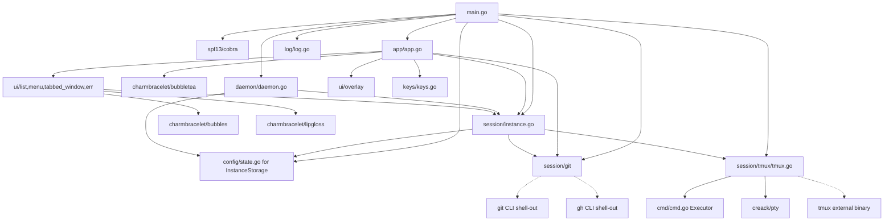

# Pass 0: Inventory — claude-squad

## Snapshot

- Reference root: `/Users/jmagady/Dev/monocle/.reference/claude-squad/`
- Git HEAD: `a4ab698899d57f23a428b18101fa0041771d18fd`
- Branch: `main`
- Recent commits (last 5):
  - `a4ab698` fix: move expensive operations off UI event loop and fix stale preview pane (#253)
  - `c4d0c03` chore: Bump version to 1.0.17
  - `52aa2dd` feat: Allow configuring preset profiles for creating sessions (#264)
  - `166112a` fix: Update claude trust prompt handling (#263)
  - `b4b43ab` feat: Enable selecting source branch for session (#262)
- Version (from `main.go:21`): `1.0.17`
- Tarball-on-disk size: `5.1 MB` (includes `.git`)
- Total files (excluding `.git`): 82
- Total Go LOC: 8,795 across 44 `.go` files
- Test file count: 6 (`_test.go` files), Total test LOC ~1,257

## Tech Stack

- Language: Go 1.23.0 (toolchain go1.24.1)
- CLI framework: `github.com/spf13/cobra v1.9.1`
- TUI framework: `github.com/charmbracelet/bubbletea v1.3.4` (BubbleTea / Elm Architecture)
- TUI styling: `github.com/charmbracelet/lipgloss v1.0.0`
- TUI widgets: `github.com/charmbracelet/bubbles v0.20.0` (textarea, viewport, spinner, key)
- Terminal multiplexer: `tmux` (external binary, NOT a Go library)
- PTY library: `github.com/creack/pty v1.1.24`
- Git library: `github.com/go-git/go-git/v5 v5.14.0` (but most operations shell out to `git` CLI for speed — see worktree_ops.go)
- GitHub CLI: `gh` (external binary, used for push/sync/browse)
- Test framework: `github.com/stretchr/testify v1.10.0`
- Clipboard: `github.com/atotto/clipboard v0.1.4`
- Other text/term helpers: `mattn/go-runewidth`, `muesli/ansi`, `muesli/reflow`, `muesli/termenv`

## Directory Map

| Path | Files | Purpose |
|------|-------|---------|
| `/main.go` | 1 | Cobra root + `cs` binary entry; subcommands: root, reset, debug, version |
| `/app/` | 3 (1,693 LOC) | BubbleTea app; `home` model, key handling, help overlays |
| `/session/` | 2 (762 LOC) | `Instance` (the unit of "session"), `Storage` |
| `/session/tmux/` | 6 (790 LOC) | `TmuxSession` wrapping external tmux + PTY |
| `/session/git/` | 7 (749 LOC) | Git worktree management, branch ops, diff |
| `/daemon/` | 3 (196 LOC) | Background autoyes daemon, PID file, signal handling |
| `/config/` | 3 (654 LOC) | Config (`~/.claude-squad/config.json`), state (`state.json`), Profile |
| `/ui/` | 11 (3,019 LOC) | List, preview/diff/terminal panes, tabbed window, menu, error box |
| `/ui/overlay/` | 6 (1,079 LOC) | Text input, branch picker, profile picker, confirmation, text overlay |
| `/keys/` | 1 (119 LOC) | Global keybindings (single map for KeyName → key.Binding) |
| `/log/` | 1 (76 LOC) | Logger init (file in os.TempDir, `claudesquad.log`) |
| `/cmd/` | 2 (50 LOC) | `Executor` interface (wraps `exec.Cmd` for test mocking) |
| `/web/` | 11 (TypeScript/Next.js, NO Go) | **Marketing static site** — NOT an app web UI |
| `/assets/`, `/.github/` | n/a | Screenshot, CI workflow |

## File Manifest (Go files, ordered by size)

| Path | LOC | Purpose |
|------|-----|---------|
| `/app/app.go` | 1,047 | Main BubbleTea model `home`; Update/View/handleKeyPress |
| `/session/instance.go` | 613 | `Instance` lifecycle: Start, Kill, Pause, Resume, Attach |
| `/session/tmux/tmux.go` | 515 | `TmuxSession` core: PTY + tmux session lifecycle |
| `/app/app_test.go` | 466 | Confirmation overlay state-machine tests |
| `/ui/preview_test.go` | 389 | Preview pane tests |
| `/ui/list.go` | 383 | Instance list renderer |
| `/ui/terminal_test.go` | 375 | Terminal pane tests |
| `/ui/terminal.go` | 362 | TerminalPane (cached tmux sessions per instance) |
| `/ui/overlay/textInput.go` | 341 | Text input with profile/branch pickers |
| `/config/config_test.go` | 305 | Config tests |
| `/ui/tabbed_window.go` | 273 | Tab manager (Preview/Diff/Terminal) |
| `/ui/preview.go` | 272 | PreviewPane (tmux capture display) |
| `/ui/overlay/overlay.go` | 263 | Generic overlay placement / fade-in background |
| `/ui/menu.go` | 227 | Bottom menu (state-dependent options) |
| `/session/git/worktree_ops.go` | 220 | Setup/Cleanup/Remove/Prune (git worktree CLI) |
| `/ui/overlay/branchPicker.go` | 212 | Branch picker (with filter + async results) |
| `/config/config.go` | 210 | Config struct + Profile + GetClaudeCommand |
| `/app/help.go` | 180 | Help-screen overlay variants |
| `/session/git/worktree_git.go` | 182 | PushChanges (via `gh repo sync`), CommitChanges, diff helpers |
| `/main.go` | 169 | Cobra root + subcommands |
| `/daemon/daemon.go` | 167 | RunDaemon, LaunchDaemon, StopDaemon (PID file IPC) |
| `/session/storage.go` | 149 | JSON marshalling for InstanceData ↔ Instance |
| `/config/state.go` | 139 | Application state (help_screens_seen bitmask + instances) |
| `/session/git/worktree.go` | 138 | GitWorktree constructor, getters |
| `/ui/diff.go` | 137 | Diff pane (colorized git diff in viewport) |
| `/keys/keys.go` | 119 | Global key bindings (KeyName enum + maps) |
| `/ui/overlay/profilePicker.go` | 110 | Profile picker (horizontal left/right) |
| `/ui/overlay/confirmationOverlay.go` | 98 | y/n/esc confirmation |
| `/cmd/cmd.go` | 32 | `Executor` interface (Run + Output) |
| `/log/log.go` | 76 | InfoLog/WarningLog/ErrorLog + log.Every (rate-limited logging) |
| `/session/git/util.go` | 64 | `sanitizeBranchName`, `IsGitRepo`, `findGitRepoRoot`, `checkGHCLI` |
| `/session/git/diff.go` | 51 | DiffStats struct + Diff() |
| `/session/tmux/pty.go` | 26 | PtyFactory abstraction (real PTY vs mocked) |
| `/daemon/daemon_unix.go` | 14 | `getSysProcAttr` (Setsid for daemon detachment) |
| `/daemon/daemon_windows.go` | 15 | `getSysProcAttr` (DETACHED_PROCESS for Windows) |
| `/session/tmux/tmux_unix.go` | 78 | SIGWINCH-based window-resize monitor |
| `/session/tmux/tmux_windows.go` | 57 | Polling window-resize monitor (no SIGWINCH on Windows) |
| `/session/tmux/tmux_test.go` | 88 | tmux start tests with MockPtyFactory |
| `/session/git/util_test.go` | 73 | sanitizeBranchName test table |
| `/session/git/worktree_branch.go` | 21 | combineErrors helper (git pkg) |
| `/ui/consts.go` | 18 | ASCII-art `FallBackText` ("CLAUDE SQUAD" big letters) |
| `/ui/err.go` | 48 | Error box (1-row banner) |

## Dependency Graph (high level)



## Entry Points

1. **`cs` binary** — `main.go:166` `main()` → `rootCmd.Execute()` (Cobra dispatch)
2. **Default RunE** — `main.go:28` → either `daemon.RunDaemon(cfg)` (with `--daemon`, internal) or `app.Run(ctx, program, autoYes)` (normal TUI)
3. **Subcommands** — `reset`, `debug`, `version`

## Critical External Dependencies (runtime)

| Tool | Purpose | Required? |
|------|---------|-----------|
| `tmux` | All session multiplexing | YES — hard requirement |
| `git` | Worktree management (via CLI, not go-git) | YES — also requires `git init` initial commit |
| `gh` (GitHub CLI) | Push branches, `gh repo sync`, `gh browse` | Only required when using `p` (push) |
| The configured `program` (default `claude`) | The agent itself | YES |

## State Checkpoint

```yaml
pass: 0
status: complete
files_scanned: 44 (Go) + 11 (TS/Next.js) + 27 (other)
go_loc: 8795
timestamp: 2026-05-11T19:55:00Z
next_pass: 1
```
