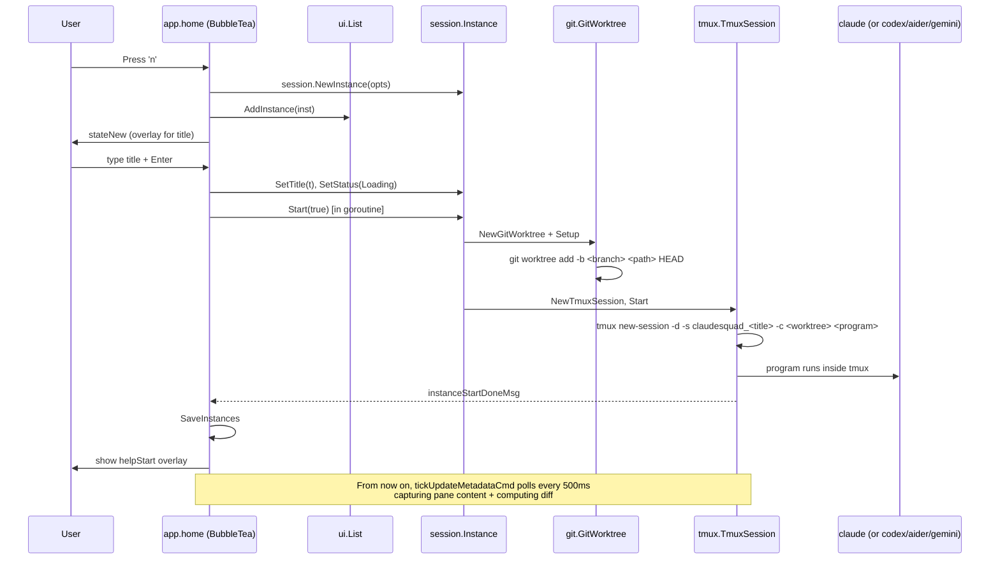
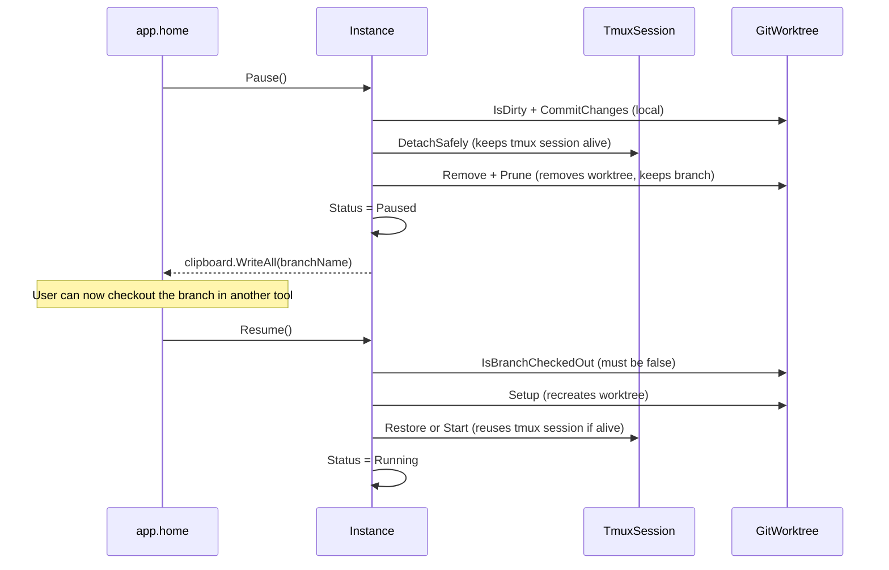
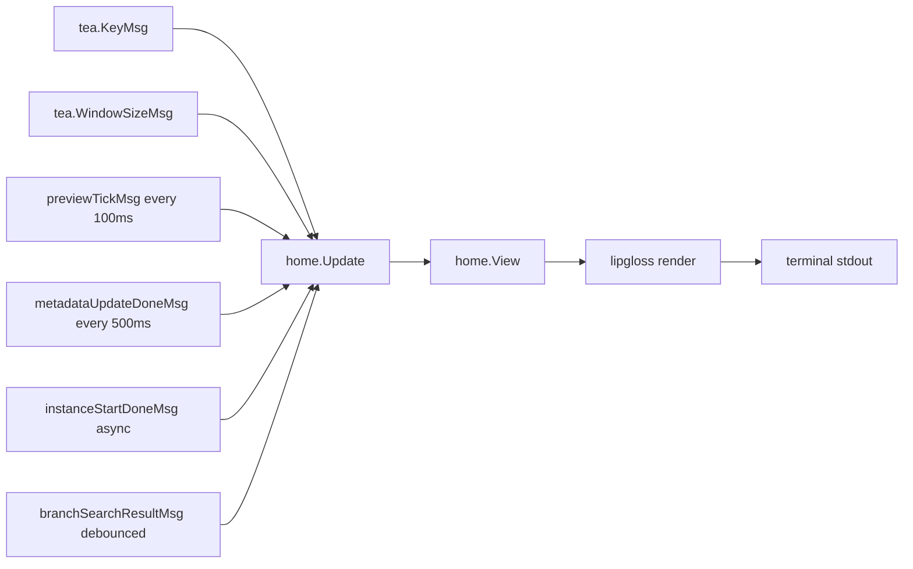

# Pass 1: Architecture — claude-squad

## Component Catalog

| Layer | Component | Responsibility | File |
|-------|-----------|----------------|------|
| Entry | `rootCmd` (Cobra) | CLI parsing, daemon-vs-TUI dispatch | `/main.go:25-76` |
| Entry | `resetCmd` | Wipes all instances + tmux sessions + worktrees | `/main.go:78-113` |
| Entry | `debugCmd` | Prints config path + JSON | `/main.go:115-134` |
| App | `home` (BubbleTea model) | Top-level Elm-architecture model; owns list/menu/tabbed window/overlays/storage; routes keys | `/app/app.go:51-104` |
| App | helpText interface | Help-screen variants with seen-bitmask gating | `/app/help.go` |
| Session | `Instance` | One agent: title + branch + tmux session + git worktree + status | `/session/instance.go:31-68` |
| Session | `Storage` | JSON marshalling of InstanceData via config.InstanceStorage interface | `/session/storage.go` |
| Session/tmux | `TmuxSession` | Wraps external tmux + PTY; Start/Attach/Detach/Close/SendKeys/CapturePane | `/session/tmux/tmux.go` |
| Session/tmux | `PtyFactory` interface, `Pty` impl | Injectable PTY for testing | `/session/tmux/pty.go` |
| Session/git | `GitWorktree` | Worktree + branch lifecycle via git CLI shell-out | `/session/git/worktree.go`, `worktree_ops.go`, `worktree_git.go` |
| Daemon | `RunDaemon` | Polls instances every `DaemonPollInterval`, taps Enter on prompts | `/daemon/daemon.go:19-88` |
| Daemon | `LaunchDaemon` / `StopDaemon` | Self-fork with `--daemon` flag, PID file in config dir | `/daemon/daemon.go:90-167` |
| Config | `Config` struct | `~/.claude-squad/config.json` | `/config/config.go:35-47` |
| Config | `State` struct | `~/.claude-squad/state.json` (help bitmask + instances JSON blob) | `/config/state.go:41-46` |
| Config | `Profile` | Named program preset (multi-harness selector) | `/config/config.go:30-33` |
| UI | `List` | Vertical instance list with rendered status/diff stats | `/ui/list.go` |
| UI | `TabbedWindow` | Container for Preview/Diff/Terminal tabs | `/ui/tabbed_window.go` |
| UI | `PreviewPane` | Captures tmux pane content for display | `/ui/preview.go` |
| UI | `DiffPane` | Renders colored git diff in viewport | `/ui/diff.go` |
| UI | `TerminalPane` | **Separate tmux session per instance** for interactive shell (NOT the agent's session) | `/ui/terminal.go` |
| UI | `Menu` | Bottom keybinding hints, state-dependent | `/ui/menu.go` |
| UI | `ErrBox` | 1-row error banner | `/ui/err.go` |
| UI/overlay | `TextInputOverlay` | Textarea with profile + branch picker for new-instance prompts | `/ui/overlay/textInput.go` |
| UI/overlay | `BranchPicker` | Async-results filtered branch chooser | `/ui/overlay/branchPicker.go` |
| UI/overlay | `ProfilePicker` | Horizontal harness selector | `/ui/overlay/profilePicker.go` |
| UI/overlay | `ConfirmationOverlay` | y/n/esc destructive-action gate | `/ui/overlay/confirmationOverlay.go` |
| Keys | `GlobalKeyStringsMap`, `GlobalkeyBindings` | Single source of truth for key bindings | `/keys/keys.go` |
| Cmd | `Executor` interface | Wraps `*exec.Cmd` for test mocking | `/cmd/cmd.go` |
| Log | `InfoLog`, `WarningLog`, `ErrorLog` | File-only logger in os.TempDir | `/log/log.go` |

## Layer Structure

```
                        +----------------------+
                        |     main.go          |
                        |   (cobra root)       |
                        +----------+-----------+
                                   |
                                   v
                +-----+-----+------+------+
                |     |     |     |      |
            +---v-+  |  +--v-+  +-v---+  v
            | app|  |  |dmn |  |state|  ...
            +--+-+  |  +-+--+  +-----+
               |    |    |
               |    |    |  (daemon re-uses same packages)
               v    v    v
            +------+----+------+
            |   session pkg    |
            |  Instance/Storage|
            +-+------------+---+
              |            |
              v            v
        +------+--+  +--------+
        |tmux pkg |  | git pkg|
        +----+----+  +----+---+
             |            |
             v            v
       (tmux external) (git CLI, gh CLI)
```

Layering: clean. UI knows about `session`, `session` knows about `tmux` + `git`, neither knows about UI. Daemon and app share the session package — daemon does NOT import UI.

## Deployment Topology

**Single-process when running normally.** `cs` runs as one foreground process executing the BubbleTea event loop.

**Two-process when AutoYes is on.** The parent `cs` process exits (or detaches) and a child `cs --daemon` runs in the background. PID is persisted to `~/.claude-squad/daemon.pid` (`/daemon/daemon.go:120`). The daemon polls every `DaemonPollInterval` (default 1000ms) and "taps Enter" on any prompts it detects.

**N tmux sessions + N git worktrees per N agents.** Each instance owns:
- A tmux session named `claudesquad_<sanitized-title>` (`/session/tmux/tmux.go:60`)
- A git worktree under `~/.claude-squad/worktrees/<sanitized-branch>_<unixnano>` (`/session/git/worktree.go:67`)
- A unique branch named `<branchPrefix><title>` (default branch prefix is `<username>/`)

If terminal tab is open, an **additional** tmux session named `claudesquad_term_<title>` is spawned in the worktree directory (`/ui/terminal.go:152`).

## Cross-Cutting Concerns

- **Logging:** `log.Initialize(daemon bool)` opens `os.TempDir()/claudesquad.log` for append. All logs are file-only — nothing prints to stdout/stderr to avoid corrupting the TUI. Daemon prefixes are `[DAEMON]` (`/log/log.go:25-43`).
- **Error display:** UI uses `errBox` (1-row banner at bottom, cleared after 3s — `/app/app.go:958-969`).
- **Concurrency:** BubbleTea events are processed on a single goroutine. Expensive work (tmux capture, git diff) runs in `tickUpdateMetadataCmd` (`/app/app.go:930-954`) spawning per-instance goroutines, joined with `sync.WaitGroup`. The PR that landed at HEAD (a4ab698) is specifically about moving these off the UI loop.
- **Platform splits:** `daemon_unix.go` / `daemon_windows.go` (process detachment), `tmux_unix.go` / `tmux_windows.go` (SIGWINCH vs polling).

## Data Flow — Creating a New Instance



## Data Flow — Pause and Resume



## Data Flow — UI Event Loop



Two timer-driven flows: `previewTickMsg` every 100ms (lightweight, just re-renders preview) and `tickUpdateMetadataCmd` every 500ms (heavy: tmux capture + git diff per instance, parallelized via goroutines).

## State Checkpoint

```yaml
pass: 1
status: complete
timestamp: 2026-05-11T19:55:00Z
next_pass: 2
```
