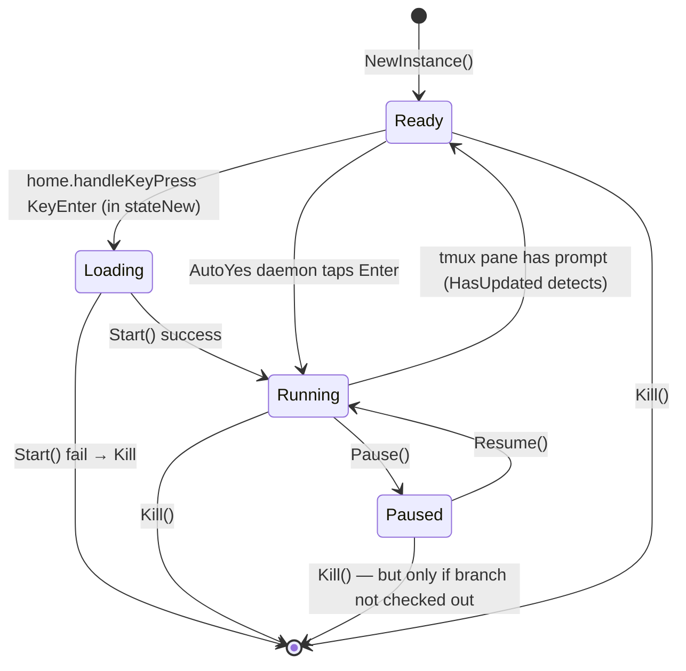
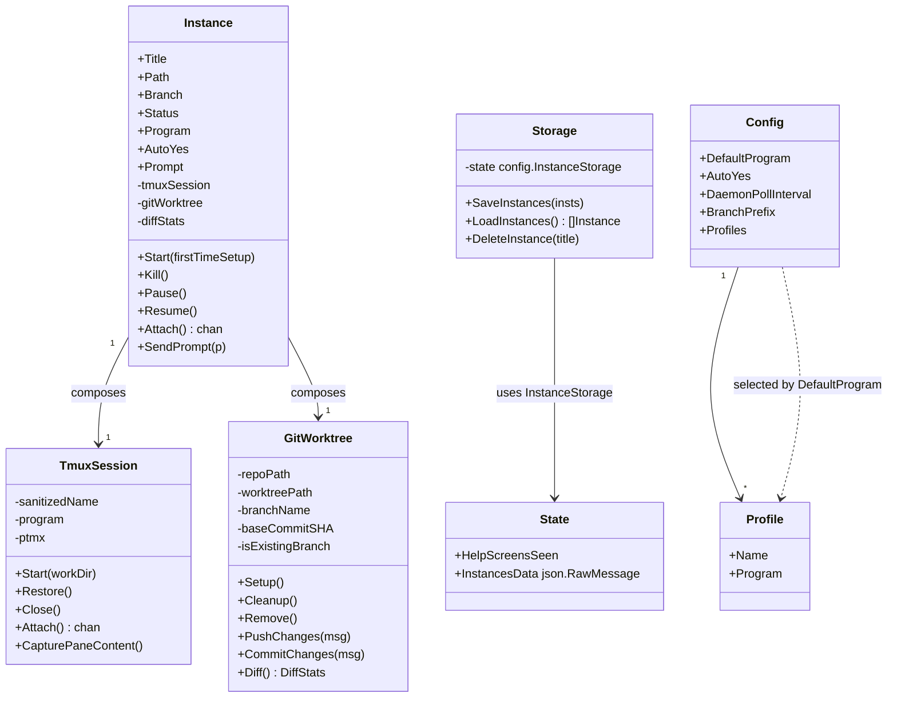

# Pass 2: Domain Model — claude-squad

## Ubiquitous Language

| Term | In code | What it really means |
|------|---------|----------------------|
| Instance | `session.Instance` | One supervised agent. Singular: title + branch + tmux session + worktree + program. Not "session" — the word "instance" is preferred in code. |
| Session | `tmux.TmuxSession` (tmux), `claude session` (Claude Code), "session" in README | Overloaded. (a) the tmux session that holds the agent process; (b) loosely, the whole instance lifecycle. Code uses "instance" for (b). |
| Program | `Instance.Program` string | The shell command that runs inside the tmux session. Default: `claude`. Examples: `claude`, `codex`, `aider --model ollama_chat/gemma3:1b`, `gemini`. |
| Profile | `config.Profile{Name, Program}` | Named pre-configured Program. Profile picker lets the user pick which "harness" to launch. |
| Worktree | `git.GitWorktree` | A git worktree (in the literal git sense) under `~/.claude-squad/worktrees/`. Each instance has one. |
| Branch | `Instance.Branch` | The branch the worktree points at. Default: `<username>/<title>`. Can be a pre-existing branch (then `isExistingBranch=true` and branch is preserved on Kill). |
| Status | `session.Status` enum | Running, Ready, Loading, Paused. |
| AutoYes | `Instance.AutoYes` bool | "Yolo mode" — the daemon will auto-tap Enter on agent prompts. Triggers daemon launch. |
| Daemon | `cs --daemon` subprocess | Background process that polls all stored instances and auto-presses Enter when prompts are detected. |
| Trust prompt | `CheckAndHandleTrustPrompt` | "Do you trust the files in this folder?" prompt from claude/aider/gemini that needs to be dismissed. |
| Detach | `tmux.Detach` / `DetachSafely` | Disconnecting the PTY from a tmux session WITHOUT killing the session. Tmux session keeps running. |
| Kill | `Instance.Kill` | Closes tmux session + cleans up worktree + deletes branch (unless `isExistingBranch`). |
| Pause | `Instance.Pause` | Commit any dirty changes locally, detach tmux (keeps session alive), remove worktree (keeps branch). Status → Paused. |
| Resume | `Instance.Resume` | Recreate worktree, restore tmux session. Status → Running. |
| Attach | `Instance.Attach` / `TmuxSession.Attach` | Hand stdin/stdout to the tmux session for interactive use. Exits on Ctrl-Q. |

## Entity Catalog

### Instance — `session.Instance` (`/session/instance.go:31-68`)

**The aggregate root.** One instance == one supervised agent.

**Fields:**
- `Title string` — primary key; max 32 chars; cannot change after Start; used as tmux session name suffix (`/session/instance.go:394-400`)
- `Path string` — workspace path (the host repo dir, made absolute on construction at `/session/instance.go:166`)
- `Branch string` — git branch (resolved by `GitWorktree.Setup`)
- `Status Status` — Running, Ready, Loading, Paused (defaults to Ready on `NewInstance`)
- `Program string` — shell command to run inside tmux
- `Height, Width int` — tmux pane dimensions
- `CreatedAt, UpdatedAt time.Time`
- `AutoYes bool`
- `Prompt string` — initial prompt to send post-start (Shift+N flow)
- Private: `diffStats *git.DiffStats`, `selectedBranch string`, `started bool`, `tmuxSession *tmux.TmuxSession`, `gitWorktree *git.GitWorktree`

**Invariants:**
1. `Title != ""` is required before `Start()` (`/session/instance.go:203`)
2. Once `started == true`, `SetTitle` returns error (`/session/instance.go:394-400`)
3. `Pause` only valid when `started && Status != Paused`
4. `Resume` only valid when `started && Status == Paused && !IsBranchCheckedOut`
5. Either `tmuxSession + gitWorktree` are both initialized after Start, or both nil if Kill cleaned them up.

### Status — `session.Status` (`/session/instance.go:19-28`)

State machine:



`Running`/`Ready` distinction is detected from tmux content: `HasUpdated` returns `hasPrompt=true` when specific strings appear in the pane content (e.g., `"No, and tell Claude what to do differently"` for Claude — `/session/tmux/tmux.go:243`).

### TmuxSession — `tmux.TmuxSession` (`/session/tmux/tmux.go:28-58`)

**Encapsulates one tmux session + one PTY connected to it.**

**Fields:**
- `sanitizedName string` — `claudesquad_<name>` with whitespace + dot replaced
- `program string`
- `ptyFactory PtyFactory` — injected (real or mock)
- `cmdExec cmd.Executor` — injected (real or mock)
- `ptmx *os.File` — running PTY (always non-nil after Start)
- `monitor *statusMonitor` — SHA256-based content-change detector
- (Attach state) `attachCh chan struct{}`, `ctx`, `cancel`, `wg`

**Operations vs underlying tmux commands:**

| Method | Underlying command |
|--------|-------------------|
| `Start` | `tmux new-session -d -s <name> -c <workdir> <program>` |
| `Restore` | `tmux attach-session -t <name>` (via PTY) |
| `Close` | `tmux kill-session -t <name>` |
| `DoesSessionExist` | `tmux has-session -t=<name>` |
| `CapturePaneContent` | `tmux capture-pane -p -e -J -t <name>` |
| `CapturePaneContentWithOptions(s,e)` | `tmux capture-pane -p -e -J -S <s> -E <e> -t <name>` |
| `SendKeys(keys)` | Writes raw bytes to PTY |
| `TapEnter` | Writes `0x0D` to PTY |
| `TapDAndEnter` | Writes `0x44, 0x0D` to PTY (for some trust prompts) |

**Sanitization:** title → `claudesquad_<title with spaces removed and . → _>` (`/session/tmux/tmux.go:64-68`)

### GitWorktree — `git.GitWorktree` (`/session/git/worktree.go:21-46`)

**Encapsulates one git worktree + its branch.**

**Fields:**
- `repoPath` — abs path to the host repo (the worktree's source)
- `worktreePath` — path under `~/.claude-squad/worktrees/<sanitized>_<unixnano>`
- `sessionName` — used in storage; mirrors Instance.Title
- `branchName` — `<BranchPrefix><sanitizedTitle>` for new branches, or the existing branch name
- `baseCommitSHA` — captured at Setup() for diff baseline
- `isExistingBranch` — if true, branch survives `Cleanup`

**Operations vs underlying git commands:**

| Method | Underlying command |
|--------|-------------------|
| `Setup` (new) | `git worktree add -b <branch> <path> <HEAD-sha>` |
| `Setup` (existing local) | `git worktree add <path> <branch>` |
| `Setup` (existing remote) | `git worktree add -b <branch> <path> origin/<branch>` |
| `Cleanup` | `git worktree remove -f` + `git branch -D` (unless existing) + `git worktree prune` |
| `Remove` | `git worktree remove -f` (keeps branch) |
| `Prune` | `git worktree prune` |
| `Diff` | `git add -N .` then `git --no-pager diff <baseCommitSHA>`, count `+`/`-` lines |
| `IsDirty` | `git status --porcelain` returns non-empty |
| `PushChanges` | `git add . && git commit --no-verify -m <msg> && gh repo sync` (or `git push -u origin` as fallback) |
| `CommitChanges` | `git add . && git commit --no-verify -m <msg>` (no push) |
| `OpenBranchURL` | `gh browse --branch <branch>` |

### Profile — `config.Profile` (`/config/config.go:30-33`)

```go
type Profile struct {
    Name    string `json:"name"`
    Program string `json:"program"`
}
```

A named harness preset. If multiple profiles exist (`HasMultiple`), the new-instance overlay shows the `ProfilePicker` (left/right arrows). The `Name` is shown in the UI; `Program` is the actual shell command.

`GetProgram()` resolves: if `DefaultProgram` matches a profile name, return that profile's `Program`. Otherwise treat `DefaultProgram` as a literal program string. This means `DefaultProgram` is overloaded — it's either a name or a literal.

### Config — `config.Config` (`/config/config.go:35-47`)

Persisted to `~/.claude-squad/config.json`.

| Field | JSON | Default | Purpose |
|-------|------|---------|---------|
| `DefaultProgram` | `default_program` | `claude` (via `GetClaudeCommand`) | Which program/profile to launch |
| `AutoYes` | `auto_yes` | `false` | Enable yolo mode by default |
| `DaemonPollInterval` | `daemon_poll_interval` | `1000` (ms) | Daemon poll cadence |
| `BranchPrefix` | `branch_prefix` | `<username>/` (lowercased) | New-branch name prefix |
| `Profiles` | `profiles` | empty | Named harness presets |

### State — `config.State` (`/config/state.go:41-46`)

Persisted to `~/.claude-squad/state.json`. **NOT** the same file as config.

| Field | JSON | Purpose |
|-------|------|---------|
| `HelpScreensSeen` | `help_screens_seen` | uint32 bitmask of dismissed help screens (so they don't show every time) |
| `InstancesData` | `instances` | raw JSON-RawMessage blob of `[]InstanceData` — list of persisted instances |

`State` implements `InstanceStorage` interface (SaveInstances/GetInstances/DeleteAllInstances). Storage layer is decoupled via this interface (`/config/state.go:17-32`), though there's only one impl.

### InstanceData — `session.InstanceData` (`/session/storage.go:11-25`)

Wire/serialization form of `Instance`. Only `Started()` instances are persisted (`/session/storage.go:60-64`). Includes nested `GitWorktreeData` (repoPath, worktreePath, sessionName, branchName, baseCommitSHA, isExistingBranch) and `DiffStatsData`.

**Reconstruction (`FromInstanceData` at `/session/instance.go:110-146`):** A loaded instance is either (a) Paused — just instantiate tmuxSession lazily, or (b) anything else — call `Start(false)` which calls `Restore()` to reattach the PTY to the existing tmux session. **Implication:** if the tmux server has been restarted, loading silently fails to reconnect.

## Relationships



## Bounded Contexts

There is effectively one bounded context — "Agent Instance Management". Within it, three sub-modules carry distinct vocabularies:

1. **Agent supervision** (session/, tmux/, git/) — knows about Instance, Status, Pause/Resume
2. **Presentation** (ui/, app/) — knows about Tabs, Preview, Diff, MenuState, Overlay
3. **Persistence** (config/, storage.go) — knows about Config, State, InstanceData

The session package is the kernel; UI depends on it but never the reverse.

## State Checkpoint

```yaml
pass: 2
status: complete
timestamp: 2026-05-11T19:55:00Z
next_pass: 3
```
