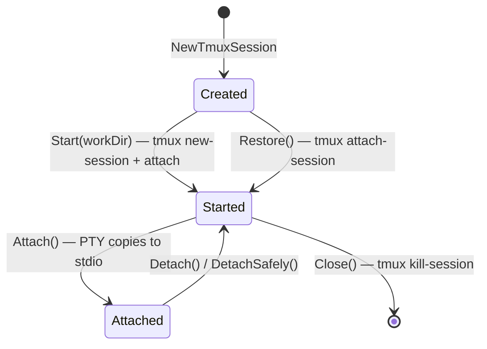

# Pass 7 (Deepening): Session + Tmux + Git Subsystems — claude-squad

## Scope

Deep verification of the three subsystems that comprise the agent supervision kernel: `session/`, `session/tmux/`, `session/git/`. Total ~2.3k LOC. The user wanted "session abstraction" specifically.

## Session Abstraction — Verified Definition

A **session in claude-squad ≡ an `Instance`**. The code consistently uses the word "instance" in identifiers; "session" is either:
- The README's marketing term (synonymous with Instance)
- The literal tmux session (a `tmux.TmuxSession` struct that an Instance composes)

There is no third meaning. There's no notion of a Claude-side "session" (claude.json, ~/.claude state directory) being managed by claude-squad — the agent's own session state is whatever the agent persists on its own.

## Lifecycle (Verified Sequence)

### Creation flow (from main UI thread)

1. User presses `n` → `home.handleKeyPress` (`/app/app.go:637`) creates `session.NewInstance(InstanceOptions)` with empty Title. Status defaults to Ready. Not yet started.
2. List adds it (`AddInstance` returns a finalizer closure).
3. State → `stateNew`. User types title in the overlay; each keypress calls `SetTitle`.
4. User presses Enter:
   - If promptAfterName (Shift+N flow): transition to `statePrompt`, show prompt overlay with branch + profile pickers.
   - Else: set status `Loading`, run finalizer (registers repo), spawn goroutine `instance.Start(true)`, return `instanceStartDoneMsg` on completion.

### Start sequence (`/session/instance.go:202-274`)

```
Start(firstTimeSetup=true):
  Title != "" assertion
  if tmuxSession nil: create new TmuxSession{sanitizedName, program, ptyFactory, cmdExec}
  if firstTimeSetup:
    if selectedBranch != "":
      gitWorktree = NewGitWorktreeFromBranch(Path, selectedBranch, Title)
      Branch = selectedBranch
    else:
      gitWorktree, Branch = NewGitWorktree(Path, Title)  // generates <BranchPrefix><Title>
  
  defer cleanup-on-error
  
  if firstTimeSetup:
    gitWorktree.Setup()  // git worktree add (HEAD or existing-branch)
    tmuxSession.Start(worktreePath)  // tmux new-session ... attach
  else (loaded from storage):
    tmuxSession.Restore()  // tmux attach to existing session via new PTY
  
  Status = Running
  started = true
```

### Restore-from-disk sequence (`/session/instance.go:110-146`)

```
FromInstanceData(data):
  reconstruct Instance + GitWorktree (with stored baseCommitSHA)
  if Status == Paused:
    instance.started = true
    instance.tmuxSession = NewTmuxSession(Title, Program)  // lazy, not yet attached
  else:
    Start(false)  // calls Restore() (attach-session) — relies on tmux server still alive
```

**Caveat:** if `Start(false)` (i.e., Restore) fails because tmux server is gone or session is gone, the instance is rejected (`return nil, err`). The whole load fails with the message `failed to create instance %s: %w`. The TUI then exits via `os.Exit(1)` in `newHome` (`/app/app.go:137-139`).

So **a tmux server crash makes `cs` un-launchable** until either (a) the user runs `cs reset`, or (b) one of the instances becomes paused (paused ones don't call Restore on load).

This is a real fragility, not just a theoretical one.

## TmuxSession Subsystem

### Lifecycle States



Field invariants:
- After `Start` or `Restore`, `ptmx != nil` AND `monitor != nil`
- After `Close`, `ptmx == nil`
- After `Detach`, `attachCh = nil, cancel = nil, wg = nil, ctx = nil`; ptmx is reset by `Restore` call

### The Detach footgun

`Detach()` (`/session/tmux/tmux.go:378-410`) closes the PTY then calls `Restore` to set a NEW ptmx (since the old one is closed). If either operation fails, it panics. The comment at line 379 acknowledges this is messy. There's an alternate `DetachSafely()` (`/session/tmux/tmux.go:336-374`) used by `Pause` that just nullifies state without re-restoring.

So:
- For interactive detach (Ctrl+Q): `Detach()` — keeps the session interactive
- For pausing: `DetachSafely()` — leaves the session existing but no PTY attached

### Trust Prompt Handling

Per-program prompt detection:

| Program | Trust prompt strings | Response |
|---------|---------------------|----------|
| Claude | `"Do you trust the files in this folder?"` OR `"new MCP server"` | TapEnter (0x0D) |
| Aider (suffix match `aider`) | `"Open documentation url for more info"` | TapDAndEnter (0x44 0x0D = D + Enter) |
| Gemini | — | (Trust prompt detection only handles Claude/non-Claude bifurcation; Gemini is NOT in `CheckAndHandleTrustPrompt` but IS in `HasUpdated` prompt detection) |

Note: HEAD's commit `166112a` is "fix: Update claude trust prompt handling". This is fragile code that breaks when agent UX changes.

### Capture Pane

- `CapturePaneContent()`: `tmux capture-pane -p -e -J` — current visible + ANSI preserved
- `CapturePaneContentWithOptions("-", "-")`: scrollback `-S - -E -` — full history including off-screen

Used both for change-detection (hash) and for the Preview pane's display.

### Cross-platform window resize

- Unix: SIGWINCH + 50ms debounce
- Windows: 250ms polling

Both end at `updateWindowSize(cols, rows)` which calls `pty.Setsize`.

## Git Subsystem

### Worktree File Layout

```
~/.claude-squad/
  config.json
  state.json
  daemon.pid
  worktrees/
    <sanitized-branch>_<unixnano>/    <- one per instance
      ...working tree...
    <sanitized-branch>_<unixnano>/
      ...
```

The `_<unixnano>` suffix on worktree paths ensures uniqueness even with collisions in sanitized names. **Branches** don't have this suffix — they're just `<BranchPrefix><title>` — so two instances with the same title would still clash at the branch level. Probably why `Title` is the primary key + unique constraint at app level (10-instance limit + title presence check before Start).

### Git Operations (verified)

| Op | Commands run |
|----|--------------|
| `Setup` (new) | `git rev-parse HEAD` → SHA; `git branch -D <branch>` (cleanup); `git worktree remove -f <path>` (cleanup); `git worktree add -b <branch> <path> <sha>` |
| `Setup` (existing local) | `git show-ref --verify refs/heads/<branch>`; `git worktree remove -f <path>` (cleanup); `git worktree add <path> <branch>` |
| `Setup` (existing remote only) | `git show-ref --verify refs/remotes/origin/<branch>`; `git worktree add -b <branch> <path> origin/<branch>` |
| `Cleanup` | `git worktree remove -f <path>`; `git branch -D <branch>` (unless `isExistingBranch`); `git worktree prune` |
| `Remove` (Pause path) | `git worktree remove -f <path>` (keeps branch) |
| `Prune` | `git worktree prune` |
| `Diff` | `git add -N .`; `git --no-pager diff <baseCommitSHA>` |
| `IsDirty` | `git status --porcelain` |
| `IsBranchCheckedOut` | `git branch --show-current` |
| `PushChanges` | `git add .`; `git commit --no-verify -m <msg>`; `gh repo sync --source -b <branch>` (fallback: `git push -u origin <branch>`); `gh repo sync -b <branch>`; `gh browse --branch <branch>` |
| `CommitChanges` (Pause path) | `git add .`; `git commit --no-verify -m <msg>` |
| `OpenBranchURL` | `gh browse --branch <branch>` |
| `FetchBranches` (background) | `git fetch --prune` (errors swallowed) |
| `SearchBranches(filter)` | `git branch -a --sort=-committerdate --format=%(refname:short)`; client-side case-insensitive filter; first 50 |

### Why `go-git` Despite the Bypass?

`go-git` is in go.mod but only used trivially. The codebase shells out to git CLI for nearly all operations, with comments explaining "much faster than go-git PlainOpen". The dep is effectively dead weight, possibly retained from an earlier iteration. Removing it would shrink the binary noticeably (go-git pulls in `dario.cat/mergo`, `Microsoft/go-winio`, `ProtonMail/go-crypto`, `cloudflare/circl`, etc — 8+ transitive deps).

### Diff Stat Implementation Quirk

`Diff()` parses output text and counts lines starting with `+` (not `+++`) and `-` (not `---`). This is a naive line counter — it includes additions inside hunks but also any line in the file that happens to start with `+`/`-`. Acceptable approximation, but not the same as `git diff --shortstat`.

`Diff()` also runs `git add -N .` before diffing, which "stages" untracked files (intent-to-add) so they show in the diff. This is important: a worktree's brand-new files would otherwise be invisible to `git diff <sha>`.

## Storage Subsystem

### What's Persisted

`InstanceData` (`/session/storage.go:11-25`):
- Title, Path, Branch, Status (as int), Height, Width, CreatedAt, UpdatedAt, AutoYes
- Program
- Worktree {RepoPath, WorktreePath, SessionName, BranchName, BaseCommitSHA, IsExistingBranch}
- DiffStats {Added, Removed, Content}

NOT persisted: the Prompt field, the selectedBranch field, tmuxSession, gitWorktree pointers (those reconstruct from Worktree data).

### When Writes Happen

- After every successful instance start
- After every successful instance finalize
- After Kill
- After app exit (`handleQuit`)
- After daemon stops

NOT after Pause / Resume individually — pause changes `Status` in memory but doesn't immediately persist unless something later triggers a save.

This is a subtle inconsistency: paused instances are persisted as Paused on next save, but if `cs` crashes before that save, the persisted Status is whatever it was before.

## Subsystem Boundaries (verified clean)

- `session` package imports `git`, `tmux`, `config` (for InstanceStorage interface only)
- `git` package imports `config`, `log`
- `tmux` package imports `cmd`, `log`
- None of these import `app`, `ui`, `daemon`
- `daemon` package imports `session`, `config`, `log`

Layering is clean. Nothing surprising.

## Delta Summary

- New items added: confirmed "session = Instance" definition; documented tmux-server-crash fragility; listed every git CLI command run; identified go-git as dead weight; called out Pause/Resume persistence gap; trust prompt table per agent
- Existing items refined: full Start sequence; restore flow; storage write triggers
- Remaining gaps: none on these subsystems

## Novelty Assessment

Novelty: **NITPICK**

Justification: The broad sweep captured the core. This round added precision but no model-changing finding. Removing it would leave the subsystem understanding intact for spec purposes.

## Convergence Declaration

session/tmux/git deepening has converged.

## State Checkpoint

```yaml
pass: 7
subsystem: session-tmux-git
round: 1
status: complete
novelty: NITPICK
timestamp: 2026-05-11T19:55:00Z
```
