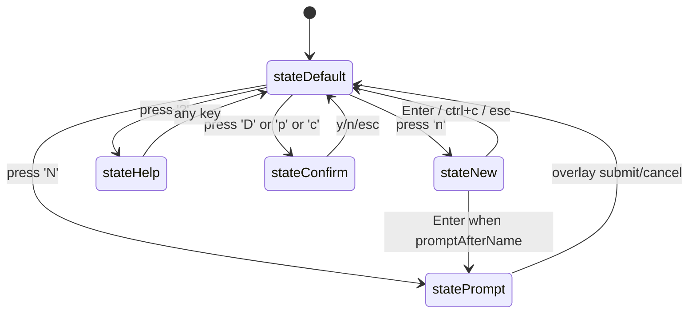

# Pass 7 (Deepening): TUI Layer — claude-squad

## Scope

Deepening on the BubbleTea TUI: framework, architecture of the home model, message types, modal stack, rendering pipeline.

## TUI Framework: bubbletea

- **`github.com/charmbracelet/bubbletea v1.3.4`** — pinned in go.mod
- Companion libs:
  - `github.com/charmbracelet/bubbles v0.20.0` — pre-built widgets (`textarea`, `viewport`, `spinner`, `key`)
  - `github.com/charmbracelet/lipgloss v1.0.0` — styling DSL (colors, borders, padding, alignment, layout via JoinHorizontal/JoinVertical/Place)
  - `github.com/charmbracelet/x/ansi`, `github.com/charmbracelet/x/term` (indirect)
- Companion text-handling libs:
  - `github.com/mattn/go-runewidth` — Unicode-aware terminal width
  - `github.com/muesli/ansi`, `muesli/reflow`, `muesli/termenv` — ANSI parsing + line wrapping (used heavily inside `overlay.PlaceOverlay`)

## Top-Level Model: `home`

`/app/app.go:51-104`. Implements `tea.Model` (Init/Update/View). Started by `tea.NewProgram(home, tea.WithAltScreen(), tea.WithMouseCellMotion()).Run()` (`/app/app.go:28-34`).

**WithAltScreen** = full-screen mode (saves terminal contents, restores on exit).
**WithMouseCellMotion** = enables mouse-wheel scrolling.

## State Machine

Five discrete UI states (`/app/app.go:39-49`):



Each non-default state has at least one overlay populated (`textInputOverlay`, `textOverlay`, `confirmationOverlay`). The `View()` method (`/app/app.go:1017-1047`) renders the base view then `overlay.PlaceOverlay`s the active overlay over it.

## Message Types

The home Update method dispatches on these message types (`/app/app.go:196-339`):

| Message | Source | Effect |
|---------|--------|--------|
| `tea.WindowSizeMsg` | terminal resize | recompute layout, propagate to all panes |
| `tea.KeyMsg` | keyboard | delegate to `handleKeyPress` |
| `tea.MouseMsg` | mouse wheel | scroll preview/diff/terminal |
| `spinner.TickMsg` | bubbles spinner | advance spinner frame |
| `hideErrMsg` | 3s after `handleError` | clear error box |
| `previewTickMsg` | self-chaining 100ms timer | refresh preview content |
| `metadataUpdateDoneMsg` | self-chaining 500ms tick (after parallel work) | update statuses + diff stats |
| `instanceStartDoneMsg` | async start goroutine | finalize new instance |
| `instanceStartedMsg` | (separate path for `Shift+N` flow) | finalize started-with-prompt instance |
| `instanceChangedMsg` | after confirm action | refresh selected-instance UI |
| `branchSearchDebounceMsg` | 150ms after filter change | maybe trigger search if version matches |
| `branchSearchResultMsg` | git search goroutine | populate branch picker |
| `error` | confirm action returned error | render in error box |

The self-chaining ticks pattern: each tick returns a Cmd that sleeps and emits the next tick. This keeps timer chains exclusive of each other (no overlapping ticks).

## Layout Math

Hardcoded percentages in `updateHandleWindowSizeEvent` (`/app/app.go:154-181`):

```
totalWidth, totalHeight = msg.Width, msg.Height
listWidth = 0.3 * totalWidth
tabsWidth = totalWidth - listWidth
contentHeight = 0.9 * totalHeight
menuHeight = totalHeight - contentHeight - 1   // -1 for error row
errBoxWidth = 0.9 * totalWidth, errBoxHeight = 1
```

Inside `TabbedWindow.SetSize` (`/ui/tabbed_window.go:81-96`):

```
tabsContentWidth = 0.9 * tabsWidth   // AdjustPreviewWidth
tabHeight = activeTabStyle.GetVerticalFrameSize() + 1
contentHeight -= tabHeight + windowStyle.GetVerticalFrameSize() + 2
```

So the actual displayable preview area is `~0.63 * totalWidth * (0.9 * totalHeight - tabHeight - frame)`. Not parametric — these multipliers are constants in code.

## Component Composition

Two flavors:

1. **Full BubbleTea sub-Models** (Init/Update/View): only `home` does this fully. `TextInputOverlay` has `Init()` and `View()` methods but they're not called by BubbleTea — the parent `home` calls `Render()` directly.
2. **Renderers with `String()`** (read by parent's View): `List`, `Menu`, `TabbedWindow`, `ErrBox`, `PreviewPane`, `DiffPane`, `TerminalPane`, `ConfirmationOverlay`, `TextOverlay`.

The renderer convention is consistent. The pattern departs from textbook TEA, where every component would be a Model. Pragmatically it works because there's only one event loop and one state holder; the renderers are just pure functions of (state, size).

## Tab Architecture

`TabbedWindow` (`/ui/tabbed_window.go`) holds three panes — Preview, Diff, Terminal — and an `activeTab int`. Tab key cycles. Each pane has its own `String()` rendering.

Critical detail: `UpdatePreview`, `UpdateDiff`, `UpdateTerminal` are **early-returning if not on the active tab** (`/ui/tabbed_window.go:107-127`). This means switching tabs requires a fresh `instanceChanged` call to populate the newly-active tab. Looking at `home.Update`, this is handled — every tab switch triggers `instanceChanged`.

## Mouse Support

`tea.WithMouseCellMotion` enables mouse-wheel events. The handler (`/app/app.go:257-273`) intercepts wheel up/down and calls `tabbedWindow.ScrollUp/ScrollDown`. No mouse click support — clicks are ignored.

## ANSI / Wide-Character Handling

- Pane captures use `tmux capture-pane -p -e` — the `-e` preserves ANSI escape codes (so colors display) and the `-J` joins wrapped lines.
- `overlay.PlaceOverlay` uses regex to dim background ANSI codes when an overlay is shown — replaces foreground/background color codes with gray equivalents. This is a non-trivial 264-line file.
- `runewidth.StringWidth` is used in titles to truncate without breaking double-wide chars.

## Modal/Overlay Stack

Only ONE overlay can be active at a time (the `home` struct has one slot per overlay type but only one is non-nil at a time, gated by state). No modal stacking. ConfirmationOverlay cannot show over a textInputOverlay, etc.

## Help Screen System

Each help screen has a bitmask flag (`helpTypeGeneral` = 1, `helpTypeInstanceStart` = 2, etc.). `helpTypeGeneral` always shows. Others show only if their bit is unset in `appState.HelpScreensSeen`. After showing, the bit is OR'd in and state saved (`/app/help.go:130-162`).

This means the user sees each non-general help screen exactly once across all `cs` invocations. Persistence is in `~/.claude-squad/state.json`.

## Per-Instance Terminal Tab (the v1.0.17 feature)

Added in commit `e69ff9c` ("feat: add Terminal tab for interactive shell access (#247)"). The Terminal tab spawns a tmux session per instance (`claudesquad_term_<title>`) running `$SHELL` in the worktree directory. The session is cached in `TerminalPane.sessions` map — switching to another instance preserves the shell history (`/ui/terminal.go:30-45`). Sessions are closed on instance Kill or instance Pause.

This means a fully-loaded claude-squad with 10 instances can have **20 tmux sessions** (10 agent + 10 terminal) and 10 worktrees on disk.

## Cleanup on Quit

`handleQuit` (`/app/app.go:342-347`) saves instances to disk and returns `tea.Quit`. **It does NOT kill tmux sessions** — they survive `cs` exit. This is intentional: re-launching `cs` restores connections via `tmux.Restore`. If user wants to wipe all state, they use `cs reset`.

## Delta Summary

- New items added: detailed message-flow inventory (12 message types), layout math, modal stack constraints, ANSI-preserve detail
- Existing items refined: clarified that `Update*` tab methods are early-returning by active tab, that overlays don't stack, that ⟨quit does not kill tmux⟩
- Remaining gaps: none for TUI layer architecture; lower-level details like exact lipgloss styling decisions are noise

## Novelty Assessment

Novelty: **NITPICK**

Justification: The broad sweep already named bubbletea + lipgloss and described the home model. This round added implementation detail (12 message types, layout math) but no new architectural concept. Removing this round's content would slightly reduce specificity but wouldn't change spec-level decisions.

## Convergence Declaration

TUI deepening has converged.

## State Checkpoint

```yaml
pass: 7
subsystem: tui
round: 1
status: complete
novelty: NITPICK
timestamp: 2026-05-11T19:55:00Z
```
