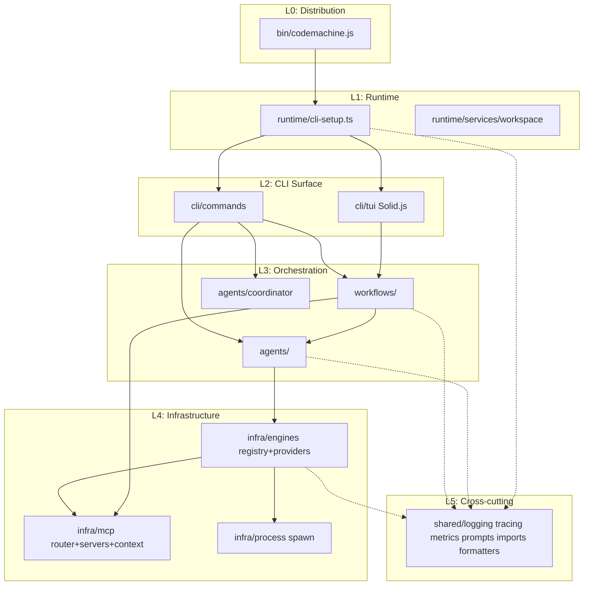
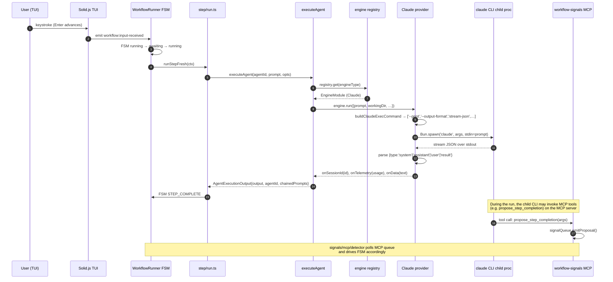

# Pass 1: Architecture — codemachine-cli

## Executive Summary

CodeMachine is a **multi-harness AI-coding-agent orchestrator** built as a TypeScript/Bun CLI. It treats every AI coding CLI (Claude Code, Codex, Cursor, OpenCode, Auggie, Mistral, CCR) as a **process-level plugin** behind a uniform `EngineModule` contract, and layers a **workflow engine** on top that drives those engines through declarative step templates. The high-level shape:

```
[user]
   ↓ (bin/codemachine.js → platform binary)
[runtime/cli-setup.ts: boot, OTel init, splash, deps]
   ↓
[Solid.js TUI (default) | commander subcommands]
   ↓
[workflows/run.ts — runWorkflow()]
   ↓
[WorkflowRunner ⇄ FSM (state/machine.ts)]
   ↓ (per step)
[step/run.ts → executeStep → agents/runner/runner.ts: executeAgent()]
   ↓
[infra/engines/core/registry → Engine plugin (Claude | Codex | …)]
   ↓
[infra/process/spawn.ts → Bun.spawn(<engine-cli>, [non-interactive flags])]
   ↓
[external AI coding CLI process — streams JSON over stdout]
```

Cross-cutting:
- **MCP** in two roles: (a) per-engine MCP settings adapter so engines route their MCP traffic through CodeMachine's local router; (b) standalone MCP servers (`workflow-signals`, `agent-coordination`) that the engines call as tools to signal completion/approval.
- **OTel telemetry** (tracing + metrics + logs) is opt-in via `CODEMACHINE_TRACE`, with exporters: OTLP/HTTP, Zipkin.
- **SQLite (`bun:sqlite`)** persistence for the agent monitoring registry (PID, session_id, telemetry per execution).
- **`.codemachine/`** workspace folder in the user's project for state, logs, artifacts, and directive signals.

## Component Catalog

### 1. Distribution & Boot (`bin/`, `src/runtime/`)

| Component | File | Responsibility |
|---|---|---|
| Shell wrapper | `/Users/jmagady/Dev/monocle/.reference/codemachine-cli/bin/codemachine.js:1-130` | Detect platform/arch, spawn the correct optionalDep platform binary; honor `CODEMACHINE_BIN_PATH` for dev |
| CLI runtime entry | `/Users/jmagady/Dev/monocle/.reference/codemachine-cli/src/runtime/cli-setup.ts:349-472` (`runCodemachineCli`) | Two-phase boot: pre-boot span (home-dir block, splash, ensure default packages, import commander) then boot span (load version, register commander, route to TUI or subcommand) |
| Home-directory guard | `/Users/jmagady/Dev/monocle/.reference/codemachine-cli/src/runtime/cli-setup.ts:77-117` | Refuse to launch directly inside `$HOME` (forces user into a project dir) |
| Splash screen | `/Users/jmagady/Dev/monocle/.reference/codemachine-cli/src/runtime/cli-setup.ts:119-141` | ANSI splash (centered "CodeMachine") shown when TTY and no subcommand |
| OTel bootstrap | `/Users/jmagady/Dev/monocle/.reference/codemachine-cli/src/runtime/cli-setup.ts:27-64` | Opt-in (`CODEMACHINE_TRACE`); initializes logger, tracing, metrics in sequence; idempotent shutdown hooks |
| Lazy initialization | `/Users/jmagady/Dev/monocle/.reference/codemachine-cli/src/runtime/cli-setup.ts:280-347` | After TUI visible: update check, engine registry load, per-engine `syncConfig()` |
| Workspace init | `/Users/jmagady/Dev/monocle/.reference/codemachine-cli/src/runtime/services/workspace/init.ts` | `ensureWorkspaceStructure({cwd})` — creates `.codemachine/` folder tree on first run |

### 2. CLI Surface (`src/cli/`)

The CLI splits into two modes: TUI (default) and commander subcommands.

| Component | File | Responsibility |
|---|---|---|
| Program assembly | `/Users/jmagady/Dev/monocle/.reference/codemachine-cli/src/cli/program.ts` | Defines the root commander `Command` (referenced from setup) |
| Commands index | `/Users/jmagady/Dev/monocle/.reference/codemachine-cli/src/cli/commands/index.ts:1-9` | Re-exports `register{Templates, Auth, Run, Step, Agents, Import, Export, MCP}Command` |
| Run command | `/Users/jmagady/Dev/monocle/.reference/codemachine-cli/src/cli/commands/run.command.ts:14-115` | `codemachine run <script>` plus per-engine variants registered dynamically from registry |
| TUI launcher | `/Users/jmagady/Dev/monocle/.reference/codemachine-cli/src/cli/tui/launcher.ts` | Mounts `app-shell.tsx` (Solid.js root) |
| TUI app shell | `/Users/jmagady/Dev/monocle/.reference/codemachine-cli/src/cli/tui/app.tsx`, `app-shell.tsx` | Route container (home / onboard / workflow) |
| TUI routes | `/Users/jmagady/Dev/monocle/.reference/codemachine-cli/src/cli/tui/routes/{home,onboard,workflow}/*` | Three primary screens; workflow route is the live execution view with timeline + log viewer + modal stack |

**Why this split:** TUI is the default UX for a long-running workflow session; subcommands are scripting and orchestration entry points (build CI, run-once tasks, auth).

### 3. Workflow Engine (`src/workflows/`, 114 files, 13K LOC)

The workflow engine is the single largest subsystem. It is internally layered:

| Layer | Path | Role |
|---|---|---|
| Public entry | `/Users/jmagady/Dev/monocle/.reference/codemachine-cli/src/workflows/run.ts:43-361` (`runWorkflow`) | Loads template, ensures workspace, registers monitoring cleanup, populates timeline, runs controller view, instantiates `WorkflowRunner` |
| Pre-flight | `/Users/jmagady/Dev/monocle/.reference/codemachine-cli/src/workflows/preflight.ts` | Spec required? Onboarding required? Workflow can start? |
| Templates | `/Users/jmagady/Dev/monocle/.reference/codemachine-cli/src/workflows/templates/{loader,types,validator,globals}.ts` | Dynamic JS module loading, hand-rolled validator, `resolveStep`/`resolveModule`/`resolveFolder` global helpers exposed to template files |
| Runner (object) | `/Users/jmagady/Dev/monocle/.reference/codemachine-cli/src/workflows/runner/index.ts:47-340` (`WorkflowRunner`) | Implements `RunnerContext`; owns FSM, input providers, signal manager, abort controller, loop counters, active loop, current session |
| Runner core | `/Users/jmagady/Dev/monocle/.reference/codemachine-cli/src/workflows/runner/core.ts:153-238` (`handleState`) | Dispatches per FSM state to mode handler; handles continuation prompts; force-interactive when paused |
| Mode handlers | `/Users/jmagady/Dev/monocle/.reference/codemachine-cli/src/workflows/runner/modes/{interactive,autonomous,continuous}.ts` | Three handlers: interactive (waits on user/controller), autonomous (auto-sends queued prompts), continuous (covered separately) |
| Step runner | `/Users/jmagady/Dev/monocle/.reference/codemachine-cli/src/workflows/step/run.ts:55-382` | `runStepFresh` (new) + `runStepResume` (continue); calls `executeStep` which calls `executeAgent` |
| Step actions | `/Users/jmagady/Dev/monocle/.reference/codemachine-cli/src/workflows/runner/actions/{advance,loop,resume,directives}.ts` | Mutations: skip, advance, loop, send queued prompt, process directives |
| State (FSM) | `/Users/jmagady/Dev/monocle/.reference/codemachine-cli/src/workflows/state/{types,machine}.ts:120-377` | `createMachine`/`createWorkflowMachine`; 7 states, 9 event types, guarded transitions |
| Indexing | `/Users/jmagady/Dev/monocle/.reference/codemachine-cli/src/workflows/indexing/{manager,lifecycle,persistence,debug,types}.ts` | `StepIndexManager` — single source of truth for step index, prompt queue, completed steps; persists to `template.json` |
| Recovery | `/Users/jmagady/Dev/monocle/.reference/codemachine-cli/src/workflows/recovery/{detect,restore,types}.ts` | Crash recovery: detect resumable step by `sessionId && !completedAt` |
| Session (per-step) | `/Users/jmagady/Dev/monocle/.reference/codemachine-cli/src/workflows/session/` | `StepSession` — per-step queue state, output, and lifecycle flags |
| Mode (auto vs manual) | `/Users/jmagady/Dev/monocle/.reference/codemachine-cli/src/workflows/mode/{mode,types}.ts` | `WorkflowMode` — source of truth for autoMode flag and active input provider |
| Signals | `/Users/jmagady/Dev/monocle/.reference/codemachine-cli/src/workflows/signals/manager/manager.ts:31-195` | `SignalManager` listens on `process.on('workflow:{pause,skip,stop,mode-change,return-to-controller}')` events from TUI |
| Signal handlers | `/Users/jmagady/Dev/monocle/.reference/codemachine-cli/src/workflows/signals/handlers/{pause,skip,stop,mode,return}.ts` | Per-signal logic that calls into FSM/mode/abort |
| Signal MCP detector | `/Users/jmagady/Dev/monocle/.reference/codemachine-cli/src/workflows/signals/mcp/{detector,controller}.ts` | Polls MCP signal queue and translates `propose_step_completion` / `approve_step_transition` into FSM events |
| Directives | `/Users/jmagady/Dev/monocle/.reference/codemachine-cli/src/workflows/directives/{reader,onAdvance,types}.ts`, plus `{loop,pause,trigger,checkpoint,error}/{evaluator,handler}.ts` | Agent-written `.codemachine/memory/directive.json` instructs workflow what to do post-step |
| Controller | `/Users/jmagady/Dev/monocle/.reference/codemachine-cli/src/workflows/controller/{init,helper,view,config}.ts` | Pre-workflow conversational controller agent (e.g., asks user track/conditions before steps begin) |
| Events | `/Users/jmagady/Dev/monocle/.reference/codemachine-cli/src/workflows/events/{bus,emitter}.ts` | `WorkflowEventBus` + `WorkflowEventEmitter` — pub-sub between runner and TUI |
| Onboarding | `/Users/jmagady/Dev/monocle/.reference/codemachine-cli/src/workflows/onboarding/` | First-run setup flow |
| Input providers | `/Users/jmagady/Dev/monocle/.reference/codemachine-cli/src/workflows/input/{emitter,types,providers/}` | `UserInputProvider`, `ControllerInputProvider` — both implement `InputProvider` interface |
| Step scenarios | `/Users/jmagady/Dev/monocle/.reference/codemachine-cli/src/workflows/step/scenarios/` | Resolves 8 scenarios from {interactive, autoMode, hasChainedPrompts} into a mode-type + input-source pair |

### 4. Engine Plugin Subsystem (`src/infra/engines/`, 91 files, ~9K LOC)

The cleanest abstraction in the codebase. Every supported AI coding CLI has identical structure.

#### Core (`src/infra/engines/core/`)

| File | Responsibility |
|---|---|
| `/Users/jmagady/Dev/monocle/.reference/codemachine-cli/src/infra/engines/core/base.ts:10-97` | Defines `EngineMetadata`, `EngineAuthModule`, `EngineMCPConfig`, `EngineModule`, `isEngineModule()` type guard |
| `/Users/jmagady/Dev/monocle/.reference/codemachine-cli/src/infra/engines/core/types.ts:11-65` | `ParsedTelemetry`, `EngineRunOptions`, `EngineRunResult`, `Engine` interface |
| `/Users/jmagady/Dev/monocle/.reference/codemachine-cli/src/infra/engines/core/registry.ts:20-128` | Singleton `EngineRegistry`: register, get, getAll (sorted by `metadata.order`), getDefault, getAllIds. Imports all 7 providers at module load and calls `register()` on each |
| `/Users/jmagady/Dev/monocle/.reference/codemachine-cli/src/infra/engines/core/factory.ts:8-50` | `createEngine(type)` wraps an `EngineModule` in a `DynamicEngine` (implements `Engine`) |
| `/Users/jmagady/Dev/monocle/.reference/codemachine-cli/src/infra/engines/core/auth.ts` | Generic auth helpers used by per-provider `auth.ts` |

#### Providers (`src/infra/engines/providers/{claude,codex,cursor,opencode,auggie,mistral,ccr}/`)

Each provider folder has the same shape (with minor variation):

```
provider/
  index.ts            # default-exports the EngineModule (composes metadata + auth + run + mcp)
  metadata.ts         # static EngineMetadata
  config.ts           # ENV var names, scope helpers, config-file utilities
  auth.ts             # isAuthenticated / ensureAuth / clearAuth / nextAuthMenuAction
  telemetryParser.ts  # parses engine-specific stream output into ParsedTelemetry
  execution/
    index.ts          # re-exports runX as the main run function
    runner.ts         # the actual run loop: build command, spawn, stream stdout, parse JSON, handle errors
    executor.ts       # orchestrates argument prep + spawn call
    commands.ts       # buildXExecCommand() — translates EngineRunOptions to CLI args
  mcp/
    index.ts          # exports EngineMCPConfig with configure/cleanup/isConfigured
    adapter.ts        # MCPAdapter implementation
    settings.ts       # locates per-engine MCP settings file, read/write/merge JSON
```

| Engine | id | CLI binary | Default model | Order | Experimental | Install | Citation |
|---|---|---|---|---|---|---|---|
| OpenCode | `opencode` | `opencode` | `opencode/big-pickle` | 1 | no | `npm i -g opencode-ai@latest` | `/Users/jmagady/Dev/monocle/.reference/codemachine-cli/src/infra/engines/providers/opencode/metadata.ts:3-12` |
| Claude Code | `claude` | `claude` | `opus` | 2 | yes | `npm install -g @anthropic-ai/claude-code` | `/Users/jmagady/Dev/monocle/.reference/codemachine-cli/src/infra/engines/providers/claude/metadata.ts:3-13` |
| Codex | `codex` | `codex` | `gpt-5.2-codex` | 3 | no | `npm install -g @openai/codex` | `/Users/jmagady/Dev/monocle/.reference/codemachine-cli/src/infra/engines/providers/codex/metadata.ts:3-13` |
| Cursor | `cursor` | `cursor-agent` | `auto` | 4 | yes | `curl https://cursor.com/install -fsS \| bash` | `/Users/jmagady/Dev/monocle/.reference/codemachine-cli/src/infra/engines/providers/cursor/metadata.ts:3-13` |
| Mistral Vibe | `mistral` | `vibe` | `devstral-2` | 5 | yes | `uv tool install mistral-vibe` | `/Users/jmagady/Dev/monocle/.reference/codemachine-cli/src/infra/engines/providers/mistral/metadata.ts:3-13` |
| Auggie | `auggie` | `auggie` | (none) | 6 | no | `npm install -g @augmentcode/auggie` | `/Users/jmagady/Dev/monocle/.reference/codemachine-cli/src/infra/engines/providers/auggie/metadata.ts:3-11` |
| Claude Code Router | `ccr` | `ccr` | `sonnet` | 7 | no | `npm install -g @musistudio/claude-code-router` | `/Users/jmagady/Dev/monocle/.reference/codemachine-cli/src/infra/engines/providers/ccr/metadata.ts:3-13` |

The **default engine** is the first by `order` — currently OpenCode. `/Users/jmagady/Dev/monocle/.reference/codemachine-cli/src/infra/engines/core/registry.ts:117-119`.

### 5. Process Spawn (`src/infra/process/spawn.ts`)

The lowest-level component: a `Bun.spawn` wrapper that handles streaming, abort, and timeout.

| Function | File | Responsibility |
|---|---|---|
| `spawnProcess` | `/Users/jmagady/Dev/monocle/.reference/codemachine-cli/src/infra/process/spawn.ts:171-402` | Main pipe-mode spawn; tracks process in `activeProcesses` set; supports timeout, AbortSignal, stdin input, stdout/stderr streaming callbacks; **Unix kills negative PID = process group** so wrapper scripts (CCR, Claude) get their children killed too (lines 233-255) |
| `spawnQuiet` | `/Users/jmagady/Dev/monocle/.reference/codemachine-cli/src/infra/process/spawn.ts:60-92` | Lightweight version for CLI checks (auth, version) |
| `spawnInteractive` | `/Users/jmagady/Dev/monocle/.reference/codemachine-cli/src/infra/process/spawn.ts:98-122` | stdio=inherit for auth flows that need user TTY |
| `killAllActiveProcesses` | `/Users/jmagady/Dev/monocle/.reference/codemachine-cli/src/infra/process/spawn.ts:128-169` | Called from cleanup handlers on Ctrl+C; SIGTERM then SIGKILL after 1 second |
| `activeProcesses` set | `/Users/jmagady/Dev/monocle/.reference/codemachine-cli/src/infra/process/spawn.ts:27` | Module-level `Set<Subprocess>` (singleton across the app) |

### 6. Agents Subsystem (`src/agents/`)

| Layer | Path | Role |
|---|---|---|
| `executeAgent` (public API) | `/Users/jmagady/Dev/monocle/.reference/codemachine-cli/src/agents/runner/runner.ts:196-546` | Loads agent config; resolves engine via CLI-override > agent-config > first-authenticated; ensures MCP config; calls `engine.run()` with streaming + telemetry callbacks |
| `EngineAuthCache` | `/Users/jmagady/Dev/monocle/.reference/codemachine-cli/src/agents/runner/runner.ts:21-48` | 5-min TTL cache for `auth.isAuthenticated()` — fixes "5-minute delay bug when spawning multiple subagents" |
| Chained prompts | `/Users/jmagady/Dev/monocle/.reference/codemachine-cli/src/agents/runner/chained.ts:269-313` | Loads ordered `.md` prompts from a folder; supports YAML frontmatter (`name`, `description`); honors `conditions` / `conditionsAny` / `tracks` filtering |
| Coordinator | `/Users/jmagady/Dev/monocle/.reference/codemachine-cli/src/agents/coordinator/{parser,service,execution}.ts` | Parses `&` (parallel) and `&&` (sequential) compositions in `codemachine run <script>`; orchestrates parallel exec of multiple agents |
| Monitoring | `/Users/jmagady/Dev/monocle/.reference/codemachine-cli/src/agents/monitoring/{monitor,registry,logger,status,cleanup}.ts` | SQLite-backed registry of agent executions; tracks PID, session_id, parent_id (tree), telemetry, log_path; status state machine: running → {completed, failed, paused, skipped} |
| Monitoring DB | `/Users/jmagady/Dev/monocle/.reference/codemachine-cli/src/agents/monitoring/db/{schema,repository,connection}.ts` | `bun:sqlite`; tables: `agents` + `telemetry` (1:1 by `agent_id`) |
| Session | `/Users/jmagady/Dev/monocle/.reference/codemachine-cli/src/agents/session/{capture,resume,types}.ts` | Helpers around session ID capture for the resume use case |
| Chat | `/Users/jmagady/Dev/monocle/.reference/codemachine-cli/src/agents/chat/` | Interactive single-shot chat with an engine (TUI subview) |

### 7. MCP Subsystem (`src/infra/mcp/`, ~25 files)

Two responsibilities:

**A. MCP-config writer (engine outbound):** writes per-engine settings files so the engine can find CodeMachine's MCP servers (and so step-level allow/block lists are respected).
- `/Users/jmagady/Dev/monocle/.reference/codemachine-cli/src/infra/mcp/writer.ts` (`ensureMCPConfig`) — invoked from `executeAgent`
- `/Users/jmagady/Dev/monocle/.reference/codemachine-cli/src/infra/mcp/context.ts` — writes `.codemachine/mcp/context.json` so the router knows which agent is currently running and what tool filter to apply
- Per-engine adapters in `src/infra/engines/providers/*/mcp/` (Claude example: `/Users/jmagady/Dev/monocle/.reference/codemachine-cli/src/infra/engines/providers/claude/mcp/adapter.ts:17-75`)

**B. MCP servers (CodeMachine-hosted):** standalone stdio MCP servers that engines call as tools.
- `workflow-signals` server: `/Users/jmagady/Dev/monocle/.reference/codemachine-cli/src/infra/mcp/servers/workflow-signals/index.ts` — three tools: `propose_step_completion`, `approve_step_transition`, `get_pending_proposal`. Replaces fragile string signals like "ACTION: NEXT".
- `agent-coordination` server: `/Users/jmagady/Dev/monocle/.reference/codemachine-cli/src/infra/mcp/servers/agent-coordination/` — provides cross-agent messaging primitives (handler, schemas, tools, validator)
- Router: `/Users/jmagady/Dev/monocle/.reference/codemachine-cli/src/infra/mcp/router/` — multiplexes tool calls based on agent context; reads `MCPContextFile` written by step executor

### 8. Shared Infrastructure (`src/shared/`)

| Module | Path | Role |
|---|---|---|
| Logging | `/Users/jmagady/Dev/monocle/.reference/codemachine-cli/src/shared/logging/{logger,otel-logger,otel-init,agent-loggers,spinner-logger}.ts` | Two backends: legacy `appDebug` (being removed per HEAD commit) and OTel-backed `otel_debug/info/warn/error` |
| Tracing | `/Users/jmagady/Dev/monocle/.reference/codemachine-cli/src/shared/tracing/{init,tracers,sampler,storage,config}.ts` | OTel tracing setup, span helpers (`withSpan`, `withRootSpan`, `startManualSpanAsync`) |
| Metrics | `/Users/jmagady/Dev/monocle/.reference/codemachine-cli/src/shared/metrics/{init,meters,instruments/,exporters/}` | OTel metrics; histograms for boot phases, counters per agent execution |
| Imports | `/Users/jmagady/Dev/monocle/.reference/codemachine-cli/src/shared/imports/{auto-import,resolver,installer,manifest,paths,registry,resolve,defaults}.ts` | The **workspace package import system** — workflows/agents from npm packages |
| Prompts | `/Users/jmagady/Dev/monocle/.reference/codemachine-cli/src/shared/prompts/{config,content,replacement,injected}.ts` | Placeholder replacement, default prompts (`STEP_RESUME_DEFAULT`, `DEFAULT_CONTINUATION_PROMPT`) |
| Updates | `/Users/jmagady/Dev/monocle/.reference/codemachine-cli/src/shared/updates/{checker,types}.ts` | `update-notifier` wrapper |
| Agents config (shared types/discovery) | `/Users/jmagady/Dev/monocle/.reference/codemachine-cli/src/shared/agents/config/types.ts:18-32`, `/Users/jmagady/Dev/monocle/.reference/codemachine-cli/src/shared/agents/discovery/{steps,catalog}.ts` | Defines `AgentDefinition` shape (id, model, engine, chainedPromptsPath, conditions, mcp); loader resolves from `config/{main.agents,sub.agents,modules,agents}.js` |
| Formatters | `/Users/jmagady/Dev/monocle/.reference/codemachine-cli/src/shared/formatters/{outputMarkers,logFileFormatter}.ts` | Engine-output normalization: `formatThinking`, `formatCommand`, `formatResult`, `formatStatus` markers; chalk renderer; log-file formatter strips ANSI |
| Workflow shared state | `/Users/jmagady/Dev/monocle/.reference/codemachine-cli/src/shared/workflows/{template,index}.ts` | Track + conditions persistence (`getSelectedTrack`, `getSelectedConditions`, `setActiveTemplate`), controller config IO |
| Utils | `/Users/jmagady/Dev/monocle/.reference/codemachine-cli/src/shared/utils/{path,errors,terminal}.ts` | `expandHomeDir`, error normalization, terminal width helpers |

## Layer Structure & Dependency Direction



**Direction:** All upward dependencies flow down; nothing in L4/L5 imports from L3/L2/L1. The one violation pattern: `runWorkflow` (`/Users/jmagady/Dev/monocle/.reference/codemachine-cli/src/workflows/run.ts:163-170`) reaches for `globalThis.__workflowEventBus` (a TUI global) — pragmatic but it makes workflow.run testability harder, since `globalThis` state leaks across runs. P1 risk for monocle's lift.

## Deployment Topology

Single-process CLI per user invocation. No daemon, no server. Child processes:

| Child | Lifecycle | Citation |
|---|---|---|
| AI coding CLI (claude / codex / cursor / etc.) | One per step (or one per resumed turn); killed on workflow abort | `/Users/jmagady/Dev/monocle/.reference/codemachine-cli/src/infra/engines/providers/claude/execution/runner.ts:284-310` |
| MCP `workflow-signals` server | Spawned by engine (per engine's MCP config) as stdio child; survives across step transitions | `/Users/jmagady/Dev/monocle/.reference/codemachine-cli/src/infra/mcp/servers/workflow-signals/index.ts:253-264` |
| MCP `agent-coordination` server | Same lifecycle pattern | `/Users/jmagady/Dev/monocle/.reference/codemachine-cli/src/infra/mcp/servers/agent-coordination/index.ts` |

Cleanup chain: SIGINT/SIGTERM → `MonitoringCleanup` saves session state → `killAllActiveProcesses` SIGTERMs all tracked children → forced SIGKILL after 1s.

## Data Flow: One Workflow Step



## Cross-Cutting Concerns

### Error Handling

- **Throw-and-catch pattern** at process boundaries (boot, command handler, workflow runner). Top-level `runCodemachineCli` (`/Users/jmagady/Dev/monocle/.reference/codemachine-cli/src/runtime/cli-setup.ts:502-515`) catches and `process.exit(1)`s.
- `Engine.run()` resolves on success, rejects on engine error. Special handling for `ENOENT` (CLI not installed → user-friendly install hint, `/Users/jmagady/Dev/monocle/.reference/codemachine-cli/src/infra/engines/providers/claude/execution/runner.ts:311-320`).
- Workflow runner: `try/catch` per step with `STEP_ERROR` FSM event (`/Users/jmagady/Dev/monocle/.reference/codemachine-cli/src/workflows/step/run.ts:249-262`).
- Abort is **first-class**: every long operation accepts `AbortSignal`. Aborts produce `AbortError` (`error.name === 'AbortError'`) which is caught and treated as a controlled cancellation, NOT a failure.
- Specific custom error class: `MCPConfigError` (`/Users/jmagady/Dev/monocle/.reference/codemachine-cli/src/infra/engines/providers/claude/mcp/adapter.ts:36-41`).

### Logging

- Dual stack during transition: legacy `debug()` from `shared/logging/logger.js` plus OTel `otel_debug/info/warn/error` (`/Users/jmagady/Dev/monocle/.reference/codemachine-cli/src/shared/logging/otel-logger.ts`).
- Per-agent logs land in `.codemachine/logs/<agent>.<id>.log` via `AgentLoggerService` with `proper-lockfile` for cross-process safety (`/Users/jmagady/Dev/monocle/.reference/codemachine-cli/src/agents/monitoring/logger.ts`, `logLock.ts`).
- Output normalization: `formatForLogFile()` strips ANSI/markers; `renderToChalk()` re-colors for terminal.

### Authentication

- Per-engine. Every `EngineModule` exports `auth.isAuthenticated()`, `ensureAuth()`, `clearAuth()`, `nextAuthMenuAction()`.
- Cache: `EngineAuthCache` (5-min TTL) used by `executeAgent` and the engine fallback chain (`/Users/jmagady/Dev/monocle/.reference/codemachine-cli/src/agents/runner/runner.ts:243-309`).
- Fallback chain: if configured engine isn't authenticated, walk the registry by order looking for an authenticated one; if none found, fall back to default; if no default, raise a "auth required" error pointing to `codemachine auth login`.

### Observability

- OTel-first, but opt-in (no impact when `CODEMACHINE_TRACE` unset — `/Users/jmagady/Dev/monocle/.reference/codemachine-cli/src/runtime/cli-setup.ts:28-30`).
- Spans named with dotted hierarchy: `cli.boot`, `cli.preBoot.cli_deps_import`, `cli.lazy.engines`, `cli.boot.tui_launcher_import`, etc.
- Metrics: boot-phase histogram (`boot.phase_duration`, ms, label `boot.phase`).
- Local dev stack: `docker/observability/docker-compose.yml` ships OTel collector + Tempo + Prometheus + Grafana with pre-built dashboards (`codemachine-observability.json`, `-process-metrics.json`, `-boot-metrics.json`).
- Trace migration in active flight (commit history all telemetry-related).

### Configuration

- Static defaults: `config/{main.agents,sub.agents,modules,placeholders}.js` (CommonJS) and `config/agent-characters.json`.
- Per-workspace overrides: `.codemachine/agents/agents-config.json` and `.codemachine/memory/*.json`.
- Per-user (auth state, MCP signal global state): `~/.codemachine/{claude,mcp,logs}/`.
- Env vars: `CODEMACHINE_CWD`, `CODEMACHINE_BIN_PATH`, `CODEMACHINE_PACKAGE_ROOT`, `CODEMACHINE_TRACE`, `CODEMACHINE_PARENT_AGENT_ID`, `LOG_LEVEL`, `DEBUG`, plus per-engine vars (e.g. `CLAUDE_CONFIG_DIR`, `ANTHROPIC_API_KEY`, `ANTHROPIC_BASE_URL`, `ANTHROPIC_AUTH_TOKEN`, `CLAUDE_OAUTH_TOKEN`, `MCP_TIMEOUT`, `MCP_TOOL_TIMEOUT`).

## Key Architectural Patterns

1. **Plugin Registry (Strategy)** — engines, MCP adapters, mode handlers, directive handlers all share the same shape: registry singleton + module contract + auto-discovery on import.
2. **Finite State Machine** — `createMachine()` with declarative `{states, on: {EVENT: {target, guard, action}}}` config. `/Users/jmagady/Dev/monocle/.reference/codemachine-cli/src/workflows/state/machine.ts:26-115`.
3. **Event Bus + Emitter** — TUI ⇄ runner communication via `WorkflowEventBus` + Node `process` EventEmitter (`process.on('workflow:pause')` etc., `/Users/jmagady/Dev/monocle/.reference/codemachine-cli/src/workflows/signals/manager/manager.ts:66-114`).
4. **Source-of-truth concentration** — `StepIndexManager` (`/Users/jmagady/Dev/monocle/.reference/codemachine-cli/src/workflows/indexing/manager.ts:24-117`) and `WorkflowMode` are deliberately the single source of truth for their domain; comments in code (e.g., FSM types `/Users/jmagady/Dev/monocle/.reference/codemachine-cli/src/workflows/state/types.ts:5-8`) explicitly call this out.
5. **Dual signal channels** — process events (user-initiated: pause/skip/stop, fast) vs file-system signals (agent-initiated: `directive.json`, async durable) vs MCP signals (agent-initiated: structured tool calls, schema-validated).
6. **Streaming process I/O** — every engine streams stdout as line-delimited JSON; the engine runner buffers, line-splits, parses, and pipes to typed callbacks (`onSessionId`, `onTelemetry`, `onData`).
7. **Centralized abort** — `AbortController` per step; signal-handlers call `.abort()`; engine runner passes signal to `Bun.spawn`; spawn's abort handler kills process group; cleanup symbol is `AbortError`.
8. **Sorted ordering for default selection** — engines, conditions, options all use a numeric `order` field with `??99` fallback (`/Users/jmagady/Dev/monocle/.reference/codemachine-cli/src/infra/engines/core/registry.ts:88-91`).
9. **Symmetric provider folders** — every engine provider has identical sub-folder layout, making it cheap to add a new engine (target: `monocle` reads as another engine).
10. **Stream-JSON as IPC** — every supported engine uses some flavor of JSON-over-stdout. Engines that don't support this are not supported.

## P0/P1 Findings (Pass 1)

- **P1 — `globalThis.__workflowEventBus`** (`/Users/jmagady/Dev/monocle/.reference/codemachine-cli/src/workflows/run.ts:163-170`): the workflow runner depends on a TUI-set global. This couples runner to TUI runtime. For monocle's headless mode, a DI seam is needed.
- **P1 — Hard-coded engine list at module load** (`/Users/jmagady/Dev/monocle/.reference/codemachine-cli/src/infra/engines/core/registry.ts:9-15, 35-44`): engines are static imports, not discovered. Adding a new engine requires editing `registry.ts`. Trade-off: simpler, no plugin manifest; not extensible at runtime.
- **P1 — Comment-noise in `cli-setup.ts`** (`/Users/jmagady/Dev/monocle/.reference/codemachine-cli/src/runtime/cli-setup.ts:6-21, 152-194, 269-271, 309-320`): in-flight refactor leaves large commented blocks; risk of dual codepaths during reasoning, but they're explicitly marked `TODO: Legacy`.
- **P0 — No tests (whole repo)** carried from Pass 0. All behavior derived from code-reading only. Reduces confidence on subtle FSM/recovery behavior.

## State Checkpoint

```yaml
pass: 1
status: complete
files_scanned_for_pass: ~25
loc_read_in_depth: ~3000
timestamp: 2026-05-11T00:01:00Z
next_pass: 2
notes: |
  Architecture mapped. Two design genes monocle most wants:
  (a) EngineModule plugin contract — clean, hardcoded but symmetric.
  (b) Workflow JS-module templates with FSM-driven runner.
  Both will be deepened in Pass B.
```
