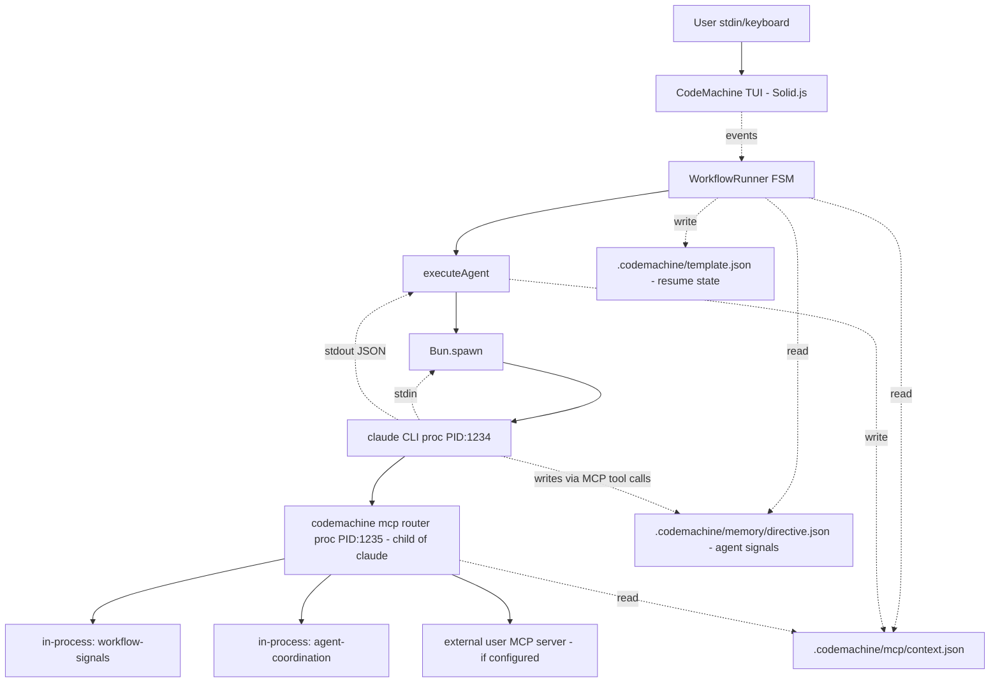

# Pass 2 Deep — Harness Architecture (Round 1)

**Target:** User-stated deliverable #1 — "Harness architecture" — Monocle as multi-harness peer to Claude Code. Full mapping of how CodeMachine launches, manages, resumes, and routes I/O for AI coding agents.

**Files read this round (not previously in depth):**
- `/Users/jmagady/Dev/monocle/.reference/codemachine-cli/src/infra/engines/core/auth.ts`
- `/Users/jmagady/Dev/monocle/.reference/codemachine-cli/src/infra/engines/providers/{opencode,ccr}/execution/{commands,runner}.ts`
- `/Users/jmagady/Dev/monocle/.reference/codemachine-cli/src/infra/engines/providers/opencode/auth.ts`
- `/Users/jmagady/Dev/monocle/.reference/codemachine-cli/src/infra/engines/providers/claude/mcp/settings.ts`
- `/Users/jmagady/Dev/monocle/.reference/codemachine-cli/src/infra/mcp/{writer,context}.ts` (full)
- `/Users/jmagady/Dev/monocle/.reference/codemachine-cli/src/infra/mcp/router/{index,backend,config}.ts`

## The Plugin Contract (`EngineModule`)

This is the heart of multi-harness support. From `/Users/jmagady/Dev/monocle/.reference/codemachine-cli/src/infra/engines/core/base.ts:67-82`:

```ts
interface EngineModule {
  metadata: EngineMetadata;            // declarative: id, name, cliBinary, install, defaultModel, order, experimental, icon
  auth: EngineAuthModule;              // isAuthenticated, ensureAuth, clearAuth, nextAuthMenuAction
  run: (options: EngineRunOptions) => Promise<EngineRunResult>;
  syncConfig?: (options?) => Promise<void>;   // optional: write per-engine config files
  onRegister?: () => void;             // optional: fires on registry registration
  onLoad?: () => void;                 // optional: fires on registry load
  mcp?: EngineMCPConfig;               // optional: per-engine MCP support
}
```

`EngineRunOptions` (`/Users/jmagady/Dev/monocle/.reference/codemachine-cli/src/infra/engines/core/types.ts:21-35`) is the uniform call contract: `{prompt, workingDir, resumeSessionId?, resumePrompt?, model?, modelReasoningEffort?, env?, onData?, onErrorData?, onTelemetry?, onSessionId?, abortSignal?, timeout?}` → `{stdout, stderr}`.

Adding a new engine = creating a folder under `src/infra/engines/providers/<id>/` with these files and adding one line to `registry.ts`.

## Engine Inventory (final)

| Engine | id | CLI | Stream format | Session resume mechanism | Default model |
|---|---|---|---|---|---|
| OpenCode | `opencode` | `opencode` | newline-delimited JSON (`opencode run --format json`) | `--session <id>` flag | `opencode/big-pickle` |
| Claude Code | `claude` | `claude` | newline-delimited JSON (`--output-format stream-json --verbose --print`) | `--resume <id>` flag; stdin for prompt | `opus` |
| Codex | `codex` | `codex` | newline-delimited JSON (`exec --json`) | `codex exec resume <id> <prompt>` positional | `gpt-5.2-codex` |
| Cursor | `cursor` | `cursor-agent` | (per `providers/cursor/execution/`) | (per `providers/cursor/execution/`) | `auto` |
| Mistral Vibe | `mistral` | `vibe` | (per `providers/mistral/execution/`) | (per `providers/mistral/execution/`) | `devstral-2` |
| Auggie | `auggie` | `auggie` | (per `providers/auggie/execution/`) | (per `providers/auggie/execution/`) | (none) |
| Claude Code Router (CCR) | `ccr` | `ccr` | newline-delimited JSON (`ccr code --print --output-format stream-json --verbose`) — Claude-compatible | `--resume <id>` flag — Claude-compatible | `sonnet` |

CCR uses the same flag set as Claude (`/Users/jmagady/Dev/monocle/.reference/codemachine-cli/src/infra/engines/providers/ccr/execution/commands.ts:48-58`). The runner is "almost a copy of Claude's runner". CCR sits in front of OpenRouter-style backends but speaks the Claude wire protocol — the engine layer doesn't need to know.

## The Per-Engine Process Lifecycle (canonical)

Every provider's `runner.ts` follows this shape (verified across Claude, Codex, OpenCode, CCR):

```ts
async function runX(options) {
  // 1. Validate prompt + workingDir
  if (!prompt || !workingDir) throw ...

  // 2. Resolve per-engine env (CLAUDE_CONFIG_DIR, XDG_DATA_HOME, etc.)
  const env = mergeEnv(process.env, options.env, perEngineDefaults)

  // 3. Build command + args (engine-specific flags)
  const {command, args} = buildXExecCommand({workingDir, resumeSessionId, model, ...})

  // 4. Stream-line state
  let buffer = ''
  let capturedSessionId = null, capturedError = null

  // 5. Spawn via shared spawnProcess (Bun.spawn under the hood)
  const result = await spawnProcess({
    command, args, cwd: workingDir, env,
    stdinInput: resumeSessionId ? resumePrompt : prompt,  // stdin-prompt is canonical
    stdioMode: 'pipe',
    onStdout: chunk => {
      buffer += normalize(chunk)
      const lines = buffer.split('\n'); buffer = lines.pop() ?? ''
      for (const line of lines) {
        // Parse JSON line; extract session_id, telemetry, content;
        // call onSessionId, onTelemetry, onData with formatted output
      }
    },
    onStderr: chunk => onErrorData?.(normalize(chunk)),
    signal: abortSignal,
    timeout: timeout ?? 1800000,  // 30 min default
  })

  // 6. Drain remaining buffer
  if (buffer.trim()) processLine(buffer)

  // 7. Error handling: ENOENT → user-facing install hint;
  //    exit-code≠0 OR capturedError → throw Error with engine-specific message
  if (notFound) throw new Error(`'X' is not available... ${installCommand}`)
  if (exitCode !== 0 || capturedError) throw new Error(capturedError ?? ...)

  return {stdout, stderr}
}
```

Citations:
- Claude: `/Users/jmagady/Dev/monocle/.reference/codemachine-cli/src/infra/engines/providers/claude/execution/runner.ts:173-383`
- OpenCode: `/Users/jmagady/Dev/monocle/.reference/codemachine-cli/src/infra/engines/providers/opencode/execution/runner.ts:134-378`
- CCR: `/Users/jmagady/Dev/monocle/.reference/codemachine-cli/src/infra/engines/providers/ccr/execution/runner.ts`

## Process Spawning (Bun.spawn wrapper)

Every engine runner delegates to `spawnProcess` (`/Users/jmagady/Dev/monocle/.reference/codemachine-cli/src/infra/process/spawn.ts:171-402`), which is a `Bun.spawn` wrapper with:

| Capability | Implementation |
|---|---|
| stdin from buffer | `TextEncoder().encode(stdinInput)` passed as `stdin:` to `Bun.spawn` |
| Streaming stdout/stderr | `child.stdout.getReader()` + decoder loop |
| Abort | External `AbortSignal` OR internal `AbortController` for timeout; on abort kills process **group** (Unix: `process.kill(-pid, SIGTERM)` then SIGKILL after 100ms) |
| Tracking | Module-level `activeProcesses: Set<Subprocess>` for global cleanup |
| Windows fallback | `child.kill('SIGTERM')` + 100ms SIGKILL (no process group on Windows) |
| Timeout | Default per-engine 30 minutes; for `spawnQuiet` (auth checks) 10 seconds |
| Command resolve | `Bun.which(command)` → falls back to `$PATH` lookup; special `'bun'` → `process.execPath` |

This is **the only place that calls Bun.spawn for engines**. All engines route through it. For monocle to swap to Node.js, this is the single file to replace (and `Bun.which` calls in auth.ts files).

## Authentication Pattern (per engine)

`EngineAuthModule` is uniform; implementations vary. Two strategies discovered:

### Strategy A — Credential file (Claude, Codex, etc.)
- `isAuthenticated()` checks for `<configDir>/.credentials.json` existence OR `env.ANTHROPIC_API_KEY` set.
- `ensureAuth()` spawns the engine CLI's interactive login (`claude /login` etc.) via `spawnInteractive`.
- `clearAuth()` deletes the credential file.
- Citations: `/Users/jmagady/Dev/monocle/.reference/codemachine-cli/src/infra/engines/providers/claude/auth.ts:38-77, 38-49`.

### Strategy B — CLI-installed-is-enough (OpenCode)
- `isAuthenticated()` returns `Bun.which(cliBinary) !== null` — no credential check at all.
- `ensureAuth()` runs the engine's `opencode auth login` via `Bun.spawn` with inherited stdio.
- "OpenCode works with zero config" — auth state lives in OpenCode's own home, not CodeMachine's.
- Citations: `/Users/jmagady/Dev/monocle/.reference/codemachine-cli/src/infra/engines/providers/opencode/auth.ts:33-41, 65-130`.

### Shared helpers (`/Users/jmagady/Dev/monocle/.reference/codemachine-cli/src/infra/engines/core/auth.ts:14-131`)

- `checkCliInstalled(command, {versionFlag, timeout})` — `Bun.which()` + spawn `<cmd> --version` to confirm executes; 10s timeout.
- `displayCliNotInstalledError(metadata)` — standardized error message with install command.
- `isCommandNotFoundError(error)` — pattern-matches `ENOENT`, "command not found", "not recognized as an internal or external command".
- `ensureAuthDirectory`, `checkCredentialExists`, `createCredentialFile`, `cleanupAuthFiles` — shared file helpers.

## Session and Resume Semantics (per-engine)

| Engine | When session ID arrives | How to resume |
|---|---|---|
| Claude | First stream event with `session_id` field → `onSessionId(id)` | New CLI process with `--resume <id>`; prompt via stdin |
| Codex | (TBD — per `codex/execution/runner.ts` not deeply read this round) | `codex exec resume <id> <prompt>` (positional args) |
| OpenCode | First stream event with `sessionID` (capitalized!) field → `onSessionId(id)` | New CLI process with `--session <id>`; prompt via stdin |
| CCR | Same as Claude (uses identical wire format) | `ccr code --resume <id>` |

**Key insight:** CodeMachine does NOT own session state. Each engine CLI maintains its own conversation transcript on disk (`~/.claude/...`, `~/.codemachine/opencode/data/...`, etc.). CodeMachine just records the session ID in `template.json:completedSteps[idx].sessionId` and the SQLite `agents.session_id` column.

Resume is a **new process spawn** with the resume flag. There is no IPC, no persistent connection, no in-memory session.

## Telemetry Reading

Two strategies discovered:

### Strategy A — From live stream + post-hoc file (Claude)
- Live stream contains `result` event with `usage` block but counts are partial.
- After `result` event arrives, `readSessionTelemetry(sessionPath)` reads `${CLAUDE_CONFIG_DIR}/projects/<slug>/${sessionId}.jsonl` and finds the last `assistant` message with `usage`. Returns canonical `{tokensIn, tokensOut, cached, cacheCreationTokens, cacheReadTokens}`.
- `tokensIn = input + cache_creation + cache_read` per Anthropic docs.
- Citation: `/Users/jmagady/Dev/monocle/.reference/codemachine-cli/src/infra/engines/providers/claude/execution/runner.ts:30-70, 261-268`.

### Strategy B — Live stream parse only (OpenCode)
- `step_finish` event with `tokens.{input, output, cache.read, cache.write}` block → captured by `telemetryCapture.captureFromStreamJson(line)`.
- Computed: `tokensIn = input + (cache.read + cache.write)`, `cached = cache.read+cache.write`.
- Citation: `/Users/jmagady/Dev/monocle/.reference/codemachine-cli/src/infra/engines/providers/opencode/execution/runner.ts:97-117, 195-214`.

`createTelemetryCapture(engineId, model, prompt, workingDir)` is a shared abstraction (`src/shared/telemetry/capture.ts` — not deep-read but pattern is clear).

## MCP Integration Topology (the key multi-harness insight)

### High-level: there is ONE MCP router

The killer feature: instead of configuring multiple MCP servers per engine, CodeMachine writes ONE MCP server entry in each engine's settings file — `codemachine mcp router` (`/Users/jmagady/Dev/monocle/.reference/codemachine-cli/src/infra/mcp/router/config.ts:68-80`):

```js
// What gets written to Claude's .claude.json mcpServers["codemachine"]:
{
  command: 'codemachine',
  args: ['mcp', 'router'],
  env: process.env.LOG_LEVEL === 'debug' ? {LOG_LEVEL: 'debug'} : undefined,
}
```

This means EVERY engine sees ONE MCP server called "codemachine" that aggregates:
- **In-process built-in servers** (`workflow-signals`, `agent-coordination`) — run as functions in the SAME process as the router, no IPC overhead.
- **External user-defined servers** — spawned as child processes via standard MCP stdio transport.

Citations:
- Router class: `/Users/jmagady/Dev/monocle/.reference/codemachine-cli/src/infra/mcp/router/index.ts:37-160`
- BackendManager (handles both in-process + external): `/Users/jmagady/Dev/monocle/.reference/codemachine-cli/src/infra/mcp/router/backend.ts:312-579`
- Built-in registration: `/Users/jmagady/Dev/monocle/.reference/codemachine-cli/src/infra/mcp/router/config.ts:92-105`

### MCP router lifecycle

1. Each engine's `mcp.adapter.configure(workflowDir, scope)` writes the router entry to the engine's MCP settings file (Claude: `.claude.json`, Codex: per-engine equivalent).
2. When the engine CLI starts, it reads its settings, finds "codemachine" MCP server, spawns `codemachine mcp router` as a stdio child.
3. The router (a `MCPRouter` class) connects to all `inProcess` backends in-memory and to all `external` backends as additional stdio child processes.
4. Tool calls flow: engine → router stdio → `BackendManager.callTool(name, args)` → backend (in-process function or external MCP server).

### Per-agent tool filtering (the `MCPContextFile` pattern)

Step-level MCP filtering is enforced via a file written to `.codemachine/mcp/context.json` before each step. The router reads this file on each `tools/list` and `tools/call`:

```ts
// /Users/jmagady/Dev/monocle/.reference/codemachine-cli/src/infra/mcp/types.ts:76-81
interface MCPContextFile {
  version: 1;
  activeServers: MCPServerFilterConfig[];   // {server, only?, exclude?, targets?}
  uniqueAgentId?: string;
  timestamp: number;
}
```

Filter semantics (`/Users/jmagady/Dev/monocle/.reference/codemachine-cli/src/infra/mcp/router/backend.ts:494-578`):
- **Empty `activeServers` array = NO tools available.** Default-deny.
- A server appears in `activeServers` → its tools are available.
- `config.only` → allowlist of tool names.
- `config.exclude` → blocklist (mutually exclusive with `only`; `only` wins).
- `config.targets` → injected into args as `_allowed_targets` for the MCP server to enforce (used by `agent-coordination` to scope agent-to-agent messaging).

`mergeMCPConfigs(agentConfig, stepConfig)` (`/Users/jmagady/Dev/monocle/.reference/codemachine-cli/src/infra/mcp/context.ts:64-91`) — step config overrides agent config per-server. Step takes precedence; non-overridden agent entries pass through.

Written by `executeAgent` before invoking the engine (`/Users/jmagady/Dev/monocle/.reference/codemachine-cli/src/agents/runner/runner.ts:316-326`).

### `ensureMCPConfig` (lazy per-engine setup)

`/Users/jmagady/Dev/monocle/.reference/codemachine-cli/src/infra/mcp/writer.ts:36-95`:

1. Dynamically imports the per-engine adapter (`../engines/providers/${engineId}/mcp/index.js`) — this self-registers into `adapterRegistry`.
2. `adapter.isConfigured(workflowDir, 'user')` → if already configured, skip (fast path).
3. Otherwise `adapter.configure(workflowDir, 'user')` → writes the engine's settings file.

**Compiled binary edge case** (`/Users/jmagady/Dev/monocle/.reference/codemachine-cli/src/infra/mcp/writer.ts:46-70`): when `__dirname.startsWith('/$bunfs')` (Bun-compiled binary), adapters must be pre-bundled via static imports because dynamic `import(`${engineId}/mcp/index.js`)` doesn't work in compiled bundles. This is a real gotcha.

## The CodeMachine vs. Claude Code Comparison

### Claude Code (single-harness, agent-native)
- The user is talking to one model at a time.
- Session = transcript stored on disk by Claude Code itself.
- The "outer loop" is the Claude Code TUI; the user types, Claude responds.
- MCP servers are configured globally or per-project; tools are agent-native.

### CodeMachine (multi-harness, orchestrator)
- The user is running a **workflow** that contains multiple steps; each step picks an engine.
- Session = per-step CLI process spawn; CodeMachine remembers the session ID for resume.
- The "outer loop" is CodeMachine's TUI; engines are subprocesses.
- ONE MCP server (`codemachine`) is registered with every engine; tools are gated per-step.

### The "Profile/Launcher" Abstraction Monocle Needs

To swap between harnesses (CodeMachine, Claude Code, Codex, future) at the same `EngineModule` boundary, monocle needs to provide:

1. **The `EngineModule` contract:** `{metadata, auth, run, mcp?}`. The contract is small (~40 LOC of TypeScript) and self-contained.
2. **A `run()` implementation** that handles:
   - Command + args building (per engine's CLI flags)
   - stdin/stdout streaming
   - JSON line-parse loop with hooks for `onSessionId`, `onTelemetry`, `onData`
   - ENOENT handling (CLI not installed)
   - Abort handling
3. **An `auth` module** with `isAuthenticated/ensureAuth/clearAuth/nextAuthMenuAction`.
4. **An `mcp` adapter** (optional, but required to participate in tool routing):
   - `getSettingsPath(scope, projectDir?)` → returns where the engine reads its MCP config
   - `configure(workflowDir, scope)` → writes `{command: 'monocle', args: ['mcp', 'router']}` (or equivalent) to that file
   - `cleanup` / `isConfigured`

Adding a new harness to CodeMachine is **~600 LOC** based on the consistent template (claude has 383 + 196 + 113 + 50 + 200 LOC across the provider folder = ~942 LOC; cursor/auggie are smaller). Most of this is duplicated structure, not novel logic.

## Process Topology Diagram



## Comparison Notes vs Claude Code's Session Model

| Aspect | Claude Code | CodeMachine |
|---|---|---|
| Session granularity | One per user thread | One per step (and one per controller) |
| Session ID source | Self-assigned (UUIDv4) | Inherited from engine CLI (Claude assigns it, CodeMachine just records) |
| Session storage | `~/.claude/projects/<slug>/<id>.jsonl` | Same files, but `CLAUDE_CONFIG_DIR=~/.codemachine/claude` to namespace |
| Resume mechanism | Built-in to TUI | CLI `--resume <id>` flag per engine |
| Cross-session memory | None (each session is independent transcript) | None at engine level; CodeMachine adds workflow-level memory via `.codemachine/memory/` and directive files |
| Auto vs manual progression | All manual | Auto mode + scenario dispatcher |
| MCP tool model | Direct: engine sees servers from `~/.claude.json` | Indirect: engine sees ONE server (router) which fans out to many |
| Per-step tool filtering | Not supported | Yes, via `MCPContextFile` written before each step |
| Hooks for tool calls | None first-class | Via custom MCP servers (and the in-process `workflow-signals` server is hook-like) |
| Plugin model | Plugins via MCP only | Engines (process-level plugins) + MCP servers (tool-level plugins) + imports (workflow packages) |

## P0/P1 Findings (this round)

- **P1 — Compiled-binary MCP adapter loading is fragile.** The dynamic `import(`./engines/providers/${engineId}/mcp/index.js`)` doesn't work inside the Bun-compiled binary, so all adapters must be statically imported elsewhere first. The workaround comment is at `/Users/jmagady/Dev/monocle/.reference/codemachine-cli/src/infra/mcp/writer.ts:52-69`. If monocle uses similar dynamic plugins, plan for build-time static-import bundling.
- **P1 — `MCPContextFile` is project-cwd-relative**, not per-process. If two CodeMachine instances run in the same cwd, they'd overwrite each other's context. The `/Users/jmagady/Dev/monocle/.reference/codemachine-cli/src/infra/mcp/context.ts:21-28` comment claims "multiple projects can run simultaneously" but says nothing about two instances in the same project.
- **P1 — Engines mostly trust `$PATH`.** `Bun.which(command)` for resolution. A malicious binary at the front of `$PATH` would hijack — same risk as any CLI invocation but worth being explicit about in monocle's threat model.
- **P0 (for monocle's port) — OpenCode is the default engine.** If monocle expects "Claude Code is the assumed default" the registry order means OpenCode wins. Either reorder explicitly or pick a different convention.

## Delta Summary
- New facts:
  - Complete `EngineModule` contract (40 LOC of interfaces); 7 engines confirmed; CCR speaks Claude protocol; OpenCode uses `sessionID` (capital D).
  - Two auth strategies (credential-file vs CLI-installed-only)
  - Telemetry: two strategies (post-hoc file read for Claude; live stream for OpenCode)
  - The MCP router architecture is the killer feature: one MCP entry per engine, router fans out to in-process and external backends
  - `MCPContextFile` per-step per-agent tool filtering with `only`/`exclude`/`targets`
  - Compiled-binary dynamic-import issue for MCP adapters
  - Process-group SIGTERM/SIGKILL on Unix for grandchild cleanup
  - Shared `checkCliInstalled` helper

## Novelty Assessment
Novelty: SUBSTANTIVE

Justification: Before this round we knew "engines are spawned as child processes" but the *specific* uniformity of the contract (command+stdin+stream-JSON+on-callbacks) was not pinned down. We now have a precise template that monocle can copy to make itself an Engine, AND a precise template for monocle to host other engines. The MCP router topology (one entry per engine, in-process built-ins, external user backends, per-step context-file filtering) is the design pattern monocle needs to either lift or improve on — it's the entire "multi-harness MCP story" in one diagram. Without this round, the brief would lack the launcher-abstraction spec.

## Convergence Declaration
Another round needed. Remaining substantive gaps:
- Cursor / Mistral / Auggie command builders (only 3 of 7 engines fully traced)
- The `agent-coordination` MCP server's tool set (only `workflow-signals` deeply read)
- `syncConfig` hook on engines — when does it write what?
- Per-engine MCP settings file locations beyond Claude (Codex, OpenCode, Cursor, etc.)
- The full `eventBus` schema (impacts harness/runner-vs-TUI boundary)

## State Checkpoint
```yaml
pass: 2
round: 1
status: complete
target: harness-architecture
timestamp: 2026-05-11T00:08:00Z
novelty: SUBSTANTIVE
files_read_this_round: 11
loc_read_this_round: ~2200
```
