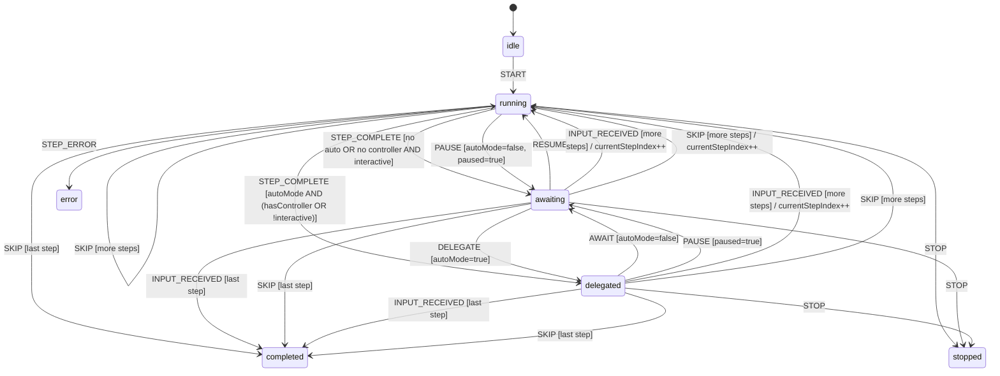

# Pass 2 Deep — Workflows Engine (Round 1)

**Target:** User-stated deliverable #2 — "the workflows system as something we could also add". Full mapping of templates → scheduler → state machine → directives → recovery.

**Files read this round (not previously in depth):**
- `/Users/jmagady/Dev/monocle/.reference/codemachine-cli/src/workflows/step/scenarios/{types,definitions,index}.ts`
- `/Users/jmagady/Dev/monocle/.reference/codemachine-cli/src/workflows/runner/modes/{continuous,types}.ts`
- `/Users/jmagady/Dev/monocle/.reference/codemachine-cli/src/workflows/runner/actions/{advance,directives}.ts`
- `/Users/jmagady/Dev/monocle/.reference/codemachine-cli/src/workflows/directives/{loop,trigger,checkpoint,error}/{evaluator,handler}.ts` (plus `trigger/execute.ts`)
- `/Users/jmagady/Dev/monocle/.reference/codemachine-cli/src/workflows/templates/globals.ts`
- `/Users/jmagady/Dev/monocle/.reference/codemachine-cli/src/workflows/utils/{config,resolvers/step,resolvers/folder}.ts`
- `/Users/jmagady/Dev/monocle/.reference/codemachine-cli/src/workflows/controller/{view,init,helper}.ts`
- `/Users/jmagady/Dev/monocle/.reference/codemachine-cli/src/workflows/indexing/{types,persistence,lifecycle}.ts`
- `/Users/jmagady/Dev/monocle/.reference/codemachine-cli/src/workflows/recovery/restore.ts`

## The Workflow Template Language (declarative)

CodeMachine's workflow templates are **plain ESM JavaScript modules**, not JSON/YAML. The template file declares the workflow shape; helper globals (`resolveStep`, `resolveFolder`, `resolveModule`, `separator`, `controller`) are injected at template-load time so authors can compose terse step lists.

### Template top-level schema

From `/Users/jmagady/Dev/monocle/.reference/codemachine-cli/src/workflows/templates/types.ts:94-103`:

```ts
interface WorkflowTemplate {
  name: string;                    // required
  steps: WorkflowStep[];           // required
  subAgentIds?: string[];          // sub-agents mirrored into .codemachine/ for the workflow
  tracks?: TracksConfig;           // user picks a track at onboarding
  conditionGroups?: ConditionGroup[];  // grouped conditional questions
  controller?: ControllerDefinition;   // pre-workflow conversational agent
  specification?: boolean;          // if true, .codemachine/inputs/specifications.md required
  autonomousMode?: 'true' | 'false' | 'never' | 'always';
}
```

Validator at `/Users/jmagady/Dev/monocle/.reference/codemachine-cli/src/workflows/templates/validator.ts:20-260` is a hand-rolled, error-aggregating type guard. Returns `{valid, errors[]}` with path-qualified messages like `Step[3].agentId must be a string`.

### Step shape

`WorkflowStep = ModuleStep | Separator` from `/Users/jmagady/Dev/monocle/.reference/codemachine-cli/src/workflows/templates/types.ts:33-55`.

| `ModuleStep` field | Meaning | Citation |
|---|---|---|
| `type: 'module'` | discriminator | line 34 |
| `agentId` | agent registered in `config/main.agents.js` | line 35 |
| `agentName` | display name | line 36 |
| `promptPath` | `string \| string[]` — concatenated prompts | line 37 |
| `model` | model override (per engine) | line 38 |
| `modelReasoningEffort` | `'low' \| 'medium' \| 'high'` | line 39 |
| `engine` | engine id override | line 40 |
| `module.behavior` | `LoopModuleBehavior \| TriggerModuleBehavior \| CheckpointModuleBehavior` | line 41 |
| `executeOnce` | skip if already executed | line 42 |
| `interactive` | `true` = wait for input, `false` = auto-advance; default `true` | line 43 |
| `tracks` | track filter (AND with selected) | line 44 |
| `conditions` | required (ALL) conditions | line 45 |
| `conditionsAny` | required (ANY) conditions | line 46 |
| `mcp` | per-step MCP server filter/allowlist | line 47 |

`Separator` is `{type:'separator', text}` — purely visual divider in the timeline.

### Template helpers (globals)

`/Users/jmagady/Dev/monocle/.reference/codemachine-cli/src/workflows/templates/globals.ts:1-27` defines five globals attached to `globalThis` at template load (`ensureTemplateGlobals()` called by `loadWorkflowModule`):

- `resolveStep(agentId, overrides?)` — looks up `mainAgents` (from `config/main.agents.js`), produces a `ModuleStep` with optional overrides. Throws `Unknown main agent: <id>` if unknown. Citation: `/Users/jmagady/Dev/monocle/.reference/codemachine-cli/src/workflows/utils/resolvers/step.ts:5-40`.
- `resolveFolder(folderName, overrides?)` — looks up a folder config in `mainAgents` (a record where `type === 'folder'`), reads every prompt file matching `^\d+\s*-` prefix, sorts numerically, returns one `ModuleStep` per file. Citation: `/Users/jmagady/Dev/monocle/.reference/codemachine-cli/src/workflows/utils/resolvers/folder.ts:13-67`.
- `resolveModule(...)` — similar to `resolveStep` but for `module` entries (with `behavior` config). Citation: `src/workflows/utils/resolvers/module.ts`.
- `separator(text)` — produces a `Separator` step.
- `controller(agentId, options?)` — produces a `ControllerDefinition` for `template.controller`. Citation: `/Users/jmagady/Dev/monocle/.reference/codemachine-cli/src/workflows/controller/helper.ts:47-53`.

### Tracks and condition groups

Tracks are **mutually exclusive options** (the user picks one). Condition groups are **questions whose answers gate which steps run**.

From `/Users/jmagady/Dev/monocle/.reference/codemachine-cli/src/workflows/templates/types.ts:64-92`:

```ts
interface ConditionGroup {
  id: string;
  question: string;
  multiSelect?: boolean;      // default: false (radio)
  tracks?: string[];          // only relevant if user picked these tracks
  conditions: Record<string, ConditionConfig>;
  children?: Record<string, ChildConditionGroup>;  // keyed by parent condition ID
}
```

The Ali template (`/Users/jmagady/Dev/monocle/.reference/codemachine-cli/templates/workflows/ali.workflow.js:20-78`) shows real use: a track (`expert` or `quick`) gates which condition groups apply, and child groups chain further questions.

## The State Machine (FSM)

`createMachine(config)` (`/Users/jmagady/Dev/monocle/.reference/codemachine-cli/src/workflows/state/machine.ts:26-115`) is a generic FSM accepting `{id, initial, context, states: {<state>: {on: {<event>: {target, guard?, action?}}, onEnter?, onExit?}}}`. Final states `completed`, `stopped`, `error` absorb all subsequent events silently.

`createWorkflowMachine(initialContext)` (`/Users/jmagady/Dev/monocle/.reference/codemachine-cli/src/workflows/state/machine.ts:120-377`) builds the workflow-specific instance.

### Full state graph



(Drawn from `/Users/jmagady/Dev/monocle/.reference/codemachine-cli/src/workflows/state/machine.ts:140-377` directly.)

## The 8-Scenario Dispatcher

The runner doesn't query the FSM alone; it computes a **scenario** from `(interactive, autoMode, hasChainedPrompts)` and dispatches to the matching mode handler.

From `/Users/jmagady/Dev/monocle/.reference/codemachine-cli/src/workflows/step/scenarios/definitions.ts:6-22`:

| # | interactive | autoMode | chainedPrompts | Mode | Input source | Handler | Notes |
|---|---|---|---|---|---|---|---|
| 1 | true | true | yes | interactive | controller | `interactiveHandler` | Controller drives with prompts |
| 2 | true | true | no | interactive | controller | `interactiveHandler` | Controller drives single step |
| 3 | true | false | yes | interactive | user | `interactiveHandler` | User drives with prompts |
| 4 | true | false | no | interactive | user | `interactiveHandler` | User drives each step |
| 5 | false | true | yes | autonomous | system | `autonomousHandler` | Fully autonomous - auto-send ALL prompts |
| 6 | false | true | no | continuous | system | `continuousHandler` | Auto-advance to next step |
| 7 | false | false | yes | interactive (forced) | user | `interactiveHandler` | Was non-interactive but mode is manual → forced user-driven with warning |
| 8 | false | false | no | interactive (forced) | user | `interactiveHandler` | Same — forced user-driven |

Forced scenarios (7,8) emit a warning message: `'This step is designed to run automatically. Enable autonomous mode or press Enter to continue.'` (`/Users/jmagady/Dev/monocle/.reference/codemachine-cli/src/workflows/step/scenarios/definitions.ts:106, 118`).

If `ctx.mode.paused`, the dispatcher **forces interactive mode regardless of scenario** (`/Users/jmagady/Dev/monocle/.reference/codemachine-cli/src/workflows/runner/core.ts:218-225`).

## Mode Handler Result Type

`/Users/jmagady/Dev/monocle/.reference/codemachine-cli/src/workflows/runner/modes/types.ts:14-22` — a closed sum:

```ts
type ModeHandlerResult =
  | { type: 'continue' }
  | { type: 'advance' }
  | { type: 'loop'; targetIndex: number }
  | { type: 'stop' }
  | { type: 'pause'; reason?: string }
  | { type: 'checkpoint' }
  | { type: 'error'; reason?: string }
  | { type: 'modeSwitch'; to: 'auto' | 'manual' };
```

All handlers return one of these. The runner's `processResult` (`/Users/jmagady/Dev/monocle/.reference/codemachine-cli/src/workflows/runner/core.ts:247-277`) is mostly a no-op pass-through; state transitions live INSIDE the handlers.

## Directives — agent-written signals

There are TWO directive paths:

### Path A — Post-step (via `processPostStepDirectives` in `step/hooks.ts`)

After step execution finishes, the workflow runs ALL the post-step directive evaluators against the agent's output:

- `handleLoopLogic` (`/Users/jmagady/Dev/monocle/.reference/codemachine-cli/src/workflows/directives/loop/handler.ts:11-77`) — if step has `module.behavior.type==='loop'`, reads `.codemachine/memory/directive.json`. If `action==='loop'` and iteration < maxIterations, rewinds `module.behavior.steps` positions, optionally with a `skip` allowlist. Tracks iteration count by `<module.id|agentId>:<index>` key.
- `handleTriggerLogic` (`/Users/jmagady/Dev/monocle/.reference/codemachine-cli/src/workflows/directives/trigger/handler.ts:11-62`) — if `module.behavior.type==='trigger'` and directive `action==='trigger'`, returns `{shouldTrigger, triggerAgentId, reason}` so the runner can `executeTriggerAgent()` (synchronously, in-line) before advancing.
- `handleCheckpointLogic` (`/Users/jmagady/Dev/monocle/.reference/codemachine-cli/src/workflows/directives/checkpoint/handler.ts:12-49`) — if module has checkpoint behavior, sets workflow `setCheckpointState({active, reason})` and signals `shouldStopWorkflow=true`.
- `handleErrorLogic` (`/Users/jmagady/Dev/monocle/.reference/codemachine-cli/src/workflows/directives/error/handler.ts:12-44`) — surfaces error directive, signals `shouldStopWorkflow=true`.

### Path B — On-advance (when user presses Enter / empty input)

`evaluateOnAdvance(cwd)` (`/Users/jmagady/Dev/monocle/.reference/codemachine-cli/src/workflows/directives/onAdvance.ts:24-49`) reads `.codemachine/memory/directive.json` and returns an `AdvanceAction`. The advance directive runs ONCE per Enter press in `handleAdvanceDirective` (`/Users/jmagady/Dev/monocle/.reference/codemachine-cli/src/workflows/runner/actions/directives.ts:69-134`).

After dispatch, `resetDirective(cwd)` writes `{action:'continue'}` back so directives don't fire twice.

### Trigger execution (mid-workflow agent invocation)

`executeTriggerAgent` (`/Users/jmagady/Dev/monocle/.reference/codemachine-cli/src/workflows/directives/trigger/execute.ts:30-144`):

1. Loads `triggerAgentId` config from `config/main.agents.js`.
2. Loads & processes the agent's prompt template (`processPromptString` resolves placeholders).
3. Looks up the source agent's `monitoringId` to set as parent (parent-child relationship in monitoring DB).
4. Calls `engine.run({prompt, workingDir, model, ...})` directly (NOT through `executeAgent` — bypasses workflow-step machinery).
5. On error: if the spawned agent has a `sessionId`, marks it as `paused` (resumable); else `failed`.

**Implication:** Trigger agents are a "side conversation" that completes synchronously within the parent step. They show up in the monitoring tree as children but don't participate in the FSM.

## Crash Recovery

The persistence layer is **`<cmRoot>/template.json`** (`/Users/jmagady/Dev/monocle/.reference/codemachine-cli/src/workflows/indexing/persistence.ts:14`). Schema:

```ts
interface TemplateTracking {
  activeTemplate: string;
  lastUpdated: string;        // ISO
  completedSteps?: Record<string, StepData>;
  notCompletedSteps?: number[];
  resumeFromLastStep?: boolean;
  selectedTrack?: string;
  selectedConditions?: string[];
  projectName?: string;
  autonomousMode?: string;
  controllerConfig?: ControllerConfig;
}

interface StepData {
  sessionId: string;
  monitoringId: number;
  completedChains?: number[];   // chained-prompt indices completed
  completedAt?: string;         // ISO; presence = step done
}
```

### Resume decision tree

`/Users/jmagady/Dev/monocle/.reference/codemachine-cli/src/workflows/indexing/types.ts:46-71`:

```
ResumeDecision = START_FRESH | RESUME_FROM_CHAIN | RESUME_FROM_CRASH | CONTINUE_AFTER_COMPLETED
```

Decision logic (per file, simplified):
1. If no `template.json`: `START_FRESH` (index 0).
2. If newest stepData has `completedChains.length > 0 && !completedAt`: `RESUME_FROM_CHAIN` from that step, at `getNextChainIndex(stepData) = max(completedChains)+1`.
3. If newest stepData has `sessionId && !completedAt`: `RESUME_FROM_CRASH`. Returns `sessionId`, `monitoringId`.
4. Else: `CONTINUE_AFTER_COMPLETED` — start at last completed + 1.

### Restoration sequence

`restoreFromCrash` (`/Users/jmagady/Dev/monocle/.reference/codemachine-cli/src/workflows/recovery/restore.ts:31-133`):

1. `emitter.registerMonitoringId(uniqueAgentId, monitoringId)` so TUI re-attaches the log panel.
2. Pulls persisted telemetry from SQLite (`monitor.getAgent(id).telemetry`) and re-emits it so token counts survive restart.
3. `status.awaiting(uniqueAgentId)` — agent shows as "awaiting input" instead of "running" until user/controller acts.
4. Sets `machineContext.currentMonitoringId` and `currentOutput`.
5. **Re-loads the chained prompts from the agent config** (`loadChainedPrompts(...)`) and re-builds the queue at `resumeIndex = max(completedChains)+1`.

**Note:** Recovery NEVER re-executes a completed turn. The agent is "left in conversation" — the next user input (or auto-mode advance) will resume the existing CLI session via `--resume <sessionId>`.

### What gets saved during normal operation

| Event | Persistence call | What's saved |
|---|---|---|
| Step started (fresh) | `indexManager.stepStarted(idx)` | `completedSteps[idx] = {sessionId:'', monitoringId:0}` (placeholder) |
| Session ID received from engine | `indexManager.stepSessionInitialized(idx, sessionId, monitoringId)` | Updates the placeholder with real values |
| Chained prompt N consumed | (implicit via `indexManager`) | `completedChains` appended |
| Step fully completes | `indexManager.stepCompleted(idx)` | Sets `completedAt = now()` |
| Ctrl+C while running | `MonitoringCleanup.registerWorkflowHandlers({onBeforeCleanup})` (`/Users/jmagady/Dev/monocle/.reference/codemachine-cli/src/workflows/run.ts:88-124`) | For each in-flight agent with sessionId, persist to `completedSteps` (or `controllerConfig`) so next run resumes |

## Controller View (pre-workflow conversation)

If `template.controller = controller('agent-id', {engine?, model?})` is set, the runner runs a special pre-workflow phase BEFORE any steps execute:

1. `runControllerView` (`/Users/jmagady/Dev/monocle/.reference/codemachine-cli/src/workflows/controller/view.ts:64-...`):
   - If `controllerConfig.sessionId` already exists → skip init, just attach.
   - Else: set `autonomousMode='never'`, set `view='controller'` in TUI, call `initControllerAgent(...)`.
2. `initControllerAgent` (`/Users/jmagady/Dev/monocle/.reference/codemachine-cli/src/workflows/controller/init.ts:29-126`):
   - Loads + concatenates prompt files (multiple paths allowed).
   - Processes placeholders.
   - Calls `executeAgent(agentId, prompt, {engineOverride, modelOverride, ui, onTelemetry})`.
   - Polls `AgentMonitorService` for the session ID (must exist — else throw).
   - Saves `controllerConfig = {agentId, sessionId, monitoringId}` to `template.json`.
3. Returns to user — TUI enters a conversation loop with the controller agent.
4. When user presses Enter to advance (or controller emits `propose_step_completion`), workflow transitions: `autonomousMode='true'`, `view='executing'`, first step begins.

The controller agent **owns a Claude session that persists across workflow steps**. Even during step execution, the user can press `c` to swap input back to the controller (signal `workflow:return-to-controller`), continue the controller conversation, then resume the step. This is the "delegated" path.

## Imports System (workflow package manager)

`getAllInstalledImports()` is used at three points (`/Users/jmagady/Dev/monocle/.reference/codemachine-cli/src/workflows/run.ts:53-56`, preflight, agent config loading). Each import is an installed package with this layout (`/Users/jmagady/Dev/monocle/.reference/codemachine-cli/src/shared/imports/types.ts:9-50`):

```
<install-path>/
  codemachine.json     # manifest: {name, version, paths?}
  config/              # main.agents.js + modules.js + agent-characters.json
  templates/workflows/ # *.workflow.js
  prompts/             # templates/<folder>/*.md
```

Imports are installed to `~/.codemachine/imports/<repo-name>/`. Registry at `~/.codemachine/imports/registry.json` (`/Users/jmagady/Dev/monocle/.reference/codemachine-cli/src/shared/imports/registry.ts:6-44`). Schema-versioned.

Path resolution order: **imports first, local fallback** (`/Users/jmagady/Dev/monocle/.reference/codemachine-cli/src/shared/imports/resolve.ts:20-55, 63-82, 90-113`). This means an imported package can shadow a local agent.

`DEFAULT_PACKAGES` (`/Users/jmagady/Dev/monocle/.reference/codemachine-cli/src/shared/imports/defaults.ts:18-27`) is currently empty (commented out) — `ali-workflow` was historically a default but was either bundled in-repo or deprecated.

Install protocol: GitHub `owner/repo` or full URL → clone to `~/.codemachine/imports/<repo-name>/` → parse `codemachine.json` manifest → register. `git`-based install (`/Users/jmagady/Dev/monocle/.reference/codemachine-cli/src/shared/imports/installer.ts` — referenced but not deep-read).

## What's NOT Yet Verified This Round

1. `step/execute.ts` and `step/hooks.ts` — how `executeStep` composes the agent prompt and how `processPostStepDirectives` orders the directive handlers.
2. Full `runStepFresh` recovery path — `handleCrashRecovery` callback invocation order.
3. Coordinator parser grammar (`src/agents/coordinator/parser.ts`) — for the "agent script" composability.
4. Onboarding flow's interaction with track/condition selection.
5. The full `eventBus` schema (event types).

## Delta Summary
- New contracts and facts added:
  - Full 8-scenario table with mode handler mappings (8 scenarios, 3 handlers)
  - Complete TemplateTracking + StepData persistence schema
  - 4-way ResumeDecision enum + decision logic
  - Trigger execution semantics (synchronous in-line agent invocation)
  - 4 post-step directives (loop, trigger, checkpoint, error) + 1 advance directive
  - Controller-view phase with cross-workflow session persistence
  - Imports system with manifest schema, registry path, precedence rules
  - Template helpers (5 globals)
  - WorkflowMachine: 7 states, 9 event types, fully declarative
  - Crash recovery: persists telemetry, re-loads chained prompts at resumeIndex
- Refinements: confirmed scenario forcing + warning text; confirmed directive file location

## Novelty Assessment
Novelty: SUBSTANTIVE

Justification: Before this round we knew the workflow runner had "FSM + modes + directives" but the precise table mapping `(interactive, autoMode, hasPrompts) → handler` was unknown, the directive ZOO (5 directive types with separate post-step vs on-advance evaluation paths) was unmapped, the recovery decision tree was unverified, and the imports system was a black box. Each of these changes the design of monocle's workflow port. Removing this round's findings would leave the spec without a concrete workflow grammar.

## Convergence Declaration
Another round needed. Remaining substantive gaps:
- `step/execute.ts` and `step/hooks.ts` — composition of the actual prompt sent to the engine, and the post-step directive ordering
- `events/{bus,emitter}.ts` — schema of events the TUI subscribes to (affects monocle's headless-vs-TUI seam)
- `mcp.ts` at workflow root — workflow-level MCP integration (not yet mapped)
- Onboarding & condition-selection persistence flow
- Coordinator parser grammar for the `codemachine run` script syntax

## State Checkpoint
```yaml
pass: 2
round: 1
status: complete
timestamp: 2026-05-11T00:07:00Z
novelty: SUBSTANTIVE
files_read_this_round: 18
loc_read_this_round: ~2500
```
