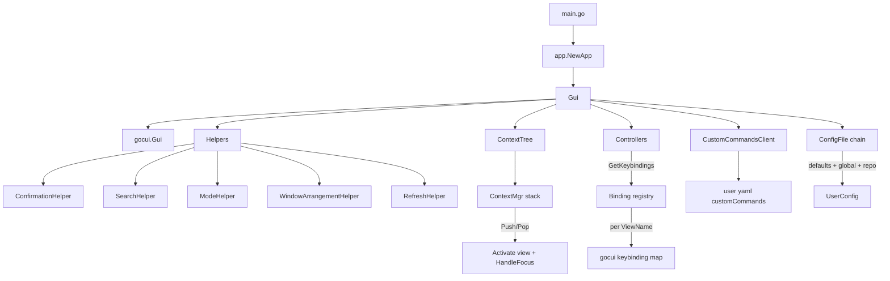
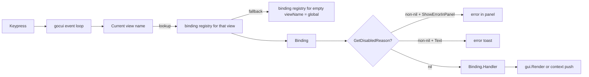

# Pass 3 — Architecture (SCOPED to the TUI)

## The five-layer wedge (highest to lowest abstraction)

```
┌───────────────────────────────────────────────────────────┐
│ 1. Gui god-struct  (pkg/gui/gui.go:62)                    │  orchestrator
├───────────────────────────────────────────────────────────┤
│ 2. ContextMgr + ContextTree                               │  panel/popup state
│    (pkg/gui/context.go, pkg/gui/context/setup.go)         │
├───────────────────────────────────────────────────────────┤
│ 3. Controllers  (pkg/gui/controllers/*)                   │  key dispatch handlers
│    + Helpers   (pkg/gui/controllers/helpers/*)            │  cross-cutting services
├───────────────────────────────────────────────────────────┤
│ 4. Popup + Custom Commands services                       │  overlay surfaces
│    (pkg/gui/popup, pkg/gui/services/custom_commands)      │
├───────────────────────────────────────────────────────────┤
│ 5. gocui Gui  (pkg/gocui/*) + boxlayout                   │  cell-grid substrate
└───────────────────────────────────────────────────────────┘
```

## Component catalogue

### Gui (the orchestrator)
`/Users/jmagady/Dev/monocle/.reference/lazygit/pkg/gui/gui.go:62`

A monolithic struct that holds:
- A `*gocui.Gui` (the underlying terminal renderer; line 64).
- `*GuiRepoState` — per-repo UI state including `ContextMgr`, search state, screen mode, popup options (line 231).
- `RepoStateMap map[Repo]*GuiRepoState` — multi-repo / multi-worktree state (line 79). Each repo gets its own state, restored when the user nav-pops back.
- `helpers *helpers.Helpers` — a struct of 30+ helper services attached per repo (line 143; full attachment at `pkg/gui/controllers.go:91`).
- `BackgroundRoutineMgr` — owns goroutines for refresh, fetch, update check (line 136).
- `Views types.Views` — flat record of every named view (`Status`, `Files`, `Commits`, `Confirmation`, `Menu`, `Search`, etc., enumerated at `pkg/gui/views.go:26-77`).
- `CustomCommandsClient *custom_commands.Client` — the user-extensions entry point (line 74).

The god-struct pattern is well-noted by the codebase itself (`gui.go:113` calls out the "gui god struct" in the comment for `KeybindingsOpts`).

### ContextMgr (panel + popup stack)
`/Users/jmagady/Dev/monocle/.reference/lazygit/pkg/gui/context.go:17`

Maintains `ContextStack []types.Context` — a stack of currently-focused contexts. Push/Pop semantics:
- `Push` (line 58) dispatches based on `ContextKind`:
  - `SIDE_CONTEXT` → wipe stack down to just this one (line 91-95).
  - `MAIN_CONTEXT` → replace any existing main, keep side underneath (line 97-107).
  - Anything else (popup, search) → push on top (line 108-127). Replacement rules collapse a top-most `TEMPORARY_POPUP` when pushing a non-search.
- `Pop` (line 132) deactivates current and activates the new top.
- Activation (line 172) takes care of: setting gocui current view, calling `HandleFocus`, updating cursor visibility based on `view.Editable && view.Mask == ""`.
- Helpers: `Current`, `CurrentSide`, `CurrentStatic` (popups skipped), `CurrentPopup` (only popups), `AllList`, `AllFilterable`, `AllSearchable`, `AllPatchExplorer` — type-switching navigators.

### Context kinds
`/Users/jmagady/Dev/monocle/.reference/lazygit/pkg/gui/types/context.go:14`

```
SIDE_CONTEXT       // left-rail panels: Files, Branches, Commits, Stash, Status
MAIN_CONTEXT       // main or secondary diff/content panel
PERSISTENT_POPUP   // commit-message, search prompt, command-description — you can return to it
TEMPORARY_POPUP    // confirmation, menu, prompt — single-shot, reused view
EXTRAS_CONTEXT     // the command-log scrollback panel (one of: focused / not)
GLOBAL_CONTEXT     // virtual context owning the global keybindings
DISPLAY_CONTEXT    // render-only views (options bar, app status, spacers)
```

This kind enum is the cornerstone of the context-aware keybinding pattern (see Pass B `key-dispatch`).

### Helpers (cross-cutting services)
`/Users/jmagady/Dev/monocle/.reference/lazygit/pkg/gui/controllers/helpers/` — 43 files, 9,267 LOC.

The Helpers struct (`pkg/gui/controllers.go:91`) is wired during `resetHelpersAndControllers()` and contains every cross-cutting service: `Refs`, `Files`, `Commits`, `MergeAndRebase`, `CherryPick`, `Confirmation`, `Search`, `Mode`, `AppStatus`, `Window`, `WindowArrangement`, `View`, `Refresh`. Helpers are how controllers reach the gui without owning a reference to the god struct directly — they take a `*helpers.HelperCommon` which exposes `IGuiCommon` (`pkg/gui/types/common.go:26`).

The IGuiCommon interface is the single most important boundary in lazygit: it's the surface every helper/controller speaks. It exposes `Refresh`, `Render`, `Context()`, `Menu`, `Confirm`, `Prompt`, `WithWaitingStatus`, `OnUIThread`, `OnWorker`, `AfterLayout`, `KeybindingsOpts`, etc. Monocle's `App` or `AppContext` trait should mirror this surface.

### Controllers (key handlers per context)
Each context has one or more controllers attached via `controllers.AttachControllers(ctx, ...)` (called from `pkg/gui/controllers.go:202..429`). A controller exposes:
- `GetKeybindings(opts types.KeybindingsOpts) []*types.Binding`
- `GetMouseKeybindings(...)`
- Optional `GetOnFocus`, `GetOnFocusLost`, `GetOnRenderToMain`, `GetOnQuit`.

The global controller (`pkg/gui/controllers/global_controller.go:9`) attaches to the synthetic `GLOBAL_CONTEXT` and owns universal keybindings (quit, refresh, screen-mode cycling, options menu, filtering menu, diffing menu, suspend, return/escape).

### Popups (the four overlay primitives)
`pkg/gui/popup/popup_handler.go:14` defines a `PopupHandler` with one method per primitive:
- `Alert(title, message)` — wraps `Confirm` with no handler.
- `Confirm(opts ConfirmOpts)` — Y/N popup.
- `ConfirmIf(condition, opts)` — only popup if condition is true; otherwise call handler directly.
- `Prompt(opts PromptOpts)` — editable text input with suggestion support.
- `Menu(opts CreateMenuOptions)` — list-of-actions overlay.
- `Toast` / `ErrorToast` — non-blocking bottom-bar status.
- `WithWaitingStatus` / `WithWaitingStatusSync` — spinner-wrapped async work.

The underlying view-level work happens in `pkg/gui/controllers/helpers/confirmation_helper.go:14`: `CreatePopupPanel`, `ResizeCurrentPopupPanels` (called every layout tick, line 315), `getPopupPanelDimensionsAux` (centres or offsets-from-parent at line 109), `resizeMenu`, `resizeConfirmationPanel`, `resizePromptPanel`, `ResizeCommitMessagePanels`.

### Search/Filter helpers
`pkg/gui/controllers/helpers/search_helper.go:20` — one helper drives both `/` filter and search. Per its file comment (line 14-18): "filtering changes the contents of the list, searching does not". Both share the `Search` context and the same prompt view.

### Window arrangement
`pkg/gui/controllers/helpers/window_arrangement_helper.go:124` — `GetWindowDimensions` returns a `map[string]boxlayout.Dimensions`. Constructed from a `boxlayout.Box` tree (line 141-166). Side-panel direction (column vs row) is decided by `shouldUsePortraitMode` (line 108) based on screen size + user config. Side accordion expansion controlled by `args.UserConfig.Gui.ExpandFocusedSidePanel` (line 447).

### Modes (rebase-mode / cherry-pick-mode / filter-mode / diffing-mode)
`pkg/gui/modes/` — each mode (`cherrypicking`, `filtering`, `diffing`, `marked_base_commit`) is a small state-bag (typically `Active() bool` + accumulated state). `ModeHelper` (`pkg/gui/controllers/helpers/mode_helper.go`, 223 LOC) renders the right-aligned info string about which modes are active and provides escape paths.

### Theming
`pkg/theme/theme.go:9` declares **package-level mutable globals** (`ActiveBorderColor`, `SelectedLineBgColor`, `OptionsFgColor`, `DefaultTextColor` etc.). `UpdateTheme(config)` reassigns them all (line 51-76). `pkg/gui/style/basic_styles.go:9` is a small palette of pre-built `TextStyle` values (Fg/Bg × 8 ANSI colours, plus `AttrUnderline`, `AttrBold`). Runtime theme switching: change config file → `ReloadChangedUserConfigFiles` (`pkg/config/app_config.go:559`) → `onUserConfigLoaded` calls `gui.setColorScheme()` → `UpdateTheme`.

### Config loading (layered)
`pkg/config/app_config.go:80` — `NewAppConfig`:
1. `findOrCreateConfigDir` finds the user config dir (XDG-based, line 134).
2. Build the initial `[]*ConfigFile{}` list. If `LG_CONFIG_FILE` env-var is set, it's a comma-separated list with `ConfigFilePolicyErrorIfMissing`. Otherwise a single file `<configDir>/config.yml` with `ConfigFilePolicyCreateIfMissing` (line 87-99).
3. `loadUserConfigWithDefaults` (line 139) iterates files in order, unmarshalling each on top of `GetDefaultConfigForPlatform(runtime.GOOS)`. Custom commands are *appended* across files rather than replaced (line 193-199).

Per-repo overrides come from `pkg/gui/gui.go:436` — `getPerRepoConfigFiles` builds a list starting from `.git/lazygit.yml` then walks upward adding `<dir>/.lazygit.yml` (line 446-455). These get appended via `ReloadUserConfigForRepo` (`pkg/config/app_config.go:547`).

### Custom commands
`pkg/gui/services/custom_commands/client.go:13` — `Client.GetCustomCommandKeybindings()` iterates `userConfig.CustomCommands` and returns `[]*types.Binding`. Each binding's view name(s) come from the command's `Context:` field (`global` → empty viewName; otherwise a comma-separated list of context-keys converted to view names via `keybinding_creator.go:45`).

`handler_creator.go:47` shows the prompt-chain pattern: an arbitrary-length list of `Prompts` is folded right-to-left into a wrapped handler. Each prompt has a type (`input`, `menu`, `menuFromCommand`, `confirm`) and an optional template `Condition` (line 110-126). Final handler resolves `customCommand.Command` through `text/template`, runs via `OS().Cmd.NewShell(...)`, then routes output based on `customCommand.Output ∈ {terminal, log, logWithPty, popup}` (line 295-340).

## Mermaid: high-level wiring



## Mermaid: keypress data flow



## State checkpoint
pass: 3
status: complete
diagrams: 2 mermaid
in-scope-only: true
