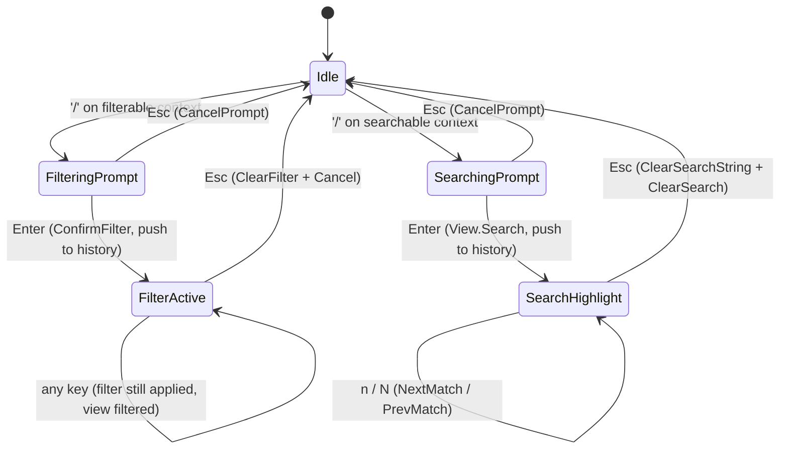
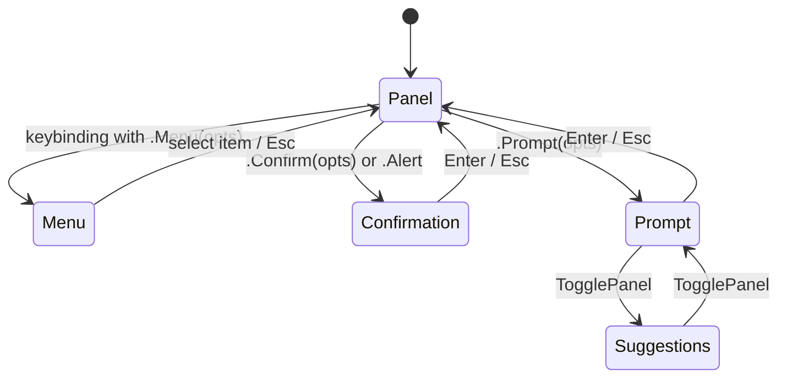

# Pass 4 — Domain Model (TUI domain, NOT git domain)

> Scope: lazygit's domain includes both the TUI plumbing and the git semantics. For monocle, only the TUI side is relevant. This pass enumerates the TUI domain entities. Git models (`pkg/commands/models`) are noted only when they leak into the UI types (e.g., the gui `Model` struct).

## Core TUI entities

### `Binding` — the unit of keybinding
`/Users/jmagady/Dev/monocle/.reference/lazygit/pkg/gui/types/keybindings.go:11`

Fields:
- `ViewName string` — empty string means "global, no view requirement"; otherwise must match the focused view name.
- `Key gocui.Key` — the keystroke (either a `KeyRune('q')`, a named special key, or a mouse event).
- `Handler func() error` — the action.
- `Description string`, `DescriptionFunc func() string` — static + dynamic descriptions; dynamic version must not be expensive (used for live re-rendering).
- `ShortDescription`, `ShortDescriptionFunc` — abbreviation used in the bottom-line options view.
- `Tag string` — typically `"navigation"` for movement bindings (used to bucket them in the `?` menu).
- `OpensMenu bool` — pure declarative; appended to descriptions with a trailing arrow in the cheatsheet.
- `DisplayOnScreen bool` — should appear in bottom options bar.
- `DisplayStyle *style.TextStyle` — colour override for that one binding on the bottom bar.
- `Tooltip string` — shown when this binding is highlighted in the keybindings menu.
- `GetDisabledReason func() *DisabledReason` — predicate; when non-nil and returns non-nil, the binding is rendered struck-through (in menus) or hidden (in bottom bar) and pressing it shows the reason as a toast.
- `Alternative string` — secondary form of the key for documentation purposes only.

### `DisabledReason`
`pkg/gui/types/common.go:213`
```go
Text                    string
ShowErrorInPanel        bool  // popup vs toast
AllowFurtherDispatching bool  // let next handler in chain try
```

### `KeybindingGuards`
`pkg/gui/types/keybindings.go:76`
```go
OutsideFilterMode Guard   // requires not currently filtering
NoPopupPanel      Guard   // requires no popup is focused
```
A `Guard` is `func(handler) handler`. Wrapping the handler is how lazygit composes preconditions inline at binding-registration time (see `pkg/gui/keybindings.go:24` and the many `opts.Guards.NoPopupPanel(...)` call sites at `controllers/global_controller.go:40,48,53,...`).

### `Context` (the panel-with-state)
`pkg/gui/types/context.go:111`
A `Context` aggregates:
- A `ContextKind` (see Pass 3).
- A `ContextKey string` — stable identifier (`MENU_CONTEXT_KEY`, `LOCAL_COMMITS_CONTEXT_KEY`, etc., listed in `pkg/gui/context/context.go`).
- A `*gocui.View` reference.
- A window name (for layout binding).
- A keybindings registry (`AddKeybindingsFn`) — multiple controllers can each contribute bindings; they're queried at keybinding-register time.
- Lifecycle hooks: `HandleFocus`, `HandleFocusLost`, `HandleRender`, `HandleRenderToMain`, `HandleQuit`.
- Optional traits: `IListContext`, `IFilterableContext`, `ISearchableContext`, `IPatchExplorerContext`, `DiffableContext`.

### `MenuItem`
`pkg/gui/types/common.go:251`
```go
Label          string         // or
LabelColumns   []string       // alternative when you want column alignment
OnPress        func() error
OpensMenu      bool
Key            gocui.Key      // optional shortcut inside the menu
Widget         MenuWidget     // checkbox / radio / none
Tooltip        string
DisabledReason *DisabledReason
Section        *MenuSection   // grouping header (pointer equality)
```

### `MenuSection`
`pkg/gui/types/common.go:208` — title + column index for header alignment.

### `Suggestion`
`pkg/gui/types/suggestion.go` — `Value` + `Label`; emitted by `FindSuggestionsFunc` for prompts and by the global suggestions context.

### `ConfirmOpts` / `PromptOpts` / `CreatePopupPanelOpts`
`pkg/gui/types/common.go:184,194,167` — option bags passed to `PopupHandler.Confirm` / `Prompt` / internal `createPopupPanelFn`. Notable: `PromptOpts.HandleClose`, `HandleDeleteSuggestion`, `FindSuggestionsFunc`, `AllowEditSuggestion`, `AllowEmptyInput`, `PreserveWhitespace`, `Mask` (for password input).

### `SearchState`
`pkg/gui/types/search_state.go` + ref `pkg/gui/controllers/helpers/search_helper.go:32-65`
```go
Context         Context  // which context launched the prompt
PrevSearchIndex int      // history scroll position
SearchType      SearchType  // None / Filter / Search
```
Filter changes which items are visible; search highlights matches.

### `Modes`
`pkg/gui/modes/` — each is a tiny state bag:
- `cherrypicking.CherryPicking` — `CherryPickedCommitHashSet` + `ContextKey` of origin context.
- `filtering.Filtering` — path being filtered + active flag.
- `diffing.Diffing` — `Ref`, `Reverse`, `Active`.
- `marked_base_commit.MarkedBaseCommit` — `commitHash` being held as rebase base.
`Modes.IsAnyModeActive()` is read by `WindowArrangementHelper` to decide whether to show the bottom info line even with `ShowBottomLine: false`.

### `ToastKind`
`pkg/gui/types/common.go:149` — `ToastKindStatus | ToastKindError`. Drives bottom-bar styling.

### `ScreenMode`
`pkg/gui/types/common.go:413` — `SCREEN_NORMAL | SCREEN_HALF | SCREEN_FULL`. Cycled via global `NextScreenMode` / `PrevScreenMode` keybindings (`global_controller.go:54,59`).

### `ItemOperation`
`pkg/gui/types/common.go:352` — tracks long-running per-item operations (`Pushing`, `Pulling`, `FastForwarding`, `Deleting`, `Fetching`, `CheckingOut`) so the spinner can decorate the item-display.

### `Model` (the gui-level model)
`pkg/gui/types/common.go:294` — bag of git data the gui reads from. We mention it to document the seam, not to deepen: when porting to monocle, this is where a project's own domain types (sessions, threads, files-on-disk) plug in.

## State machines (TUI-only)

### Search-prompt state machine


### Popup focus state machine


## Ubiquitous language

| Term | Meaning |
|---|---|
| Context | A focusable panel-with-state, holds a view + keybindings + lifecycle hooks. |
| Window | A layout cell; multiple contexts can map to the same window (e.g. `main` shows Normal, Staging, MergeConflicts, or PatchBuilding depending on side panel). |
| View | The gocui terminal-cell buffer that's painted. |
| Binding | A `(viewName, key, handler)` triple, optionally with metadata. |
| Helper | A cross-cutting service (search, confirmation, refresh, mode). |
| Controller | A binding-registration object attached per context. |
| Mode | A global state flag (filtering / cherry-picking / diffing / marked-base) altering footer + escape semantics. |
| Toast | Bottom-bar transient message. |
| Tooltip | Highlight-time hint, shown beneath menu items and inline in confirmation tooltip view. |
| Suggestion | Autocomplete entry; suggestions context appears below the prompt. |
| Cheatsheet | Generated from `GetCheatsheetKeybindings` (`pkg/gui/keybindings.go:48`) — used by `pkg/cheatsheet/` to emit markdown docs. |

## State checkpoint
pass: 4
status: complete
git-domain-notes: minimal (Model and ItemOperation touched only as seam contracts)
