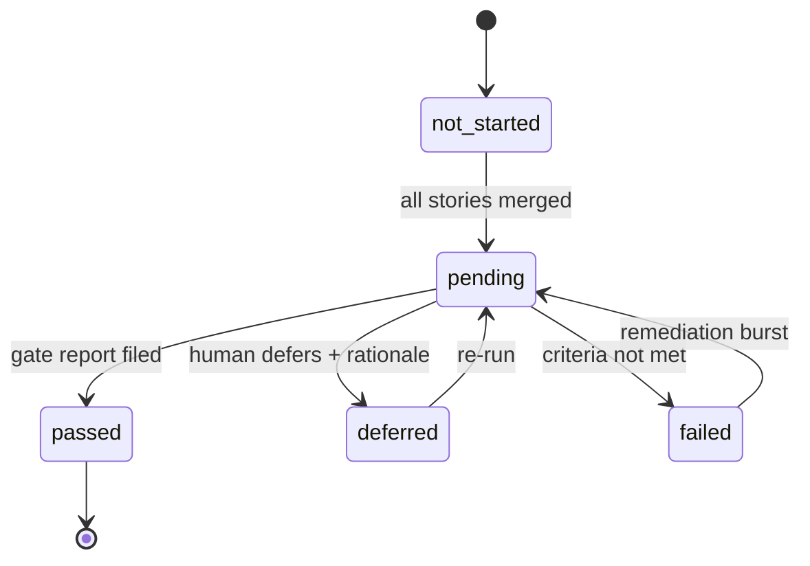
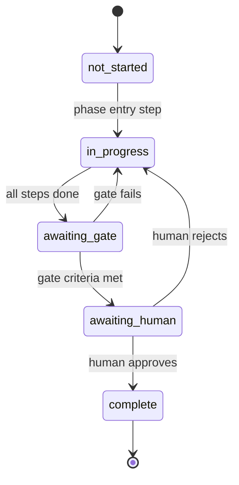

# Pass 3 — Scoped Domain Model: vsdd-factory

The domain model is the vocabulary monocle must speak to be factory-aware. Every term is grounded in a source file.

## Core Entities

### E1. Workflow

**Definition**: A YAML file declaring a DAG of `steps` for a single mode or phase.

**Identity**: `workflow.name` (string, kebab-case, e.g., `brownfield-vsdd`, `feature-vsdd`, `per-story-delivery`).

**Lifecycle**: Static. Workflows are checked into the plugin source tree; they are NOT runtime artifacts.

**Source**: `workflows/*.lobster`, `workflows/phases/*.lobster`. Loaded via `bin/lobster-parse` (`bin/lobster-parse:31-51` calls `yq eval --output-format=json '.' "$FILE" | jq "$EXPR"`).

**Cardinality**: 16 in-tree (8 modes + 8 phases).

### E2. Step

**Definition**: A single node in the workflow DAG. One of: agent invocation, skill invocation, gate evaluation, human approval, sub-workflow invocation, loop, parallel-foreach, or shell command.

**Identity**: `step.name` (string, unique within workflow).

**Edges**: `step.depends_on` (list of step names; same workflow).

**Source**: every step lives inside `workflow.steps[]`. See Pass 2 step schema.

### E3. Phase

**Definition**: A numbered VSDD pipeline stage (0–7). Has its own `.lobster` sub-workflow file. Phase progression is gated by a "phase gate" with criteria + human approval.

**Phases** (per `README.md:103-135`, `orchestrator.md:275-288`):
| Phase | Name | Sub-workflow file |
|---|---|---|
| 0 | Codebase Ingestion | `phases/phase-0-codebase-ingestion.lobster` |
| 1 | Spec Crystallization | `phases/phase-1-spec-crystallization.lobster` |
| 2 | Story Decomposition | `phases/phase-2-story-decomposition.lobster` |
| 3 | TDD Implementation | `phases/phase-3-tdd-implementation.lobster` |
| 4 | Holdout Evaluation | `phases/phase-4-holdout-evaluation.lobster` |
| 5 | Adversarial Refinement | `phases/phase-5-adversarial-refinement.lobster` |
| 6 | Formal Hardening | `phases/phase-6-formal-hardening.lobster` |
| 7 | Convergence | `phases/phase-7-convergence.lobster` |

Note: F1–F7 are aliases used by feature mode (DELTA phases). Phases are numbered identically; the `F` prefix signals "feature delta" context.

### E4. Mode

**Definition**: A top-level workflow that orchestrates phases for a particular operating context.

**Modes** (per `orchestrator.md:10-19`):
- `greenfield` — new project, brief → release
- `brownfield` — existing codebase, Phase 0 ingest + greenfield overlay
- `feature` — post-v1 incremental delta
- `maintenance` — scheduled quality sweeps
- `discovery` — autonomous opportunity research
- `planning` — adaptive front-end (artifact detection)
- `multi-repo` — cross-repo coordination
- `code-delivery` — per-story sub-workflow (invoked from Phase 3)

### E5. Cycle

**Definition**: A numbered/named directory under `.factory/cycles/` that archives all artifacts produced during one pass through the pipeline (or a coherent multi-phase run).

**Identity**: `cycle_id` string of form `vX.Y.Z-<type>-<name>` (per `cycle-manifest-template.md:2`).

**Lifecycle**: Created by orchestrator at pipeline start (e.g., `feature.lobster:105-114` `feature-cycle-init` step: "Create cycle directory: cycles/vX.Y.Z-feature-NAME/. Initialize cycle-manifest.md").

**Key file**: `cycle-manifest.md` with frontmatter `{document_type: cycle-manifest, cycle_id, cycle_type, version, status, started, completed, producer}`.

**Cycle types**: `greenfield | feature | bugfix | deprecation | refactor` (`cycle-manifest-template.md:5`).

### E6. Wave

**Definition**: A batch of stories that can be implemented in parallel (no inter-story dependencies within a wave). Wave ordering is computed via Kahn's algorithm on the story dependency graph.

**State carrier**: `.factory/wave-state.yaml`.

**Schema** (`wave-state-template.yaml:1-29`):
```yaml
current_wave: wave_0a
next_gate_required: null  # or wave_N when N's stories all merged but gate not run
waves:
  wave_0a:
    stories: []                    # all stories assigned
    stories_merged: []             # merged subset
    gate_status: not_started       # not_started | pending | passed | deferred | failed
    gate_date: null
    gate_report: null
    rationale: null
```

**State transitions** (`wave-state-template.yaml:10-15`):
- story merges → append to `stories_merged`
- all stories merged → `gate_status: pending`, set `next_gate_required`
- gate report filed → `gate_status: passed`, clear `next_gate_required`
- gate explicitly deferred → `gate_status: deferred` (with rationale)

### E7. STATE.md

**Definition**: The single live pipeline-state file. YAML frontmatter + markdown body. Size-bounded (200/500 line warn/block). Lives in `.factory/STATE.md`.

(Schema covered in Pass B "STATE.md deep dive" file.)

### E8. Story

**Definition**: A vertical-slice work unit with frontmatter, acceptance criteria, BC references, and a wave assignment. Lives at `.factory/stories/STORY-NNN.md`.

**Index**: `.factory/stories/STORY-INDEX.md`.

**Sprint state**: `.factory/stories/sprint-state.yaml` (per-story status).

### E9. Behavioral Contract (BC)

**Definition**: An L3 specification artifact describing a single behavior. Format `BC-S.SS.NNN` (DF-035 4-level hierarchy).

**Index**: `.factory/specs/behavioral-contracts/BC-INDEX.md`.

### E10. Verification Property (VP)

**Definition**: An L4 verification artifact (formal property, proof obligation). Format `VP-NNN`.

**Index**: `.factory/specs/verification-properties/VP-INDEX.md`.

### E11. Holdout Scenario

**Definition**: A hidden acceptance test, evaluated by an information-asymmetric agent in Phase 4. Lives in `.factory/holdout-scenarios/`.

**Index**: `.factory/holdout-scenarios/HS-INDEX.md`.

### E12. Hook Plugin

**Definition**: A WASM module registered in `hooks-registry.toml` to react to Claude Code events.

**Identity**: `entry.name` (unique).

**Native vs adapter**: 21 native-WASM plugins coexist with 35 entries that use the `hook-plugins/legacy-bash-adapter.wasm` shim to invoke `hooks/<name>.sh` bash scripts (`hooks-registry.toml:1-9`).

### E13. Event

**Definition**: A JSONL record written by the dispatcher to `.factory/logs/events-*.jsonl`. Emitted by:
- The dispatcher itself: `dispatcher.schema_mismatch`, `dispatcher.registry_invalid`, `plugin.async_block_discarded`, `plugin.timeout`, `plugin.invoked`, `plugin.completed`, `plugin.crashed` (`main.rs:23-31`).
- Plugins via `host::emit_event` (debug builds expose `VSDD_SINK_FILE` for test ingestion).

This is **monocle's primary input** for "recent hook activity".

### E14. Gate

**Definition**: A step type that evaluates assertion-style `criteria` bullets and either blocks or warns on failure.

**Sub-types**:
- Phase gate: end of each phase, criteria check, human approval
- Wave gate: after all stories in a wave merge, run integration + holdout + adversarial review
- Quality gate: ad-hoc within phases (e.g., red-gate, brownfield regression gate)

### E15. Information Asymmetry Wall

**Definition**: A `context.exclude` glob list applied to a spawned agent's context to enforce that certain artifacts are invisible. Critical examples (per `code-delivery.lobster:126-135`):
- Adversary cannot see implementer-notes, prior adversarial passes, semport history, holdout scenarios.
- PR reviewer cannot see `.factory/**`.
- Holdout evaluator cannot see source code, specs, or implementation notes.

## Ubiquitous Language Glossary (selected)

| Term | Meaning |
|---|---|
| Dark Factory | Autonomous AI software pipeline; vsdd-factory's tagline |
| VSDD | Verified Spec-Driven Development methodology |
| Red Gate | The state where tests compile but all fail; gates implementation |
| Convergence | Quantitative agreement across 7 dimensions: spec, test, impl, verification, visual, performance, documentation |
| Iron Law | Hard rule encoded in a skill; never weakened without eval evidence |
| Burst | A coherent set of edits committed as ONE commit on `factory-artifacts` |
| factory-artifacts (branch) | Orphan branch holding `.factory/` content |
| Tier (T1/T2/T3) | Agent tier — T1 read-only, T2 spec writers, T3 coders |
| BC-S.SS.NNN | 4-level Behavioral Contract identifier (Section.Sub.Number) |
| AC | Acceptance Criterion (per story) |
| DTU | Digital Twin Unit (clone of external API for hermetic testing) |
| Information Asymmetry Wall | Context exclusion enforced on agent spawn |
| Lobster file | A `.lobster` workflow file (YAML) — name was the user's choice |
| Semport | Cross-language porting workflow (DF-014) |
| Cycle | One pass through the pipeline, archived under `.factory/cycles/<id>/` |
| Wave | Parallel-eligible story batch |

## Relationships (Mermaid)

```mermaid
classDiagram
    class Workflow {
        +string name
        +string version
        +string description
        +Defaults defaults
        +List~Step~ steps
    }
    class Step {
        +string name
        +StepType type
        +List~string~ depends_on
        +string condition
        +string timeout
    }
    class Phase {
        +int number
        +string subworkflow_file
        +Gate phase_gate
    }
    class Mode {
        +string name
        +Workflow workflow
    }
    class StateMd {
        +string mode
        +int phase
        +string current_step
        +string current_cycle
    }
    class Cycle {
        +string cycle_id
        +string cycle_type
        +string version
        +CycleManifest manifest
    }
    class Wave {
        +string current_wave
        +Map waves
    }
    class HookPlugin {
        +string name
        +string event
        +string tool_regex
        +int priority
        +bool async
    }
    class Event {
        +string event_type
        +string session_id
        +string trace_id
        +string timestamp
    }

    Mode "1" --> "1" Workflow : has
    Workflow "1" --> "*" Step : contains
    Workflow "1" --> "*" Phase : orchestrates
    Phase "1" --> "1" Workflow : sub-workflow
    StateMd "1" --> "1" Mode : declares
    StateMd "1" --> "0..1" Cycle : current
    Cycle "1" --> "*" Wave : has
    HookPlugin "*" --> "*" Event : emits
    StateMd "1" --> "*" Event : surfaces
```



## State Machines

### Wave Gate State



### Phase State



### STATE.md `pipeline:` Field

Values (`skills/state-update/SKILL.md:65-75`):
- `INITIALIZED` — factory set up, no work started
- `RUNNING` — active phase
- `PAUSED` — human-requested pause
- `BLOCKED` — waiting on dependency or decision
- `COMPLETED` — all phases done

Also seen in workflows:
- `STARTED` (used by brownfield.lobster:116 — `pipeline: STARTED`)
- `FEATURE-CYCLE` (feature.lobster:113 — `pipeline: FEATURE-CYCLE`)
- `COMPLETE` (used by various end-states)

Monocle should treat the `pipeline` field as a free-form enum that includes at minimum `{INITIALIZED, STARTED, RUNNING, FEATURE-CYCLE, PAUSED, BLOCKED, COMPLETE, COMPLETED}` — and surface whatever value is found rather than enforcing a canonical set.

## Bounded Contexts

| Context | Owner | Monocle role |
|---|---|---|
| Workflow Definition | source tree (`.lobster` files) | READ |
| Workflow Execution | orchestrator agent + skills | OBSERVE (via STATE.md + events) |
| Dispatch & Hook Routing | factory-dispatcher binary | OBSERVE (via events.jsonl ONLY) |
| Pipeline State | STATE.md + wave-state.yaml | READ |
| Artifact Production | specialist agents | READ (artifact paths only) |
| Cycle Archive | `.factory/cycles/<id>/` | READ for "what happened" lookups |
| Multi-repo Coordination | `.factory-project/` | READ (if present) |

Monocle's bounded context is **READ-ONLY OBSERVATION**. It must never write to STATE.md, wave-state.yaml, or events.jsonl.

## State Checkpoint

```yaml
pass: 3
status: complete
entities: 15
glossary_terms: 14
timestamp: 2026-05-11T22:10:00Z
next_pass: 4-behavioral-contracts
```
