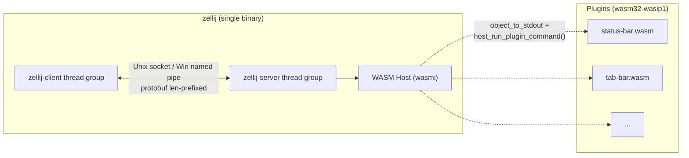

# Pass 1: Project Discovery (Scoped) — zellij

## Snapshot

- Reference: `/Users/jmagady/Dev/monocle/.reference/zellij/`
- HEAD: `de1e0f7560d03ce6b5514e22eef7e7852c9385e8` (2026-05-11 16:14:32 +0200, branch `main`)
- Tip commit subject: `docs(changelog): session manager close pr`
- Project: terminal workspace / multiplexer, batteries-included Rust, edition 2021, rust-version 1.92.
- Workspace crate count: 23 members (workspace root `Cargo.toml` lines 39-62).
- Rust file count (excluding `target/`, `.git/`): 307 source files (a low number — most crates have a few wide modules; `zellij-server/src/screen.rs` alone is 9,958 lines).
- Total Rust LOC (broad sweep, includes tests and snapshots): 275,464.
- Tests: 25 `*_test*.rs` files + 10 `unit/` test directories + insta snapshots in 10 locations.
- Build: Cargo workspace, `xtask`-based custom build runner (`xtask/`), per-os GitHub Actions matrix (`ubuntu-latest`, `macos-latest`, `windows-latest`).
- Wire format: Protobuf (`prost` 0.11.9) for client/server IPC plus plugin host-API.
- WASM engine: `wasmi` 0.51.3 (interpreter, not Wasmtime) with `wasmi_wasi`.
- Async: `tokio` 1.40 multi-thread runtime; `crossbeam` channels for cross-thread bus on the server side.
- Config language: KDL (`kdl` 4.5.0 crate, span feature enabled).
- License: MIT.

## In-Scope vs Out-of-Scope — Crate-by-Crate

The user-scope explicitly named workspace-architecture, IPC, plugin SDK, config/keybinds/themes, session persistence, default-plugins survey, and build/release. PTY internals, layout geometry, i18n, SSH plumbing, asciinema export, terminal emulation, and host-emulator integration code are explicitly out-of-scope because monocle uses tmux as the multiplexer and ratatui for layout — none of zellij's PTY/layout/mouse code transfers.

| Crate / Path | Type | LOC (.rs) | In-Scope | Rationale |
|---|---|---|---|---|
| `.` (root `src/`, the `zellij` bin) | bin | 5,822 | YES (entry-point surface) | Top-level `main.rs`, `build.rs`, e2e tests — needed to see how the workspace is wired into a single binary. |
| `zellij-utils/` | lib | 70,395 | YES (full) | Shared types: IPC messages, config (KDL), keybinds, themes, layout, plugin_api protobuf, errors, channels, sessions, session_serialization. This is THE boundary-types crate. |
| `zellij-client/` | lib | 18,340 | YES (full) | Client-side: connects to server over Unix socket / Windows pipe, owns stdin/stdout, ANSI/key parsing. Web client (axum) and remote-attach gated behind `web_server_capability` feature. |
| `zellij-server/` | lib | 142,410 | PARTIAL | Plugin host (`plugins/`), thread bus, route, server lib, screen-instruction enum, session_layout_metadata, host_query — all IN scope. PTY (`pty.rs`, `pty_writer.rs`, `terminal_bytes.rs`), grid (`panes/grid.rs`), terminal_pane / sixel / alacritty_functions, floating_panes / tiled_panes layout math, mouse handling — OUT of scope. |
| `zellij-tile/` | lib | 3,889 | YES (full) | Plugin SDK: `ZellijPlugin` trait, `ZellijWorker` trait, `register_plugin!`/`register_worker!` macros, `shim.rs` (host-call wrappers), `ui_components/` (Table/Ribbon/NestedList/Text). Compiled to `wasm32-wasip1`. |
| `zellij-tile-utils/` | lib | 31 | YES (full) | Tiny: three macros (`rgb!`, `palette_match!`, `style!`). Mentioned for completeness. |
| `xtask/` | bin | 1,736 | YES (light) | Custom build runner used by CI: `cargo xtask build`, `cargo xtask test`, `cargo xtask format`. Builds plugins to wasm. |
| `default-plugins/session-manager` | wasm plugin | 5,955 | YES | Reference example for monocle's `session-bookmark` UI. Lists live + resurrectable sessions, attach/resurrect/kill, rename, new session. |
| `default-plugins/status-bar` | wasm plugin | 5,945 | YES (representative) | Mode-aware bottom bar; biggest example of how plugins consume keybind state via `ModeUpdate` events. |
| `default-plugins/configuration` | wasm plugin | 3,801 | YES (representative) | Plugin-driven config editor — interesting because it mutates host config via `Reconfigure` / `RebindKeys` server instructions. |
| `default-plugins/compact-bar` | wasm plugin | 2,420 | YES (representative) | Alternate status bar variant. Surveyed only — same `ZellijPlugin` shape as status-bar. |
| `default-plugins/tab-bar` | wasm plugin | 796 | YES (representative) | Top tab bar — smallest "real" plugin, good ZellijPlugin skeleton. |
| `default-plugins/strider` | wasm plugin | 1,338 | YES (representative) | File browser; demonstrates `host` filesystem permission + `FileSystemUpdate` event subscription. |
| `default-plugins/plugin-manager` | wasm plugin | 1,103 | YES (representative) | UI for installing / managing plugins at runtime. |
| `default-plugins/about` | wasm plugin | 2,477 | survey only | Splash screen — no novel host integration. |
| `default-plugins/share` | wasm plugin | 2,488 | survey only | Session sharing UI; depends on web_server_capability feature. |
| `default-plugins/multiple-select` | wasm plugin | 695 | survey only | Pane multi-select tool — geometry-coupled. |
| `default-plugins/layout-manager` | wasm plugin | 4,344 | survey only | Layout picker UI — layout-geometry-coupled (out of scope per user). |
| `default-plugins/link` | wasm plugin | 474 | survey only | OSC-8 hyperlink follower. |
| `default-plugins/fixture-plugin-for-tests` | wasm plugin | 1,005 | survey only | Test fixture; not user-facing. |
| `assets/` | data | 0 .rs | YES (assets only) | Default themes, layouts, prebuilt plugin wasm — these are what `include_dir!(...)` and `include_bytes!(...)` embed into the binary. |
| `example/` | docs | 0 | YES | `example/default.kdl` is the canonical full keybind reference; `example/themes/example.kdl` is the canonical theme reference. |
| `.github/workflows/` | CI | 0 | YES | `rust.yml`, `release.yml`, `e2e.yml` — release-and-test strategy. |
| `docker-compose.yml` | infra | 0 | survey only | Dev convenience. |
| `wix/` | installer | 0 | NO | Windows installer wxs files. |
| `docs/` | docs | 0 | survey only | Architecture & error-handling notes. |

### Explicit Out-of-Scope (mentioned, not deepened)

| Area | Files | Reason |
|---|---|---|
| PTY / terminal-emulation core | `zellij-server/src/pty.rs` (2,407), `pty_writer.rs`, `terminal_bytes.rs`, `os_input_output*.rs` | Monocle delegates multiplexing to tmux. |
| Grid + character cells | `zellij-server/src/panes/grid.rs`, `terminal_character.rs`, `alacritty_functions.rs`, `sixel.rs` | Terminal-emulator state — monocle never owns these bytes. |
| Layout geometry math | `zellij-server/src/panes/floating_panes/*`, `tiled_panes/*` | Monocle uses ratatui's standard `Layout` primitive. |
| ANSI stdin parser | `zellij-client/src/stdin_ansi_parser.rs` | Monocle's stdin comes through tmux. |
| Mouse handling | `zellij-utils/src/input/mouse.rs`, `zellij-server/src/panes/.../*mouse*` | Captured by tmux. |
| i18n / translations | none in tree at this HEAD | Confirmed by ls — no `assets/translations/` directory. |
| SSH remote-attach | `zellij-client/src/remote_attach/` | Monocle uses tmux + reverse tunnel. |
| Asciinema export | not present in tree at this HEAD | Confirmed absent. |
| wezterm/alacritty embedding | none | Confirmed — these are upstream dependencies; no host-integration code lives in the tree. |

## Tech Stack Summary

| Layer | Choice |
|---|---|
| Language | Rust 2021, MSRV 1.92 |
| Build | Cargo workspace + `xtask` |
| Async runtime | tokio 1.40 (`fs`, `rt-multi-thread`, `macros`, `time`, `process`, `signal`, `io-util`, `io-std`, `net`) |
| Cross-thread channels | crossbeam `Sender`/`Receiver` re-exported via `zellij_utils::channels` |
| IPC transport | Unix domain socket via `interprocess` crate (Tokio-enabled); Windows named-pipe markers |
| Wire format | Protobuf (`prost`), length-prefixed (u32 LE) on the socket — see `write_protobuf_message` / `read_protobuf_message` in `zellij-utils/src/ipc.rs:402-426` |
| Plugin VM | `wasmi` 0.51.3 (pure Rust WASM interpreter; chosen over Wasmtime for portability/simplicity) + `wasmi_wasi` for WASI capability |
| Config language | KDL via `kdl` 4.5.0 |
| Error model | `anyhow` + `thiserror` + custom `ErrorContext` thread-local stack (`zellij-utils/src/errors.rs`) |
| CLI parser | `clap` 3.2.2 with `derive`, `env`, `color`, `suggestions` |
| TUI rendering | crossterm 0.28 + `ansi_term` + raw VT escapes (zellij is its own renderer; no ratatui) |
| Serialization for non-wire | `serde`, `serde_json` |
| Logging | `log` + `log4rs` (rolling-file appender) |
| Default-plugin compile target | `wasm32-wasip1` |

## Entry Points

| Binary | File | Role |
|---|---|---|
| `zellij` | `src/main.rs` | Single command-line dispatch (server, client, attach, ls, kill, setup, …) |
| `cli_client` | `zellij-client/src/cli_client.rs` (`pub mod cli_client`) | One-shot CLI command issuance over IPC (e.g. `zellij action send`) |
| `web_client` | `zellij-client/src/web_client/` (feature-gated) | Axum-based HTTP/WebSocket frontend |
| `xtask` | `xtask/src/main.rs` | Build orchestrator (cargo xtask) |
| `default-plugins/*` | `src/main.rs` per plugin | Compiled to wasm32-wasip1 |

## Dependency Graph (in-scope only)

```
zellij (bin)
├── zellij-client      (path dep, optional features: unstable, web_server_capability)
├── zellij-server      (path dep, optional features: web_server_capability)
└── zellij-utils       (workspace dep)

zellij-client
└── zellij-utils       (workspace dep)
zellij-server
└── zellij-utils       (workspace dep)

zellij-tile (compiled to wasm)
└── zellij-utils       (workspace dep)   -- only the protobuf/data types are usable from wasm

zellij-tile-utils       (no deps on other zellij crates)

default-plugins/*       (compiled to wasm32-wasip1)
└── zellij-tile         (path dep)
```

Mermaid view of the runtime topology (also useful for monocle's own design):



## File Manifest (most-referenced files for downstream passes)

| Path | Role | LOC |
|---|---|---|
| `zellij-utils/src/ipc.rs` | IPC envelope: `ClientToServerMsg`/`ServerToClientMsg`, `IpcSenderWithContext`, length-prefixed protobuf wire | 468 |
| `zellij-utils/src/channels.rs` | `SenderWithContext` wrapper + `ASYNCOPENCALLS` task-local | 44 |
| `zellij-utils/src/data.rs` | Domain types: `Event`, `EventType`, `Action`, `InputMode`, `KeyWithModifier`, `Palette`, `Styling`, `PaneId`, `PluginIds`, `PermissionType`, … | 3,656 |
| `zellij-utils/src/errors.rs` | `ErrorContext`, `LoggableError`, `FatalError`, prelude | 964 |
| `zellij-utils/src/sessions.rs` | `get_sessions`, `get_resurrectable_sessions`, socket probing | 731 |
| `zellij-utils/src/session_serialization.rs` | KDL serialization of running session layout for resurrection | 2,237 |
| `zellij-utils/src/setup.rs` | Defaults + asset extraction + `dump_default_config` | 905 |
| `zellij-utils/src/consts.rs` | All path roots: `ZELLIJ_SOCK_DIR`, `ZELLIJ_CACHE_DIR`, `ZELLIJ_SESSION_INFO_CACHE_DIR`, `CLIENT_SERVER_CONTRACT_VERSION` | (read first 100) |
| `zellij-utils/src/client_server_contract/*.proto` | Wire schemas (3 files: `client_to_server.proto`, `server_to_client.proto`, `common_types.proto`) | (3 files) |
| `zellij-utils/src/input/config.rs` | `Config` aggregate (keybinds, options, themes, plugins, ui, env, background_plugins, web_client) | 1,335 |
| `zellij-utils/src/input/keybinds.rs` | `Keybinds(HashMap<InputMode, HashMap<KeyWithModifier, Vec<Action>>>)` | 142 |
| `zellij-utils/src/input/layout.rs` | `Layout`, `TiledPaneLayout`, `FloatingPaneLayout`, `SwapTiledLayout`, `SwapFloatingLayout` | 2,103 |
| `zellij-utils/src/input/options.rs` | CLI-overridable `Options`: theme, default_mode, default_shell, default_cwd, default_layout, on_force_close, scroll_buffer_size, … | 581 |
| `zellij-utils/src/input/theme.rs` | `Themes`, `Theme(sourced_from_external_file, palette: Styling)`, `UiConfig`, `FrameConfig`, `HexColor` | 148 |
| `zellij-utils/src/input/permission.rs` | `PermissionCache` for plugin permissions (host-fs cache file) | 67 |
| `zellij-utils/src/input/actions.rs` | `Action` enum (the central dispatch type) | 3,919 |
| `zellij-utils/src/kdl/mod.rs` | KDL→Action / Config / Theme parsing | 7,255 |
| `zellij-utils/src/kdl/kdl_layout_parser.rs` | KDL→Layout parser | 2,601 |
| `zellij-utils/src/plugin_api/*` | Plugin API protobuf wire types (16 .proto + 16 .rs pairs) — total 12,361 LOC | (sub-tree) |
| `zellij-client/src/lib.rs` | `ClientInstruction`, `start_client`, thread spawn, dispatch | 1,431 |
| `zellij-client/src/input_handler.rs` | Keyboard → Action dispatch | (large) |
| `zellij-client/src/os_input_output.rs` | `ClientOsApi` trait | (medium) |
| `zellij-server/src/lib.rs` | `ServerInstruction`, server bootstrap, thread spawn | 2,348 |
| `zellij-server/src/thread_bus.rs` | `ThreadSenders`, `Bus<T>` for typed cross-thread routing | 243 |
| `zellij-server/src/route.rs` | Per-client message routing thread; pairs `ClientToServerMsg` → typed instruction | 3,179 |
| `zellij-server/src/screen.rs` | `ScreenInstruction` + screen worker (10K LOC — the heart of state mutation, but layout-coupled so we won't deepen) | 9,958 |
| `zellij-server/src/plugins/mod.rs` | `PluginInstruction` (47 variants), plugin worker | 1,465 |
| `zellij-server/src/plugins/wasm_bridge.rs` | `WasmBridge`: client+plugin state, base_modes, keybinds, env, theme | 2,261 |
| `zellij-server/src/plugins/plugin_loader.rs` | Loads wasm bytes → wasmi `Module` → `Store` + `Instance`, mounts WASI preopens | 488 |
| `zellij-server/src/plugins/plugin_map.rs` | `PluginMap`: registry of running `(PluginId, ClientId) → (RunningPlugin, Subscriptions, workers)` | 412 |
| `zellij-server/src/plugins/zellij_exports.rs` | Host-side implementation of every `PluginCommand` (the host ABI) | 5,376 |
| `zellij-server/src/plugins/pipes.rs` | CLI-pipe ↔ plugin pipe state machine | 253 |
| `zellij-tile/src/lib.rs` | `ZellijPlugin` trait, `ZellijWorker` trait | 220 |
| `zellij-tile/src/shim.rs` | All host-call helpers (`subscribe`, `set_selectable`, `request_permission`, …) | 2,864 |

## State Checkpoint

```yaml
pass: 1
status: complete
files_scanned: 60+
crates_in_scope: 18 (counting representative default-plugins)
crates_out_of_scope_areas: 9 (subpaths within zellij-server, plus client-side stdin parser)
timestamp: 2026-05-11T20:00:00Z
next_pass: 2
```
