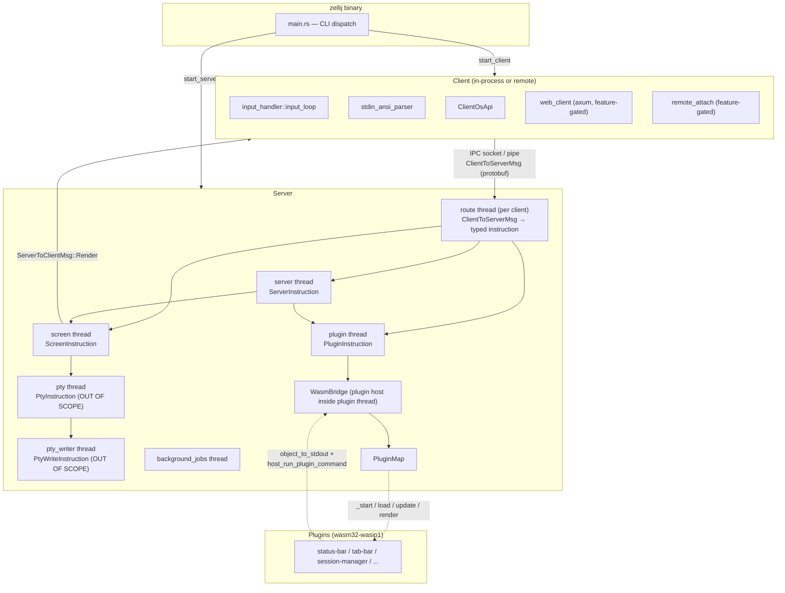
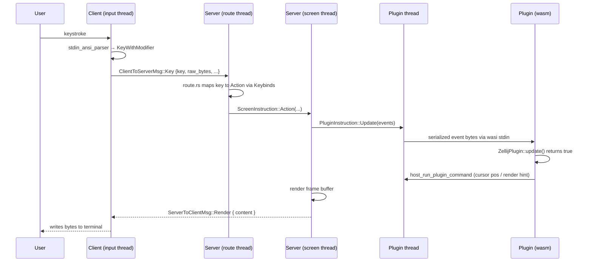

# Pass 2: Architecture — zellij

## Component Catalog (in-scope only)

| Component | Crate / Path | Role | Owns |
|---|---|---|---|
| zellij bin | `src/main.rs` | Single entry point. Dispatches into setup, ls, kill, attach, run, server, etc. | CLI parsing, process model selection |
| Client | `zellij-client/` | Connects to running server over IPC socket. Owns the user's terminal stdin/stdout. | terminal raw mode, stdin parser, render loop |
| Server | `zellij-server/` | Stateful daemon. Owns all panes, plugin host, layout state. | session state, sub-thread bus |
| Utils | `zellij-utils/` | Shared types, IPC, KDL, errors, channels, sessions, plugin_api protobufs. | wire schema, config types |
| Tile (plugin SDK) | `zellij-tile/`, `zellij-tile-utils/` | Compiled into each wasm plugin. `ZellijPlugin` trait + host-call shim. | plugin-side ABI |
| Default plugins | `default-plugins/<name>/` | wasm32-wasip1 binaries shipped with zellij; loaded by Server's plugin host. | individual UI / utility behaviors |
| xtask | `xtask/` | Custom build orchestrator: builds wasm plugins, copies them into `assets/plugins/`, runs tests/format. | cross-target build, vendored assets |

## Process / Deployment Topology

zellij is **one binary, two roles, N plugins**:

1. First invocation: `zellij` — on first run forks/spawns a server in the background (daemonize) and connects as a client.
2. Subsequent `zellij attach` calls: another client connects to the same server over the same Unix socket.
3. Server runs many threads: `server`, `screen`, `pty`, `pty_writer`, `plugin`, `background_jobs`, plus one `route` thread per connected client.
4. Plugins run inside the Server process under a `wasmi::Engine` (interpreter VM); each plugin gets its own WASI `Store` and per-`(plugin_id, client_id)` `Instance`.
5. Optional `web_server_capability` feature spawns a tokio-based axum HTTP/WebSocket server inside the client crate for remote browser attach.

Single-binary multi-role pattern is implemented in `src/main.rs` via a `Command` enum dispatch to either `start_client` or `start_server`. See `zellij-client/src/lib.rs:43` (`ASYNC_RUNTIME: OnceLock<tokio::runtime::Runtime>`) and `zellij-server/src/lib.rs:1-90`.

## Layer Diagram



## Cross-Cutting Concerns

| Concern | Where |
|---|---|
| Error model | `zellij-utils/src/errors.rs` — `anyhow::Result` everywhere, plus `ErrorContext` thread-local and `task_local!` (`OPENCALLS` / `ASYNCOPENCALLS`) carrying a stack-of-instructions for crash diagnosis. `LoggableError`, `FatalError`, `ZellijError`. |
| Logging | `log` crate facade, `log4rs` rolling-file appender in `zellij-utils/src/logging.rs`. `LoggingPipe` in server forwards plugin stderr to host log. |
| Cross-thread messaging | crossbeam `Sender`/`Receiver` wrapped with `SenderWithContext` (carries `ErrorContext`) — `zellij-utils/src/channels.rs:23-32`. |
| Cross-process messaging | `IpcSenderWithContext` / `IpcReceiverWithContext` over `interprocess::local_socket::Stream`, length-prefixed protobuf — `zellij-utils/src/ipc.rs:226-310`. |
| Config | KDL via `kdl` 4.5.0. Parsing centralized in `zellij-utils/src/kdl/mod.rs` (7,255 LOC) and `kdl_layout_parser.rs` (2,601 LOC). |
| Permissions | `PermissionCache` persisted at `ZELLIJ_PLUGIN_PERMISSIONS_CACHE` — `zellij-utils/src/input/permission.rs:1-67`. |
| Async | tokio multi-thread runtime per role; `OnceLock<Runtime>` to avoid re-init (`zellij-client/src/lib.rs:43`). |
| Wire schema versioning | `CLIENT_SERVER_CONTRACT_VERSION: usize = 1` and `CLIENT_SERVER_CONTRACT_DIR` for path scoping — `zellij-utils/src/consts.rs:25-95`. |
| Paths | All cache/socket/config paths gated through `directories::ProjectDirs`; lazy_static globals in `zellij-utils/src/consts.rs`. |
| State persistence | `~/.cache/zellij/session_info/<session_name>/session-layout.kdl` + `session-metadata.kdl`, written by server, read by `sessions::get_resurrectable_sessions`. |

## Thread Bus (Server)

`zellij-server/src/thread_bus.rs` defines `ThreadSenders` (a struct of `Option<SenderWithContext<T>>` for every thread) and `Bus<T>` (the receiver wrapper for a specific thread).

```rust
pub struct ThreadSenders {
    pub to_screen: Option<SenderWithContext<ScreenInstruction>>,
    pub to_pty: Option<SenderWithContext<PtyInstruction>>,
    pub to_plugin: Option<SenderWithContext<PluginInstruction>>,
    pub to_server: Option<SenderWithContext<ServerInstruction>>,
    pub to_pty_writer: Option<SenderWithContext<PtyWriteInstruction>>,
    pub to_background_jobs: Option<SenderWithContext<BackgroundJob>>,
    pub should_silently_fail: bool,
}
```
Source: `zellij-server/src/thread_bus.rs:11-23`.

Each `send_to_*` method does:
1. Optionally swallow the error (test convenience).
2. Otherwise `context("failed to get X sender")?` → `send(instruction).to_anyhow()`.

This is essentially a manually-typed "actor mesh" — every thread is an actor with a typed mailbox. The pattern is extremely portable.

## Data Flow Diagram (key paths)



## Build & Release

- **Custom orchestrator**: `xtask`. CI calls `cargo xtask build`, `cargo xtask test`, `cargo xtask format --check`. (Workflow: `.github/workflows/rust.yml`.)
- **Plugin compilation**: `xtask` cross-compiles each `default-plugins/*` crate to `wasm32-wasip1`, then `include_bytes!` embeds them via `zellij-utils/src/setup.rs:43-79` (`DEFAULT_CONFIG`, `DEFAULT_LAYOUT`, `STRIDER_LAYOUT`, …) and `zellij-utils/assets/plugins/*` for the runtime fallback path.
- **OS matrix**: ubuntu-latest, macos-latest, windows-latest; plus a `test-no-web` job that runs `cargo xtask test --no-web`.
- **Release**: `.github/workflows/release.yml`; `[profile.release]` enables `lto = true`, `strip = true`, `codegen-units = 1` (workspace `Cargo.toml:124-127`).
- **Packaging**: `[package.metadata.deb]` deb config (workspace `Cargo.toml:128-141`), wix MSI configuration in `wix/`, `[package.metadata.binstall]` for `cargo-binstall` (workspace `Cargo.toml:143-146`).
- **Feature flags** (top crate): `default = ["plugins_from_target", "vendored_curl", "web_server_capability"]`; `unstable`, `disable_automatic_asset_installation`, `web_server_capability` propagated through workspace.

## State Checkpoint

```yaml
pass: 2
status: complete
timestamp: 2026-05-11T20:05:00Z
next_pass: 3
```
