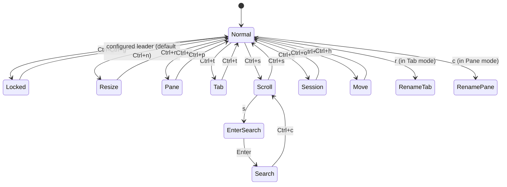
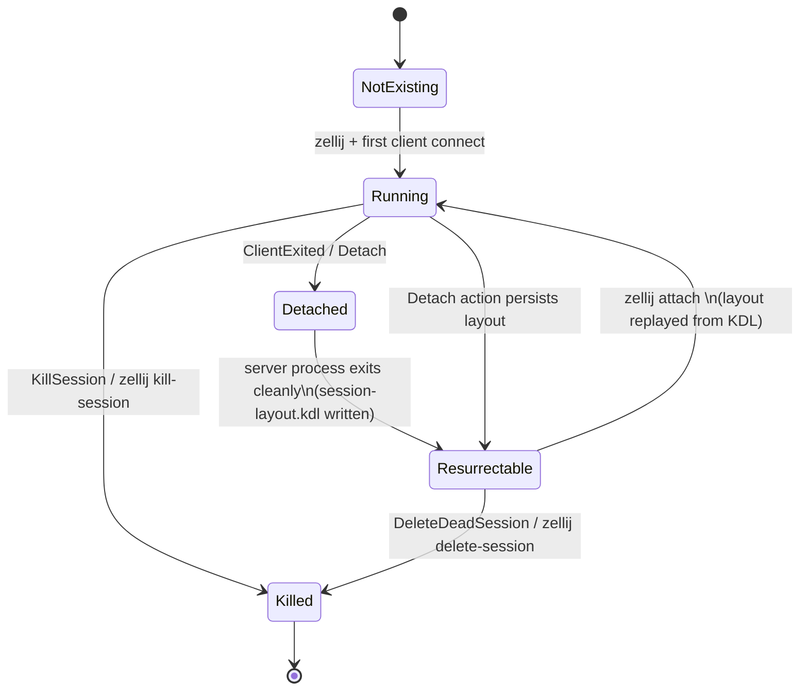
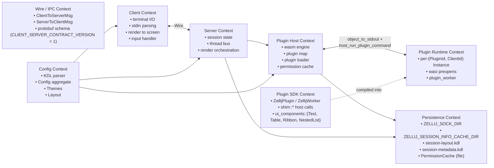

# Pass 3: Domain Model — zellij

## Ubiquitous Language (in-scope subset)

| Term | Meaning |
|---|---|
| Session | A long-lived server process keyed by a name (UUID-or-words). Persisted via socket file in `ZELLIJ_SOCK_DIR` and metadata in `ZELLIJ_SESSION_INFO_CACHE_DIR`. |
| Client | A process attached to a session, owning a terminal. There can be multiple clients per session ("multiplayer"). Identified by `ClientId = u16`. |
| Tab | One concurrent workspace in a session. Holds tiled + floating panes. |
| Pane | A leaf rectangle on screen. Discriminated by `PaneId`: `PaneId::Terminal(u32)` or `PaneId::Plugin(u32)`. |
| Layout | A serializable tree of panes (tabs, tiled, floating) parsed from KDL. Can be built-in (`default.kdl`, `strider.kdl`) or user-defined. |
| Plugin | A wasm32-wasip1 module loaded by the server's plugin thread, hosting a `ZellijPlugin` impl. |
| Worker | A secondary wasm instance launched by a plugin when it exports an `_worker`-suffixed function (e.g. `my_worker`). Messages exchanged via `post_message_to`/`CustomMessage`. |
| Mode (InputMode) | The current "keymap context" — one of 14 modes (Normal, Locked, Resize, Pane, Tab, Scroll, EnterSearch, Search, RenameTab, RenamePane, Session, Move, Prompt, Tmux). |
| Action | The unit of behavior. Bindings produce `Vec<Action>`. ≈170 Action variants drive every state mutation. |
| Event | Server→Plugin notification (`Event::ModeUpdate`, `Event::Key`, `Event::FileSystemUpdate`, …). 50+ variants. |
| EventType | A subscription discriminant for filtering events. |
| PluginCommand | A plugin→host RPC: `Subscribe`, `OpenFile`, `Write`, `RenameSession`, etc. ≈120 variants. |
| PluginPermission | A capability gate. 17 permission types: `ReadApplicationState`, `ChangeApplicationState`, `OpenFiles`, `RunCommands`, `OpenTerminalsOrPlugins`, `WriteToStdin`, `WebAccess`, `ReadCliPipes`, `MessageAndLaunchOtherPlugins`, `Reconfigure`, `FullHdAccess`, `StartWebServer`, `InterceptInput`, `ReadPaneContents`, `RunActionsAsUser`, `WriteToClipboard`, `ReadSessionEnvironmentVariables`. |
| Pipe | A named bidirectional message channel between CLI / external process / plugin. |
| Layout (resurrected) | A KDL file at `~/.cache/zellij/session_info/<name>/session-layout.kdl` reconstructed on detach. |
| Style / Palette | Color and styling typed model in `zellij-utils/src/data.rs`. |

## Entity Catalog (boundary types — these are what monocle would port)

### Identity & connectivity

| Entity | File | Definition |
|---|---|---|
| `ClientId` | `zellij-server/src/lib.rs:79`, also `zellij-utils/src/data.rs:31` | `pub type ClientId = u16;` |
| `PaneId` | `zellij-utils/src/data.rs:2809` | `enum PaneId { Terminal(u32), Plugin(u32) }` |
| `PluginId` | `zellij-server/src/plugins/mod.rs:50` | `pub type PluginId = u32;` |
| `Session` | `zellij-utils/src/ipc.rs:50-56` | `{ id: u64, conn_name: String, alias: String }` |
| `SessionInfo` | `zellij-utils/src/data.rs` (referenced in `Event::SessionUpdate`) | Live session metadata broadcast to plugins. |
| `ConnectToSession` | `zellij-utils/src/data.rs` (referenced widely) | Target descriptor for `SwitchSession`. |
| `ClientAttributes` | `zellij-utils/src/ipc.rs:60-63` | `{ size: Size, style: Style }` — sent on `AttachClient` / `FirstClientConnected`. |
| `ExitReason` | `zellij-utils/src/ipc.rs:209-218` | `Normal / NormalDetached / ForceDetached / CannotAttach / Disconnect / WebClientsForbidden / KickedByHost / CustomExitStatus(i32) / Error(String)` |

### Config aggregate (top-level Config)

`zellij-utils/src/input/config.rs:31-41`:

```rust
pub struct Config {
    pub keybinds: Keybinds,
    pub options: Options,
    pub themes: Themes,
    pub plugins: PluginAliases,
    pub ui: UiConfig,
    pub env: EnvironmentVariables,
    pub background_plugins: HashSet<RunPluginOrAlias>,
    pub web_client: WebClientConfig,
}
```

### Keybinds (`zellij-utils/src/input/keybinds.rs:11`)

```rust
pub struct Keybinds(pub HashMap<InputMode, HashMap<KeyWithModifier, Vec<Action>>>);
```

A two-level map: mode → key → action sequence. Default action for unbound keys depends on mode (Locked / default-mode → `Write`, RenameTab → `TabNameInput`, EnterSearch → `SearchInput`, else `NoOp`). See `default_action_for_mode` at `keybinds.rs:71-99`.

### InputMode (`zellij-utils/src/data.rs:1146-1196`)

14 variants — encoded keyboard contexts. Modal interaction is THE model. Plugins receive a `ModeUpdate(ModeInfo)` event whenever the mode changes (which itself ships keybind tables; plugins can subscribe to `InitialKeybinds` to cache them and process subsequent `ModeUpdate`s without keybind payloads — see `Event::InitialKeybinds` at `data.rs:1027-1029`).

### Themes (`zellij-utils/src/input/theme.rs:38-79`)

```rust
pub struct Themes(HashMap<String, Theme>);
pub struct Theme {
    pub sourced_from_external_file: bool,
    #[serde(flatten)]
    pub palette: Styling,
}
pub struct UiConfig { pub pane_frames: FrameConfig }
pub struct FrameConfig { pub rounded_corners: bool, pub hide_session_name: bool }
```

Theme palettes use `Styling` (full token-mapped palette) defined in `zellij-utils/src/data.rs` around line 1380+. Hex parsing accepts `#RGB` or `#RRGGBB` via `HexColor` (`theme.rs:81-130`). The host terminal can also report its color mode via CSI 2031 / DSR 997 — see `HostTerminalThemeMode { Dark, Light }` at `data.rs:1034` and the corresponding `Event::HostTerminalThemeChanged` and `ClientToServerMsg::HostTerminalThemeChanged`.

### Options (`zellij-utils/src/input/options.rs`)

CLI-overridable runtime config. Notable fields: `simplified_ui`, `theme`, `theme_dark`, `theme_light`, `default_mode`, `default_shell`, `default_cwd`, `default_layout`, `layout_dir`, `theme_dir`, `on_force_close`, plus many more.

### Layout types (`zellij-utils/src/input/layout.rs:1-2103`)

The Layout tree types:
- `Layout` — top-level: tabs, swap layouts, template
- `TiledPaneLayout`, `FloatingPaneLayout`
- `SwapTiledLayout`, `SwapFloatingLayout`
- `Run` — what a pane runs: `Run::Command(RunCommand)`, `Run::Plugin(RunPluginOrAlias)`, `Run::EditFile`, `Run::Cwd`
- `RunPluginOrAlias` — either an inline `RunPlugin` or `PluginAlias` (named reference)
- `PluginUserConfiguration(BTreeMap<String, String>)` — plugin instance config

These are also the data structures **persisted** by `session_serialization::serialize_session_layout` (`zellij-utils/src/session_serialization.rs:43-83`).

### Permission model (`zellij-utils/src/data.rs:1063-1086` + `input/permission.rs`)

```rust
pub enum PermissionType { /* 17 variants — listed in Pass 1 glossary */ }

pub struct PermissionCache {
    path: PathBuf,
    granted: HashMap<String, Vec<PermissionType>>,
}
```

The cache is persisted to disk so users only grant permissions once per plugin URL.

### IPC envelope (`zellij-utils/src/ipc.rs:95-167`)

`ClientToServerMsg` — 20 variants. Notable:
- `FirstClientConnected { cli_assets: CliAssets, is_web_client: bool }`
- `AttachClient { cli_assets, tab_position_to_focus, pane_to_focus, is_web_client }`
- `Action { action, terminal_id, client_id, is_cli_client }`
- `Key { key, raw_bytes, is_kitty_keyboard_protocol }`
- `DetachSession { client_ids }`, `ClientExited`, `KillSession`, `ConnStatus`
- `TerminalResize { new_size }`, `TerminalPixelDimensions { ... }`
- `SubscribeToPaneRenders { pane_ids, scrollback, ansi }`
- `ForwardedReplyFromHost { token, reply_bytes }` (host-query whitelisting)
- `HostTerminalThemeChanged { mode }`

`ServerToClientMsg` — 13 variants. Notable:
- `Render { content: String }` (the per-frame escape-sequence blob)
- `Exit { exit_reason }`, `Connected`, `UnblockInputThread`
- `SwitchSession { connect_to_session }`
- `PaneRenderUpdate { pane_id, viewport, scrollback, is_initial }`
- `ForwardQueryToHost { token, query_bytes }` (the server asks the client to issue an ANSI query to the host terminal)
- `ConfigFileUpdated`, `RenamedSession { name }`, `StartWebServer`, `QueryTerminalSize`

### Server-internal instruction enums (the "actor mailbox" types)

| Enum | File | Variants |
|---|---|---|
| `ServerInstruction` | `zellij-server/src/lib.rs:82-178` | 33 variants — first-client / attach / detach / log / kill-session / rebind / reconfigure / web-server / forward-query-to-host / mode-changes / share-current-session / disconnect-all / change-mode-for-all-clients |
| `PluginInstruction` | `zellij-server/src/plugins/mod.rs:57-220` | 47 variants — load, update, unload, reload, resize, add/remove client, new-tab, override-layout, apply-cached, post-message-*, plugin-subscribed-to-events, permission-request-result, dump-layout, list-clients-*, cli-pipe, keybind-pipe, cache-plugin-events, message-from-plugin, unblock-cli-pipes, reconfigure, watch-filesystem, change-plugin-host-dir, web-server-started, pane-render-report, user-input, layout-list-update, request-state-update, session-save-time, detect-plugin-config-changes, highlight-clicked |
| `ScreenInstruction` | `zellij-server/src/screen.rs` (9,958 LOC, mostly handlers for these) | (out-of-scope per user; depth elided) |
| `PtyInstruction`, `PtyWriteInstruction`, `BackgroundJob` | server | OUT OF SCOPE per user |

### Client-internal instruction enum

`zellij-client/src/lib.rs:170-194` — `ClientInstruction` — 14 variants mirroring `ServerToClientMsg` with `Error(String)` injected for local error reporting. `From<ServerToClientMsg>` is implemented for it.

## Plugin SDK Domain Types (the "plugin-facing" model)

### `ZellijPlugin` trait (`zellij-tile/src/lib.rs:31-49`)

```rust
pub trait ZellijPlugin: Default {
    fn load(&mut self, configuration: BTreeMap<String, String>) {}
    fn update(&mut self, event: Event) -> bool { false }   // returns true → render() will be called
    fn pipe(&mut self, pipe_message: PipeMessage) -> bool { false }
    fn render(&mut self, rows: usize, cols: usize) {}
}
```

### `ZellijWorker` trait (`zellij-tile/src/lib.rs:67-72`)

```rust
pub trait ZellijWorker<'de>: Default + Serialize + Deserialize<'de> {
    fn on_message(&mut self, message: String, payload: String) {}
}
```

### `Event` enum (`zellij-utils/src/data.rs:945-1032`)

50+ variants. Logical clusters:

- **Mode / focus / state** — `ModeUpdate(ModeInfo)`, `TabUpdate(Vec<TabInfo>)`, `PaneUpdate(PaneManifest)`, `Visible(bool)`
- **Input** — `Key(KeyWithModifier)`, `Mouse(Mouse)`, `PastedText(String)`, `InterceptedKeyPress(KeyWithModifier)`
- **File system** — `FileSystemCreate/Read/Update/Delete(Vec<(PathBuf, Option<FileMetadata>)>)`
- **Clipboard** — `CopyToClipboard(CopyDestination)`, `SystemClipboardFailure`, `InputReceived`
- **Sessions / clients** — `SessionUpdate(Vec<SessionInfo>, Vec<(String, Duration)>)`, `ListClients(Vec<ClientInfo>)`, `CwdChanged`, `CommandChanged`
- **Plugin pane lifecycle** — `CommandPaneOpened/Exited/ReRun`, `EditPaneOpened/Exited`, `PaneClosed(PaneId)`
- **Web / commands** — `RunCommandResult(exit, stdout, stderr, context)`, `WebRequestResult(status, headers, body, context)`, `WebServerStatus(WebServerStatus)`, `FailedToStartWebServer`
- **Workers** — `CustomMessage(message, payload)`
- **Permissions / config** — `PermissionRequestResult(PermissionStatus)`, `PluginConfigurationChanged(map)`, `FailedToWriteConfigToDisk`, `ConfigWasWrittenToDisk`
- **Lifecycle** — `BeforeClose`, `Timer(f64)` (seconds since timer scheduled)
- **Rendering / observe** — `PaneRenderReport(map)`, `PaneRenderReportWithAnsi(map)`, `ActionComplete(action, pane_id, context)`, `UserAction(Action, ClientId, terminal_id, cli_client_id)`
- **Layouts** — `AvailableLayoutInfo(layouts, errors)`
- **Misc** — `HighlightClicked { pane_id, pattern, matched_string, context }`, `HostFolderChanged(PathBuf)`, `FailedToChangeHostFolder`, `InitialKeybinds(KeybindsVec)`, `HostTerminalThemeChanged(HostTerminalThemeMode)`

### `PluginCommand` enum (`zellij-utils/src/data.rs:3325-3450+`)

~120 variants — the plugin-side ABI verbs. Logical clusters:

- **Subscriptions / metadata** — `Subscribe/Unsubscribe`, `GetPluginIds`, `GetZellijVersion`
- **Open** — `OpenFile`, `OpenFileFloating`, `OpenFileInPlace`, `OpenTerminal*`, `OpenCommandPane*`
- **Pane control** — `Resize`, `ResizeWithDirection`, `MoveFocus(Direction)`, `MovePane`, `MovePaneWithDirection`, `FocusNextPane`, `FocusPreviousPane`, `ToggleFocusFullscreen`, `TogglePaneFrames`, `TogglePaneEmbedOrEject`, `CloseFocus`, `CloseTerminalPane`, `ClosePluginPane`, `FocusTerminalPane`, `FocusPluginPane`
- **Tabs** — `SwitchTabTo`, `GoToNextTab`, `GoToPreviousTab`, `GoToTab`, `GoToTabName`, `FocusOrCreateTab`, `NewTab`, `NewTabsWithLayout`, `NewTabsWithLayoutInfo`, `ToggleTab`, `CloseFocusedTab`, `UndoRenameTab`, `RenameTab`
- **Input modes / scrolling** — `SwitchToMode`, `ClearScreen`, `Scroll*`, `PageScroll*`
- **Self plugin state** — `SetSelectable`, `ShowCursor`, `HideSelf`, `ShowSelf`, `CloseSelf`
- **Stdin / clipboard** — `Write`, `WriteChars`, `WriteToPaneId`, `WriteCharsToPaneId`
- **Config / permissions** — `RequestPluginPermissions`, `Reconfigure(stringified_config, save)`
- **Process control** — `RunCommand`, `ExecCmd`, `SendSigintToPaneId`, `SendSigkillToPaneId`, `RerunCommandPane`
- **Web** — `WebRequest`
- **Sessions** — `SwitchSession`, `RenameSession`, `DeleteDeadSession`, `DeleteAllDeadSessions`, `KillSessions`
- **Pipes** — `UnblockCliPipeInput`, `BlockCliPipeInput`, `CliPipeOutput`, `MessageToPlugin`
- **Filesystem observe** — `ScanHostFolder`, `WatchFilesystem`
- **Pane scrollback** — `GetPaneScrollback`, `EditScrollback`, `EditScrollbackForPaneWithId`
- **Pane info** — `GetPanePid`, `GetPaneRunningCommand`, `DumpSessionLayout { tab_index }`
- **Plugin↔plugin** — `PostMessageTo`, `PostMessageToPlugin`
- **Layout** — `PreviousSwapLayout`, `NextSwapLayout`
- **Theme** — `Reconfigure` also drives theme changes (the parameter is a stringified KDL config)

## State Machines

### InputMode (modal keymap state)



(Lifted from `example/default.kdl`. Each transition is a `SwitchToMode` action attached to a keybind in the originating mode.)

### Session lifecycle



Persistence trigger: see `PluginInstruction::LogLayoutToHd(SessionLayoutMetadata)` (`plugins/mod.rs:138`). The server periodically dumps via `DumpLayout` + `LogLayoutToHd`. The dumped KDL doc is produced by `session_serialization::serialize_session_layout` (`session_serialization.rs:43-83`) and written to `session_layout_cache_file_name(session_name)`.

### Plugin lifecycle

```mermaid
stateDiagram-v2
    [*] --> Loading: PluginInstruction::Load
    Loading --> AwaitingPermission: requires permissions
    AwaitingPermission --> Running: PermissionRequestResult(Granted)
    AwaitingPermission --> Failed: PermissionRequestResult(Denied)
    Loading --> Running: wasm Instance + _start + load() returned
    Running --> Running: update() / pipe() / render()
    Running --> Reloading: PluginInstruction::Reload
    Reloading --> Running
    Running --> Unloading: PluginInstruction::Unload(pid)
    Unloading --> [*]
```

## Bounded-Context Map (in-scope)



## State Checkpoint

```yaml
pass: 3
status: complete
timestamp: 2026-05-11T20:10:00Z
next_pass: 4
```
