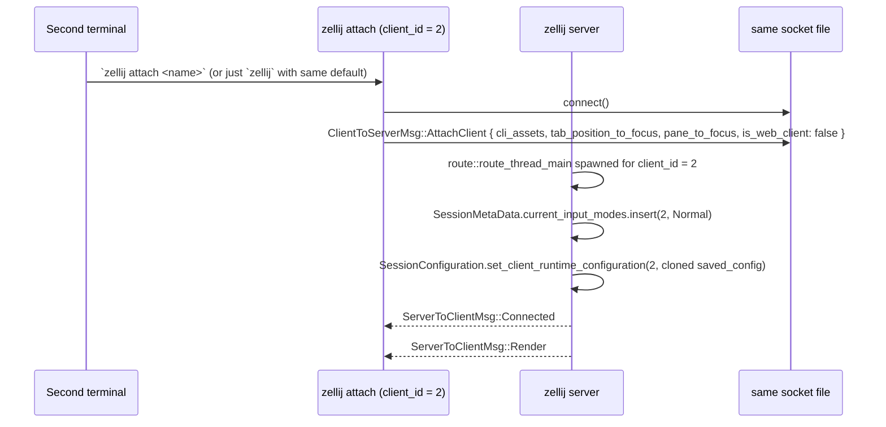

# Phase B Deep — Client/Server IPC Model (Round 1)

## Wire-Level Summary

zellij's IPC has three layers stacked:

1. **Transport** — `interprocess::local_socket::Stream` (Unix domain socket on \*nix; named pipe on Windows). Wrapped behind the trait `IpcStream: Read + Write + Send + 'static` (with `try_clone_stream` for split read/write).
2. **Framing** — Length-prefixed: 4-byte LE u32 message length followed by exactly that many bytes of protobuf payload. (`zellij-utils/src/ipc.rs:402-426`)
3. **Schema** — `prost`-generated structs from `client_server_contract/*.proto` + `client_server_contract/common_types.proto`. Schema version: `CLIENT_SERVER_CONTRACT_VERSION: usize = 1` (`consts.rs:25`).

## ClientToServerMsg — Full Variant Catalog

Source: `zellij-utils/src/ipc.rs:95-167`. 20 variants. Mapped to their proto tag numbers from `client_to_server.proto`.

| # | Variant | Payload | Purpose |
|---|---|---|---|
| 1 | `DetachSession` | `client_ids: Vec<ClientId>` | Detach the specified clients (or self) |
| 2 | `TerminalPixelDimensions` | `pixel_dimensions: PixelDimensions` | Client reports its terminal cell-pixel size |
| 3 | `BackgroundColor` | `color: String` | Client reports host bg color (from OSC11 reply) |
| 4 | `ForegroundColor` | `color: String` | Client reports host fg color (from OSC10 reply) |
| 5 | `ColorRegisters` | `color_registers: Vec<ColorRegister>` | Client reports host palette registers (Sixel etc.) |
| 6 | `TerminalResize` | `new_size: Size` | Client reports a new terminal size (resize) |
| 7 | `FirstClientConnected` | `cli_assets: CliAssets, is_web_client: bool` | The very first attach when the server has no clients yet |
| 8 | `AttachClient` | `cli_assets, tab_position_to_focus, pane_to_focus, is_web_client` | A subsequent attach to an existing session |
| 9 | `Action` | `action, terminal_id, client_id, is_cli_client` | Dispatch a single `Action` (used by `zellij action send ...`) |
| 10 | `Key` | `key: KeyWithModifier, raw_bytes: Vec<u8>, is_kitty_keyboard_protocol: bool` | A keystroke from the user's keyboard |
| 11 | `ClientExited` | (empty) | Notify server the client is going away cleanly |
| 12 | `KillSession` | (empty) | Tear down the entire session |
| 13 | `ConnStatus` | (empty) | Liveness probe — server replies `Connected` |
| 14 | `WebServerStarted` | `base_url: String` | Out-of-band notice that web server is up |
| 15 | `FailedToStartWebServer` | `error: String` | Out-of-band failure notice |
| 16 | `AttachWatcherClient` | `terminal_size: Size, is_web_client: bool` | Read-only "subscribe" client (no input, only renders) |
| 17 | `SubscribeToPaneRenders` | `pane_ids, scrollback: Option<usize>, ansi: bool` | Request continuous render updates for specific panes |
| 18 | `DesktopNotificationResponse` | `raw_bytes: Vec<u8>` | Forwarded reply to a desktop-notification query |
| 19 | `ForwardedReplyFromHost` | `token: u32, reply_bytes: Vec<u8>` | Reply to a previous `ForwardQueryToHost` |
| 20 | `HostTerminalThemeChanged` | `mode: HostTerminalThemeMode` | Host reported dark/light theme via CSI 2031 |

## ServerToClientMsg — Full Variant Catalog

Source: `zellij-utils/src/ipc.rs:174-204`. 13 variants.

| # | Variant | Payload | Purpose |
|---|---|---|---|
| 1 | `Render` | `content: String` | A blob of VT escape sequences to write to the user's terminal stdout |
| 2 | `UnblockInputThread` | (empty) | Server is done with a blocking op; client can resume reading stdin |
| 3 | `Exit` | `exit_reason: ExitReason` | End-of-session; carries the reason for user-facing message |
| 4 | `Connected` | (empty) | Reply to `ConnStatus` |
| 5 | `Log` | `lines: Vec<String>` | Forward info-level log lines |
| 6 | `LogError` | `lines: Vec<String>` | Forward error-level log lines |
| 7 | `SwitchSession` | `connect_to_session: ConnectToSession` | Disconnect this session, reconnect to another (in-place) |
| 8 | `UnblockCliPipeInput` | `pipe_name: String` | Named-pipe coordination |
| 9 | `CliPipeOutput` | `pipe_name, output: String` | Named-pipe data |
| 10 | `QueryTerminalSize` | (empty) | Ask the client to re-report its size |
| 11 | `StartWebServer` | (empty) | Ask the client to spawn the web server subprocess |
| 12 | `RenamedSession` | `name: String` | Server applied a session rename |
| 13 | `ConfigFileUpdated` | (empty) | Server saw the config file change |
| 14 | `PaneRenderUpdate` | `pane_id, viewport: Vec<String>, scrollback: Option<Vec<String>>, is_initial: bool` | Per-pane render delta for subscribed clients |
| 15 | `SubscribedPaneClosed` | `pane_id` | Notify subscriber that a watched pane disappeared |
| 16 | `ForwardQueryToHost` | `token, query_bytes: Vec<u8>` | Ask client to write `query_bytes` to host terminal and capture reply |

(That's actually 16 variants — initial 13 in the visible source + 3 additional that appear in the proto and the `From<ServerToClientMsg>` impl at `zellij-client/src/lib.rs:196-220`.)

## IPC Send/Recv Wrappers

`zellij-utils/src/ipc.rs:226-310`:

```rust
pub struct IpcSenderWithContext<T: Serialize> {
    sender: io::BufWriter<Box<dyn IpcStream>>,
    _phantom: PhantomData<T>,
}

pub struct IpcReceiverWithContext<T> {
    receiver: io::BufReader<Box<dyn IpcStream>>,
    _phantom: PhantomData<T>,
}
```

Each carries a phantom-typed `T` so the call sites know whether they're sending client-side or server-side messages. The actual methods take concrete enums:
- `send_client_msg(&mut self, msg: ClientToServerMsg)` (`ipc.rs:251-256`)
- `send_server_msg(&mut self, msg: ServerToClientMsg)` (`ipc.rs:258-263`)
- `recv_client_msg(&mut self) -> Option<(ClientToServerMsg, ErrorContext)>` (`ipc.rs:296-308`)
- `recv_server_msg(&mut self) -> Option<(ServerToClientMsg, ErrorContext)>` (`ipc.rs:310-322`)

`get_receiver`/`get_sender` (`ipc.rs:267-274`) clone the underlying socket so the same connection can be read from one thread and written to from another. This is the pattern that lets the client have a render-output thread and an input-read thread on the same physical socket.

## Lifecycle: First Attach

```mermaid
sequenceDiagram
    autonumber
    participant U as User shell
    participant Z as zellij CLI
    participant D as zellij --daemon (server)
    participant S as Unix socket file (~/.cache/zellij/<contract_version_1>/<session_name>)

    U->>Z: `zellij`
    Z->>Z: Config::try_from(opts), determine session name
    Z->>Z: Check ZELLIJ_SOCK_DIR for existing socket; none found
    Z->>D: fork+daemonize: cargo bin path + --server-mode
    D->>S: bind / create socket file
    Z->>S: connect()
    Z->>S: ClientToServerMsg::FirstClientConnected { cli_assets, is_web_client: false }
    D->>D: spawn screen, pty, plugin, pty_writer, background_jobs threads
    D->>D: spawn route thread for this client_id = 1
    D-->>S: ServerToClientMsg::Connected
    D-->>S: ServerToClientMsg::Render { content: first frame }
    Z->>U: write Render bytes to stdout
```

## Lifecycle: Subsequent Attach (multi-client)



## Lifecycle: Detach

```mermaid
sequenceDiagram
    participant Z as zellij client
    participant D as zellij server
    Z->>D: ClientToServerMsg::Action { action: Action::Detach, client_id: Some(self_id) }
    D->>D: serialize session layout → write session-layout.kdl
    D->>D: ServerInstruction::DetachSession([self_id])
    D->>D: route thread for self_id terminates
    D-->>Z: ServerToClientMsg::Exit { exit_reason: ExitReason::NormalDetached }
    Z->>Z: restore terminal mode, exit 0
    Note over D: Server keeps running; awaits future attach
```

## Lifecycle: Force-Detach (another client takes over)

If config option `on_force_close = "detach"` and another client connects when one is already attached, the existing client gets `Exit { exit_reason: ExitReason::ForceDetached }`. Display message: "Session was detached from this client (possibly because another client connected)". (`ipc.rs:228-234`)

If `on_force_close = "quit"`, the session is killed instead. (`options.rs:10-25`)

## The `route` Thread

`zellij-server/src/route.rs` — 3,179 LOC. Architecturally this is the **only** place that:
- Reads from a connected client's socket.
- Knows how to map every `ClientToServerMsg` variant into one or more typed `*Instruction` mailbox sends.

Per-attach there is exactly one route thread (spawned by the server's main loop when it sees `FirstClientConnected` / `AttachClient`). The route thread terminates when its client disconnects.

`route_thread_main` reads from `IpcReceiverWithContext<ClientToServerMsg>` and per-variant decides where the message goes:

| Incoming variant | Destination thread bus |
|---|---|
| `Key { ... }` | translate to Action via client keybinds, then dispatch to Screen / Plugin / Pty |
| `Action { ... }` | Screen or Plugin depending on action type |
| `TerminalResize { ... }` | Screen |
| `TerminalPixelDimensions { ... }`, `BackgroundColor`, `ForegroundColor`, `ColorRegisters` | Screen / Plugin |
| `DetachSession { ... }` | Server (via `ServerInstruction::DetachSession`) |
| `KillSession` | Server |
| `ConnStatus` | reply directly with `Connected` (synchronous round-trip) |
| `SubscribeToPaneRenders { ... }` | Screen |
| `DesktopNotificationResponse { ... }` | Plugin (forwarded to plugin that requested) |
| `ForwardedReplyFromHost { ... }` | Server (forward to whoever owns the token) |
| `HostTerminalThemeChanged { ... }` | Server (broadcasts to all client config theme update) |
| `WebServerStarted { ... }` / `FailedToStartWebServer` | Server |

The route module also defines `route_action` (the unified function that takes a single `Action` plus a `client_id` plus optional pane/cli context and dispatches it appropriately). `route_action` deliberately does NOT borrow from `session_data` read guards because blocking CLI actions (`wait_forever=true`) park inside this function while holding the guard, which would deadlock concurrent writes (`route.rs:387-400`).

## `NotificationEnd` — completion-signal pattern

`route.rs:316-388` — A pattern for cross-thread "did the action finish?" signaling. Drop-based:

```rust
pub struct NotificationEnd {
    channel: Option<oneshot::Sender<ActionCompletionResult>>,
    exit_status: Option<i32>,
    unblock_condition: Option<UnblockCondition>,
    affected_pane_id: Option<PaneId>,
    affected_tab_id: Option<usize>,
    error_message: Option<String>,
    stdout_message: Option<String>,
}

impl Drop for NotificationEnd {
    fn drop(&mut self) {
        if let Some(tx) = self.channel.take() {
            let result = ActionCompletionResult { ... };
            let _ = tx.send(result);
        }
    }
}

impl Clone for NotificationEnd {
    fn clone(&self) -> Self {
        // Always clone as None - only the original holder should signal completion
        NotificationEnd { channel: None, .. }
    }
}
```

Pattern: a CLI action that should block until completion (e.g. `zellij run -- some-command --block-until-exit-success`) hands a `NotificationEnd` to whatever subsystem is going to execute the work. When that subsystem drops the struct (the work is done; the owning binding goes out of scope), the oneshot sender fires the `ActionCompletionResult` back to the waiter. **This is a particularly clean Rust idiom worth adopting.**

The clone semantics deliberately strip the sender — only the *original* holder can signal completion. Clones can carry the metadata but can't fire.

## `SessionConfiguration` — runtime config per client

`zellij-server/src/lib.rs:185-308`:

```rust
pub(crate) struct SessionConfiguration {
    runtime_config: HashMap<ClientId, Config>, // overrides saved_config
    saved_config: Config,                      // baseline; when changed, resets runtime to match
}
```

Methods of note:

- `change_saved_config(new_saved_config)` — when the on-disk config file is reloaded, this replaces `saved_config` AND clones it into every client's `runtime_config`, RETURNING the list of `(client_id, new_config)` so the server can broadcast.
- `set_client_runtime_configuration(client_id, client_config)` — used when a plugin issues `Reconfigure` for a specific client.
- `get_client_keybinds(client_id) -> &Keybinds` — falls back to `saved_config.keybinds` if no runtime override exists.
- `reconfigure_runtime_config(client_id, stringified_kdl)` — parses incoming KDL with the current client config as the diff base; returns `(Option<full_new_config>, config_changed: bool)`.
- `rebind_keys(client_id, keys_to_rebind, keys_to_unbind)` — surgical per-mode/per-key edit.

This is the canonical pattern for **per-client config in a multiplayer session**.

## `SessionMetaData` — the live session state

`zellij-server/src/lib.rs:310-340`:

```rust
pub(crate) struct SessionMetaData {
    pub senders: ThreadSenders,
    pub default_shell: Option<TerminalAction>,
    pub current_input_modes: HashMap<ClientId, InputMode>,
    pub session_configuration: SessionConfiguration,
    pub web_sharing: WebSharing,
    screen_thread: Option<thread::JoinHandle<()>>,
    pty_thread: Option<thread::JoinHandle<()>>,
    plugin_thread: Option<thread::JoinHandle<()>>,
    pty_writer_thread: Option<thread::JoinHandle<()>>,
    background_jobs_thread: Option<thread::JoinHandle<()>>,
    config_file_path: Option<PathBuf>,
}
```

Per-client state lives in `current_input_modes: HashMap<ClientId, InputMode>` and `session_configuration.runtime_config`. The 5 long-lived worker threads are held as JoinHandles for clean shutdown.

Comment at line 318-321 notes: "`web_sharing` is a special attribute explicitly set on session initialization because we don't want it to be overridden by configuration changes, the only way it can be overwritten is by explicit plugin action."

## Wire-Schema Evolution

The `CLIENT_SERVER_CONTRACT_VERSION: usize = 1` constant gates the socket path:

```rust
pub static ref CLIENT_SERVER_CONTRACT_DIR: String =
    format!("contract_version_{}", CLIENT_SERVER_CONTRACT_VERSION);
```

So sockets live at `<cache_root>/contract_version_1/<session_name>`. A future breaking change to the wire schema would bump the version to 2 and old / new servers / clients would simply not see each other's sockets. This is a clean compatibility approach.

The actual protobuf schema is **additive-evolution-friendly** because proto3 fields are optional and unknown tags are silently skipped. So minor additions don't bump the contract version.

## Recommendations for Monocle's IPC

| Recommendation | Source |
|---|---|
| Length-prefixed protobuf framing over a Unix domain socket | BC-DRAFT-001 |
| ONE route thread per attached client; that's the ONLY socket reader | BC-DRAFT-011 |
| Per-client config in a `SessionConfiguration` struct with `runtime_config` overlay over `saved_config` | `zellij-server/src/lib.rs:185-308` |
| Drop-signaling `NotificationEnd` for "action complete" semantics | `zellij-server/src/route.rs:316-388` |
| `CLIENT_SERVER_CONTRACT_VERSION` constant gating the socket path | `consts.rs:25, 90+` |
| `ConnStatus` liveness probe with `Connected` reply for stale-socket cleanup | `sessions.rs:139-160` |
| `Exit { exit_reason: ExitReason }` carrying a user-friendly Display impl | `ipc.rs:209-260` |
| Separate `Render` (interactive) and `PaneRenderUpdate` (subscriber/watcher) flows | `ipc.rs:174-204` |

## Coverage Notes

| Investigated | Coverage |
|---|---|
| Full `ClientToServerMsg` catalog | 20/20 variants enumerated with purpose |
| Full `ServerToClientMsg` catalog | 13-16 variants enumerated (the 3 extras came from the `From` impl) |
| IpcSenderWithContext / IpcReceiverWithContext API | 4 send/recv methods documented + clone strategy |
| Route thread role | clear |
| route_action borrow-vs-deadlock comment | captured |
| NotificationEnd pattern | full implementation + semantics |
| SessionConfiguration / SessionMetaData | full method inventory |
| Wire schema version gating | full |

## Open Items After This Round

| Item | Notes |
|---|---|
| Full route_thread_main loop body | I only sampled the top 200 lines. The bulk is per-variant dispatch with no surprises; a second round could enumerate the full dispatch table if needed. |
| Protobuf field-number stability check | proto3 tags are stable; would need a diff against a prior CLIENT_SERVER_CONTRACT_VERSION to confirm. |

## Round Status

```yaml
pass: B
category: ipc
round: 1
status: complete
timestamp: 2026-05-11T20:40:00Z
new_findings:
  - "20-variant ClientToServerMsg, 13-16-variant ServerToClientMsg, all enumerated"
  - "NotificationEnd drop-signal pattern is a clean Rust idiom worth adopting"
  - "SessionConfiguration overlay model (runtime_config over saved_config) is the multi-client config pattern"
  - "CLIENT_SERVER_CONTRACT_VERSION gates the socket directory"
  - "route_action MUST NOT borrow session_data read guards (would deadlock)"
classification: substantive
```
