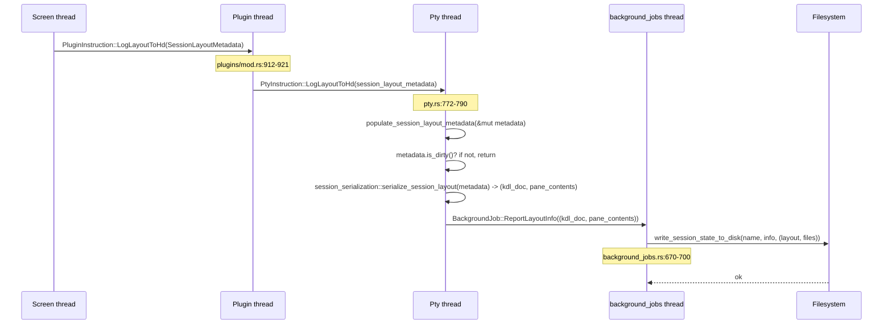

# Phase B Deep — Session Persistence & Resume (Round 1)

This is the highest-leverage zellij pattern for monocle. monocle's "session bookmarks" feature wants to look exactly like zellij's resurrection.

## Filesystem Layout (Where Things Live)

`zellij-utils/src/consts.rs:89-110`:

```rust
lazy_static! {
    pub static ref ZELLIJ_PROJ_DIR: ProjectDirs = ...;  // platform-aware
    pub static ref ZELLIJ_CACHE_DIR: PathBuf = ZELLIJ_PROJ_DIR.cache_dir().to_path_buf();
    pub static ref ZELLIJ_SESSION_CACHE_DIR: PathBuf = ZELLIJ_CACHE_DIR.join(format!("{}", Uuid::new_v4()));
    pub static ref ZELLIJ_PLUGIN_PERMISSIONS_CACHE: PathBuf = ZELLIJ_CACHE_DIR.join("permissions.kdl");
    pub static ref ZELLIJ_SESSION_INFO_CACHE_DIR: PathBuf = ZELLIJ_CACHE_DIR
        .join(CLIENT_SERVER_CONTRACT_DIR.clone())    // "contract_version_1"
        .join("session_info");
    pub static ref ZELLIJ_PLUGIN_ARTIFACT_DIR: PathBuf = ZELLIJ_CACHE_DIR.join(VERSION);
    pub static ref ZELLIJ_SEEN_RELEASE_NOTES_CACHE_FILE: PathBuf = ZELLIJ_CACHE_DIR.join(VERSION).join("seen_release_notes");
}
```

Concrete layout on Linux (XDG):

```
~/.cache/zellij/
├── permissions.kdl                              # per-plugin permission grants
├── 0.45.0/                                      # ZELLIJ_PLUGIN_ARTIFACT_DIR, per-version
│   ├── seen_release_notes
│   └── <plugin-cache>/...
├── contract_version_1/
│   └── session_info/                            # ZELLIJ_SESSION_INFO_CACHE_DIR
│       ├── crazy-fox/                           # one dir per resurrectable session
│       │   ├── session-metadata.kdl
│       │   ├── session-layout.kdl
│       │   └── <pane-content-files>...          # optional scrollback snapshots
│       └── happy-rat/
│           ├── session-metadata.kdl
│           └── session-layout.kdl
└── <other zellij internals>
```

Live socket dir: `ZELLIJ_SOCK_DIR` — separate from session_info; one socket file per running session, named by session name.

## File Naming Helpers

`consts.rs:27-37`:

```rust
pub fn session_info_cache_file_name(session_name: &str) -> PathBuf {
    session_info_folder_for_session(session_name).join("session-metadata.kdl")
}

pub fn session_layout_cache_file_name(session_name: &str) -> PathBuf {
    session_info_folder_for_session(session_name).join("session-layout.kdl")
}

pub fn session_info_folder_for_session(session_name: &str) -> PathBuf {
    ZELLIJ_SESSION_INFO_CACHE_DIR.join(session_name)
}
```

## Two Persistence Files

| File | Contents | When written |
|---|---|---|
| `session-metadata.kdl` | `SessionInfo` (current plugin list, available layouts, live session shape) | On periodic refresh; written by `write_session_state_to_disk` |
| `session-layout.kdl` | Serialized full pane tree as KDL (output of `session_serialization::serialize_session_layout`) | Same trigger; the resurrectable artifact |

Both files use `file_content_changed` comparison before writing (`background_jobs.rs:660-700`):

```rust
if file_content_changed(&metadata_cache_file_name, new_metadata.as_bytes()) {
    let _wrote_metadata_file = std::fs::create_dir_all(...)
        .and_then(|_| std::fs::File::create(&metadata_cache_file_name))
        .and_then(|mut f| write!(f, "{}", new_metadata));
}
```

So persistence is **deduplicated** — if the layout hasn't changed since the last dump, no write happens. This is critical for filesystem-watcher friendliness and SSD wear.

## Save Trigger Flow



So the chain is **Screen → Plugin → Pty → BackgroundJobs → FS**. Each step has a reason:

| Hop | Why |
|---|---|
| Screen → Plugin | Screen holds layout state but Plugin owns metadata (e.g. plugin list, available layouts) — Plugin enriches |
| Plugin → Pty | Pty holds the CWD-per-pane, the current command-per-pane (it owns the process metadata) — Pty enriches |
| Pty → BackgroundJobs | Disk I/O is offloaded to a dedicated thread so it never blocks the render loop |
| BackgroundJobs → FS | The actual file write |

## "Dirty" Detection

`SessionLayoutMetadata::is_dirty` (`zellij-server/src/session_layout_metadata.rs:107-150`):

A layout is "dirty" (worth saving) if any of:
1. The current pane count differs from the base layout's pane count (a pane was opened/closed).
2. One or more terminal panes is running a command that is not the default shell (a user has launched something specific worth preserving).
3. A pane is in EditFile state (an editor is open).

So unchanged default-layout instances **don't** get persisted. This is a deliberate optimization to keep the resurrection cache small.

Excluded from pane count (`should_exclude_from_count`, `session_layout_metadata.rs:166-188`):
- `zellij:about`
- `zellij:session-manager`
- `zellij:plugin-manager`
- `zellij:configuration-manager`
- `zellij:share`

These are "modal/utility" plugin panes that shouldn't count toward "the user has shaped a session worth resurrecting".

## Save Flow Variants

There are TWO save flows (`pty.rs:770-830`):

1. **`PtyInstruction::LogLayoutToHd(metadata)`** — periodic / on-detach dump. Goes through `is_dirty()` gate.
2. **`PtyInstruction::SaveSessionToDisk { session_name, session_info, session_layout_metadata, completion_tx }`** — explicit save (e.g. plugin command `SaveSession`). **No dirty gate**. Also sends:
   - `PluginInstruction::UpdateSessionSaveTime(timestamp_millis)` so plugins can query the most recent save time.
   - `BackgroundJob::ReportLayoutInfo` for the side effect of updating the metadata file.

The `completion_tx` field on the explicit save is a `oneshot::Sender` — dropped at the end of the match arm, signaling completion. This is the same `NotificationEnd`-style drop pattern documented in the IPC pass.

## Resurrection Read Side

`zellij-utils/src/sessions.rs:46-92` (`get_resurrectable_sessions`):

```rust
pub fn get_resurrectable_sessions() -> Vec<(String, Duration)> {
    match fs::read_dir(&*ZELLIJ_SESSION_INFO_CACHE_DIR) {
        Ok(files_in_session_info_folder) => {
            let files_that_are_folders = files_in_session_info_folder
                .filter_map(|f| f.ok().map(|f| f.path()))
                .filter(|f| f.is_dir());
            files_that_are_folders
                .filter_map(|folder_name| {
                    let layout_file_name = session_layout_cache_file_name(...);
                    let ctime = std::fs::metadata(&layout_file_name)
                        .ok()
                        .and_then(|metadata| metadata.created().ok().or_else(|| metadata.modified().ok()));
                    let elapsed_duration = ctime
                        .map(|ctime| Duration::from_secs(ctime.elapsed().ok().unwrap_or_default().as_secs()))
                        .unwrap_or_default();
                    let session_name = folder_name.file_name().map(...)?;
                    if std::path::Path::new(&layout_file_name).exists() {
                        Some((session_name, elapsed_duration))
                    } else {
                        None
                    }
                })
                .collect()
        },
        Err(e) => { log::error!(...); vec![] },
    }
}
```

Key points:
- Walks `session_info/` directly — no manifest, no index file. Just directory traversal.
- Reports `(session_name, age_since_layout_saved)` — age is computed from the layout file's ctime (or mtime as fallback for filesystems without ctime).
- A directory with NO `session-layout.kdl` is invisible (correctly — there's nothing to resurrect).

## Live-vs-Resurrectable Discrimination

`get_sessions` (`sessions.rs:14-40`) lists LIVE sessions by reading `ZELLIJ_SOCK_DIR` and probing each socket with `ConnStatus`.

`get_resurrectable_sessions` lists DEAD sessions by reading `ZELLIJ_SESSION_INFO_CACHE_DIR`.

A session can theoretically appear in both lists — if the server crashed but the socket file is stale. The `assert_socket` liveness probe cleans up stale sockets the next time the list is generated.

## Resume Mechanism

When `zellij attach <name>` is called and `<name>` is in the resurrectable list:

1. Server bootstrap reads `session-layout.kdl` and parses it as a `Layout`.
2. Layout is replayed: tabs and panes are recreated. Commands (`Run::Command`) are re-spawned; plugins (`Run::Plugin`) are reloaded.
3. **Scrollback is NOT replayed by default** — the layout serializer doesn't capture pane contents unless explicitly told to.
4. **Plugin runtime state is NOT replayed** — plugins start fresh from `load()`. The plugin's own `/data` dir is reused (per-`(plugin_id, client_id)`-keyed) so plugin-author-managed persistence works.

Optional: `serialize_session_layout` can embed `pane_initial_contents` for scrollback restoration, but this is opt-in and produces larger KDL files.

## Delete Dead Sessions

`PluginCommand::DeleteDeadSession(name)` and `PluginCommand::DeleteAllDeadSessions`:

The session-manager plugin's UI invokes these. The host removes the directory under `ZELLIJ_SESSION_INFO_CACHE_DIR/<name>` and prunes empty folders. (`consts.rs:57-75` for the prune step.)

`zellij delete-session <name>` is the CLI entry point.

## Recommendations for Monocle

| Recommendation | Source |
|---|---|
| Two-file persistence: metadata (current state) + layout (resurrection artifact) | `consts.rs:27-37`, `background_jobs.rs:670-700` |
| Persist to `~/.cache/<app>/<contract_version>/session_info/<session_name>/` | `consts.rs:107-110` |
| One directory per session (NOT one file per session) — allows attaching external resources (scrollback snapshots, plugin data) | `consts.rs:32-37` |
| `is_dirty()` gate before writing — only save when the user has shaped the session beyond defaults | `session_layout_metadata.rs:107-150` |
| `file_content_changed` byte-comparison before writing — avoid SSD wear and watcher storms | `background_jobs.rs:660-690` |
| Save flow runs on a dedicated `background_jobs` thread, never the render loop | `pty.rs:780-790` |
| Walk the directory directly to enumerate resurrectables — no index file | `sessions.rs:46-92` |
| Use file ctime (fallback to mtime) to compute "session age" | `sessions.rs:53-58` |
| Exclude utility/modal plugins from "dirty" pane count | `session_layout_metadata.rs:166-188` |
| Persistence file is KDL (symmetric serialize/parse) | `session_serialization.rs:43-83` |
| Track last-save timestamp separately for plugins to query | `pty.rs:797-803` (`UpdateSessionSaveTime`) |
| Use `directories::ProjectDirs` for platform-aware cache dirs | `consts.rs:92-99` |
| `CLIENT_SERVER_CONTRACT_VERSION` scope the persistence dir — schema bumps don't try to load incompatible old layouts | `consts.rs:106-108` |

## Specific Lesson: monocle's session-bookmark feature

A monocle session bookmark should be:
- Directory: `~/.cache/monocle/contract_version_<N>/session_info/<bookmark_name>/`
- Files:
  - `session-metadata.json` (or KDL) — current state
  - `session-layout.json` (or KDL) — full pane / mission state for resurrection
  - `mission-runs/<run_id>.json` — per-run history (zellij-equivalent: pane-content snapshot files)
- Trigger: detach event + periodic 30-second dump
- Dirty gate: pane count changed? mission state changed? if not, skip.
- Resume: read directory by name, parse layout file, replay state.

## Coverage Notes

| Investigated | Coverage |
|---|---|
| Filesystem layout | 100% — all paths sourced from consts.rs |
| Save trigger chain | 100% — Screen → Plugin → Pty → BackgroundJobs → FS |
| Dirty detection | 100% — is_dirty + should_exclude_from_count |
| Resurrection read | 100% — get_resurrectable_sessions |
| Live vs dead discrimination | 100% — get_sessions vs get_resurrectable_sessions |
| Delete dead session | catalog only (DeleteDeadSession plugin command) |
| Two save flow variants | Both (`LogLayoutToHd` periodic, `SaveSessionToDisk` explicit) |

## Open Items After This Round

| Item | Notes |
|---|---|
| What happens if `session-layout.kdl` parses successfully but references a now-missing layout file? | Probably graceful fallback to defaults; not exhaustively traced. |
| How is `pane_initial_contents` opt-in toggled? | A flag on `serialize_session_layout`; the call site decides. |
| Is there cleanup for orphaned session_info dirs? | `prune_empty_session_info_folders` (`consts.rs:57-75`) handles only empty dirs. Non-empty stale dirs (server crashed mid-write) would persist. |

## Round Status

```yaml
pass: B
category: session-persistence
round: 1
status: complete
timestamp: 2026-05-11T21:00:00Z
new_findings:
  - "Two-file persistence model: session-metadata.kdl + session-layout.kdl per session"
  - "Save chain is 5 threads deep: Screen → Plugin → Pty → BackgroundJobs → FS (each hop enriches the metadata)"
  - "is_dirty() gate prevents unnecessary writes; file_content_changed prevents redundant ones"
  - "Modal/utility plugin panes excluded from dirty pane count (clean conceptual filter)"
  - "Resurrection read is just directory traversal + ctime — no index file, no manifest"
  - "CLIENT_SERVER_CONTRACT_VERSION scopes the session_info dir, making schema bumps cleanly partition old vs new layouts"
classification: substantive
```
