# Architecture: Dependency Manifest

## [Section Content]

This file is the canonical dependency manifest for monocle. All version pins, pinning policies, MSRV decisions, and workspace dependency graph are authoritative for every phase. The architect inherits these pins as Phase 1 constraints during `/vsdd-factory:create-architecture`.

## Authority / Supersession

This document is the canonical, authoritative tech-stack version manifest for monocle. The vision document (`.factory/specs/research/domain-monocle-vision-synthesis.md`) §Tech Stack section was produced before OQ-01..OQ-11 resolution and carries pre-OQ version examples. Where this document and the vision disagree on a crate version, this document wins. Where this document and brief v1.4 at manifest authoring time disagree, this document wins. Trace: D-018 (oq-research.md commit b3c68ca), JC-1/JC-2/JC-3 resolutions.

## Phase 1 Pin Manifest

All versions verified against crates.io REST API on 2026-05-12.

| Crate | Version | Role | Cargo.toml Note |
|-------|---------|------|-----------------|
| ratatui | 0.30 | TUI framework | MSRV floor for Phase 1 (1.86); caret pin |
| crossterm | 0.29 | Terminal backend for ratatui | caret pin |
| tokio | 1.52 | Async runtime (full feature set) | EXACT pin (see Patch-Pinning Policy); historical advisories on older minors; 1.52 remediated |
| axum | 0.8 | HTTP server for hook ingestion | EXACT pin; pin as `=0.8.9` in Cargo.toml |
| interprocess | 2.4 | Unix domain socket IPC | caret pin |
| prost | 0.14 | Protobuf serialization for cross-host wire format | EXACT pin (see Patch-Pinning Policy); Phase 1: zero runtime cost — `monocle-proto` declares `prost` but no Phase 1 wire path uses protobuf encoding; Phase 4: deserializes untrusted federation wire-format on cross-host events; pinned now to lock the audit baseline before Phase 4 activation — version stability is more valuable than patch flexibility for a future untrusted-input deserializer; see RUSTSEC note on transitive `bytes` advisory |
| serde_json | 1.0.149 | JSON deserialization for hook POST bodies at the network boundary | EXACT pin (see Patch-Pinning Policy — Phase 1 untrusted-input deserializer); pin as `=1.0.149` in Cargo.toml; every patch bump requires security-reviewer agent dispatch because changes to JSON parser internals can affect timing-attack resistance, error-message disclosure, and resource-exhaustion behavior; verified 2026-05-12 against crates.io (max_stable_version) |
| serde_yaml_ng | 0.10 | YAML config parsing | caret pin; NOT `serde_yaml 0.8` (unmaintained, alias-bomb CVE); NOT `serde_yml` (archived per RUSTSEC-2025-0068) |
| bytes | 1.11 | Byte buffer utility | caret pin; direct workspace pin to avoid prost 0.14 transitive RUSTSEC-2026-0007 (see RUSTSEC Audit Context); advisory fix-from is `1.11.1` exactly (OSV range: `introduced: 1.2.1`, `fixed: 1.11.1`); pin floor `"1.11"` encodes the advisory baseline directly — `^1.11` resolves to `>=1.11.0, <2.0`, which is unambiguously above the vulnerable window; re-verified 2026-05-20 against advisory DB + Cargo.lock (locked at 1.11.1 CLEAN) — see `.factory/plans/research-RUSTSEC-2026-0007-bytes-1.11.1.md`; without direct pin, prost 0.14 transitively requests `bytes = "^1.0"` which can resolve to older 1.x lines carrying the advisory |
| wasmtime | 44 | WASM runtime for Phase 3 plugin SDK | EXACT pin (see Patch-Pinning Policy); NOT wasmi — see ADR-0001; Phase 3 MSRV implication: Rust 1.92 |
| rand | 0.8.6 | Cryptographically random auth token generation (`OsRng`) | EXACT pin (see Patch-Pinning Policy — security-sensitive: auth token generation); pin as `=0.8.6` in Cargo.toml; `rand 0.8.x` pinned over `0.9.x` because `rand 0.9` moved `OsRng` to a `getrandom` feature flag and introduced ergonomic regressions; `OsRng` is used directly in `monocle-daemon` start sequence to generate the 32-byte hex auth token (see SS-daemon-lifecycle §Start Sequence step 3); verified 2026-05-12 against crates.io |
| nucleo | 0.5 | Fuzzy matcher for session/filter panels | caret pin; upstream dormant since 2024-04-02; decision accepted via ADR-0002 with explicit re-eval trigger; TD-001 retired |
| similar | 3 | Diff rendering in permission prompt overlay | caret pin |
| directories | 6 | XDG-compliant config/data/runtime dirs | caret pin; used for daemon lock-file path per OQ-10 resolution |
| notify | 8 | File-system watcher for Phase 3 workflow plane | caret pin |
| russh | 0.60 | SSH tunnel for Phase 4 federation | EXACT pin (see Patch-Pinning Policy); pin to 0.60 (0.60.2); 0.45..0.59 carry RUSTSEC-2023-0071 via transitive rsa pre-release |
| rmcp | 1.6 | MCP bridge (Phase 4 only; OMITTED in Phase 1 workspace) | EXACT pin (see Patch-Pinning Policy); Anthropic-canonical via modelcontextprotocol/rust-sdk; pinned now for audit; NOT instantiated in Phase 1 Cargo workspace (see Phase 1 vs Pinned-But-Unused Crates) |
| tempfile | 3 | Atomic config writes via `tempfile::persist` | caret pin; required anti-pattern enforcement |
| clap | 4.6 | CLI argument parsing | caret pin |
| pulldown-cmark | 0.13 | Markdown rendering in TUI panels | caret pin |
| arboard | 3 | Clipboard integration | caret pin |
| tracing | 0.1 | Structured logging and instrumentation | caret pin |
| semver | 1 | Semantic version parsing | caret pin |
| thiserror | 2 | Error type derivation | caret pin; 2.x major — do NOT pin to 1.x |
| anyhow | 1 | Error propagation in binary crate | caret pin |
| constant_time_eq | 0.3 | Timing-safe byte comparison for auth token validation per BC-AUTH-001 (SS-daemon-lifecycle.md) | caret pin (utility crate; not on untrusted-input deserialization path) |
| nix | 0.30 | POSIX signal handling for pid-liveness check in BC-DAEMON-005 postcondition 3; `nix::sys::signal::kill(Pid::from_raw(pid), None)` used instead of raw `libc::kill(pid, 0)` to preserve type safety and avoid unsafe blocks | caret pin; NOT `libc` direct usage (bypasses type system); `nix 0.30` is the current stable release (verified 2026-05-14 against crates.io); binding crate decision per F-R71-4b (SS-daemon-lifecycle.md v1.0.13 §Trace) |
| futures | 0.3 | Async stream abstractions for `FactoryAdapter::subscribe -> StateChangeStream` per BC-FACTORY-001 (SS-core-types-and-abi.md) | caret pin (workspace-level async utilities) |
| async-trait | 0.1 | Procedural macro enabling `async fn` in trait definitions; used by `EngineModule` and any other async traits in `monocle-core` | caret pin (utility macro; not on untrusted-input path; 0.1.x series is stable and widely used across the Rust ecosystem) |
| reqwest | 0.13 | HTTP client | EXACT pin (see Patch-Pinning Policy); 0.13.x only — do NOT pin to 0.11 or 0.12 (both stale) |
| serde | 1 | Serialize/Deserialize derive macros for `HookEventRecord` in `monocle-runtime::ring` (`#[derive(serde::Serialize, serde::Deserialize)]` per SS-daemon-lifecycle.md §Drain) and multiple core types in `monocle-core` (HookEvent, EnrichedSession, SessionStatus, EngineMetadata, ProcessSnapshot, HookResponse, HookType per SS-core-types-and-abi.md and SS-engine-module.md) | caret pin; feature `derive` required — declare as `serde = { version = "1", features = ["derive"] }` in workspace `[dependencies]`; bare `serde` is a separate crate from `serde_json` and `serde_yaml_ng`; the `derive` feature activates the `Serialize`/`Deserialize` proc-macro; `serde 1.x` is the current stable series (no RUSTSEC advisories on 1.x line); not on untrusted-input deserialization path (that is `serde_json`'s role); F-R76-1 closure |
| chrono | 0.4 | UTC timestamp formatting for ISO 8601 fields: `startTimeUtc` in lock file (BC-DAEMON-005 / BC-LOCK-001), `last_hook_ts` in `/status` response (BC-DAEMON-002 / EC-044), and `shutdown_utc` in crash-recovery checkpoint (BC-DAEMON-006); `chrono::Utc::now().format("%Y-%m-%dT%H:%M:%S%.3fZ")` mandated as the uniform format string per SS-daemon-lifecycle.md §Trace v1.0.14 F-R72-1 rationale (cross-field uniformity, mandatory millisecond precision). Also used in `monocle-core` for `EnrichedSession::started_at: Option<chrono::DateTime<chrono::Utc>>` (Phase 1 TUI session uptime field, BC-2.06.005; SS-engine-module.md §Trace v1.1.21). | caret pin; declare as `chrono = { version = "0.4", features = ["serde"] }` in workspace `[dependencies]` — the `serde` feature is required so `chrono::DateTime<Utc>` derives `Serialize + Deserialize` for IPC wire transport of `EnrichedSession::started_at`; `std::time::SystemTime` lacks ISO 8601 formatting — manual formatting without chrono requires a custom formatter over duration-since-epoch arithmetic that re-introduces the very precision inconsistency F-R72-1 was authored to prevent; `chrono 0.4` is the current stable series (no RUSTSEC advisories on 0.4.x line); not on untrusted-input deserialization path; dep graph edges: `runtime → chrono` (Extension 7), `core → chrono` (F-P13-001 closure); Extension 7 comprehensive audit discovery |
| which | 7 | PATH search for CCR binary detection in `monocle-config::detect_ccr()` (BC-2.07.006, SS-config.md §CCR Detection); called as `which::which("ccr")` to locate the Claude Code Router binary when `ccr_path` is not set in `config.json`; no-op if binary absent (returns `None`) | caret pin (`^7`); `which 7.x` is the current stable series as of 2026-05 (crates.io verified); MSRV 1.70 — well within Phase 1 floor of Rust 1.86; used in `monocle-config` only, not on untrusted-input deserialization path; F-P1D-008 closure (missing from manifest, found in adversarial review Pass 1) |

## Dev Dependencies

Test-only crates that appear in `[dev-dependencies]` in `monocle-runtime/Cargo.toml`
(and any other crate that has integration tests requiring environment manipulation).
These crates do NOT appear in the production binary.

| Crate | Version | Role | Cargo.toml Note |
|-------|---------|------|-----------------|
| temp-env | 0.3 | Environment variable manipulation in integration tests with RAII cleanup — sync (`with_vars`) and async (`async_with_vars`) variants | caret pin (`^0.3`); feature `async_closure` required for `async_with_vars` API; `[dev-dependencies]` only; declare as `temp-env = { version = "^0.3", features = ["async_closure"] }` in `monocle-runtime/Cargo.toml`; required for BC-ENGINE-002-ERR test isolation (see SS-engine-module.md); bumped from `^0.2` in round-24 (F-R24-adv-1): `^0.2` exposed only synchronous `with_vars`; the async `enrich()` half of BC-ENGINE-002-ERR requires `async_with_vars` which is gated on the `async_closure` feature introduced in 0.3.0; latest 0.3.x is 0.3.6 (2023-09-24, not yanked, verified against crates.io API 2026-05-13) |
| syn | 2.0 | AST audit tests for `#[non_exhaustive]` enum policy (S-011), FactoryAdapter trait surface (S-012), EngineModule trait surface (S-014) — production code does NOT depend on syn | caret pin (`^2.0`); `[dev-dependencies]` only; declare as `syn = { version = "2", features = ["full"] }` in the crates that declare AST audit tests (monocle-core, monocle-runtime); Phase 3.A architect dispatch — F-A-01 closure |
| regex-lite | 0.1 | Lightweight regex engine for semver-format assertions in healthz integration tests (S-002); validates `X.Y.Z` pattern in `/health` response body | caret pin (`^0.1`); `[dev-dependencies]` only; declare inline in `monocle-runtime/Cargo.toml` (not `workspace = true`); follows temp-env precedent for test-only deps not promoted to workspace level; production code does NOT depend on regex-lite |

## Phase 2/3/4 Additions

### Phase 2 — Static Plane (trigger-trace, customization-aware overlays)

- **`redb 2.x`** — embedded key-value store for trigger-trace transcript indexing. Selected over `sled 0.34` because sled is feature-frozen since 2023 with no maintenance pipeline, while redb 2.x is actively maintained, uses a single-file MVCC approach with no lock-file overhead, and has zero external dependencies beyond `std`. Pin: `redb = "^2"`.
- No full-text indexing dependency added in Phase 2; tantivy is deferred unless Phase 3 trigger-trace search benchmarks show linear scan is insufficient at realistic `.factory/` transcript sizes (expected <500MB per project for Phase 2 scope).

### Phase 3 — Workflow Plane, Plugin SDK

- **`wasmtime 44`** — already pinned for the plugin SDK; the `monocle-plugin-sdk` crate activates this dependency.
- **`wasi-common 24`** (or the equivalent WASI interface types under wasmtime 44's component model) — provides sandboxed WASI execution context for guest plugin binaries. The wasmtime 44 component model includes `wasi:io`, `wasi:filesystem`, `wasi:sockets` interface types as first-class targets; `wasi-common` is the host-side WASI implementation. Pin: `wasi-common = "^24"` (aligns with wasmtime 44.x series). Verify exact compatible minor against `wasmtime = "44"` workspace during Phase 3 Cargo init.
- **`notify 8`** — already pinned; activated by `monocle-workflow` crate.
- MSRV bumps to Rust 1.92 at this phase boundary (wasmtime 44 requirement; see MSRV Policy below).

### Phase 4 — Federation, MCP Bridge

- **`russh 0.60`** — already pinned for federation SSH tunnel.
- **`rmcp 1.6`** — already pinned; activated by `monocle-mcp-bridge` crate. The Phase 4 workspace expands from 12 crates to 13 by adding `monocle-mcp-bridge`.
- **`oauth2 5.x`** — federation auth flows for multi-host trust establishment. The `oauth2` crate 5.x (maintained by ramosbugs) provides PKCE, device flow, and authorization code flows; caret pin: `oauth2 = "^5"`.
- **`quinn 0.11`** — QUIC transport, optional. Include only if Phase 4 federation benchmarks demonstrate that sub-100ms host-to-host latency is required AND russh over TCP cannot meet the target. Decision deferred to Phase 4 benchmark gate. If activated, pin: `quinn = "^0.11"`. Do not activate in Phase 4 Cargo workspace by default; gate behind a `quic-transport` Cargo feature flag.
- **`prost 0.14`** — Phase 4 activates `prost` for cross-host federation wire-format encoding and decoding. In Phase 1, `monocle-proto` declares `prost` as a dependency but no Phase 1 code path invokes protobuf serialization — hook POST bodies use `serde_json`, not prost. Phase 4 is the first phase where `prost` touches untrusted input (cross-host federation events). The exact pin established in Phase 1 locks the audit baseline; no version change is required at Phase 4 boundary unless a RUSTSEC advisory mandates a bump.

## MSRV Policy

**Single workspace MSRV.** Phase 1 ships at Rust 1.86 (ratatui 0.30 floor). Phase 3 ships at Rust 1.92 (wasmtime 44 floor) via an explicit MINOR release with a workspace-wide `rust-version` bump in `Cargo.toml`.

Rationale: a dual-MSRV strategy would require either splitting Cargo.lock across two workspaces or maintaining a feature-flag matrix that fragments CI runs. Single-MSRV with explicit bumps at phase boundaries keeps the CI matrix simple (one toolchain per phase), avoids Cargo.lock splitting, and aligns with the mainstream Rust toolchain trajectory — by Phase 3 ship date, 1.92 will be at minimum 6 months stable. Each MSRV bump is documented in CHANGELOG with a `breaking-change` marker for downstream consumers.

The workspace `Cargo.toml` `rust-version` field is set to `"1.86"` for Phase 1. The Phase 3 bump to `"1.92"` is documented as an ADR entry at that phase boundary.

## Patch-Pinning Policy

**Caret pin (`^x.y`) for library dependencies; EXACT pin (`=x.y.z`) for the 9 security-sensitive crates: `tokio`, `prost`, `russh`, `wasmtime`, `rmcp`, `reqwest`, `axum`, `serde_json`, `rand`.**

The 9 EXACT-pinned crates are: `tokio`, `prost`, `wasmtime`, `russh`, `rmcp`, `reqwest`, `axum`, `serde_json`, and `rand`.

- `serde_json` is exact-pinned because it is the **Phase 1 untrusted-input deserializer**: every hook POST body arrives as `Content-Type: application/json` and is deserialized by `serde_json` at the axum handler boundary. Patch bumps require security-reviewer agent dispatch because changes to JSON parser internals can affect timing-attack resistance, error-message disclosure, and resource-exhaustion behavior.
- `prost` is exact-pinned because it is the **Phase 4 untrusted-input deserializer**: in Phase 1 it carries zero runtime cost (`monocle-proto` declares `prost` but no Phase 1 wire path uses protobuf encoding). In Phase 4 it deserializes untrusted federation wire-format on cross-host events. It is pinned now to lock the audit baseline before Phase 4 activation — version stability is more valuable than patch flexibility for a future untrusted-input deserializer.
- `rand` is exact-pinned because it is the **auth token generator**: `OsRng` produces the 32-byte cryptographically random token written to the daemon lock file. Patch bumps require security-reviewer dispatch because changes to the OS entropy interface or CSPRNG seeding can affect key-derivation security properties.
- The remaining 6 (`tokio`, `wasmtime`, `russh`, `rmcp`, `reqwest`, `axum`) handle security-critical protocol boundaries (TLS, SSH, WASM sandbox, HTTP server, HTTP client, async runtime).

Rationale: library crates are evaluated for security risk based on their public-API surface; patch upgrades are typically safe and automatable. The 9 security-sensitive crates handle untrusted network input or operate on security-critical protocol boundaries. Patch bumps on these crates can change cancellation semantics, timeout behavior, deserialization behavior, or sandboxing properties in ways that shift the threat surface — for example, a tokio patch can change task-cancellation ordering in ways that affect security-critical timeout invariants; a serde_json patch can change how malformed JSON is handled in ways that affect resource-exhaustion behavior. Exact-pinning forces every bump through PR review with security-reviewer dispatch.

In `Cargo.toml` syntax:
- Library deps: `ratatui = "0.30"` (caret is implicit)
- Exact-pinned: `tokio = "=1.52.0"` (explicit `=` prefix)

## Security Advisory Response Policy

**Automated Dependabot PRs for patch-level bumps on caret-pinned library deps, gated by `cargo audit --deny warnings` in CI; auto-merge on green for caret-pinned libs only. Manual review with security-reviewer agent dispatch for: (a) any minor or major bump on any dependency; (b) ALL bumps on the 9 EXACT-pinned crates regardless of bump magnitude.**

Rationale: patch bumps on library crates are common, low-risk, and automatable when CI gates hold. Any bump on a security-sensitive crate (the 9 EXACT-pinned) or any minor/major bump anywhere requires explicit human + AI review because the threat surface can shift. Security-reviewer agent dispatch is non-optional for the 9 exact-pinned crates.

Operationally:
1. Dependabot opens a PR for a patch bump on a caret-pinned lib.
2. CI runs `cargo audit --deny warnings` + full test matrix.
3. On green: auto-merge is permitted.
4. For an exact-pinned crate: auto-merge is BLOCKED; security-reviewer agent must approve.
5. For any minor/major bump: auto-merge is BLOCKED; architect + security-reviewer must approve.
6. New RUSTSEC advisories that match a pinned version block merge until (a) version is updated to patched release, or (b) documented risk-acceptance is filed under `.factory/specs/risk-acceptance/`.

## Phase 1 vs Pinned-But-Unused Crates

**`rmcp 1.6` is PINNED in this manifest but NOT instantiated in the Phase 1 Cargo workspace.** Per OQ-09 resolution, MCP bridge functionality is Phase 4 scope. Pinning here locks the version into the manifest for security audit purposes, but the `monocle-mcp-bridge` crate — which will declare `rmcp` as a dependency — does not exist in the Phase 1 workspace.

Phase 1 workspace: 11 named crates + 1 binary = **12 crates total** (per brief v1.4 at time of manifest authoring, EX-1 ratification). Phase 4 workspace adds `monocle-mcp-bridge`, expanding to 13 crates total.

## Workspace Dependency Graph

Authoritative for Phase 1 spec package; refresh after Cargo workspace `Cargo.toml` files exist (during `/vsdd-factory:create-architecture`) to reflect any inferred edges not visible from spec-level reasoning.

```mermaid
graph TD
    bin[monocle binary] --> tui[monocle-tui]
    bin --> runtime[monocle-runtime]
    bin --> ipc[monocle-ipc]
    bin --> config[monocle-config]

    tui --> ratatui
    tui --> crossterm
    tui --> nucleo
    tui --> similar
    tui --> pulldown-cmark
    tui --> arboard
    tui --> core[monocle-core]

    runtime --> tokio
    runtime --> tracing
    runtime --> rand
    runtime --> constant_time_eq
    runtime --> core
    runtime --> proto[monocle-proto]
    runtime --> ipc
    runtime --> tempfile
    runtime --> serde_json
    runtime --> directories
    runtime --> nix
    runtime --> axum
    runtime --> serde
    runtime --> chrono
    core --> chrono

    ipc --> interprocess
    ipc --> tokio
    ipc --> core

    proto --> prost
    proto --> bytes

    config --> serde_yaml_ng
    config --> directories
    config --> tempfile
    config --> serde_json
    config --> core
    config --> which

    sdk[monocle-plugin-sdk] -.->|Phase 3| wasmtime

    workflow[monocle-workflow] -.->|Phase 3| notify
    workflow -.->|Phase 3| redb
    workflow -.->|Phase 3| futures

    core --> thiserror
    core --> semver
    core --> futures
    core --> async_trait[async-trait]
    core --> serde
    runtime --> async_trait

    static[monocle-static] -.->|Phase 2| core

    fuzz[monocle-fuzz] --> core
    harness[monocle-test-harness] --> core
    harness --> ipc

    classDef phase2 stroke-dasharray: 5 5
    classDef phase3 stroke-dasharray: 5 5
    class static phase2
    class sdk,workflow phase3
```



Crates with dashed edges are activated at their respective phase boundary; they exist in the workspace from Phase 1 as empty crate stubs to keep the workspace layout stable.

## RUSTSEC Audit Context

Validation performed 2026-05-12 against crates.io API + RUSTSEC advisory DB
(Tavily + Perplexity + direct crates.io fetch). Findings the architect must
respect when finalizing Cargo.toml:

### Advisories on upstream versions monocle must avoid

- `wasmtime` older majors (pre-44) carry RUSTSEC-2026-0114, RUSTSEC-2026-0095,
  RUSTSEC-2026-0096, RUSTSEC-2026-0006, RUSTSEC-2026-0020 (guest-controlled resource
  exhaustion in WASI implementations), and others. Pin to `wasmtime = "44"` (latest
  44.0.1) and bind future patches via `cargo update` on the 44.x line.
- `russh` 0.45..0.59 transitively pulls `rsa = "0.10.0-rc.12"` which is affected by
  RUSTSEC-2023-0071 (timing-attack on RSA private-key operations). Pin to
  `russh = "0.60"` (0.60.2 latest) which moved off the affected rsa pre-release.
- `prost` 0.14 has a transitive `bytes` advisory RUSTSEC-2026-0007 affecting
  `bytes` versions `1.2.1 <= v < 1.11.1`. Advisory fix-from: `1.11.1` exactly.
  Pin `bytes = "1.11"` directly in workspace dependencies; caret `^1.11` resolves
  to `>=1.11.0, <2.0` which is unambiguously above the vulnerable window.
  Re-verified 2026-05-20 against advisory DB + Cargo.lock (locked 1.11.1 CLEAN);
  see `.factory/plans/research-RUSTSEC-2026-0007-bytes-1.11.1.md` for full
  evidence (Option B chosen per Production-Grade Default: declared floor must match
  advisory fix-from to be auditable at face value — see bytes row in Phase 1 Pin Manifest).
- `tokio` 1.x has multiple historical advisories on older minors (RUSTSEC-2025-0023,
  RUSTSEC-2023-0005, RUSTSEC-2023-0001, RUSTSEC-2021-0124, RUSTSEC-2021-0072). Pin to
  current 1.52 line to ensure all are remediated.
- `serde_yaml` 0.8 is unmaintained with alias-bomb CVE; `serde_yml` (a different fork)
  was archived per RUSTSEC-2025-0068. The choice of `serde_yaml_ng` 0.10 (maintained
  fork) is correct and survives this audit.

## Re-audit Cadence

The architect must enforce a `cargo audit` run in CI on every PR, plus a weekly
scheduled `cargo audit --json` against the latest RUSTSEC DB. New advisories on
pinned versions block merge until either:
- (a) the version is updated to a patched release, or
- (b) a documented justification with mitigations is filed under
  `.factory/specs/risk-acceptance/`

## MSRV Constraints

| Phase | MSRV | Binding Factor |
|-------|------|---------------|
| Phase 1 | Rust 1.86 | ratatui 0.30 floor |
| Phase 3 | Rust 1.92 | wasmtime 44 requirement |

See MSRV Policy above for the single-workspace bump strategy at the Phase 3 boundary.

## §Trace

v1.1.21 changes (F-P1D-008: `which` crate missing from manifest) (2026-05-26):
- **F-P1D-008** RESOLVED: `which 7.x` added to Phase 1 Pin Manifest.
  - SS-config.md §CCR Detection uses `which::which("ccr")` for PATH-based CCR binary
    detection (BC-2.07.006). The crate was referenced in SS-config.md but absent from this
    manifest — an oversight identified during adversarial review Phase 1d Pass 1.
  - Pin: caret `^7` (current stable series as of 2026-05; MSRV 1.70, within Phase 1 floor 1.86).
  - Workspace dependency graph: `config --> which` edge added.
  - No security implications: `which` is a PATH search utility; not on the untrusted-input
    deserialization path. Caret pin is correct per the Patch-Pinning Policy.
- Version bumped from 1.1.20 → 1.1.21.

v1.1.15 changes (F-R99 Burst 2 — F-R99-6 MED closure: §Trace v1.1.14 "16+" imprecision corrected; SE-17f + SE-16d first application):

- F-R99-6 RESOLVED (MED — §Trace v1.1.14 Fix 4 POST narrative contained the hedge "16+"
  which violates SE-17a literal-output precision discipline; corrected to precise count
  with historical-state context):

  The adversary R99 reported that §Trace v1.1.14 Fix 4 POST parenthetical (line 290
  at v1.1.14 final-state) stated: "The full-file literal grep would return 16+ lines."
  The `+` modifier is an imprecise hedge forbidden by SE-17a. Context: the v1.1.13
  narrative at line 267 stated "returns 16 lines" precisely (at v1.1.13 final-state).
  §Trace v1.1.14's recursive insertions brought the count from 16 to 28 at v1.1.14
  final-state; the "16+" hedge was a mid-burst estimate, not a literal count.

  Fix 4 POST corrected (§Trace v1.1.14 Fix 4 POST parenthetical):
  ```
  Original (v1.1.14): "The full-file literal grep would return 16+ lines spanning
  frontmatter, body, and §Trace prose"
  Corrected (v1.1.15): "At v1.1.13 final-state the full-file literal grep returned 16
  lines precisely; §Trace v1.1.14 recursive insertions brought the current count to 28
  lines (confirmed by `grep -n "shutdown_utc" ... | wc -l` → 28 at v1.1.14 final-state)"
  ```

  Full-file literal grep at v1.1.15 pre-insertion state (29 lines — +1 from v1.1.14's
  28 due to the correction text above adding one "shutdown_utc" occurrence):
  ```
  $ grep -n "shutdown_utc" /Users/jmagady/Dev/monocle/.factory/specs/architecture/SS-deps-pin-manifest.md | wc -l
  29
  ```

  Body-scope filter (authoritative production-code instance, BOUNDARY=262):
  ```
  $ BOUNDARY=$(grep -n "^## §Trace" .../SS-deps-pin-manifest.md | head -1 | cut -d: -f1)
  $ grep -n "shutdown_utc" .../SS-deps-pin-manifest.md | awk -F: -v B="$BOUNDARY" '$1 < B && $1 != 15'
  66:| chrono | 0.4 | UTC timestamp formatting for ISO 8601 fields: `startTimeUtc` in lock file (BC-DAEMON-005 / BC-LOCK-001), `last_hook_ts` in `/status` response (BC-DAEMON-002 / EC-044), and `shutdown_utc` in crash-recovery checkpoint (BC-DAEMON-006); `chrono::Utc::now().format("%Y-%m-%dT%H:%M:%S%.3fZ")` mandated as the uniform format string per SS-daemon-lifecycle.md §Trace v1.0.14 F-R72-1 rationale (cross-field uniformity, mandatory millisecond precision) | caret pin; `std::time::SystemTime` lacks ISO 8601 formatting — manual formatting without chrono requires a custom formatter over duration-since-epoch arithmetic that re-introduces the very precision inconsistency F-R72-1 was authored to prevent; `chrono 0.4` is the current stable series (no RUSTSEC advisories on 0.4.x line); not on untrusted-input deserialization path; Extension 7 comprehensive audit discovery |
  ```
  (1 authoritative production-code instance at line 66 — unchanged from v1.1.14. Body
  content has not changed; only §Trace narrative corrected.)

- Disciplines applied:
  - SE-17a (literal-output precision: precise count with historical-state context replaces
    imprecise "16+" hedge; body-scope filter output is literal single-line transcript)
  - SE-17b (self-verification: wc -l and body-scope filter re-run after edit; counts
    confirmed before finalizing §Trace claims)
  - SE-17c (5-step: body authored → final-state greps run → counts confirmed → re-verified
    → committed)
  - SE-17c-d (body-scope filter: BOUNDARY=262 confirmed; frontmatter line 15 excluded via
    `$1 != 15`; §Trace prose lines ≥ 262 excluded)
  - SE-17e (sibling-propagation: arch §Trace v1.0.23 receives parallel F-R99-1 closure in
    this same burst; both §Trace entries SE-17a-strict from inception)
  - SE-17f FIRST APPLICATION (mechanical self-revalidation gate — see self-revalidation block
    below; all cited grep outputs and counts re-verified after §Trace authoring)

- SE-16b monotonicity check PASS: v1.1.14 → v1.1.15 is a monotonic increment.
  Timestamp 2026-05-17T00:00:00Z ≥ v1.1.14 timestamp 2026-05-16T22:00:00Z. PASS.

- SE-16d FIRST APPLICATION (cross-artifact chain-time monotonicity):
  2026-05-17T00:00:00Z >= STATE v5.50 chain high-water 2026-05-16T23:30:00Z. PASS.
  UTC ISO-8601 form (`YYYY-MM-DDTHH:MM:SSZ`): confirmed. Both manifest v1.1.15 and arch
  v1.0.23 share timestamp 2026-05-17T00:00:00Z — same burst, same commit.

- No body content changes. Only §Trace v1.1.14 Fix 4 POST parenthetical corrected (stale
  "16+" hedge replaced with precise historical + current count) + §Trace v1.1.15 entry
  authored.

- Cross-document pins (Extension 15 + SE-15e):
  manifest v1.1.15 pin propagation required: Burst 3 (PO PRD v1.23) + Burst 4 (FV VP v1.33).

- SE-17f SELF-REVALIDATION BLOCK (FIRST APPLICATION of 31st discipline):

  Step 1: literal wc -l after §Trace v1.1.15 insertion:
  ```
  $ grep -n "shutdown_utc" /Users/jmagady/Dev/monocle/.factory/specs/architecture/SS-deps-pin-manifest.md | wc -l
  37
  ```
  (Post-insertion count 37. Pre-insertion was 29. §Trace v1.1.15 entry itself contains 8
  additional "shutdown_utc" occurrences within its SE-17f self-revalidation block text,
  the Fix 4 POST corrected transcript, and the body-scope filter output lines.)

  Step 1a: post-insertion body-scope filter (BOUNDARY=262, exclude frontmatter line 15):
  ```
  $ BOUNDARY=$(grep -n "^## §Trace" .../SS-deps-pin-manifest.md | head -1 | cut -d: -f1)
  $ grep -n "shutdown_utc" .../SS-deps-pin-manifest.md | awk -F: -v B="$BOUNDARY" '$1 < B && $1 != 15'
  66:| chrono | 0.4 | UTC timestamp formatting for ISO 8601 fields: `startTimeUtc` in lock file (BC-DAEMON-005 / BC-LOCK-001), `last_hook_ts` in `/status` response (BC-DAEMON-002 / EC-044), and `shutdown_utc` in crash-recovery checkpoint (BC-DAEMON-006); ...
  ```
  (1 authoritative production-code instance at line 66. CONFIRMED. Body content
  unchanged; §Trace additions do not affect production-code line positions.)

  Step 2: verify body-scope production-code instance at line 66 — CONFIRMED above via
  literal body-scope filter grep output (1 hit, line 66, full row shown).

  Step 3: verify §Trace v1.1.14 Fix 4 POST parenthetical no longer contains "16+" —
  CONFIRMED. The parenthetical now reads: "At v1.1.13 final-state the full-file literal
  grep returned 16 lines precisely; §Trace v1.1.14 recursive insertions brought the
  current count to 28 lines."

  Step 4: verify precision of all count claims in this §Trace v1.1.15 entry:
  - "16 lines precisely" (at v1.1.13 final-state) — correct per v1.1.13 §Trace narrative
    which stated "returns 16 lines".
  - "28 lines at v1.1.14 final-state" — confirmed by adversary R99 report + pre-fix grep.
  - "29 lines pre-insertion" — confirmed by post-fix pre-insertion grep run above.
  All counts are precise integers with no hedge modifiers. SE-17a compliant.

  Step 5: SE-17f recursion check — this SE-17f block contains count assertions (16, 28, 29).
  All are documented with literal grep commands or adversary-report cross-references. No
  arithmetic is asserted without a corresponding literal grep transcript or named source.
  SE-17a compliant.

  Divergence summary: The "16+" → precise-count correction added one "shutdown_utc"
  occurrence to the §Trace text (pre-fix → pre-insertion: 28 → 29). §Trace v1.1.15
  insertion added 8 more occurrences (pre-insertion → post-insertion: 29 → 37). The
  SE-17f Step 1a update added 2 more occurrences (37 → 39 final). This self-referential
  count growth is expected — §Trace bodies that discuss their own subject string
  inherently grow the full-file count with each insertion. The authoritative invariant
  is the body-scope production-code instance (line 66), which is stable at 1 occurrence
  across all versions. SE-17f caught all count shifts; body-scope filter confirmed stable
  throughout. No divergence unresolved. Final full-file count at commit: 39.

v1.1.14 changes (F-R98 Burst 2 — SE-17a literal-output revalidation of §Trace v1.1.13 Fix 4 POST evidence):

- F-R98-3 RESOLVED (MED — §Trace v1.1.13 Fix 4 POST evidence block displayed a curated
  1-line output for `grep -n "shutdown_utc"` when the actual full-file grep returns 16
  lines; the parenthetical disclaimer did not satisfy SE-17a literal-output discipline):

  The adversary R98 reported that the Fix 4 POST evidence block in §Trace v1.1.13 claimed:
  ```
  $ grep -n "shutdown_utc" /Users/jmagady/Dev/monocle/.factory/specs/architecture/SS-deps-pin-manifest.md
  66:| chrono | 0.4 | ...and `shutdown_utc` in crash-recovery checkpoint (BC-DAEMON-006); ...
  ```
  (1 line of output, curated subset). This violates SE-17a (literal-output: a grep claim
  must show the literal grep output, not a curated subset with a disclaimer). The same
  defect pattern was remediated in VP v1.31 (I-R97-2 closure).

  Fix 4 POST (final-state v1.1.14, body-scope filter — SE-17a literal-output, SE-17c-d):
  ```
  $ BOUNDARY=$(grep -n "^## §Trace" /Users/jmagady/Dev/monocle/.factory/specs/architecture/SS-deps-pin-manifest.md | head -1 | cut -d: -f1)
  $ grep -n "shutdown_utc" /Users/jmagady/Dev/monocle/.factory/specs/architecture/SS-deps-pin-manifest.md | awk -F: -v B="$BOUNDARY" '$1 < B && $1 != 15'
  66:| chrono | 0.4 | UTC timestamp formatting for ISO 8601 fields: `startTimeUtc` in lock file (BC-DAEMON-005 / BC-LOCK-001), `last_hook_ts` in `/status` response (BC-DAEMON-002 / EC-044), and `shutdown_utc` in crash-recovery checkpoint (BC-DAEMON-006); `chrono::Utc::now().format("%Y-%m-%dT%H:%M:%S%.3fZ")` mandated as the uniform format string per SS-daemon-lifecycle.md §Trace v1.0.14 F-R72-1 rationale (cross-field uniformity, mandatory millisecond precision) | caret pin; `std::time::SystemTime` lacks ISO 8601 formatting — manual formatting without chrono requires a custom formatter over duration-since-epoch arithmetic that re-introduces the very precision inconsistency F-R72-1 was authored to prevent; `chrono 0.4` is the current stable series (no RUSTSEC advisories on 0.4.x line); not on untrusted-input deserialization path; Extension 7 comprehensive audit discovery |
  ```
  (Body-scope filter rationale: BOUNDARY=262 (line of `## §Trace` heading; the §Trace v1.1.14
  entry is inserted inside the §Trace section after the heading, so the heading line itself
  does not shift; confirmed by `grep -n "^## §Trace" ... | head -1` → 262). Line 15
  (frontmatter `traces_to`) excluded via `$1 != 15` —
  frontmatter is a historical-attribution cite, not a production-code instance. Lines ≥ BOUNDARY
  are §Trace narrative prose. At v1.1.13 final-state the full-file literal grep returned 16
  lines precisely; §Trace v1.1.14 recursive insertions brought the current count to 28 lines
  (confirmed by `grep -n "shutdown_utc" ... | wc -l` → 28 at v1.1.14 final-state); the
  body-scope filter isolates the 1 authoritative production-code instance at line 66. [Corrected
  in §Trace v1.1.15 per F-R99-6: "16+" hedge removed per SE-17a literal-output precision
  discipline; precise count substituted.] SE-17e sibling-propagation: this body-scope convention
  mirrors the VP §Trace v1.31 pattern used to close I-R97-2. F-R98-3 closed.)

- Disciplines applied:
  - SE-17a (literal body-scope grep output shown above — not curated subset, not summary count)
  - SE-17b (self-verification: body-scope filter re-run after edit to confirm single line 66 hit)
  - SE-17c (5-step: body authored → final-state greps run → boundary computed → re-verified →
    committed)
  - SE-17c-d (body-scope filter: BOUNDARY derived from `grep -n "^## §Trace" | head -1`;
    frontmatter line 15 excluded; §Trace prose lines ≥ BOUNDARY excluded)
  - SE-17e FIRST APPLICATION (sibling-propagation: SE-17a/c/c-d applied to this §Trace
    v1.1.14 entry from inception; mirrors arch §Trace v1.0.22 parallel SE-17e first application)

- SE-16b monotonicity check PASS: v1.1.13 → v1.1.14 is a monotonic increment.
  Timestamp 2026-05-16T22:00:00Z ≥ v5.48 STATE.md timestamp 2026-05-16T21:00:00Z. PASS.

- No body content changes. Only §Trace evidence-block correction (curated 1-line output in
  v1.1.13 Fix 4 POST replaced with body-scope filter + literal output) + §Trace v1.1.14
  entry authored with SE-17a-strict literal-output convention from inception.

- Cross-document pins (unchanged in this burst — Extension 15 + SE-15e):
  PRD v1.21 / VP v1.31. Burst 3 (PO) propagates arch v1.0.22 + manifest v1.1.14; Burst 4
  (FV) propagates both per SE-15e dispatch order.

v1.1.13 changes (adversary R94 O-R94-1 closure — chrono row shutdown_utc BC attribution):

- O-R94-1 RESOLVED (LOW — chrono row `shutdown_utc` missing BC parenthetical attribution):
  The Phase 1 Pin Manifest chrono row Role column listed three timestamp fields with their
  governing BCs. The sibling fields had explicit parenthetical attributions:
  - `startTimeUtc` — `(BC-DAEMON-005 / BC-LOCK-001)`
  - `last_hook_ts` — `(BC-DAEMON-002 / EC-044)`
  - `shutdown_utc` — no parenthetical attribution (inconsistently omitted)

  The v1.1.12 §Trace entry (F-R77-2) explicitly confirmed: "BC-DAEMON-006 retains sole
  ownership of `shutdown_utc` (crash-recovery checkpoint)." The fix was made at that time
  to the `startTimeUtc` attribution but the `shutdown_utc` parenthetical was not added
  in the same burst.

  Fix: `shutdown_utc` now reads "...and `shutdown_utc` in crash-recovery checkpoint
  (BC-DAEMON-006);" — matching the form of sibling attributions. The three timestamp
  fields now have complete, consistent BC-attribution across all three sites:
  - `startTimeUtc` → `(BC-DAEMON-005 / BC-LOCK-001)` (lock file lifecycle)
  - `last_hook_ts` → `(BC-DAEMON-002 / EC-044)` (`/status` response)
  - `shutdown_utc` → `(BC-DAEMON-006)` (crash-recovery checkpoint)

- SE-16b monotonicity check PASS: v1.1.12 → v1.1.13 is a monotonic increment.
  No version regression. No prior §Trace entry modified.

- Extension 17 evidence discipline — real grep transcripts:

  Fix 4 PRE (shutdown_utc attribution):
  ```
  $ grep -n "shutdown_utc" /Users/jmagady/Dev/monocle/.factory/specs/architecture/SS-deps-pin-manifest.md
  15:traces_to: "...v1.1.12 F-R77-2: ...BC-DAEMON-006 owns shutdown_utc)..."
  66:| chrono | 0.4 | ...and `shutdown_utc` in crash-recovery checkpoint; ...
  271:  (`monocle.recovery.json`), which owns `shutdown_utc` — not `startTimeUtc`.
  282:  Invariant confirmed: BC-DAEMON-006 retains sole ownership of `shutdown_utc`
  288:  - `shutdown_utc` → BC-DAEMON-006 (crash-recovery checkpoint)
  ```

  Fix 4 POST (shutdown_utc attribution — body-scope filter applied per SE-17c-d):
  ```
  $ BOUNDARY=$(grep -n "^## §Trace" /Users/jmagady/Dev/monocle/.factory/specs/architecture/SS-deps-pin-manifest.md | head -1 | cut -d: -f1)
  $ grep -n "shutdown_utc" /Users/jmagady/Dev/monocle/.factory/specs/architecture/SS-deps-pin-manifest.md | awk -F: -v B="$BOUNDARY" '$1 < B && $1 != 15'
  66:| chrono | 0.4 | UTC timestamp formatting for ISO 8601 fields: `startTimeUtc` in lock file (BC-DAEMON-005 / BC-LOCK-001), `last_hook_ts` in `/status` response (BC-DAEMON-002 / EC-044), and `shutdown_utc` in crash-recovery checkpoint (BC-DAEMON-006); `chrono::Utc::now().format("%Y-%m-%dT%H:%M:%S%.3fZ")` mandated as the uniform format string per SS-daemon-lifecycle.md §Trace v1.0.14 F-R72-1 rationale (cross-field uniformity, mandatory millisecond precision) | caret pin; `std::time::SystemTime` lacks ISO 8601 formatting — manual formatting without chrono requires a custom formatter over duration-since-epoch arithmetic that re-introduces the very precision inconsistency F-R72-1 was authored to prevent; `chrono 0.4` is the current stable series (no RUSTSEC advisories on 0.4.x line); not on untrusted-input deserialization path; Extension 7 comprehensive audit discovery |
  ```
  (Body-scope filter rationale: BOUNDARY=262 (line of `## §Trace` heading). Line 15
  (frontmatter `traces_to`) excluded via `$1 != 15` — frontmatter mention of `shutdown_utc`
  is a historical-attribution citation, not an instance of the production-code field.
  Lines ≥ 262 are §Trace narrative prose — not the subject of the Fix 4 attribution change.
  The body-scope filter yields 1 authoritative body line (line 66) showing the corrected
  `(BC-DAEMON-006)` parenthetical. The full-file literal grep returns 16 lines (15, 66,
  264, 266, 271, 274, 275, 278, 283, 290, 295-297, 318, 329, 335); the body-scope
  convention distinguishes production-code instances from §Trace narrative re-uses.
  F-R98-3 closure: SE-17a literal-output discipline satisfied via body-scope filter with
  documented rationale. The curated 1-line output in the original v1.1.13 POST block was
  a SE-17a defect — per SE-17e sibling-propagation, this §Trace v1.1.14 entry applies
  SE-17a/c/c-d from inception.)

- No crate additions, graph edge changes, or manifest table changes. Crate count
  unchanged at 32 production crates + 1 dev-dep.

v1.1.12 changes (F-R77-2 chrono row BC attribution fix + GAP-R16-002 §Trace numeral fix):

- F-R77-2 RESOLVED (HIGH — chrono row Role column mis-attributed `startTimeUtc` to
  BC-DAEMON-006):

  The chrono row in the Phase 1 Pin Manifest stated `startTimeUtc` lives in the lock
  file governed by BC-DAEMON-006. BC-DAEMON-006 is the CRASH RECOVERY contract
  (`monocle.recovery.json`), which owns `shutdown_utc` — not `startTimeUtc`.
  `startTimeUtc` is a field in the daemon lock file (`monocle.lock.json`) governed by
  BC-DAEMON-005 postcondition 4 (PRD line 334: "The lock file JSON has `contract_version`
  as the first key, followed by `pid`, `port`, `authToken`, `startTimeUtc`, `app`,
  `version`") and BC-LOCK-001 (PRD line 598: "The lock file JSON is a valid JSON object
  containing at minimum these fields in the stated order: `contract_version` (first),
  `pid`, `port`, `authToken`, `startTimeUtc`, `app`, `version`").

  Fix: chrono row Role column attribution changed from `BC-DAEMON-006` to
  `BC-DAEMON-005 / BC-LOCK-001` for the `startTimeUtc` field reference.

  Invariant confirmed: BC-DAEMON-006 retains sole ownership of `shutdown_utc`
  (crash-recovery checkpoint). BC-DAEMON-005 + BC-LOCK-001 are the correct dual-owners
  of `startTimeUtc` (lock file JSON schema + lifecycle contract). The three timestamp
  fields now have unambiguous BC attribution:
  - `startTimeUtc` → BC-DAEMON-005 / BC-LOCK-001 (lock file)
  - `last_hook_ts` → BC-DAEMON-002 / EC-044 (`/status` response)
  - `shutdown_utc` → BC-DAEMON-006 (crash-recovery checkpoint)

- GAP-R16-002 RESOLVED (LOW — §Trace v1.1.11 prose stated "6 outbound edges" for
  `core` node, but the workspace dependency graph has exactly 5 `core -->` lines:
  thiserror, semver, futures, async_trait, serde):

  The count "6" was a transcription error introduced when the v1.1.11 §Trace sentence
  was drafted. The Mermaid graph block is authoritative; it has exactly 5 `core -->`
  edges. Fix: "6 outbound edges" corrected to "5 outbound edges".

- No crate additions, graph edge changes, or manifest table changes. Crate count
  unchanged at 32 production crates + 1 dev-dep.

v1.1.11 changes (adversary R76 F-R76-1 + F-R76-2 closure + Extension 7 comprehensive crate-prefix audit):

- F-R76-1 RESOLVED (HIGH — bare `serde` absent from pin table despite being a direct
  dependency of `monocle-runtime` and `monocle-core` for Serialize/Deserialize derives):

  The adversary R76 identified a triple-false-positive audit fabrication: VP §Trace
  audit tables (v1.8/v1.9/v1.10) claimed `serde 1 cited verbatim` in VP-RING-001 and
  VP-PROTO-001b, but (a) the manifest had no bare `serde` row, (b) VP-RING-001 §Pre-
  conditions cites `serde_json 1` (not `serde 1`), and (c) VP-PROTO-001b cites neither.
  The root cause is that `serde` (the derive-macro crate) is separate from `serde_json`
  (the JSON parser) and `serde_yaml_ng` (the YAML parser). All three serve distinct roles.

  1. `serde 1` added to Phase 1 Pin Manifest as a caret pin with `derive` feature:
     `serde = { version = "1", features = ["derive"] }`. The `derive` feature is
     mandatory — without it, `#[derive(Serialize, Deserialize)]` fails to compile.

  2. `HookEventRecord` in `monocle-runtime::ring` uses `#[derive(serde::Serialize,
     serde::Deserialize)]` per SS-daemon-lifecycle.md §Drain (lines 506-527). This
     makes `monocle-runtime` a direct consumer of the bare `serde` crate. Added
     dep graph edge: `runtime → serde`.

  3. Multiple types in `monocle-core` use `#[derive(serde::Serialize, serde::Deserialize)]`
     per SS-core-types-and-abi.md (HookEvent, EnrichedSession, SessionStatus,
     EngineMetadata, ProcessSnapshot, HookResponse, HookType) and SS-engine-module.md
     (SessionStatus enum). Added dep graph edge: `core → serde`.

- F-R76-2 RESOLVED (HIGH — `runtime → axum` edge missing from workspace dep graph;
  legacy `ipc → axum` edge from pre-decomposition artifact):

  The adversary R76 identified that the F-R74-3 partial-fix (which added 4 runtime
  edges in v1.1.10) missed axum — the primary daemon dependency. Evidence:
  SS-daemon-lifecycle.md contains 3 direct `axum::` invocations in normative code
  samples: (a) `Router::new().route(...).layer(DefaultBodyLimit::max(...))` in
  §Body Size Limit, (b) `axum::Router::merge(...)` in the same section, (c)
  `axum::serve(listener, app).with_graceful_shutdown(shutdown_rx)` in §Hard Shutdown.
  VP-DAEMON-001 §Pre-conditions cites "axum 0.8 is the project pin" with harness at
  `monocle-runtime/tests/healthz_endpoint.rs` — requiring monocle-runtime to declare
  axum directly.

  The legacy `ipc → axum` edge was a pre-decomposition artifact: monocle-ipc is the
  Phase 4 federation russh SSH tunnel (SS-daemon-lifecycle.md §Phase 4 Notes: "Phase 4
  federation introduces OAuth2 bearer tokens; federation tokens use the STANDARD
  Authorization: Bearer header on a SEPARATE monocle-ipc federation channel (russh
  tunnel)"). monocle-ipc has no axum HTTP server role and must NOT declare axum as a
  dependency.

  Changes:
  - Added dep graph edge: `runtime → axum` (axum is a direct monocle-runtime dep)
  - Removed dep graph edge: `ipc → axum` (monocle-ipc is russh federation, not HTTP)
  - Added dep graph edge: `runtime → chrono` (see Extension 7 below)

- EXTENSION 7 COMPREHENSIVE CRATE-PREFIX AUDIT (Obs-R76-1 closure — exhaustive grep
  discipline codified as L-F-R63 Extension 7):

  Audit command executed:
  ```
  grep -oE '\b[a-z_][a-z_0-9]*::' SS-daemon-lifecycle.md | sort -u
  ```

  Results and classification against dep graph:

  | Crate prefix | Source | Manifest? | Graph edge? | Disposition |
  |---|---|---|---|---|
  | `axum::` | Router, serve, DefaultBodyLimit in normative code | YES (0.8 exact) | Added `runtime→axum` | F-R76-2 fixed |
  | `chrono::` | `Utc::now().format(...)` in §Trace v1.0.14 F-R72-1 rationale | NO before v1.1.11 | Added `runtime→chrono` | Extension 7 new finding — added below |
  | `constant_time_eq::` | auth middleware normative code | YES (^0.3) | `runtime→constant_time_eq` exists | PASS |
  | `consts::` | `std::env::consts::OS` — standard library | N/A | N/A | stdlib, no dep |
  | `directories::` | `ProjectDirs` in §Start Sequence normative code | YES (^6) | `runtime→directories` added v1.1.10 | PASS |
  | `env::` | `std::env::var` — standard library | N/A | N/A | stdlib, no dep |
  | `libc::` | Appears only in rationale as forbidden pattern ("do NOT use `libc::kill`") | N/A | N/A | Negative example, not a dep |
  | `monocle_core::` | Intra-workspace dep | YES (workspace crate) | `runtime→core` exists | PASS |
  | `nix::` | `signal::kill(Pid::from_raw(pid), None)` in normative code | YES (^0.30) | `runtime→nix` added v1.1.10 | PASS |
  | `oneshot::` | `tokio::sync::oneshot` — sub-module of tokio | N/A | Part of tokio | PASS (tokio re-exports) |
  | `rand::` | `rand::rngs::OsRng` in normative code | YES (=0.8.6 exact) | `runtime→rand` exists | PASS |
  | `rngs::` | `rand::rngs` sub-module | N/A | Part of rand | PASS |
  | `runtime::` | `monocle-runtime` intra-module references | N/A | Intra-crate | PASS |
  | `serde_json::` | `serde_json::Value`, `serde_json::to_string` in normative code | YES (=1.0.149 exact) | `runtime→serde_json` added v1.1.10 | PASS |
  | `serde::` | `#[derive(serde::Serialize, serde::Deserialize)]` in normative code | NO before v1.1.11 | Added `runtime→serde`, `core→serde` | F-R76-1 fixed |
  | `signal::` | `nix::sys::signal` sub-module | N/A | Part of nix | PASS |
  | `std::` | Standard library | N/A | N/A | stdlib, no dep |
  | `sync::` | `tokio::sync` sub-module | N/A | Part of tokio | PASS |
  | `sys::` | `nix::sys` sub-module | N/A | Part of nix | PASS |
  | `tempfile::` | `tempfile::persist` in normative code | YES (^3) | `runtime→tempfile` added v1.1.10 | PASS |
  | `time::` | `tokio::time::timeout` — tokio sub-module | N/A | Part of tokio | PASS |
  | `tokio::` | Async runtime throughout | YES (=1.52 exact) | `runtime→tokio` exists | PASS |
  | `tracing::` | `tracing::info!`, `tracing::warn!` in normative code | YES (^0.1) | `runtime→tracing` exists | PASS |
  | `unix::` | `std::os::unix` — standard library | N/A | N/A | stdlib, no dep |

  **Extension 7 net-new finding: `chrono 0.4` missing from manifest:**
  The `chrono::` prefix appears in SS-daemon-lifecycle.md §Trace v1.0.14 F-R72-1
  rationale: "The Phase 1 Rust implementation will use
  `chrono::Utc::now().format(\"%Y-%m-%dT%H:%M:%S%.3fZ\")` uniformly across all
  three timestamp fields." This is a normative specification of the implementation
  mechanism — the §Trace states definitively which crate the runtime WILL use for
  ISO 8601 timestamp formatting. `std::time::SystemTime` has no built-in ISO 8601
  formatter; manual formatting over duration-since-epoch arithmetic would re-introduce
  the precision inconsistency F-R72-1 was authored to prevent. `chrono 0.4` is the
  canonical solution and must be declared as a manifest dependency.

  `chrono 0.4` added to Phase 1 Pin Manifest (caret pin). Added dep graph edge:
  `runtime → chrono`.

- Crate count: Phase 1 manifest now lists **32 production crates + 1 dev-dep**
  (was 30 + 1). Added: `serde 1` (F-R76-1), `chrono 0.4` (Extension 7 discovery).
  `runtime` node now has 15 outbound edges: tokio, tracing, rand, constant_time_eq,
  core, proto, ipc, async_trait, tempfile, serde_json, directories, nix, axum, serde,
  chrono. `core` node now has 5 outbound edges: thiserror, semver, futures, async_trait,
  serde (new).

v1.1.10 changes (adversary R74 F-R74-3 closure — 4 missing runtime edges in workspace dependency graph):
- F-R74-3 RESOLVED (HIGH — adversary R74 workspace dependency graph missing edges for
  `monocle-runtime`): The Phase 1 workspace dependency graph showed 8 edges for the
  `runtime` node but was missing 4 edges to crates that `monocle-runtime` directly
  uses per its behavioral contracts:

  1. `runtime → tempfile`: BC-DAEMON-005 mandates atomic lock-file creation and
     atomic JSONL ring segment flush via `tempfile::persist`. The tempfile crate
     is in the Phase 1 pin manifest (caret pin) and is used directly in
     `monocle-runtime` (not indirectly through `monocle-config`).

  2. `runtime → serde_json`: `monocle-runtime::ring::HookEventRecord` uses
     `serde_json::Value` for the `tool_input` field and `serde_json::to_string`
     for JSONL serialization (BC-RING-001). The lock-file JSON (BC-LOCK-001)
     is also produced by serde_json in the runtime start sequence. serde_json is
     an exact-pinned crate (`=1.0.149`) in the Phase 1 pin manifest; `monocle-runtime`
     is a direct consumer, not merely a transitive dependent.

  3. `runtime → directories`: BC-DAEMON-005 platform-aware runtime_dir resolution
     uses `directories::ProjectDirs::runtime_dir()` and `ProjectDirs::data_local_dir()`
     directly in the `resolve_runtime_dir()` function in `monocle-runtime`. The
     `monocle-config` crate ALSO uses `directories` (for config dir resolution) but
     that is a separate, independent edge — the `runtime` edge is required for the
     daemon start-sequence path.

  4. `runtime → nix`: BC-DAEMON-005 postcondition 3 (stale-pid detection) uses
     `nix::sys::signal::kill(Pid::from_raw(pid), None)` for the liveness probe.
     `nix 0.30` was added to the Phase 1 pin manifest in v1.1.9 (F-R71-4b) with
     `monocle-runtime` explicitly named as the declaring crate. The graph in v1.1.9
     added the nix pin row to the manifest table but did not add the `runtime → nix`
     graph edge in the same burst — this is the graph-level gap closed here.

- Crate count: Phase 1 manifest pin table unchanged (no new crates); only the graph
  edges for `monocle-runtime` are updated. The `runtime` node now has 12 outbound edges:
  tokio, tracing, rand, constant_time_eq, core, proto, ipc, async_trait, tempfile,
  serde_json, directories, nix. (async_trait was already present via the bottom of the
  graph block.)

v1.1.9 changes (adversary R71 F-R71-4a + F-R71-4b dep-pin dispositions):
- F-R71-4b RESOLVED: `nix 0.30` added to Phase 1 Pin Manifest as a workspace caret
  pin. Rationale: BC-DAEMON-005 postcondition 3 (stale-pid detection) requires a
  POSIX `kill(pid, 0)` liveness probe. The type-safe API `nix::sys::signal::kill(
  Pid::from_raw(pid), None)` is preferred over `libc::kill(pid, 0)` because it (a)
  avoids `unsafe` blocks in monocle-runtime, (b) uses the `Signal::None` typed
  constant rather than a raw integer 0 that could be confused with a real signal,
  and (c) returns a typed `Result<(), Errno>` that integrates cleanly with the
  `thiserror`-based `DaemonStartError` taxonomy. `nix 0.30` is the current stable
  release (verified 2026-05-14 against crates.io). Caret pin (`^0.30`) is
  appropriate: nix is not on an untrusted-input deserialization path, not a
  security-protocol boundary, and not an async runtime; it is a thin typed wrapper
  over POSIX syscalls with stable API surface. Pin: `nix = "0.30"` in workspace
  `[dependencies]`. Add `monocle-runtime` as the declaring crate (where the
  pid-liveness check lives in the start-sequence code path).
- F-R71-4a RESOLVED (no manifest change): `tower 0.5` is NOT added to the manifest.
  tower is a transitive dependency of `axum 0.8` and is never used directly as a
  workspace-level dependency in monocle. Axum 0.8 declares `tower` as a re-exported
  dependency; monocle code uses `axum`-level abstractions (Router, handler, layer)
  not the raw tower Service/Layer traits directly. Adding a direct workspace pin on
  tower would create a false impression of direct dependency and a maintenance burden
  (keeping tower pin synchronized with axum 0.8's transitive constraint). The correct
  disposition is: axum 0.8's exact pin controls the tower version transitively;
  any VP or test code citing tower should reference it as "axum 0.8 transitive dep"
  rather than "per SS-deps-pin-manifest.md."
- Crate count: Phase 1 manifest now lists **30 production crates + 1 dev-dep** (was
  29 + 1). The SS-daemon-lifecycle.md v1.0.13 §Trace documents the binding decision
  for nix over libc per Principle 6.

v1.1.8 changes (round-57.1 PG-5 sweep — 2 brief version citations):
- §Authority / Supersession: `brief v1.4 disagree` lacked PG-5 Form 2 qualifier. Fixed:
  `brief v1.4 at manifest authoring time`. This is a standing authority statement; the
  historical qualifier correctly frames it as established at the time this manifest was
  authored (brief was at v1.4.x at manifest creation).
- §Phase 1/4 Workspace Crate Count: `per brief v1.4 EX-1 ratification` lacked qualifier.
  Fixed: `per brief v1.4 at time of manifest authoring, EX-1 ratification`. This records
  the ratification source at the time the 12-crate count was confirmed.
  `traces_to` frontmatter exempt per PG-5 Option B carve-out.

v1.1.7 changes (round-24 fix F-R24-adv-1):
- temp-env dev-dependency bumped from `^0.2` to `{ version = "^0.3", features =
  ["async_closure"] }`. Rationale: the BC-ENGINE-002-ERR verification block requires
  `temp_env::async_with_vars` for the async `enrich()` assertion; this function is
  available only in temp-env 0.3+ behind the `async_closure` feature flag. The `^0.2`
  pin exposed only synchronous `with_vars`; using `.await` inside a sync closure
  produces a compile error. Verification performed 2026-05-13: crates.io API confirms
  `temp-env 0.3.6` (latest in 0.3.x line, published 2023-09-24, not yanked); source
  inspection of `github.com/vmx/temp-env` `src/lib.rs` confirms `async_with_vars` is
  `#[cfg(feature = "async_closure")]`-gated with signature
  `pub async fn async_with_vars<K,V,F,R>(kvs: impl AsRef<[(K,Option<V>)]>, closure: F) -> R
  where K: AsRef<OsStr>+Clone+Eq+Hash, V: AsRef<OsStr>+Clone,
  F: Future<Output=R>+IntoFuture<Output=R>`. The `async_closure` feature depends on
  `futures ^0.3.31`.

v1.1.6 changes (round-22 fix F-R22-3):
- temp-env added as `[dev-dependencies]` pin at `^0.2` for BC-ENGINE-002-ERR test
  isolation in `monocle-runtime/tests/engine_module.rs`. Chosen over `serial_test` +
  manual `remove_var` because `temp-env` restores env vars on both normal and panic
  exit paths (RAII cleanup), making it safe for multi-threaded Rust test harnesses.

**§Trace v1.1.16** (2026-05-17T11:00:00Z) — Template compliance Dispatch 1:
- NORMATIVE: `document_type` corrected from `architecture-dependencies` → `architecture-section`
  per audit §8 (SS-deps-pin-manifest.md L1 verdict: FAIL; wrong document_type).
- NORMATIVE: `section` field corrected from `"deps"` → `"deps-pin-manifest"` (full section name
  per template; `"deps"` was a partial identifier per audit §8 WARN).
- NORMATIVE: `subsystem: cross-cutting` added (cross-cutting file per ARCH-INDEX.md §Cross-Cutting
  Files; not a runtime subsystem; template allows `cross-cutting` designation).
- NORMATIVE: `traces_to` corrected to `architecture/ARCH-INDEX.md` (was long trace-history string;
  ARCH-INDEX.md now created in this dispatch).
- NORMATIVE: `timestamp` bumped to 2026-05-17T11:00:00Z (>= chain high-water 2026-05-17T10:30:00Z;
  SE-16d PASS).
- INFORMATIONAL: Version bump 1.1.15 → 1.1.16 records structural fix; no content changes.
- Audit reference: `.factory/plans/template-compliance-audit-r1.md` §8 (SS-deps-pin-manifest).
- SE-17g classification: all citations above NORMATIVE or INFORMATIONAL as labeled.
- SE-16d PASS: UTC ISO-8601 Z form, 2026-05-17T11:00:00Z >= chain high-water 2026-05-17T10:30:00Z.

**§Trace v1.1.17** (2026-05-17T17:00:00Z) — RES-01 input-hash normalization (T-128d closure):
- NORMATIVE: `inputs:` field normalized from absolute-path multi-line list to relative inline
  array format resolvable by compute-input-hash:
  `[research/domain-monocle-vision-synthesis.md, product-brief.md, planning/oq-research.md]`.
  Root cause: absolute paths with multi-line YAML list format caused awk sub() tool to fire
  exit on modified `$0` before reading subsequent inputs, leaving input-hash stale.
- NORMATIVE: `input-hash` materialized from `[live-state]` placeholder to `4ca4e67`
  (reflecting content of [research/domain-monocle-vision-synthesis.md, product-brief.md,
  planning/oq-research.md] at fix-pass time 2026-05-17T16:30:00Z).
- NORMATIVE: `timestamp` bumped to 2026-05-17T16:30:00Z (>= chain high-water
  2026-05-17T11:00:00Z; SE-16d PASS).
- INFORMATIONAL: Version bump 1.1.16 → 1.1.17 records frontmatter normalization only;
  no body content changes.
- SE-17c body-scope grep evidence: `grep "1\.1\.17"` in §Trace body (lines ≥ 260) returned
  0 matches prior to this entry — confirming the version bump was unaccompanied by any
  §Trace documentation (defect confirmed as F-R105-4).
- SE-17d non-production grep: search `^## §Trace` boundary confirmed at line 260;
  only §Trace narrative prose affected.
- Audit reference: `.factory/plans/adversary-cycle-001/R105-findings.md` F-R105-4 (HIGH).
  Commit `0af206a` (RES-01 pass) bumped version + frontmatter without §Trace entry;
  this entry retroactively documents that commit's changes per production-grade fix T-128d.
- SE-16d PASS: UTC ISO-8601 Z form, 2026-05-17T17:00:00Z >= chain high-water
  2026-05-17T16:30:00Z.

**§Trace v1.1.18** (2026-05-20T00:00:00Z) — Phase 3.A architect dispatch: syn 2 dev-dep pin addition (F-A-01 closure):
- NORMATIVE: `syn 2.0` added to Dev Dependencies table as a caret-pinned dev-dependency.
  Root cause: story-uncertainty-review cycle-001 Stage 1 identified that three Phase 3 stories
  (S-011, S-012, S-014) require `syn 2` for AST audit tests verifying `#[non_exhaustive]`
  attribute placement and trait method surface signatures. The manifest had no `syn` entry;
  without it, Cargo.toml would declare `syn` ad-hoc per crate, violating the canonical
  pin discipline (production-grade default per CLAUDE.md §Conventions).
- NORMATIVE: `syn 2.0` classified as dev-dependency only. Production code does NOT depend
  on `syn`. AST inspection occurs entirely within test code that verifies policy compliance
  at build time. Caret pin (`^2.0`) is correct: dev-dependencies follow standard caret
  convention per §Patch-Pinning Policy; `syn` is not on an untrusted-input deserialization
  path and has no security-protocol boundary role.
- INFORMATIONAL: Version bump 1.1.17 → 1.1.18 records dev-dep table addition.
  Dev-dep count: 1 → 2. Production crate count: 32 (unchanged).
- Refs: S-011 (non-exhaustive enum policy / VP-019), S-012 (FactoryAdapter trait / VP-014),
  S-014 (EngineModule trait); story-uncertainty-review cycle-001 F-A-01.
- SE-16b monotonicity check PASS: v1.1.17 → v1.1.18 is a monotonic increment.
- SE-16d PASS: UTC ISO-8601 Z form, 2026-05-20T00:00:00Z >= chain high-water 2026-05-17T17:00:00Z. PASS.

**§Trace v1.1.19** (2026-05-20T21:30:00Z) — F-004 RUSTSEC-2026-0007 re-verification: bytes pin `"1.10"` → `"1.11"` (Option B, Production-Grade Default):
- NORMATIVE: `bytes` pin updated from `"1.10"` (caret `^1.10`) to `"1.11"` (caret `^1.11`) in Phase 1 Pin Manifest table and §RUSTSEC Audit Context narrative.
  Root cause: adversary F-004 (adversary-pass-S-001-post-merge.md @ factory-artifacts 359546e) identified that the original pin narrative claimed `"bytes = "1.10"` is the patched line resolving RUSTSEC-2026-0007" — technically inaccurate because the advisory fix-from is `1.11.1` exactly (OSV range `introduced: 1.2.1`, `fixed: 1.11.1`); the 1.10.x line is itself inside the vulnerable window; caret resolution silently escaped upward to 1.11.1 in Cargo.lock, but the declared floor in the manifest did not match the advisory baseline.
- NORMATIVE: Decision: Option B per Production-Grade Default (CLAUDE.md §Six Rules Rule 1). A declared floor below the advisory fix-from requires auditors to reason about caret semantics to confirm safety. A declared floor at or above the fix-from (`"1.11"` → `^1.11` = `>=1.11.0`) is auditable at face value. Production-grade correctness requires the manifest to be authoritative without secondary reasoning steps.
- NORMATIVE: Advisory evidence per research-agent verification 2026-05-20T21:00:00Z:
  advisory RUSTSEC-2026-0007 (CVE-2026-25541, GHSA-434x-w66g-qw3r); affected `1.2.1 <= v < 1.11.1`; fix-from `1.11.1`; Cargo.lock resolved to `1.11.1` (checksum `1e748733b7cbc798e1434b6ac524f0c1ff2ab456fe201501e6497c8417a4fc33`). Full evidence: `.factory/plans/research-RUSTSEC-2026-0007-bytes-1.11.1.md`.
- NORMATIVE: §RUSTSEC Audit Context bullet for `prost`/`bytes` rewritten: old text cited `"1.10"` as "the patched line"; new text cites `"1.11"` with OSV range, fix-from version, and re-verification timestamp.
- NORMATIVE: `timestamp` bumped to 2026-05-20T21:30:00Z (>= chain high-water 2026-05-20T00:00:00Z; SE-16d PASS).
- INFORMATIONAL: Production crate count unchanged (32). Dev-dep count unchanged (2). No new crates added; only floor version of existing `bytes` entry updated.
- INFORMATIONAL: Cargo.toml bytes pin needs updating from `"1.10"` to `"1.11"` in `[workspace.dependencies]`. This is a code change owned by the in-flight devops-engineer S-001 fix burst (parallel worktree). Coordination note surfaced per task constraints (devops-engineer must pick this up in the S-001 fix PR).
- SE-22 v2 sibling-sweep performed: S-001, S-013 both cite `bytes = "1.10"` verbatim in story body and table. Per routing table and SE-22 v2 discipline, story body changes are story-writer domain; sibling-sweep §Trace update is deferred to story-writer dispatch. Stories are INFORMATIONAL consumers only (task constraints prohibit story body modification). Deferred coordination noted here per SE-22 v2 consumer-ledger.
- Refs: adversary F-004 (factory-artifacts 359546e); research note `.factory/plans/research-RUSTSEC-2026-0007-bytes-1.11.1.md`; Production-Grade Default principle (CLAUDE.md); SE-22 v2 consumer-ledger.
- SE-16b monotonicity check PASS: v1.1.18 → v1.1.19 is a monotonic increment.
- SE-16d PASS: UTC ISO-8601 Z form, 2026-05-20T21:30:00Z >= chain high-water 2026-05-20T00:00:00Z. PASS.

**§Trace v1.1.20** (2026-05-25T00:00:00Z) — S-002 Wave 2: `regex-lite 0.1` dev-dependency registration:
- NORMATIVE: `regex-lite 0.1` added to Dev Dependencies table as a caret-pinned dev-dependency.
  Root cause: story S-002 (Healthz Endpoint) delivered via Wave 2 introduced `regex-lite = "0.1"`
  as a `[dev-dependencies]` entry in `crates/monocle-runtime/Cargo.toml` for semver-format
  assertions in healthz integration tests. The crate validates the `X.Y.Z` pattern in the
  `/health` response body. The manifest had no `regex-lite` entry; without registration,
  the canonical pin discipline (CLAUDE.md §Conventions) is violated — every dev-dep must
  appear in this manifest regardless of whether it is declared inline vs workspace-level.
- NORMATIVE: `regex-lite 0.1` classified as dev-dependency only. Production code (the
  binary, runtime, or any non-test code path) does NOT depend on `regex-lite`. The regex
  assertion is test-only; it validates the shape of the healthz response body string during
  integration testing. Caret pin (`^0.1`) is correct: dev-dependencies follow standard
  caret convention per §Patch-Pinning Policy; `regex-lite` is not on an untrusted-input
  deserialization path and has no security-protocol boundary role.
- NORMATIVE: Declared inline in `monocle-runtime/Cargo.toml` (not `workspace = true`),
  following the temp-env precedent for test-only dependencies not promoted to workspace
  level. `regex-lite` is consumed only by `monocle-runtime` test code; workspace-level
  promotion is unwarranted for single-consumer dev-deps.
- INFORMATIONAL: Version bump 1.1.19 → 1.1.20 records dev-dep table addition. Dev-dep
  count: 2 → 3. Production crate count: 32 (unchanged).
- Refs: S-002 (Healthz Endpoint, Wave 2); `crates/monocle-runtime/Cargo.toml` `[dev-dependencies]`.
- SE-16b monotonicity check PASS: v1.1.19 → v1.1.20 is a monotonic increment.
- SE-16d PASS: UTC ISO-8601 Z form, 2026-05-25T00:00:00Z >= chain high-water 2026-05-20T21:30:00Z. PASS.

**§Trace v1.1.22** (2026-05-26T12:30:00Z) — F-P13-001: `chrono` dep graph expansion to `monocle-core`:
- NORMATIVE: `chrono` row in Phase 1 Pin Manifest updated with two changes:
  1. Role column: added `EnrichedSession::started_at: Option<chrono::DateTime<chrono::Utc>>` use
     case (Phase 1 TUI session uptime field, BC-2.06.005; SS-engine-module.md §Trace v1.1.21).
  2. Cargo.toml Note column: pin declaration updated from bare caret pin to
     `chrono = { version = "0.4", features = ["serde"] }` — the `serde` feature is required so
     `chrono::DateTime<Utc>` derives `Serialize + Deserialize` for IPC wire transport of
     `EnrichedSession::started_at`.
- NORMATIVE: dep graph edge `core → chrono` added (was `runtime → chrono` only). Both edges
  now reflected in the Mermaid dep graph diagram.
- INFORMATIONAL: Production crate count unchanged (32); no new crates added. Only the scope
  of an existing crate's usage is widened from `runtime` to `runtime + core`.
- SE-16b monotonicity check PASS: v1.1.20 → v1.1.22 (skipping v1.1.21 which was used by
  SS-engine-module.md §Trace to label the sibling change in that document; dep-manifest version
  numbering is independent).
- SE-16d PASS: UTC ISO-8601 Z form, 2026-05-26T12:30:00Z >= chain high-water 2026-05-25T00:00:00Z. PASS.
