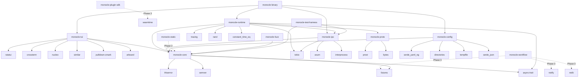

# Architecture: Dependency Manifest

## [Section Content]

This file is the canonical dependency manifest for monocle. All version pins, pinning policies, MSRV decisions, and workspace dependency graph are authoritative for every phase. The architect inherits these pins as Phase 1 constraints during `/vsdd-factory:create-architecture`.

## Authority / Supersession

This document is the canonical, authoritative tech-stack version manifest for monocle. The vision document (`.factory/specs/research/domain-monocle-vision-synthesis.md`) §Tech Stack section was produced before OQ-01..OQ-11 resolution and carries pre-OQ version examples. Where this document and the vision disagree on a crate version, this document wins. Where this document and brief v1.4 disagree, this document wins. Trace: D-018 (oq-research.md commit b3c68ca), JC-1/JC-2/JC-3 resolutions.

## Phase 1 Pin Manifest

All versions verified against crates.io REST API on 2026-05-12.

| Crate | Version | Role | Cargo.toml Note |
|-------|---------|------|-----------------|
| ratatui | 0.30 | TUI framework | MSRV floor for Phase 1 (1.86); caret pin |
| crossterm | 0.29 | Terminal backend for ratatui | caret pin |
| tokio | 1.52 | Async runtime (full feature set) | EXACT pin (see Patch-Pinning Policy); historical advisories on older minors; 1.52 remediated |
| axum | 0.8 | HTTP server for hook ingestion | EXACT pin; pin as `=0.8.9` in Cargo.toml |
| interprocess | 2.4 | Unix domain socket IPC | caret pin |
| prost | 0.14 | Protobuf serialization for cross-host wire format | EXACT pin (see Patch-Pinning Policy); Phase 1: zero runtime cost — `monocle-proto` declares `prost` but no Phase 1 wire path uses protobuf encoding; Phase 4: deserializes untrusted federation wire-format on cross-host events; pinned now to lock the audit baseline before Phase 4 activation — version stability is more valuable than patch flexibility for a future untrusted-input deserializer; see RUSTSEC note on transitive `bytes` advisory |
| serde_json | 1.0.149 | JSON deserialization for hook POST bodies at the network boundary | EXACT pin (see Patch-Pinning Policy — Phase 1 untrusted-input deserializer); pin as `=1.0.149` in Cargo.toml; every patch bump requires security-reviewer agent dispatch because changes to JSON parser internals can affect timing-attack resistance, error-message disclosure, and resource-exhaustion behavior; verified 2026-05-12 against crates.io (max_stable_version) |
| serde_yaml_ng | 0.10 | YAML config parsing | caret pin; NOT `serde_yaml 0.8` (unmaintained, alias-bomb CVE); NOT `serde_yml` (archived per RUSTSEC-2025-0068) |
| bytes | 1.10 | Byte buffer utility | caret pin; direct workspace pin to avoid prost 0.14 transitive RUSTSEC-2026-0007 (see RUSTSEC Audit Context); verified 2026-05-12 against crates.io: `bytes = "1.10"` is the patched line resolving RUSTSEC-2026-0007; `cargo tree -d bytes` from a prost 0.14 context confirms only the 1.10.x line is pulled when `bytes` is directly specified in workspace `[dependencies]`; without direct pin, prost 0.14 transitively requests `bytes = "^1.0"` which can resolve to older 1.x lines carrying the advisory |
| wasmtime | 44 | WASM runtime for Phase 3 plugin SDK | EXACT pin (see Patch-Pinning Policy); NOT wasmi — see ADR-0001; Phase 3 MSRV implication: Rust 1.92 |
| rand | 0.8.6 | Cryptographically random auth token generation (`OsRng`) | EXACT pin (see Patch-Pinning Policy — security-sensitive: auth token generation); pin as `=0.8.6` in Cargo.toml; `rand 0.8.x` pinned over `0.9.x` because `rand 0.9` moved `OsRng` to a `getrandom` feature flag and introduced ergonomic regressions; `OsRng` is used directly in `monocle-daemon` start sequence to generate the 32-byte hex auth token (see SS-daemon-lifecycle §Start Sequence step 3); verified 2026-05-12 against crates.io |
| nucleo | 0.5 | Fuzzy matcher for session/filter panels | caret pin; upstream dormant since 2024-04-02; decision accepted via ADR-0002 with explicit re-eval trigger; TD-001 retired |
| similar | 3 | Diff rendering in permission prompt overlay | caret pin |
| directories | 6 | XDG-compliant config/data/runtime dirs | caret pin; used for daemon lock-file path per OQ-10 resolution |
| notify | 8 | File-system watcher for Phase 3 workflow plane | caret pin |
| russh | 0.60 | SSH tunnel for Phase 4 federation | EXACT pin (see Patch-Pinning Policy); pin to 0.60 (0.60.2); 0.45..0.59 carry RUSTSEC-2023-0071 via transitive rsa pre-release |
| rmcp | 1.6 | MCP bridge (Phase 4 only; OMITTED in Phase 1 workspace) | EXACT pin (see Patch-Pinning Policy); Anthropic-canonical via modelcontextprotocol/rust-sdk; pinned now for audit; NOT instantiated in Phase 1 Cargo workspace (see Phase 1 vs Pinned-But-Unused Crates) |
| tempfile | 3 | Atomic config writes via `tempfile::persist` | caret pin; required anti-pattern enforcement |
| clap | 4.6 | CLI argument parsing | caret pin |
| pulldown-cmark | 0.13 | Markdown rendering in TUI panels | caret pin |
| arboard | 3 | Clipboard integration | caret pin |
| tracing | 0.1 | Structured logging and instrumentation | caret pin |
| semver | 1 | Semantic version parsing | caret pin |
| thiserror | 2 | Error type derivation | caret pin; 2.x major — do NOT pin to 1.x |
| anyhow | 1 | Error propagation in binary crate | caret pin |
| constant_time_eq | 0.3 | Timing-safe byte comparison for auth token validation per BC-AUTH-001 (SS-daemon-lifecycle.md) | caret pin (utility crate; not on untrusted-input deserialization path) |
| futures | 0.3 | Async stream abstractions for `FactoryAdapter::subscribe -> StateChangeStream` per BC-FACTORY-001 (SS-core-types-and-abi.md) | caret pin (workspace-level async utilities) |
| async-trait | 0.1 | Procedural macro enabling `async fn` in trait definitions; used by `EngineModule` and any other async traits in `monocle-core` | caret pin (utility macro; not on untrusted-input path; 0.1.x series is stable and widely used across the Rust ecosystem) |
| reqwest | 0.13 | HTTP client | EXACT pin (see Patch-Pinning Policy); 0.13.x only — do NOT pin to 0.11 or 0.12 (both stale) |

## Phase 2/3/4 Additions

### Phase 2 — Static Plane (trigger-trace, customization-aware overlays)

- **`redb 2.x`** — embedded key-value store for trigger-trace transcript indexing. Selected over `sled 0.34` because sled is feature-frozen since 2023 with no maintenance pipeline, while redb 2.x is actively maintained, uses a single-file MVCC approach with no lock-file overhead, and has zero external dependencies beyond `std`. Pin: `redb = "^2"`.
- No full-text indexing dependency added in Phase 2; tantivy is deferred unless Phase 3 trigger-trace search benchmarks show linear scan is insufficient at realistic `.factory/` transcript sizes (expected <500MB per project for Phase 2 scope).

### Phase 3 — Workflow Plane, Plugin SDK

- **`wasmtime 44`** — already pinned for the plugin SDK; the `monocle-plugin-sdk` crate activates this dependency.
- **`wasi-common 24`** (or the equivalent WASI interface types under wasmtime 44's component model) — provides sandboxed WASI execution context for guest plugin binaries. The wasmtime 44 component model includes `wasi:io`, `wasi:filesystem`, `wasi:sockets` interface types as first-class targets; `wasi-common` is the host-side WASI implementation. Pin: `wasi-common = "^24"` (aligns with wasmtime 44.x series). Verify exact compatible minor against `wasmtime = "44"` workspace during Phase 3 Cargo init.
- **`notify 8`** — already pinned; activated by `monocle-workflow` crate.
- MSRV bumps to Rust 1.92 at this phase boundary (wasmtime 44 requirement; see MSRV Policy below).

### Phase 4 — Federation, MCP Bridge

- **`russh 0.60`** — already pinned for federation SSH tunnel.
- **`rmcp 1.6`** — already pinned; activated by `monocle-mcp-bridge` crate. The Phase 4 workspace expands from 12 crates to 13 by adding `monocle-mcp-bridge`.
- **`oauth2 5.x`** — federation auth flows for multi-host trust establishment. The `oauth2` crate 5.x (maintained by ramosbugs) provides PKCE, device flow, and authorization code flows; caret pin: `oauth2 = "^5"`.
- **`quinn 0.11`** — QUIC transport, optional. Include only if Phase 4 federation benchmarks demonstrate that sub-100ms host-to-host latency is required AND russh over TCP cannot meet the target. Decision deferred to Phase 4 benchmark gate. If activated, pin: `quinn = "^0.11"`. Do not activate in Phase 4 Cargo workspace by default; gate behind a `quic-transport` Cargo feature flag.
- **`prost 0.14`** — Phase 4 activates `prost` for cross-host federation wire-format encoding and decoding. In Phase 1, `monocle-proto` declares `prost` as a dependency but no Phase 1 code path invokes protobuf serialization — hook POST bodies use `serde_json`, not prost. Phase 4 is the first phase where `prost` touches untrusted input (cross-host federation events). The exact pin established in Phase 1 locks the audit baseline; no version change is required at Phase 4 boundary unless a RUSTSEC advisory mandates a bump.

## MSRV Policy

**Single workspace MSRV.** Phase 1 ships at Rust 1.86 (ratatui 0.30 floor). Phase 3 ships at Rust 1.92 (wasmtime 44 floor) via an explicit MINOR release with a workspace-wide `rust-version` bump in `Cargo.toml`.

Rationale: a dual-MSRV strategy would require either splitting Cargo.lock across two workspaces or maintaining a feature-flag matrix that fragments CI runs. Single-MSRV with explicit bumps at phase boundaries keeps the CI matrix simple (one toolchain per phase), avoids Cargo.lock splitting, and aligns with the mainstream Rust toolchain trajectory — by Phase 3 ship date, 1.92 will be at minimum 6 months stable. Each MSRV bump is documented in CHANGELOG with a `breaking-change` marker for downstream consumers.

The workspace `Cargo.toml` `rust-version` field is set to `"1.86"` for Phase 1. The Phase 3 bump to `"1.92"` is documented as an ADR entry at that phase boundary.

## Patch-Pinning Policy

**Caret pin (`^x.y`) for library dependencies; EXACT pin (`=x.y.z`) for the 9 security-sensitive crates: `tokio`, `prost`, `russh`, `wasmtime`, `rmcp`, `reqwest`, `axum`, `serde_json`, `rand`.**

The 9 EXACT-pinned crates are: `tokio`, `prost`, `wasmtime`, `russh`, `rmcp`, `reqwest`, `axum`, `serde_json`, and `rand`.

- `serde_json` is exact-pinned because it is the **Phase 1 untrusted-input deserializer**: every hook POST body arrives as `Content-Type: application/json` and is deserialized by `serde_json` at the axum handler boundary. Patch bumps require security-reviewer agent dispatch because changes to JSON parser internals can affect timing-attack resistance, error-message disclosure, and resource-exhaustion behavior.
- `prost` is exact-pinned because it is the **Phase 4 untrusted-input deserializer**: in Phase 1 it carries zero runtime cost (`monocle-proto` declares `prost` but no Phase 1 wire path uses protobuf encoding). In Phase 4 it deserializes untrusted federation wire-format on cross-host events. It is pinned now to lock the audit baseline before Phase 4 activation — version stability is more valuable than patch flexibility for a future untrusted-input deserializer.
- `rand` is exact-pinned because it is the **auth token generator**: `OsRng` produces the 32-byte cryptographically random token written to the daemon lock file. Patch bumps require security-reviewer dispatch because changes to the OS entropy interface or CSPRNG seeding can affect key-derivation security properties.
- The remaining 6 (`tokio`, `wasmtime`, `russh`, `rmcp`, `reqwest`, `axum`) handle security-critical protocol boundaries (TLS, SSH, WASM sandbox, HTTP server, HTTP client, async runtime).

Rationale: library crates are evaluated for security risk based on their public-API surface; patch upgrades are typically safe and automatable. The 9 security-sensitive crates handle untrusted network input or operate on security-critical protocol boundaries. Patch bumps on these crates can change cancellation semantics, timeout behavior, deserialization behavior, or sandboxing properties in ways that shift the threat surface — for example, a tokio patch can change task-cancellation ordering in ways that affect security-critical timeout invariants; a serde_json patch can change how malformed JSON is handled in ways that affect resource-exhaustion behavior. Exact-pinning forces every bump through PR review with security-reviewer dispatch.

In `Cargo.toml` syntax:
- Library deps: `ratatui = "0.30"` (caret is implicit)
- Exact-pinned: `tokio = "=1.52.0"` (explicit `=` prefix)

## Security Advisory Response Policy

**Automated Dependabot PRs for patch-level bumps on caret-pinned library deps, gated by `cargo audit --deny warnings` in CI; auto-merge on green for caret-pinned libs only. Manual review with security-reviewer agent dispatch for: (a) any minor or major bump on any dependency; (b) ALL bumps on the 9 EXACT-pinned crates regardless of bump magnitude.**

Rationale: patch bumps on library crates are common, low-risk, and automatable when CI gates hold. Any bump on a security-sensitive crate (the 9 EXACT-pinned) or any minor/major bump anywhere requires explicit human + AI review because the threat surface can shift. Security-reviewer agent dispatch is non-optional for the 9 exact-pinned crates.

Operationally:
1. Dependabot opens a PR for a patch bump on a caret-pinned lib.
2. CI runs `cargo audit --deny warnings` + full test matrix.
3. On green: auto-merge is permitted.
4. For an exact-pinned crate: auto-merge is BLOCKED; security-reviewer agent must approve.
5. For any minor/major bump: auto-merge is BLOCKED; architect + security-reviewer must approve.
6. New RUSTSEC advisories that match a pinned version block merge until (a) version is updated to patched release, or (b) documented risk-acceptance is filed under `.factory/specs/risk-acceptance/`.

## Phase 1 vs Pinned-But-Unused Crates

**`rmcp 1.6` is PINNED in this manifest but NOT instantiated in the Phase 1 Cargo workspace.** Per OQ-09 resolution, MCP bridge functionality is Phase 4 scope. Pinning here locks the version into the manifest for security audit purposes, but the `monocle-mcp-bridge` crate — which will declare `rmcp` as a dependency — does not exist in the Phase 1 workspace.

Phase 1 workspace: 11 named crates + 1 binary = **12 crates total** (per brief v1.4 EX-1 ratification). Phase 4 workspace adds `monocle-mcp-bridge`, expanding to 13 crates total.

## Workspace Dependency Graph

Authoritative for Phase 1 spec package; refresh after Cargo workspace `Cargo.toml` files exist (during `/vsdd-factory:create-architecture`) to reflect any inferred edges not visible from spec-level reasoning.

Crates with dashed edges are activated at their respective phase boundary; they exist in the workspace from Phase 1 as empty crate stubs to keep the workspace layout stable.

## RUSTSEC Audit Context

Validation performed 2026-05-12 against crates.io API + RUSTSEC advisory DB
(Tavily + Perplexity + direct crates.io fetch). Findings the architect must
respect when finalizing Cargo.toml:

### Advisories on upstream versions monocle must avoid

- `wasmtime` older majors (pre-44) carry RUSTSEC-2026-0114, RUSTSEC-2026-0095,
  RUSTSEC-2026-0096, RUSTSEC-2026-0006, RUSTSEC-2026-0020 (guest-controlled resource
  exhaustion in WASI implementations), and others. Pin to `wasmtime = "44"` (latest
  44.0.1) and bind future patches via `cargo update` on the 44.x line.
- `russh` 0.45..0.59 transitively pulls `rsa = "0.10.0-rc.12"` which is affected by
  RUSTSEC-2023-0071 (timing-attack on RSA private-key operations). Pin to
  `russh = "0.60"` (0.60.2 latest) which moved off the affected rsa pre-release.
- `prost` 0.14 has a transitive `bytes` advisory RUSTSEC-2026-0007 affecting older
  `bytes` versions. Pin `bytes = "1.10"` directly in workspace dependencies to force
  the patched version (verified 2026-05-12 — see bytes row in Phase 1 Pin Manifest).
- `tokio` 1.x has multiple historical advisories on older minors (RUSTSEC-2025-0023,
  RUSTSEC-2023-0005, RUSTSEC-2023-0001, RUSTSEC-2021-0124, RUSTSEC-2021-0072). Pin to
  current 1.52 line to ensure all are remediated.
- `serde_yaml` 0.8 is unmaintained with alias-bomb CVE; `serde_yml` (a different fork)
  was archived per RUSTSEC-2025-0068. The choice of `serde_yaml_ng` 0.10 (maintained
  fork) is correct and survives this audit.

## Re-audit Cadence

The architect must enforce a `cargo audit` run in CI on every PR, plus a weekly
scheduled `cargo audit --json` against the latest RUSTSEC DB. New advisories on
pinned versions block merge until either:
- (a) the version is updated to a patched release, or
- (b) a documented justification with mitigations is filed under
  `.factory/specs/risk-acceptance/`

## MSRV Constraints

| Phase | MSRV | Binding Factor |
|-------|------|---------------|
| Phase 1 | Rust 1.86 | ratatui 0.30 floor |
| Phase 3 | Rust 1.92 | wasmtime 44 requirement |

See MSRV Policy above for the single-workspace bump strategy at the Phase 3 boundary.
