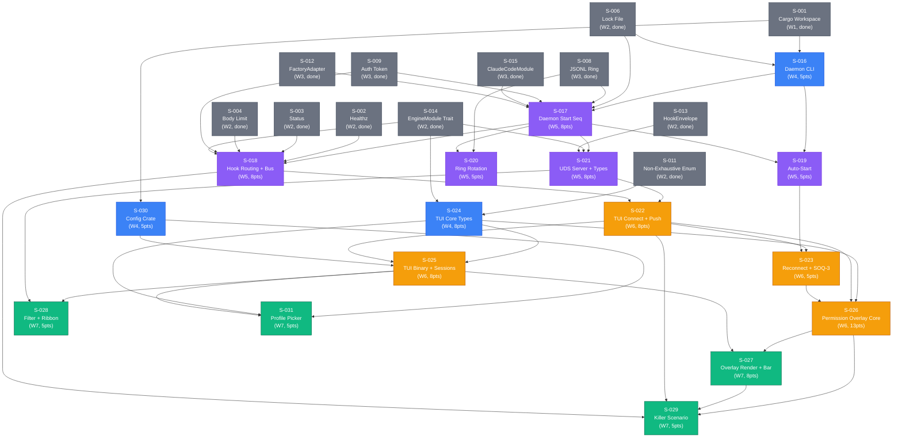

# Dependency Graph: monocle Phase 2 Expansion (Waves 4-7)

> This file covers the dependency graph for the 16 new stories (S-016 through S-031)
> added in the Phase 2 Expansion burst. For Waves 1-3 dependency graph, see
> `.factory/stories/dependency-graph.md`.

## Full Mermaid Graph

The graph includes all 16 new stories plus the Wave 1-3 anchor stories they depend on.
Existing Wave 1-3 stories are shown in grey; new Wave 4-7 stories are shown normally.

## Topological Sort Verification

Performing topological sort to confirm the graph is acyclic:

**Wave 4** (no dependencies on new stories — only Wave 1-3):
- S-016: depends on S-001 (W1), S-006 (W2). Earliest wave: 4. VALID.
- S-024: depends on S-011 (W2), S-014 (W2). Earliest wave: 4. VALID.
- S-030: depends on S-001 (W1). Earliest wave: 4. VALID.

**Wave 5** (depends on Wave 4):
- S-017: depends on S-016 (W4), S-006 (W2), S-008 (W3), S-009 (W3), S-015 (W3), S-012 (W3). Earliest wave: max(4, 2, 3, 3, 3, 3)+1 = 5. VALID.
- S-018: depends on S-017 (W5), S-002 (W2), S-003 (W2), S-004 (W2), S-009 (W3), S-014 (W2). Earliest wave: max(5, 2, 2, 2, 3, 2)+0 = 5. VALID.
- S-019: depends on S-016 (W4), S-017 (W5). Earliest wave: max(4, 5)+0 = 5. VALID.
- S-020: depends on S-008 (W3), S-017 (W5). Earliest wave: max(3, 5)+0 = 5. VALID.
- S-021: depends on S-017 (W5), S-014 (W2), S-013 (W2). Earliest wave: max(5, 2, 2)+0 = 5. VALID.

**Wave 6** (depends on Wave 5):
- S-022: depends on S-021 (W5), S-018 (W5). Earliest wave: max(5, 5)+1 = 6. VALID.
- S-023: depends on S-022 (W6), S-019 (W5). Earliest wave: max(6, 5)+0 = 6. VALID.
- S-025: depends on S-024 (W4), S-022 (W6), S-030 (W4). Earliest wave: max(4, 6, 4)+0 = 6. VALID.
- S-026: depends on S-024 (W4), S-022 (W6), S-023 (W6). Earliest wave: max(4, 6, 6)+0 = 6. VALID.

**Wave 7** (depends on Wave 6):
- S-027: depends on S-026 (W6), S-025 (W6). Earliest wave: max(6, 6)+1 = 7. VALID.
- S-028: depends on S-025 (W6), S-021 (W5). Earliest wave: max(6, 5)+1 = 7. VALID.
- S-029: depends on S-026 (W6), S-027 (W7), S-022 (W6), S-018 (W5). Earliest wave: max(6, 7, 6, 5)+0 = 7. VALID.
- S-031: depends on S-030 (W4), S-024 (W4), S-025 (W6). Earliest wave: max(4, 4, 6)+1 = 7. VALID.

**Result: No cycles detected. Dependency graph is acyclic. Topological sort PASS.**

**Critical path:** S-001 → S-016 → S-017 → S-021 → S-022 → S-026 → S-027 → S-029

Critical path length: 8 stories, 63 total points (5+8+8+8+8+13+8+5 = 63 pts on path).

## Dependency Adjacency Table

| Story | Wave | Pts | Depends On | Blocks |
|-------|------|-----|------------|--------|
| S-016 | 4 | 5 | S-001, S-006 | S-017, S-019 |
| S-024 | 4 | 8 | S-011, S-014 | S-025, S-026, S-031 |
| S-030 | 4 | 5 | S-001 | S-025, S-031 |
| S-017 | 5 | 8 | S-016, S-006, S-008, S-009, S-015, S-012 | S-018, S-019, S-020, S-021 |
| S-018 | 5 | 8 | S-017, S-002, S-003, S-004, S-009, S-014 | S-022, S-029 |
| S-019 | 5 | 5 | S-016, S-017 | S-023 |
| S-020 | 5 | 5 | S-008, S-017 | — |
| S-021 | 5 | 8 | S-017, S-014, S-013 | S-022, S-028 |
| S-022 | 6 | 8 | S-021, S-018 | S-023, S-025, S-026, S-029 |
| S-023 | 6 | 5 | S-022, S-019 | S-026 |
| S-025 | 6 | 8 | S-024, S-022, S-030 | S-027, S-028, S-031 |
| S-026 | 6 | 13 | S-024, S-022, S-023 | S-027, S-029 |
| S-027 | 7 | 8 | S-026, S-025 | S-029 |
| S-028 | 7 | 5 | S-025, S-021 | — |
| S-029 | 7 | 5 | S-026, S-027, S-022, S-018 | — |
| S-031 | 7 | 5 | S-030, S-024, S-025 | — |

## BC to Stories Traceability Matrix

| BC ID | Title | Story | Full Coverage? |
|-------|-------|-------|----------------|
| BC-2.04.001 | Daemon Start Sequence: Port Bind + Lock File + Token Write (SOQ-2) | S-017 | YES |
| BC-2.04.002 | Daemon Auto-Start on TUI Launch | S-019 | YES |
| BC-2.04.003 | `MONOCLE_NO_AUTOSTART=1` Suppresses Auto-Start | S-019 | YES |
| BC-2.04.004 | `monocle daemon start` CLI Subcommand | S-016 | YES |
| BC-2.04.005 | `monocle daemon stop` CLI Subcommand | S-016 | YES |
| BC-2.04.006 | `directories::ProjectDirs::runtime_dir()` Fallback Chain | S-016 | YES |
| BC-2.04.007 | Hook Endpoint: PreToolUse Request Routing | S-018 | YES |
| BC-2.04.008 | Hook Endpoint: Notification Request Routing (2000ms Timeout) | S-018 | YES |
| BC-2.04.009 | Hook Endpoint: Stop/SessionStart/PromptSubmit Routing (300ms Timeout) | S-018 | YES |
| BC-2.04.010 | Hook Tmpfile Generation at `runtimeDir/hooks-settings.json` | S-017 | YES |
| BC-2.04.011 | Bounded Event Bus with Drop Counter | S-018 | YES |
| BC-2.04.012 | JSONL Ring: Capacity and Rotation Policy | S-020 | YES |
| BC-2.05.001 | UDS Server Bind at `runtimeDir/monocle.sock` | S-021 | YES |
| BC-2.05.002 | TUI Client Connects to UDS and Receives Initial State Push | S-022 | YES |
| BC-2.05.003 | IPC Message Types: SessionListUpdate | S-021 | YES |
| BC-2.05.004 | IPC Message Types: HookEventReceived | S-021 | YES |
| BC-2.05.005 | IPC Message Types: PermissionPromptQueued | S-022 | YES |
| BC-2.05.006 | TUI Reconnects After Daemon Restart | S-023 | YES |
| BC-2.05.007 | Overlay Stack Cleared on Daemon Disconnect (SOQ-3) | S-023 | YES |
| BC-2.05.008 | UDS-Only in Phase 1 (No Shared-Memory Transport) | S-021 | YES |
| BC-2.06.001 | AppMode State Machine: Compile-Time Mutual Exclusion | S-024 | YES |
| BC-2.06.002 | FocusSnapshot: Focus Restored After Overlay/Fullscreen Close | S-024 | YES |
| BC-2.06.003 | Action Dispatch: 5-Level Binding Precedence | S-024 | YES |
| BC-2.06.004 | `Ctrl-\` Popup: Appears and Dismisses Without State Loss | S-025 | YES |
| BC-2.06.005 | Sessions Panel: Session List Renders from IPC State | S-025 | YES |
| BC-2.06.006 | Sessions Panel: `/` Filter with Nucleo Fuzzy Match | S-028 | YES |
| BC-2.06.007 | Sessions Panel: `Enter` Transitions to Fullscreen | S-025 | YES |
| BC-2.06.008 | Permission Overlay: VecDeque Stack Push on PermissionPromptQueued | S-026 | YES |
| BC-2.06.009 | Permission Overlay: `[↑↓]` Rotates Stack | S-026 | YES |
| BC-2.06.010 | Permission Overlay: Diff Preview via `similar 3` | S-027 | YES |
| BC-2.06.011 | Permission Overlay: Accept-Once Keybinding | S-026 | YES |
| BC-2.06.012 | Permission Overlay: Accept-Always Keybinding | S-026 | YES |
| BC-2.06.013 | Permission Overlay: Reject Keybinding | S-026 | YES |
| BC-2.06.014 | Permission Overlay: `[Esc]` Hides Without Rejecting | S-026 | YES |
| BC-2.06.015 | Permission Overlay: `[t]` Trace-to-Source Stub | S-027 | YES |
| BC-2.06.016 | Permission Overlay: Cleared on Daemon Disconnect | S-026 | YES |
| BC-2.06.017 | Permission Response Within Hook Timeout Budget | — | GAP (GAP-P2-005) |
| BC-2.06.018 | Event Ribbon Panel: Rolling Hook Event Log | S-028 | YES |
| BC-2.06.019 | Status Bar: Drop Counter Renders Under Load | S-027 | YES |
| BC-2.06.020 | Status Bar: Breadcrumb | S-027 | YES |
| BC-2.06.021 | Status Bar: Keybinding Hint Line | S-027 | YES |
| BC-2.06.022 | Killer Scenario: ≤6 Keystrokes for Dual Permission Resolve | S-029 | YES |
| BC-2.06.023 | TUI Removes Resolved Prompt from Overlay Stack on PermissionPromptResolved | S-026 | YES |
| BC-2.06.024 | Permission Overlay: Tool Payload Rendering by Type | S-027 | YES |
| BC-2.07.001 | Config File Atomic Write via `tempfile::persist` | S-030 | YES |
| BC-2.07.002 | Config Schema Version 1: Harness Profile Fields | S-030 | YES |
| BC-2.07.003 | Config Missing or Corrupted: Default Applied | S-030 | YES |
| BC-2.07.004 | Profile Picker: Sticky-Per-Project | S-031 | YES |
| BC-2.07.005 | Profile Picker: `Ctrl-P` Override Shows Picker | S-031 | YES |
| BC-2.07.006 | CCR Detection via `ccr_path` Config Field | S-030 | YES |

**Coverage: 49/50 BCs covered (BC-2.06.017 deferred — GAP-P2-005; BC-2.06.024 added — covered by S-027)**

## Subsystem to Story Matrix

| Subsystem | BC Range | Stories |
|-----------|----------|---------|
| SS-04 Daemon Wiring | BC-2.04.001..012 | S-016, S-017, S-018, S-019, S-020 |
| SS-05 IPC | BC-2.05.001..008 | S-021, S-022, S-023 |
| SS-06 TUI | BC-2.06.001..023 | S-024, S-025, S-026, S-027, S-028, S-029 |
| SS-07 Config | BC-2.07.001..006 | S-030, S-031 |

## NFR Coverage for Expansion Stories

| NFR ID | Category | Covering Story | Validation Method |
|--------|----------|---------------|-------------------|
| NFR-001 | Hook latency ≤300ms | S-018 (hook routing + bus), S-029 (killer scenario) | Integration test: hook-to-decision roundtrip under 300ms; S-029 E2E validates full path |
| NFR-002 | Notification latency ≤2000ms | S-018 (Notification routing 2000ms timeout) | Integration test: notification handler asserts 2000ms budget |
| NFR-003 | TUI overlay render ≤100ms | S-027 (latency budget — Phase 3 integration test infrastructure) | BC-2.06.017 latency validation deferred to Phase 3 (GAP-P2-005); tool payload rendering behavior covered by BC-2.06.024 in S-027 |
| NFR-006 | 1000 events/sec throughput | S-018 (bounded event bus drop counter) | S-018 integration test: 1000 events injected, drop counter asserted ≤N |

NFR-001/002/003/006 are now covered by expansion stories. GAP-P2-001..004 are resolved by Waves 5-7 stories. The NFR deferred-to-Phase-3 classification from the original STORY-INDEX v3.0 <!-- version-pin-historical: version at original decomposition time; superseded per expansion stories --> is superseded by these assignments.

## Gap Register (Expansion)

| Gap ID | Level | Source | Justification | Resolution Target |
|--------|-------|--------|---------------|-------------------|
| GAP-EXP-001 | L3 | BC-2.06.022 E2E harness | Killer scenario test requires full daemon+TUI running in test process — integration harness design deferred to test-writer dispatch for S-029 | S-029 test-writer dispatch |
| GAP-EXP-002 | L3 | BC-2.07.005 Ctrl-P hardware key in test | Ctrl-P keybinding simulation in ratatui test context needs crossterm event injection helper — design deferred to test-writer for S-031 | S-031 test-writer dispatch |

Both gaps are L3 (test infrastructure design choices) with mandatory resolution at their respective story's test-writer dispatch. No L1 (BC clause) gaps. No L2 (edge case) gaps.

## §Trace v1.8

**F-S025-ADV11-HIGH-001 PO Option B — SS-tui + BC-2.06.016 pin propagation** (2026-05-28):
- SS-tui.md pin v1.8.1 → v1.8.2 (architect cross-doc consistency patch, commit 740465d).
- BC-INDEX.md pin v1.26 → v1.27 (BC-2.06.016 v1.0.8 bump reflected in BC-INDEX).
- Version bumped v1.7 → v1.8.
- SE-16d monotonicity: v1.8 timestamp 2026-05-28T00:00:00Z >= v1.7 timestamp 2026-05-28T16:00:00Z. PASS (same-day).

## §Trace v1.7

**F-S025-ADV5-HIGH-003 + Pass 5 cumulative pin propagation** (2026-05-28):
- SS-tui.md pin v1.8.0 → v1.8.1 (Pass 5 architect).
- BC-INDEX.md pin v1.25 → v1.26 (BC-2.06.014 v1.0.7 bump).
- Version bumped v1.6 → v1.7.
- SE-16d monotonicity: v1.7 timestamp 2026-05-28T16:00:00Z >= v1.6 timestamp 2026-05-28T00:00:00Z. PASS.

## §Trace v1.6

**F-S025-ADV4-BLOCKER-001 + BLOCKER-002 propagation** (2026-05-28):
- SS-tui.md pin v1.7.0 → v1.8.0 (Overlay shape sweep).
- BC-INDEX.md pin v1.23 → v1.25.
- Version bumped v1.5 → v1.6.
- SE-16d monotonicity: v1.6 timestamp 2026-05-28 >= v1.5 timestamp 2026-05-27. PASS.

## §Trace v1.4

**Mechanical pin cascade: BC-INDEX v1.22 → v1.23 + STORY-INDEX v4.5 → v4.7** (2026-05-27):
- BC-INDEX.md input pin updated: `"1.22"` → `"1.23"`.
- STORY-INDEX.md input pin updated: `"4.5"` → `"4.7"`.
- traces_to updated: `v4.5` → `v4.7`.
- Version bumped v1.4 → v1.5.

## §Trace v1.3

**Phase 2 Adversarial Review Pass 3 — version pin updates** (2026-05-27):
- OBS-P3-001/002: BC-INDEX.md pin updated `"1.19"` → `"1.21"`; STORY-INDEX.md pin updated
  `"4.0"` → `"4.4"`; traces_to updated to `v4.4`.
- Version bumped v1.2→v1.3.

## §Trace v1.2

**Phase 2 Adversarial Review Pass 2 — BC-2.06.017 gap, BC-2.06.024 addition, NFR-003 fix** (2026-05-27):
- F-P2ADV-P2-004: BC-2.06.017 row changed from `S-027 | YES` to `— | GAP (GAP-P2-005)` (no covering story for latency budget; deferred to Phase 3).
- BC-2.06.024 row added: `S-027 | YES` (tool payload rendering behavior now covered by S-027 per BC-2.06.024).
- Coverage count updated: 49/49 (100%) → 49/50 (BC-2.06.017 gap, BC-2.06.024 added).
- NFR-003 row updated: removed stale BC-2.06.017 reference; updated to reflect GAP-P2-005 and BC-2.06.024 distinction.
- Version bumped v1.1→v1.2.

## §Trace v1.1

**Phase 2 Adversarial Review Pass 1 — critical path point sum fix** (2026-05-27):
- F-P2ADV-012: Critical path point sum corrected — "60 total points" → "63 total points". The arithmetic 5+8+8+8+8+13+8+5 = 63 was already shown correctly; the prose label was wrong.
- dependency-graph-expansion.md version bumped v1.0→v1.1.

## §Trace v1.0

**Phase 2 Expansion dependency graph created** (2026-05-27T00:00:00Z):
- 16 new stories graphed (S-016..S-031) across Waves 4-7.
- Topological sort PASS: no cycles, all wave assignments verified monotonically.
- Critical path: S-001 → S-016 → S-017 → S-021 → S-022 → S-026 → S-027 → S-029 (8 stories, 63 pts).
- 49/49 BCs traced (100%).
- NFR-001/002/003/006 coverage now resolved by expansion stories (supersedes STORY-INDEX v3.0 GAP-P2-001..004 deferred classification).
- 2 L3 test-infrastructure gaps registered (GAP-EXP-001, GAP-EXP-002).
## §Trace v1.9 — POL-11 version-pin remediation (2026-05-30)

**Bump:** 1.8 → 1.9.
**Scope (POL-11 fix per ADR-0007):**
- `traces_to:` field: `STORY-INDEX.md v4.7` → `STORY-INDEX.md v5.21` (Option 1 — active live pointer; bumped to canonical current version post-remediation-burst bumps).
- Line ~273: `original STORY-INDEX v3.0 is superseded` — added `<!-- version-pin-historical -->` (Option 3 — historical reference to original decomposition state; the v3.0 version correctly documents what was current at original authoring time).
**SE-16d PASS:** 2026-05-30 >= prior date (patch; no normative behavioral change).
